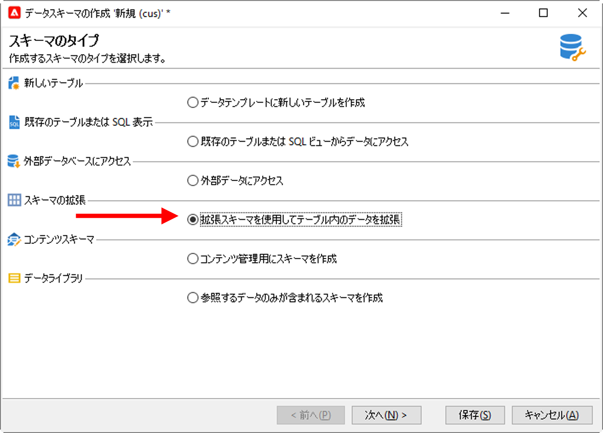

# スキーマの拡張{#extend-schemas}

テクニカルユーザーは、導入のニーズに合わせてキャンペーンデータモデルをカスタマイズできます。既存の要素へのスキーマの追加、スキーマ内の要素の変更または要素の削除を行います。

キャンペーンデータモデルをカスタマイズする主な手順は次のとおりです。

1. 拡張スキーマの作成
1. キャンペーンデータベースの更新
1. 入力フォームの調整

>[!CAUTION]
>組み込みスキーマは直接変更できません。 組み込みのスキーマを適応させる必要がある場合は、拡張する必要があります。

:bulb:キャンペーンの組み込みテーブルとそのやり取りについての詳細は、[このページ](datamodel.md)を参照してください。

スキーマを拡張するには、次の手順に従います。

1. エクスプローラーの&#x200B;**[!UICONTROL 管理/設定/データスキーマー]**&#x200B;フォルダーに移動します。
1. 「**新規**」ボタンをクリックし、「**[!UICONTROL 拡張スキーマを使用してテーブルのデータを拡張する]**」を選択します。

   

1. 拡張する組み込みスキーマを特定し、選択します。

   

   規則に従って、拡張スキーマに組み込みスキーマと同じ名前を付け、カスタム名前空間を使用します。

   

1. スキーマエディタで、コンテキストメニューを使用して必要な要素を追加し、保存します。

   

   以下の例では、Membership Year属性を追加し、姓の長さ制限を設定し（この制限はデフォルトの名前に上書きします）、組み込みスキーマから生年月日を削除します。

   ```
   <srcSchema created="YY-MM-DD" desc="Recipient table" extendedSchema="nms:recipient"
           img="nms:recipient.png" label="Recipients" labelSingular="Recipient" lastModified="YY-MM-DD"
           mappingType="sql" name="recipient" namespace="cus" xtkschema="xtk:srcSchema">
   <element desc="Recipient table" img="nms:recipient.png" label="Recipients" labelSingular="Recipient"
           name="recipient">
   <attribute name="Membership Year" label="memberYear" type="long"/>
   <attribute length="50" name="lastName"/>
   <attribute _operation="delete" name="birthDate"/>
   </element>
   </srcSchema> 
   ```

1. データベース構造を更新して、変更を適用します。 [詳細情報](update-database-structure.md)
1. データベースに変更が実装されたら、受信者入力フォームを適合させて、変更を表示することができます。 [詳細情報](forms.md)