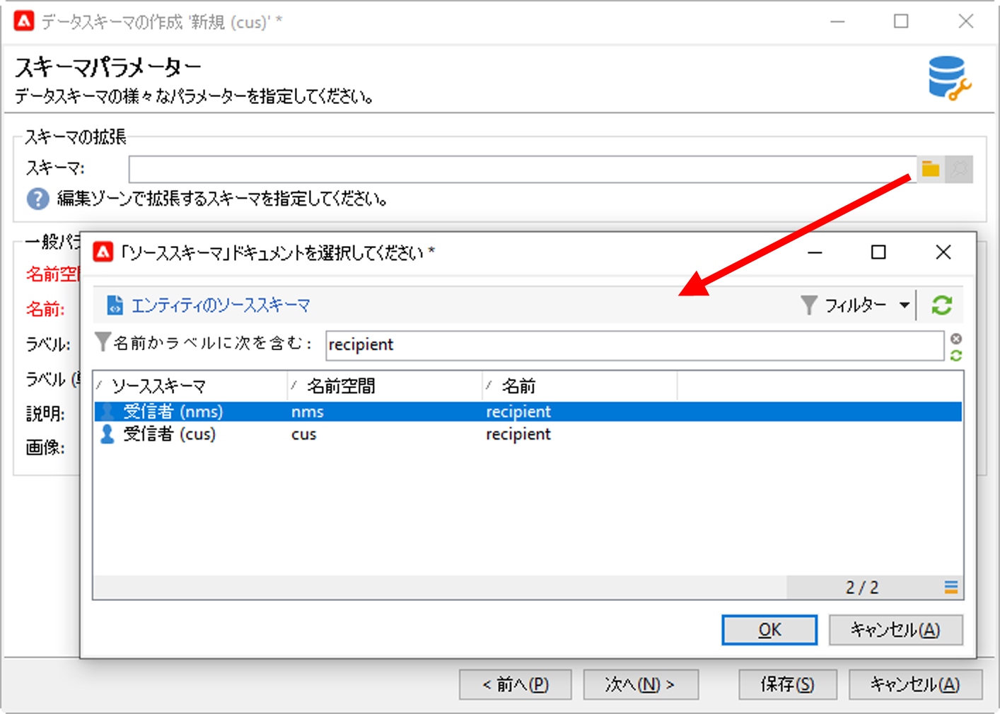
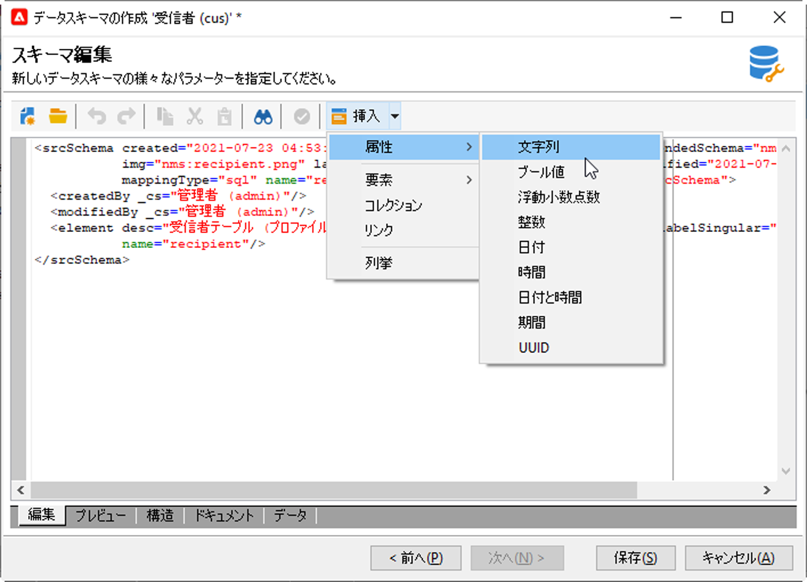

# スキーマの拡張{#extend-schemas}

技術ユーザーは、実装のニーズに合わせてCampaignデータモデルをカスタマイズできます。既存のスキーマに要素を追加、スキーマ内の要素を変更または要素を削除します。

Campaignデータモデルをカスタマイズする主な手順は次のとおりです。

1. 拡張スキーマの作成
1. Campaignデータベースの更新
1. 入力フォームの適応

>[!CAUTION]
>組み込みスキーマは直接変更できません。 組み込みスキーマを適応させる必要がある場合は、拡張する必要があります。

:bulb:Campaignの組み込みテーブルとそのインタラクションについての詳細は、[このページ](datamodel.md)を参照してください。

スキーマを拡張するには、次の手順に従います。

1. エクスプローラーで、**[!UICONTROL 管理/設定/データスキーマ]**&#x200B;フォルダーに移動します。
1. 「**新規**」ボタンをクリックし、「**[!UICONTROL 拡張スキーマ]**&#x200B;を使用してテーブルのデータを拡張します」を選択します。

   

1. 拡張する組み込みスキーマを指定して選択します。

   

   慣例により、拡張スキーマに組み込みスキーマと同じ名前を付け、カスタム名前空間を使用します。  一部の名前空間は内部のみであることに注意してください。 [詳細情報](schemas.md#reserved-namespaces)。

   

1. スキーマエディターで、コンテキストメニューを使用して必要な要素を追加し、保存します。

   

   次の例では、 MembershipYear属性を追加し、姓の長さ制限を設定し（この制限はデフォルトの名前に上書きします）、組み込みスキーマから生年月日を削除します。

   

   ```
   <srcSchema created="YYYY-MM-DD" desc="Recipient table" extendedSchema="nms:recipient"
           img="nms:recipient.png" label="Recipients" labelSingular="Recipient" lastModified="YYYY-MM-DD"
           mappingType="sql" name="recipient" namespace="cus" xtkschema="xtk:srcSchema">
    <element desc="Recipient table" img="nms:recipient.png" label="Recipients" labelSingular="Recipient" name="recipient">
       <attribute label="Member since" name="MembershipYear" type="long"/>
       <attribute length="50" name="lastName"/>
       <attribute _operation="delete" name="birthDate"/>
   </element>
   </srcSchema>
   ```

1. **[!UICONTROL 「構造]**」タブでスキーマ構造の更新を確認するため、Campaignから切断して再接続します。

   

1. 変更を適用するには、データベース構造を更新します。 [詳細情報](update-database-structure.md)

1. データベースに変更が実装されたら、受信者の入力フォームを調整して、変更を表示できるようにします。 [詳細情報](forms.md)
