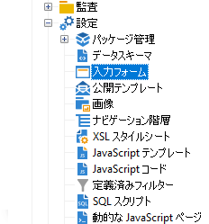
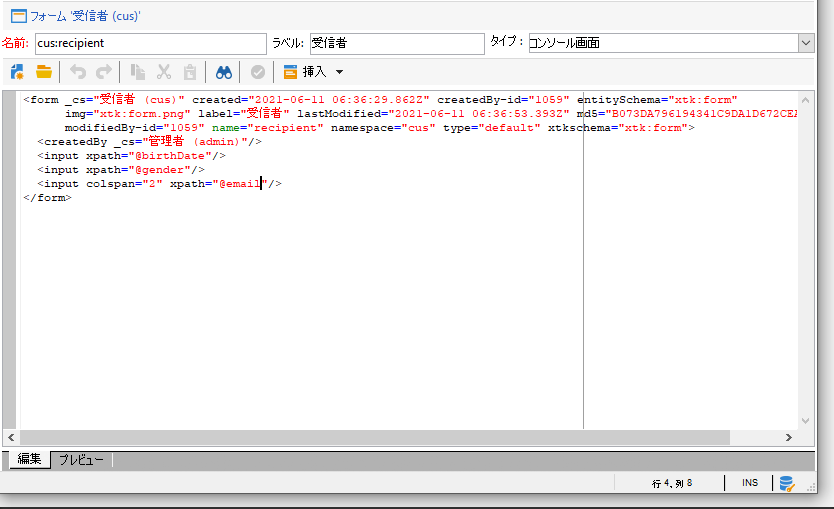
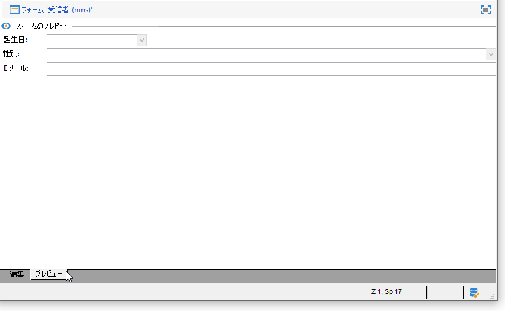
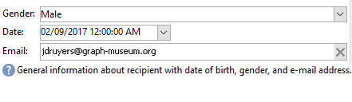

# 入力フォームの概要{#gs-ac-forms}

スキーマを作成または拡張する場合、変更をエンドユーザーに表示するには、関連する入力フォームを作成または変更する必要があります。

入力フォームを使用すると、Adobe Campaignクライアントコンソールから、データスキーマに関連付けられたインスタンスを編集できます。 フォームは名前と名前空間で識別されます。

フォームの識別キーは、コロンで区切られた名前空間と名前で構成される文字列です。次に例を示します。「cus:contact」と入力します。

## 入力フォームの編集

クライアントコンソールの&#x200B;**[!UICONTROL 管理] > [!UICONTROL 設定] > [!UICONTROL 入力フォーム]**&#x200B;フォルダーから入力フォームを作成し、設定します。



編集領域を使用して、入力フォームの XML コンテンツを入力できます。



プレビューにより、入力フォームの表示が生成されます。



## フォームの構造

フォームの説明は、フォームスキーマ&#x200B;**xtk:form**&#x200B;の文法に従った構造化XMLドキュメントです。

入力フォームのXMLドキュメントには、**name**&#x200B;属性と&#x200B;**namespace**&#x200B;属性を持つ`<form>`ルート要素が含まれている必要があります。これにより、フォームの名前と名前空間が指定されます。

```
<form name="form_name" namespace="name_space">
...
</form>
```

デフォルトでは、フォームは同じ名前と名前空間を持つデータスキーマに関連付けられます。 フォームを別の名前に関連付けるには、`<form>`要素の&#x200B;**entity-schema**&#x200B;属性をスキーマキーの名前に設定します。 入力フォームの構造を説明するために、「cus:recipient」サンプルスキーマを使用したインターフェイスについて説明します。

```
<srcSchema name="recipient" namespace="cus">
  <enumeration name="gender" basetype="byte">    
    <value name="unknown" label="Not specified" value="0"/>    
    <value name="male" label="Male" value="1"/>   
    <value name="female" label="Female" value="2"/>   
  </enumeration>

  <element name="recipient">
    <attribute name="email" type="string" length="80" label="Email" desc="E-mail address of recipient"/>
    <attribute name="birthDate" type="datetime" label="Date"/>
    <attribute name="gender" type="byte" label="Gender" enum="gender"/>
  </element>
</srcSchema>
```

サンプルスキーマに基づく入力フォーム：


```
<form name="recipient" namespace="cus">
  <input xpath="@gender"/>
  <input xpath="@birthDate"/>
  <input xpath="@email"/>
</form>
```

編集コントロールの説明は、`<form>`ルート要素から始まります。 編集コントロールが、スキーマ内のフィールドのパスを格納した **xpath** 属性を持つ **`<input>`** 要素に入力されます。

編集コントロールは、対応するデータタイプに自動的に適応し、スキーマで定義されているラベルを使用します。

>[!NOTE]
>
>**label**&#x200B;属性を`<input>`要素に追加すると、データスキーマで定義されたラベルを上書きできます。\
>`<input label="E-mail address" xpath="@name" />`

デフォルトでは、各フィールドは1行に表示され、データのタイプに応じて、使用可能なすべてのスペースを占有します。

:arrow_upper_right:すべてのフォーム属性は、[Campaign Classicv7ドキュメント](https://docs.adobe.com/content/help/en/campaign-classic/technicalresources/api/control-Button.html)に記載されています。

## 書式設定 {#formatting}

コントロールのレイアウトは、HTMLテーブルで使用されるレイアウトと似ています。1つのコントロールを複数の列に分割したり、要素を組み合わせたり、使用可能なスペースの占有を指定したりできます。 ただし、書式設定では、領域を割合で分割するだけで済みます。オブジェクトの固定寸法は指定できません。

上記の例のコントロールを2列に表示するには：


```
<form name="recipient" namespace="cus">
  <container colcount="2">
    <input xpath="@gender"/>
    <input xpath="@birthDate"/>
    <input xpath="@email"/>
  </container>
</form>
```

**colcount**&#x200B;属性を持つ&#x200B;**`<container>`**&#x200B;要素を使用すると、2つの列に強制的に子コントロールを表示できます。

コントロールの&#x200B;**colspan**&#x200B;属性は、値に入力された列数だけコントロールを拡張します。


```
<form name="recipient" namespace="cus">
  <container colcount="2">
    <input xpath="@gender"/>
    <input xpath="@birthDate"/>
    <input xpath="@email" colspan="2"/>
  </container>
</form> 
```

**type=&quot;frame&quot;**&#x200B;属性を設定すると、コンテナは&#x200B;**label**&#x200B;属性に含まれるラベルを使用して、子コントロールの周囲にフレームを追加します。


```
<form name="recipient" namespace="cus">
  <container colcount="2" type="frame" label="General">
    <input xpath="@gender"/>
    <input xpath="@birthDate"/>
    <input xpath="@email" colspan="2"/>
  </container>
</form>
```

**`<static>`**&#x200B;要素を使用して、入力フォームを書式設定できます。



```
<form name="recipient" namespace="cus">
  <static type="separator" colspan="2" label="General"/>
  <input xpath="@gender"/>
  <input xpath="@birthDate"/>
  <input xpath="@email" colspan="2"/>
  <static type="help" label="General information about recipient with date of birth, gender, and e-mail address." colspan="2"/>
</form>
```

**separator**&#x200B;タイプの&#x200B;**`<static>`**&#x200B;タグを使用して、**label**&#x200B;属性にラベルを含む区切りバーを追加できます。

ヘルプタイプの`<static>`タグを使用してヘルプテキストが追加されました。 テキストの内容は、**label**&#x200B;属性に入力します。

## コンテナの使用 {#containers}

**コンテナ**&#x200B;を使用して、一連のコントロールをグループ化します。 これらは&#x200B;**`<container>`**&#x200B;要素で表されます。 上記では、複数の列に対するコントロールの書式設定に使用されていました。

`<container>`の&#x200B;**xpath**&#x200B;属性を使用すると、子コントロールを簡単に参照できます。 次に、コントロールの参照は親`<container>`の親に対して相対的に行われます。

「xpath」を含まないコンテナの例：

```
<container colcount="2">
  <input xpath="location/@zipCode"/>
  <input xpath="location/@city"/>
</container>
```

例えば、「location」という要素に「xpath」を追加します。

```
<container colcount="2" xpath="location">
  <input xpath="@zipCode"/>
  <input xpath="@city"/>
</container>
```

コンテナは、ページ内に書式設定された一連のフィールドを使用して複雑なコントロールを作成するために使用します。

### タブ（ノートブック） {#tab-container}を追加します。

**ノートブック**&#x200B;コンテナを使用して、タブからアクセス可能なページのデータを書式設定します。


```
<container type="notebook">
  <container colcount="2" label="General">
    <input xpath="@gender"/>
    <input xpath="@birthDate"/>
    <input xpath="@email" colspan="2"/>
  </container>
  <container colcount="2" label="Location">
    ...
  </container>
</container>
```

メインコンテナは、 **type=&quot;notebook&quot;**&#x200B;属性で定義します。 タブは子コンテナで宣言され、タブのラベルは&#x200B;**label**&#x200B;属性から設定されます。

**style=&quot;down&quot;**&#x200B;属性を追加して、コントロールの下にタブラベルを強制的に垂直方向に配置します。 この属性はオプションです。 デフォルト値は&#x200B;**&quot;up&quot;**&#x200B;です。


`<container style="down" type="notebook">  ... </container>`

### アイコン(iconbox)を追加します。 {#icon-list}

このコンテナを使用して、表示するページを選択できる縦のアイコンバーを表示します。


```
<container type="iconbox">
  <container colcount="2" label="General" img="xtk:properties.png">
    <input xpath="@gender"/>
    <input xpath="@birthDate"/>
    <input xpath="@email" colspan="2"/>
  </container>
  <container colcount="2" label="Location" img="nms:msgfolder.png">
    ...
  </container>
</container>
```

メインコンテナは、**type=&quot;iconbox&quot;**&#x200B;属性で定義します。 アイコンに関連付けられているページは、子コンテナ内で宣言されます。 アイコンのラベルは、**label**&#x200B;属性から設定します。

ページのアイコンは`img="<image>"`属性から設定します。`<image>`は、名前と名前空間で構成されるキーに対応する画像の名前です（例：「xtk:properties.png」）。

画像は、**[!UICONTROL 管理/設定/画像]**&#x200B;ノードから入手できます。

### コンテナ(visibleGroup)を非表示{#visibility-container}

動的条件を使用して、一連のコントロールを非表示にすることができます。

次の例は、「性別」フィールドの値に対するコントロールの表示/非表示を示しています。

```
<container type="visibleGroup" visibleIf="@gender=1">
  ...
</container>
<container type="visibleGroup" visibleIf="@gender=2">
  ...
</container>
```

表示コンテナは、属性&#x200B;**type=&quot;visibleGroup&quot;**&#x200B;で定義されます。 **visibleIf**&#x200B;属性には、表示条件が含まれます。

条件構文の例：

* **visibleIf=&quot;@email=&#39;peter.martinezATneolane.net&#39;&quot;**:文字列型のデータが等しいかどうかをテストします。比較値は引用符で囲む必要があります。
* **visibleIf=&quot;@gender >= 1 and @gender != 2&quot;**:条件を数値に設定する必要があります。
* **visibleIf=&quot;@boolean1=trueまたは@boolean2=false&quot;**:ブール値フィールドをテストします。

### 条件付き表示(enabledGroup) {#enabling-container}

このコンテナを使用すると、動的条件から一連のデータを有効または無効にできます。 コントロールを無効にすると、コントロールは編集できなくなります。 次の例は、「性別」フィールドの値に基づくコントロールの有効化を示しています。

```
<container type="enabledGroup" enabledIf="@gender=1">
  ...
</container>
<container type="enabledGroup" enabledIf="@gender=2">
  ...
</container>
```

有効化コンテナは、**type=&quot;enabledGroup&quot;**&#x200B;属性で定義します。 **enabledIf**&#x200B;属性には、有効化条件が含まれます。

## リンク{#editing-a-link}の編集

リンクは、データスキーマ内で次のように宣言します。

```
<element label="Company" name="company" target="cus:company" type="link"/>
```

入力フォーム内のリンクの編集コントロールは次のとおりです。


```
<input xpath="company"/>
```

ターゲットの選択は、編集フィールドを介してアクセスできます。 入力は、入力された最初の数文字からターゲット要素を容易に見つけられるように、先入れタイプによって支援されます。 次に、ターゲットスキーマで定義された&#x200B;**計算文字列**&#x200B;に基づいて検索がおこなわれます。 コントロール内の検証後にスキーマが存在しない場合は、オンザフライターゲット作成の確認メッセージが表示されます。 確認を行うと、ターゲットテーブルに新しいレコードが作成され、リンクに関連付けられます。

作成済みのレコードのリストからターゲット要素を選択するには、ドロップダウンリストを使用します。

**[!UICONTROL リンクを変更]**（フォルダー）アイコンをクリックすると、ターゲット要素のリストとフィルターゾーンを含む選択フォームが開きます。

**[!UICONTROL リンクを編集]**（虫めがね）アイコンは、リンクされた要素の編集フォームを起動します。 デフォルトでは、ターゲットスキーマのキーに基づいて、使用されるフォームが推定されます。 **form**&#x200B;属性を使用すると、編集フォームの名前(例：&quot;cus:company2&quot;)と呼ばれます。

入力フォーム内のリンク定義から&#x200B;**`<sysfilter>`**&#x200B;要素を追加することで、ターゲット要素の選択肢を制限できます。

```
<input xpath="company">
  <sysFilter>
    <condition expr="[location/@city] =  'Newton"/>
  </sysFilter>
</input>
```

**`<orderby>`**&#x200B;要素でリストを並べ替えることもできます。

```
<input xpath="company">
  <orderBy>
    <node expr="[location/@zipCode]"/>
  </orderBy>
</input>
```

## 制御プロパティ{#control-properties}

* **noAutoComplete**:type-ahead （値が「true」の場合）を無効にします。
* **createMode**:リンクが存在しない場合は、その場でがリンクを作成します。次のような値を選択できます。

   * **none**:作成を無効にします。リンクが存在しない場合は、エラーメッセージが表示されます
   * **inline**:編集フィールドにコンテンツを含むリンクを作成します
   * **エディション**:リンクに編集フォームを表示します。フォームが検証されると、データが保存されます（デフォルトモード）。

* **noZoom**:リンクに編集フォームがない（値が「true」の場合）
* **フォーム**:ターゲット要素の編集フォームをオーバーロードします

## リンクのリストを追加します（連結されていない） {#list-of-links}

データスキーマにコレクション要素として入力されたリンク(unbound=&quot;true&quot;)は、リストを経由して、データスキーマに関連するすべての要素を表示する必要があります。

原則は、最適化されたデータ読み込みを使用して、リンクされた要素のリストを表示することです（データバッチによるダウンロード、リストが表示されている場合のみの実行）。

スキーマ内のコレクションリンクの例：

```
<element label="Events" name="rcpEvent" target="cus:event" type="link" unbound="true">
...
</element>
```

入力フォーム内のリストは次のとおりです。

```
 <input xpath="rcpEvent" type="linklist">
  <input xpath="@label"/>
  <input xpath="@date"/>
</input>
```

リストコントロールは、**type=&quot;linklist&quot;**&#x200B;属性で定義します。 リストパスは、コレクションリンクを参照する必要があります。

列は、リストの&#x200B;**`<input>`**&#x200B;要素を使用して宣言します。 **xpath**&#x200B;属性は、ターゲットスキーマ内のフィールドのパスを参照します。

（スキーマ内のリンクに定義された）ラベルを持つツールバーは、自動的にリストの上に配置されます。

リストは、「**[!UICONTROL フィルター]**」ボタンでフィルターでき、列を追加および並べ替えるように設定できます。

**[!UICONTROL 追加]**&#x200B;ボタンと&#x200B;**[!UICONTROL 削除]**&#x200B;ボタンを使用して、リンク上のコレクション要素を追加および削除できます。 デフォルトでは、要素を追加すると、ターゲットスキーマの編集フォームが起動します。

リストの&#x200B;**`<input>`**&#x200B;タグで&#x200B;**zoom=&quot;true&quot;**&#x200B;属性を設定すると、「**[!UICONTROL 詳細]**」ボタンが自動的に追加されます。選択した行の編集フォームを開始できます。

フィルタリングと並べ替えは、リストの読み込み時に適用できます。

```
 <input xpath="rcpEvent" type="linklist">
  <input xpath="@label"/>
  <input xpath="@date"/>
  <sysFilter>
    <condition expr="@type = 1"/>
  </sysFilter>
  <orderBy>
    <node expr="@date" sortDesc="true"/>
  </orderBy>
</input>
```

## 関係テーブル{#relationship-table}を定義します

関係テーブルを使用すると、2つのテーブルをN-N基数とリンクできます。 関係テーブルには、2つのテーブルへのリンクのみが含まれます。

したがって、リストに要素を追加すると、関係テーブル内の2つのリンクのいずれかからリストを完了できます。

スキーマ内の関係テーブルの例：

```
<srcSchema name="subscription" namespace="cus">
  <element name="recipient" type="link" target="cus:recipient" label="Recipient"/>
  <element name="service" type="link" target="cus:service" label="Subscription service"/>
</srcSchema>
```

この例では、「cus:recipient」スキーマの入力フォームから開始します。 このリストには、サービスの購読との関連付けが表示され、既存のサービスを選択して購読を追加できる必要があります。


```
<input type="linklist" xpath="subscription" xpathChoiceTarget="service" xpathEditTarget="service" zoom="true">
  <input xpath="recipient"/>
  <input xpath="service"/>
</input>
```

**xpathChoiceTarget**&#x200B;属性を使用して、入力したリンクから選択フォームを起動できます。 関係テーブルレコードを作成すると、現在の受信者と選択したサービスへのリンクが自動的に更新されます。

>[!NOTE]
>
>**xpathEditTarget**&#x200B;属性を使用すると、入力したリンク上で選択した行を強制的に編集できます。

### リストのプロパティ{#list-properties}

* **noToolbar**:ツールバーを非表示（値が「true」の場合）
* **toolbarCaption**:ツールバーのラベルをオーバーロード
* **toolbarAlign**:ツールバーの垂直または水平のジオメトリを修正します（以下の値を指定できます）。&quot;vertical&quot;|&quot;horizontal&quot;)
* **img**:リストに関連付けられた画像を表示します
* **フォーム**:ターゲット要素の編集フォームをオーバーロードします
* **ズーム**:ターゲット要 **** 素を編集するためのズームボタンを追加します。
* **xpathEditTarget**:入力されたリンクに対する編集を設定
* **xpathChoiceTarget**:さらに、入力したリンクの選択フォームを起動します。

## {#memory-list-controls}メモリリストコントロールの追加

メモリリストを使用すると、リストデータのプリロードを使用してコレクション要素を編集できます。 このリストは、フィルターまたは構成できません。

これらのリストは、XMLでマッピングされたコレクション要素またはボリュームの少ないリンクで使用されます。

## 列リスト{#column-list}を追加します。

このコントロールは、「追加」ボタンと「削除」ボタンを含むツールバー付きの編集可能な列リストを表示しています。

```
<input xpath="rcpEvent" type="list">
  <input xpath="@label"/>
  <input xpath="@date"/>
</input>
```

リストコントロールは、**type=&quot;list&quot;** 属性を使用して設定する必要があります。リストのパスは、コレクション要素を参照する必要があります。

列は、リストの子の&#x200B;**`<input>`**&#x200B;タグで宣言します。 列のラベルとサイズは、**label**&#x200B;属性と&#x200B;**colSize**&#x200B;属性を使用して強制できます。

>[!NOTE]
>
>並べ替え順の矢印は、データスキーマ内のコレクション要素に&#x200B;**ordered=&quot;true&quot;**&#x200B;属性を追加すると、自動的に追加されます。

ツールバーのボタンは、水平方向に整列できます。

```
<input nolabel="true" toolbarCaption="List of events" type="list" xpath="rcpEvent" zoom="true">
  <input xpath="@label"/>
  <input xpath="@date"/>
</input>
```

**toolbarCaption**&#x200B;属性は、ツールバーを水平方向に整列させ、リストの上にタイトルを入力します。

### リストのズームインを有効にする{#zoom-in-a-list}

リスト内のデータの挿入と編集は、別の編集フォームに入力できます。

```
<input nolabel="true" toolbarCaption="List of events" type="list" xpath="rcpEvent" zoom="true" zoomOnAdd="true">
  <input xpath="@label"/>
  <input xpath="@date"/>

  <form colcount="2" label="Event">
    <input xpath="@label"/>
    <input xpath="@date"/>
  </form>
</input>
```

編集フォームは、リスト定義の下の`<form>`要素から入力します。 入力フォームの構造と同じです。 リストの&#x200B;**`<input>`**&#x200B;タグで&#x200B;**zoom=&quot;true&quot;**&#x200B;属性を設定すると、「**[!UICONTROL 詳細]**」ボタンが自動的に追加されます。 この属性を使用すると、選択した行の編集フォームを起動できます。

>[!NOTE]
>
>**zoomOnAdd=&quot;true&quot;**&#x200B;属性を追加すると、リスト要素の挿入時に編集フォームが呼び出されます。

### リストのプロパティ{#list-properties-1}

* **noToolbar**:ツールバーを非表示（値が「true」の場合）
* **toolbarCaption**:ツールバーのラベルをオーバーロード
* **toolbarAlign**:ツールバーの位置を変更します（次の値を指定できます）。&quot;vertical&quot;|&quot;horizontal&quot;)
* **img**:リストに関連付けられた画像を表示します
* **フォーム**:ターゲット要素の編集フォームをオーバーロードします
* **ズーム**:ターゲット要 **** 素を編集するためのズームボタンを追加します。
* **zoomOnAdd**:追加時に編集フォームを起動します。
* **xpathChoiceTarget**:さらに、入力したリンクの選択フォームを起動します。

## 編集不可のフィールドを追加します{#non-editable-fields}

フィールドを表示して編集しないようにするには、**`<value>`**&#x200B;タグを使用するか、**`<input>`**&#x200B;タグで&#x200B;**readOnly=&quot;true&quot;**&#x200B;属性を設定します。

「性別」フィールドの例：


```
<value value="@gender"/>
<input xpath="@gender" readOnly="true"/>
```

## ラジオボタン{#radio-button}を追加します。

ラジオボタンを使用すると、複数のオプションから選択できます。 **`<input>`**&#x200B;タグを使用して使用可能なオプションをリストし、 **checkedValue**&#x200B;属性で選択肢に関連付けられた値を指定します。

「性別」フィールドの例：

```
<input type="RadioButton" xpath="@gender" checkedValue="0" label="Choice 1"/>
<input type="RadioButton" xpath="@gender" checkedValue="1" label="Choice 2"/>
<input type="RadioButton" xpath="@gender" checkedValue="2" label="Choice 3"/>
```


## チェックボックスの追加 {#checkbox}

チェックボックスは、ブール値の状態を反映します（選択されているかどうかは関係ありません）。 デフォルトでは、このコントロールは「ブール値」(true/false)フィールドで使用されます。 デフォルト値の0または1を取る変数をこのボタンに関連付けることができます。 この値は、**checkValue**&#x200B;属性を使用してオーバーロードできます。

```
<input xpath="@boolean1"/>
<input xpath="@field1" type="checkbox" checkedValue="Y"/>
```


## ナビゲーション階層の編集{#navigation-hierarchy-edit}

このコントロールは、編集する一連のフィールドにツリーを構築します。

編集するコントロールは、ツリーコントロールの&#x200B;**`<input>`**&#x200B;タグの下に入力された&#x200B;**`<container>`**&#x200B;にグループ化されます。

```
<input nolabel="true" type="treeEdit">
  <container label="Text fields">
    <input xpath="@text1"/>
    <input xpath="@text2"/>
  </container>
  <container label="Boolean fields">
    <input xpath="@boolean1"/>
    <input xpath="@boolean2"/>
  </container>
</input>
```


## 式フィールド{#expression-field}の追加

式フィールドは、式から動的にフィールドを更新します。**`<input>`**&#x200B;タグを&#x200B;**xpath**&#x200B;属性と共に使用して、更新するフィールドのパスと、更新式を含む&#x200B;**expr**&#x200B;属性を入力します。

```
<!-- Example: updating the boolean1 field from the value contained in the field with path /tmp/@flag -->
<input expr="Iif([/tmp/@flag]=='On', true, false)" type="expr" xpath="@boolean1"/>
<input expr="[/ignored/@action] == 'FCP'" type="expr" xpath="@launchFCP"/>
```

## フォームのコンテキスト{#context-of-forms}

入力フォームを実行すると、編集対象のエンティティのデータを含むXMLドキュメントが初期化されます。 このドキュメントは、フォームのコンテキストを表し、ワークスペースとして使用できます。

### コンテキスト{#updating-the-context}を更新します。

フォームのコンテキストを変更するには、`<set expr="<value>" xpath="<field>"/>`タグを使用します。ここで、`<field>`は更新先フィールド、`<value>`は更新式または値です。

`<set>`タグの使用例：

* **`<set expr="'Test'" xpath="/tmp/@test" />`**:は、一時的な場所/tmp/@test1に「テスト」値を配置します。
* **`<set expr="'Test'" xpath="@lastName" />`**:「lastName」属性のエンティティを「Test」値に更新します。
* **`<set expr="true" xpath="@boolean1" />`**:「boolean1」フィールドの値を「true」に設定します。
* **`<set expr="@lastName" xpath="/tmp/@test" />`**:「lastName」属性の内容を使用した更新

**`<enter>`**&#x200B;タグと&#x200B;**`<leave>`**&#x200B;タグを使用してフォームを初期化し閉じる際に、フォームのコンテキストを更新できます。

```
<form name="recipient" namespace="cus">
  <enter>
    <set...
  </enter>
  ...
  <leave>
    <set...
  </leave>
</form>
```

>[!NOTE]
>
>`<enter>`と`<leave>`   タグは、ページの`<container>`（「notebook」タイプと「iconbox」タイプ）で使用できます。

### 式言語{#expression-language-}

マクロ言語をフォーム定義で使用して、条件付きテストを実行できます。

**`<if expr="<expression>" />`**&#x200B;タグは、式が検証された場合に、タグで指定された命令を実行します。

```
<if expr="([/tmp/@test] == 'Test' or @lastName != 'Doe') and @boolean2 == true">
  <set xpath="@boolean1" expr="true"/>
</if>
```

**`<check expr="<condition>" />`**&#x200B;タグと&#x200B;**`<error>`**&#x200B;タグを組み合わせると、フォームの検証が実行されなくなり、条件が満たされない場合はエラーメッセージが表示されます。

```
<leave>
  <check expr="/tmp/@test != ''">
    <error>You must populate the 'Test' field!</error> 
  </check>
</leave>
```

## アシスタント（ウィザード） {#wizards}

アシスタントにより、一連のデータ入力手順をページ形式で実行できます。 入力したデータは、フォームの検証時に保存されます。

アシスタントを追加するには、次のタイプの構造を使用します。

```
<form type="wizard" name="example" namespace="cus" img="nms:rcpgroup32.png" label="Wizard example" entity-schema="nms:recipient">
  <container title="Title of page 1" desc="Long description of page 1">
    <input xpath="@lastName"/>
    <input xpath="comment"/>
  </container>
  <container title="Title of page 2" desc="Long description of page 2">
    ...
  </container>
  ...
</form>
```

**要素に`<form>`type=&quot;wizard&quot;**&#x200B;属性を指定すると、フォームの構築時にウィザードモードを定義できます。 ページは、`<form>`要素の子である`<container>`要素から作成されます。 ページの`<container>`要素に、タイトルと説明のタイトル属性が設定され、ページタイトルの下に説明が表示されます。 **[!UICONTROL 前へ]**&#x200B;ボタンと&#x200B;**[!UICONTROL 次へ]**&#x200B;ボタンが自動的に追加され、ページ間を移動できます。

**[!UICONTROL 完了]**&#x200B;ボタンを押すと、入力したデータが保存され、フォームが閉じます。

### SOAP メソッド {#soap-methods}

SOAPメソッドの実行は、ページの最後に配置された&#x200B;**`<leave>`**&#x200B;タグから開始できます。

**`<soapcall>`**&#x200B;タグには、次の入力パラメーターを持つメソッドの呼び出しが含まれます。

```
<soapCall name="<name>" service="<schema>">
  <param type="<type>" exprIn="<xpath>"/>  
  ...
</soapCall>
```

サービスの名前とその実装スキーマは、**`<soapcall>`**&#x200B;タグの&#x200B;**name**&#x200B;属性と&#x200B;**service**&#x200B;属性を使用して入力します。

入力パラメーターは、**`<soapcall>`**&#x200B;タグの下の&#x200B;**`<param>`**&#x200B;要素に記述されます。

パラメーターの型は、**type**&#x200B;属性を使用して指定する必要があります。 次のタイプを使用できます。

* **文字列**:文字列
* **boolean**:Boolean
* **byte**:8ビット整数
* **short**:16ビット整数
* **long**:32ビット整数
* **short**:16ビット整数
* **double**:倍精度浮動小数点数
* **DOMElement**:element-typeノード

**exprIn**&#x200B;属性には、パラメーターとして渡すデータの場所が含まれます。

**例**：

```
<leave>
  <soapCall name="RegisterGroup" service="nms:recipient">         
    <param type="DOMElement" exprIn="/tmp/entityList"/>         
    <param type="DOMElement" exprIn="/tmp/choiceList"/>         
    <param type="boolean"    exprIn="true"/>       
  </soapCall>
</leave>
```

