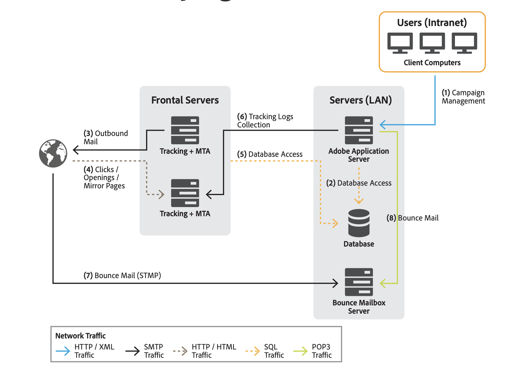

# 一般的なアーキテクチャ{#general-architecture}

一般的な Adobe Campaign ソリューションのデプロイメントは、次のコンポーネントで構成されます。

* **パーソナライズされたクライアント環境**

   直感的なグラフィカルユーザーインターフェイス。このインターフェイスでは、マーケティングオファーの連絡と追跡、キャンペーンの作成、すべてのマーケティングの活動、プログラム、および計画（メール、ワークフロー、ランディングページなど）のレビューと管理、顧客プロファイルの作成と管理、オーディエンスの作成などを実行できます。

* **開発環境**

   サーバーサイドのソフトウェア。ユーザーインターフェイスで定義するルールとワークフローに基づき、選択したコミュニケーションチャネル（メール、SMS、プッシュ通知、ダイレクトメール、Web、Social など）を通じてマーケティングキャンペーンを実施できます。

* **データベースコンテナ**

   リレーショナルデータベース技術を活用して、Adobe Campaign クラウドデータベースの顧客データベースコンテナに、すべての顧客情報、キャンペーンの構成要素、オファー、ワークフロー、キャンペーンの結果などを格納します。

## パーソナライズされたクライアント環境{#client-env}

アプリケーションには、リッチクライアント、シンクライアント、API 統合など、さまざまな方法でアクセスできます。

* **クライアントコンソール**:アプリケーションのメインユーザーインターフェイスは、標準のインターネットプロトコル（SOAP、HTTPなど）でAdobe Campaignアプリケーションサーバーと通信するネイティブアプリケーション（Windows上）です。Adobe Campaign クライアントコンソールは、生産性に優れた使いやすさを備え、帯域幅をほとんど使用せず（ローカルキャッシュを使用）、デプロイメントが容易になるよう設計されています。 このコンソールは、インターネットブラウザーから導入でき、自動的に更新でき、HTTP(S)トラフィックのみを生成するので、特定のネットワーク設定は不要です。

   [!DNL :bulb:] [Campaignクライアントコンソールの詳細を説明します](../start/connect.md)。

* **Webアクセス**:アプリケーションの一部は、レポートモジュール、配信承認ステージ、インスタンスの監視など、HTMLユーザーインターフェイスを使用して、シンプルなwebブラウザーでアクセスできます。

   [!DNL :bulb:] [Campaign Webアクセスの詳細情報](../start/connect.md)を参照してください。

* **Campaign API**：Web サービスの API を SOAP プロトコルで公開して、外部のアプリケーションからシステムを呼び出すこともできます。

   [!DNL :bulb:] [Campaign APIについて詳しくは、](../dev/api.md)を参照してください。

## 開発環境{#dev-env}

Adobe Campaignは、オープンで拡張性の高いアーキテクチャを作成するための、異なるアプリケーションを備えた単一のプラットフォームです。 Adobe Campaign のプラットフォームは、柔軟なアプリケーションレイヤーで記述されており、ビジネスのニーズに合わせて簡単に構成できます。分散型のアーキテクチャであるため、メッセージの処理件数を数千から数百万へ拡張するなど、システムを線形的に拡張できます。

Campaign のモジュールには、連続して稼働させるものと、一時的に起動するものがあります。一時的に起動するモジュールでは、管理タスク（データベース接続の設定など）や繰り返しタスク（トラッキング情報の整理など）を実行します。

Adobe Campaign モジュールには 3 つのタイプがあります。

* **マルチインスタンスモジュール**:1つのプロセスがすべてのインスタンスに対して実行されます。対象となるモジュールは、web、syslogd、trackinglogd、watchdog などです。
* **モノラルインスタンスモジュール**:1つのプロセスがインスタンスごとに実行されます。対象となるモジュールは、mta、wfserver、inMail、sms、stat などです。
* **ユーティリティモジュール**:これらは、時々実行され、時々または繰り返される操作（クリーンアップ、設定、トラッキングログのダウンロードなど）を実行するモジュールです。

主なプロセスは次のとおりです。

**アプリケーションサーバー**（nlserver web）

このプロセスでは、WebサービスAPI(SOAP/HTTP + XML)を介してAdobe Campaignの機能をすべて提供します。 また、HTML ベースでアクセスできるよう、Web ページ（レポート、Web フォームなど）を動的に生成します。そのため、このプロセスには Apache Tomcat JSP サーバーが含まれています。 コンソールは、このプロセスに接続します。

**ワークフローエンジン**（nlserver wfserver）

このプロセスは、アプリケーションで定義したワークフローを実行します。

次のような、定期的に実行するテクニカルワークフローも処理します。

* **トラッキング**:トラッキングログのリカバリと統合。リダイレクトサーバーからログを取得し、レポートモジュールで使用する集計インジケーターを作成します。
* **クリーンアップ**:データベースのクリーニング。古いレコードを削除し、データベースが加速度的に肥大化するのを防ぎます。
* **請求**:プラットフォームに関するアクティビティレポートの自動送信（データベースサイズ、マーケティングアクションの数など）

**配信サーバー**（nlserver mta）

Adobe Campaign には、メールをブロードキャストする機能がネイティブで備わっています。 このプロセスは、SMTP のメール転送エージェント（MTA）として機能します。メッセージを「一対一」でパーソナライズし、物理的に配信します。 配信ジョブを使用して実行され、自動再試行を処理します。 さらに、トラッキングを有効にすると、URL が自動的に置き換えられ、リダイレクトサーバーを指すようになります。

このプロセスでは、SMS、FAX、ダイレクトメール用に、カスタマイズやサードパーティルータへの自動送信を処理できます。

**リダイレクトサーバー**（nlserver webmdl）

Adobe Campaign では、メールの開封とクリック追跡を自動的に処理できます（Web サイトレベルでのトランザクショントラッキングについては、今後の課題です）。 これを実現するため、メールメッセージに含まれる URL を書き換えて、このモジュールを指すようにします。このモジュールは、目的の URL にリダイレクトされる前に、そのインターネットユーザーが通過したことを登録します。

高可用性を確保するため、このプロセスはデータベースから独立しています。他のサーバープロセスとの通信には、SOAP 呼び出し（HTTP、HTTP(S) および XML）のみを使用します。 技術的には、この機能は HTTP サーバーの拡張モジュール（IIS の ISAPI 拡張、DSO Apache モジュールなど）に実装されており、Windows でのみ使用できます。

その他の技術的なプロセスも利用できます。

**バウンスメールの管理**（nlserver inMail）

このプロセスは、配信エラーによって返されたバウンスメッセージを、バウンスメッセージ受信用のメールボックスから自動的に取得します。 バウンスメッセージをルールベースで処理して配信エラーの原因（宛先不明、制限超過など）を特定し、データベース内の配信ステータスを更新します。

これらの動作は事前に設定されており、すべて自動でおこなわれます。

**SMS 配信ステータス**（nlserver sms）

このプロセスは、SMS ルータをポーリングして進行状況のステータスを収集し、データベースを更新します。

**ログメッセージの書き込み**（nlserver syslogd）

この技術プロセスは、他のプロセスで生成されたログメッセージとトレースを取得して、ハードディスクに書き込みます。 これにより、問題発生時の診断に使える十分な情報を取得します。

**トラッキングログの書き込み** (nlserver trackinglogd)

このプロセスは、リダイレクトプロセスによって生成されたトラッキングログをディスクに保存します。

**受信イベントの書き込み** (nlserver interactiond)

このプロセスは、インタラクションのフレームワークで発生するインバウンドイベントをディスクに記録します。

**監視モジュール**（nlserver watchodg）

このプロセスは、他の子プロセスを生成するメインプロセスとして機能します。 障害発生時には子プロセスの監視や再開を自動的に行うため、システムの稼働時間を最大限に維持できます。

**統計サーバー**（nlserver stat）

このプロセスは、接続数、送信メッセージ数（送信先メールサーバー別）、接続や送信の制限値（同時接続数の上限、1 時間あたりや 1 接続あたりのメッセージ数の上限）などの統計情報を保持します。同じパブリック IP アドレスを共有している場合は、複数のインスタンスやマシンを統合することもできます。

## データベースコンテナ {#db-containers}

Adobe Campaign Cloud データベースは、[!DNL Snowflake]を活用しています。これには、ソリューションの機能データ（プロファイル、サブスクリプション、コンテンツなど）、技術データ（配信ジョブ、配信ログ、トラッキングログなど）、作業データ（購入、リード）が含まれています。Adobe Campaign のコンポーネントはすべて、特定のタスクを実行するためにデータベースと通信します。

お客様は、事前定義されたデータベースとスキーマを使用してAdobe Campaignをデプロイできます。必要に応じて、この事前定義された環境を拡張できます。 Adobe Campaign からデータマート内のすべてのデータへは、SQL 呼び出しを介してアクセスします。Adobe Campaign には、ETL（抽出、変換、ロード）ツールを補完する機能も備わっており、システムとの間でのデータの読み込みと書き出しを実行することができます。

>[!CAUTION]
>
>**キャンペーン管理Cloud Services**&#x200B;では、ライセンス契約の条件に従って、Adobeが環境と初期設定を設定しています。 インストール済みの組み込みパッケージ、組み込みスキーマまたはレポートを変更することはできません。
>
>Campaignアドオンまたはプロビジョニングされていない特定の機能を使用する必要がある場合は、**Adobeカスタマーケア**&#x200B;にお問い合わせください。