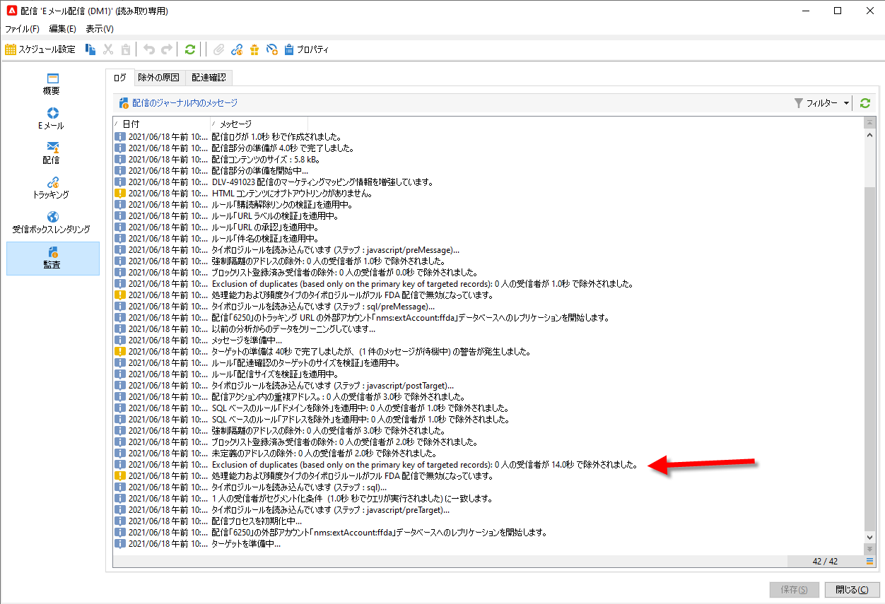
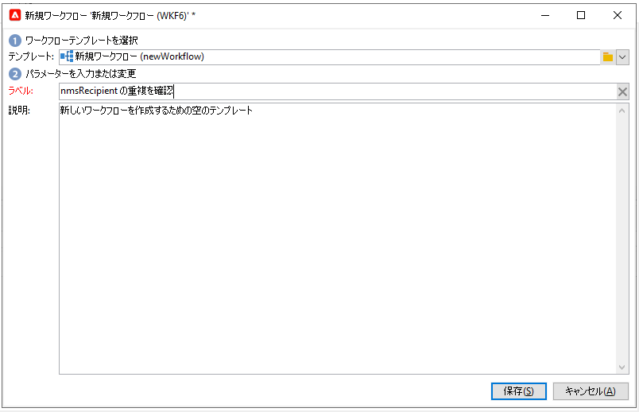
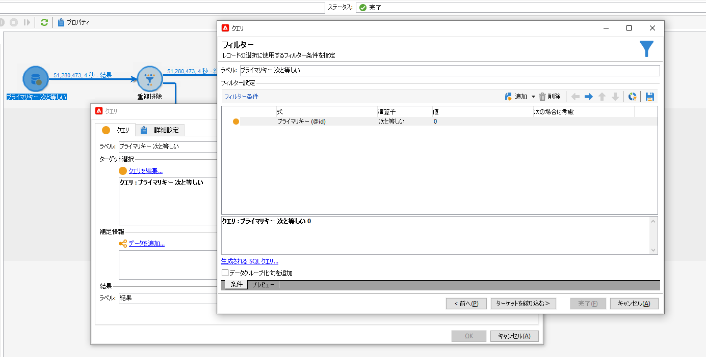
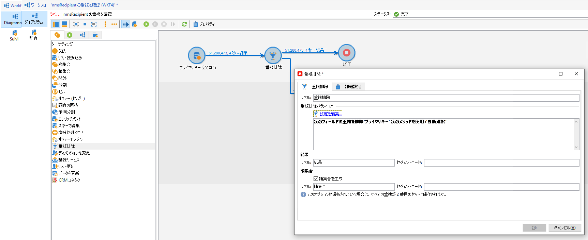
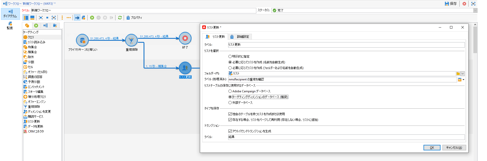
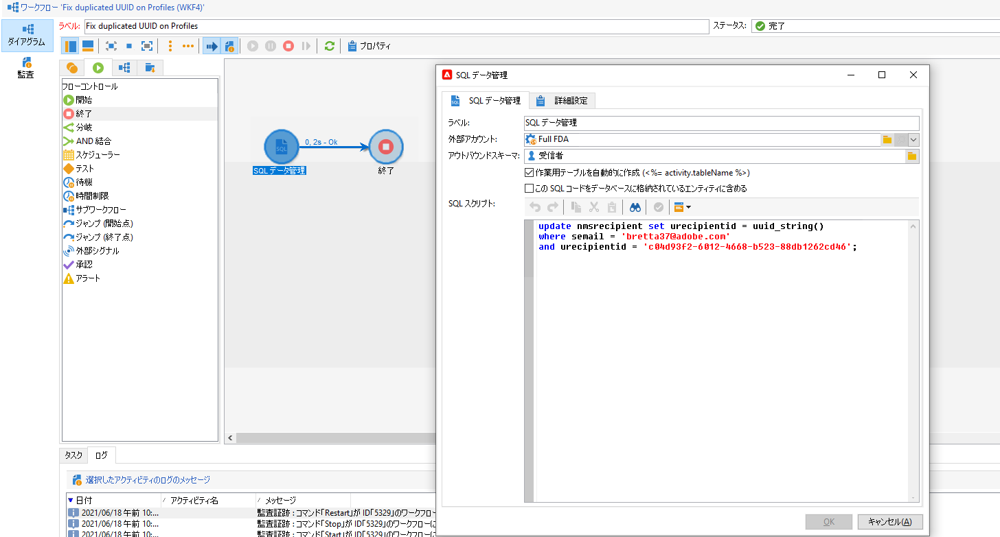

# 鍵の管理とユニシティ{#key-management}

Campaign v8では、プライマリキーはUniversally Unique IDentifier(UUID)で、文字に関する文字列です。 このUUIDを作成するには、スキーマのメイン要素に&#x200B;**autouuid**&#x200B;と&#x200B;**autopk**&#x200B;属性を&#x200B;**true**&#x200B;に設定する必要があります。

Adobeキャンペーンv8には、Snowflakeがコアデータベースとして付属しています。 Snowflake・データベースの分散アーキテクチャには、テーブル内のキーの共通性を管理するメカニズムは用意されていません。エンドユーザーは、Adobe Campaignデータベース内のキーの一貫性を確保する責任を負います。

リレーショナルデータベースの一貫性を維持するには、キー、特にプライマリキーに対する重複を避けることが必須です。 プライマリキーでの重複は、**クエリ**、**紐付け**、**更新データ**&#x200B;など、データ管理ワークフローのアクティビティに問題を引き起こします。

ベストプラクティスとして、Adobeでは、重複したキーがデータベースに読み込まれた場合に、データ管理プロセス全体の一部として[検出](#detect-duplicates)と[正しい](#correct-duplicates)戦略を採用することをお勧めします。

## 重複の検出{#detect-duplicates}

Campaignには、配信の準備中に、重複したUUIDをオーディエンスから自動的に削除する新しいガードレールが追加されました。 この新しいメカニズムは、配信の準備中にエラーが発生するのを防ぎます。

>[!CAUTION]
>
>重複したキーはUUIDに制限されません。 これは、カスタムテーブルで作成されたカスタムキーを含む、IDを持つで発生する可能性があります。

エンドユーザーは、次の情報を配信ログで確認できます。キーが重複しているので、一部の受信者をメインターゲットから除外できます。 その場合、次の警告が表示されます。`Exclusion of duplicates (based on the primary key or targeted records)`.



この場合、重複したキーを識別するワークフローを作成できます。 その後、これらのキーを修正できます。 これを実行するには、次の手順に従います。

1. 新しいワークフローを作成.

   

1. **クエリ**&#x200B;アクティビティを追加します
1. **受信者**&#x200B;テーブルを選択します

   

1. **重複排除**&#x200B;アクティビティを追加し、プライマリキー(UUID)で重複を排除します。 1つの複製のみを保持し、「 **補集合を生成** 」オプションをオンにして、複製のアウトバウンドトランジションを作成します。

   

1. 「リスト更新」アクティビティを使用して、複製をリストに保存します。

   

これで、重複した受信者にリストから直接アクセスできます。 トランジションに、重複した行が1つしか含まれていない場合でも、すべての重複がリストに記録されます。


## {#correct-duplicates}の重複を修正

重複を修正するには、Campaignデータを更新する必要があります。 アクションのタイプは、重複と実装の特性に厳密に結び付けられています。 異なる緩和戦略（削除、結合または更新）を必要とする複数のケースに直面する場合があります。

>[!IMPORTANT]
>
>プライマリキーの複製により、組み込みのワークフローアクティビティを使用して特定の行を選択または更新できなくなります。 UUIDの重複が原因で、データの重複排除は失敗し、データベースの整合性に影響を与える可能性があります。 そのため、重複を修正することを強くお勧めします。

例：

* **ケース1**  — 同じUUIDと同じプロファイル情報（同じEメール、名など）を持つ、重複した受信者:受信者は、「実際」の重複や軽減のように見えるので、重複の1つを削除するだけです。
もう1つのアプローチは、1人の受信者の情報を他の受信者に結合することです。

* **ケース2**  — 同じUUIDを持つが、プロファイル情報（Eメールや名などが異なる）が異なる重複した受信者:
今回は、異なるプロファイルが存在し、Campaignデータベースに両方を保持することが推奨されます。つまり、新しいUUIDを生成する重複の1つを更新するだけの方がよい場合があります。 [詳しくは、この例を参照してください](#deduplicate-sample)。

緩和方法に応じて、いつでも別のワークフローのリストを照会し、必要に応じて更新を適用できます。 詳しいガイダンスについては、Adobeにお問い合わせください。

### 重複排除のサンプル{#deduplicate-sample}

受信者が重複している場合は、Campaignデータベースに両方のレコードを保持できます。 その場合は、いずれか1つを新しいUUIDで更新する必要があります。

したがって、クラウドデータベースでSQL更新クエリを実行するには、**SQL Data Management**&#x200B;ワークフローアクティビティを使用して、次のSQL更新を実行します。

```sql
update nmsrecipient set urecipientid = uuid_string()
where semail = 'bretta37@adobe.com'
and urecipientid = 'c04d93f2-6012-4668-b523-88db1262cd46';
```



選択した行が新しいUUIDで更新されたら、インターフェイスで更新された行を確認し、UUIDが期待どおりに更新されたことを確認できます。 また、](#detect-duplicates)で説明しているように、**重複を検出**&#x200B;ワークフロー[を実行して、データベース内の重複を検出することもできます。
