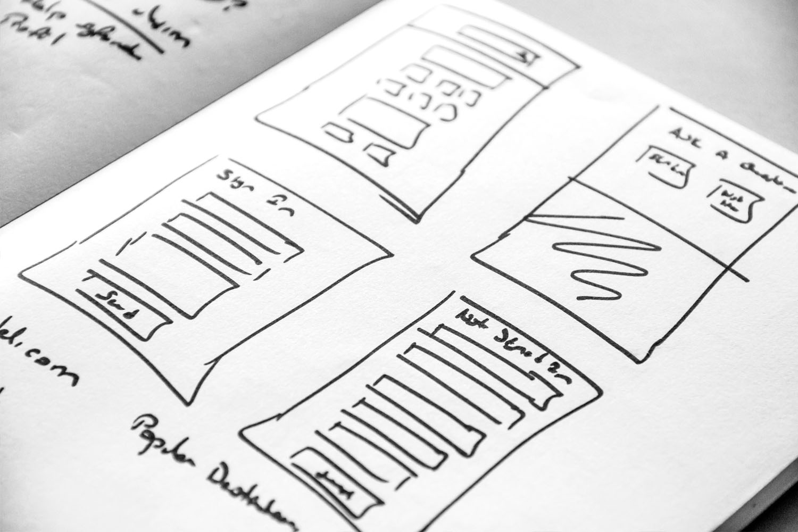

# ランディングページの作成と管理 {#ac-gs-lp}

ランディングページは、特定のマーケティング目標を持つ専用の web ページです。 訪問者は通常、メール、ソーシャルメディアへの投稿、または検索エンジンの結果でリンクをクリックした後、ランディングページに到達します。 一般的な web サイトページとは異なり、ランディングページは、購入、サービスの購読/購読解除、リソースのダウンロードなど、1 つの明確に定義されたアクションの推進に焦点を当てています。 Adobe Campaignを使用すると、ランディングページを作成してユーザーのデータを更新したり、お知らせの受信をオプトイン/オプトアウトしたり、ニュースレターなどの特定のサービスを購読したりできるオンラインフォームにユーザーを誘導できます。

ランディングページを作成するには、[web ユーザーインターフェイス ](../start/campaign-ui.md#campaign-web-user-interface-ac-web-ui) を参照します。 Adobe Campaignには、ランディングページ用の新しいユーザーエクスペリエンスが付属しており、web ユーザーインターフェイスでのみ使用できます。

>[!AVAILABILITY]
>
>* Campaign web ユーザーインターフェイスは、Adobe IDを使用してAdobe Campaignに接続するユーザーのみが使用できます。 [Identity Management System （IMS） ](https://helpx.adobe.com/jp/enterprise/using/identity.html){target="_blank"} のAdobeの詳細を表示します。
>
>* Campaign web ユーザーインターフェイスで作成したランディングページは、Campaign クライアントコンソールで表示または編集することができません。
>

ランディングページを使用すると、次のことができます。

* 様々なユースケースに合わせてすぐに使用できる事前入力済みテンプレートを使用して、ランディングページをすばやく作成、デザイン、共有します。
* Adobe Campaignのコンテンツデザイン機能を活用すると、レスポンシブランディングページを簡単に作成できます。
* オプトインおよびオプトアウトフローを迅速かつシームレスに設定します。
* 購読サービスを作成して、ユーザーがサービスを購読できるようにします。 詳細情報
* 受信者に、お知らせの受信を登録解除する機能を提供します。

ランディングページについて詳しくは、[Campaign web ユーザーインターフェイスのドキュメント ](https://experienceleague.adobe.com/en/docs/campaign-web/v8/landing-pages/get-started-lp){target="_blank"} を参照してください。

また、次のセクションも参照できます。

<table style="table-layout:fixed"><tr style="border: 0;">
<td>

<a href="https://experienceleague.adobe.com/ja/docs/campaign-web/v8/landing-pages/create-lp"><strong>ランディングページの作成</strong>

</td>
<td>

<a href="https://experienceleague.adobe.com/ja/docs/campaign-web/v8/landing-pages/lp-content"><strong>ランディングページの設計</strong></a>

</td>
<td>

<a href="https://experienceleague.adobe.com/ja/docs/campaign-web/v8/landing-pages/lp-templates"><strong>ランディングページテンプレートの操作</strong></a>

</td>
</tr></table>
