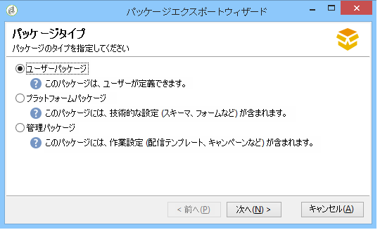
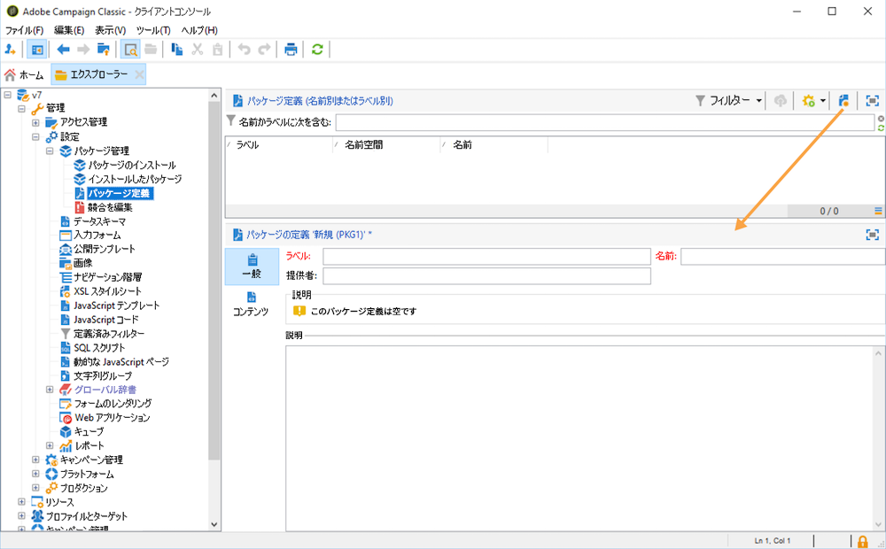
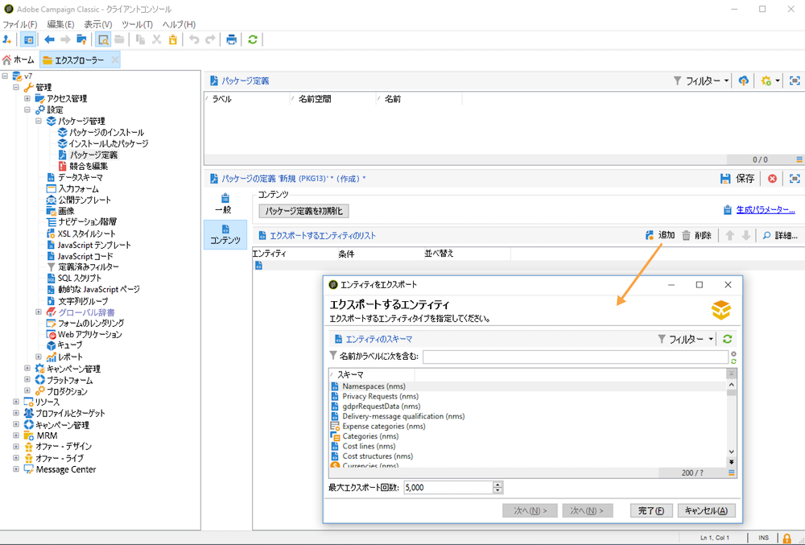
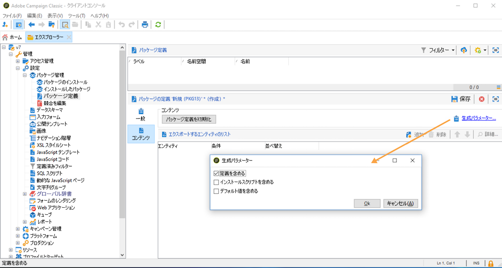

# データパッケージの使用{#data-packages}

## パッケージの基本を学ぶ {#gs-data-packages}

データパッケージを使用すると、プラットフォームのカスタム設定とデータをエクスポートおよびインポートできます。パッケージには、様々なタイプの設定やコンポーネントを含めることができ、フィルタリングされている場合とそうでない場合があります。

Campaign データパッケージでは、Adobe Campaign データベースのエンティティが XML ファイルに表示されます。パッケージでは、各エンティティがそのすべてのデータと共に表されます。

**データパッケージ**&#x200B;の原則とは、データの設定をエクスポートして別の Adobe Campaign 環境内に組み込むことです。この[節](#data-package-best-practices)では、一貫したデータパッケージのセットを維持する方法を説明します。

### パッケージの種類 {#types-of-packages}

Adobe Campaign では、ユーザーパッケージ、プラットフォームパッケージ、管理パッケージの 3 つのタイプのパッケージを使用できます。

* **ユーザーパッケージ**&#x200B;では、エクスポートするエンティティのリストを選択できます。このタイプのパッケージでは、依存関係の管理とエラーの確認が行われます。
* **プラットフォームパッケージ**&#x200B;には、スキーマ、JavaScript コードなど、すべての付加的な技術リソース（非標準）が含まれています。
* **管理パッケージ**&#x200B;には、テンプレート、ライブラリなど、すべての付加的なテンプレートやビジネスオブジェクト（非標準）が含まれています。

>[!CAUTION]
>
>**プラットフォーム**&#x200B;パッケージと&#x200B;**管理**&#x200B;パッケージには、エクスポートするエンティティの定義済みリストが含まれています。個々のエンティティは、作成したパッケージに含まれる事前定義のリソースを削除するためのフィルター条件にリンクされています。

## データ構造 {#data-structure}

1 つのデータパッケージは、次の例のように、**xrk:navtree** データスキーマの文法に準拠した 1 個の構造化 XML ドキュメントによって記述されます。

```xml
<package>
  <entities schema="nms:recipient">
    <recipient email="john.smith@adobe.com" lastName="Smith" firstName="John">      
      <folder _operation="none" name="nmsRootFolder"/>      
      <company _operation="none" name="Adobe"/>
    </recipient>
  </entities>
  <entities schema="sfa:company">
    <company name="Adobe">
      <location city="London" zipCode="W11 2BQ"/>
    </company>
  </entities>
</package>
```

XML ドキュメントの先頭と末尾には必ず `<package>` 要素を記述します。それに続くすべての `<entities>` 要素によって、データがドキュメントタイプ別に配置されます。1 つの `<entities>` 要素には、その要素の **schema** 属性で指定されたデータスキーマの形式に基づくパッケージのデータが含まれます。パッケージ内のデータには、例えば自動生成キー（**autopk** オプション）のような、ベース間の互換性がない内部キーが含まれていてはなりません。

この例では、`folder` リンクと `company` リンクが、宛先テーブル内のいわゆる「ハイレベル」キーで次のように置き換えられています。

```xml
<recipient>
  <folder _operation="none" name="nmsRootFolder"/>
  <company _operation="none" name="Adobe"/>
</recipient>
```

`operation` 属性の値が `none` であることが、紐付けリンクの定義であることを意味します。

データパッケージの作成は、任意のテキストエディターを使って手作業で行うことができます。XML ドキュメントの構造が `xtk:navtree` データスキーマに準拠していることを確認する必要があります。クライアントコンソールには、データパッケージのエクスポートとインポートを実行できるモジュールがあります。

## パッケージのエクスポート {#export-packages}

パッケージは次の 3 つの方法でエクスポートできます。

* **[!UICONTROL パッケージエクスポート]**&#x200B;アシスタントを使用すると、1 つのパッケージにオブジェクトセットをエクスポートできます。[詳細情報](#export-a-set-of-objects-in-a-package)
* **1 つのオブジェクト**&#x200B;をエクスポートするには、このオブジェクトを右クリックし、**[!UICONTROL アクション／パッケージにエクスポート]**&#x200B;を選択します。
* **パッケージ定義**&#x200B;を使用すると、後でパッケージにエクスポートするオブジェクトを追加するパッケージ構造を作成できます。[詳細情報](#manage-package-definitions)

パッケージをエクスポートしたら、そのパッケージと追加したすべてのエンティティを別の Campaign インスタンスにインポートできます。

### パッケージに含まれる一連のオブジェクトのエクスポート {#export-a-set-of-objects-in-a-package}

データパッケージにオブジェクトセットをエクスポートするには、次の手順に従います。

1. エクスプローラーの&#x200B;**[!UICONTROL ツール／詳細設定／パッケージをエクスポート...]** メニュー経由でパッケージエクスポートアシスタントを参照します。
1. [パッケージのタイプ](#types-of-packages)を選択します。

   

1. 「**追加**」ボタンをクリックして、パッケージとしてエクスポートするエンティティを選択します。

   >[!CAUTION]
   >
   >エクスポートの対象が&#x200B;**[!UICONTROL オファーカテゴリ]**、**[!UICONTROL オファー環境]**、**[!UICONTROL プログラム]**&#x200B;または&#x200B;**[!UICONTROL プラン]**&#x200B;タイプのフォルダーである場合は、**xtk:folder** を絶対に選択しないでください。選択するとデータの一部が失われることがあります。フォルダーに対応するエンティティ（オファーカテゴリには **nms:offerCategory**、オファー環境には **nms:offerEnv**、プログラムには **nms:program**、プランには **nms:plan**）を選択します。

   エンティティのエクスポート処理の流れは、依存関係メカニズムによってコントロールされます。詳しくは、[依存関係の管理](#manage-dependencies)を参照してください。

1. 「**[!UICONTROL 次へ]**」をクリックし、抽出するドキュメントのタイプに関するフィルタークエリを定義します。ここでは、データ抽出用のフィルタリング節を設定する必要があります。

   >[!NOTE]
   >
   >Query Editor については、[この節](../../automation/workflow/query.md)を参照してください。

1. 「**[!UICONTROL 次へ]**」をクリックし、エクスポートしたデータの並べ替え順序を選択します。

1. 抽出するデータをプレビューし、設定を確認します。

1. パッケージエクスポートアシスタントの最終ページで、エクスポートを開始します。「**[!UICONTROL ファイル]**」フィールドで指定されたファイルにデータが格納されます。

### 依存関係の管理 {#manage-dependencies}

エクスポート処理では、エクスポートされた様々な要素間のリンクを追跡します。このメカニズムは次の 2 つのルールに基づいて機能します。

* リンクの整合性タイプ `own` または `owncopy` を使ってリンクされたオブジェクトは、エクスポート対象オブジェクトと同じパッケージに含めてエクスポートされます。
* リンクの整合性タイプ `neutral` または `define` を使ってリンク（定義リンク）されたオブジェクトは、別途エクスポートする必要があります。

>[!NOTE]
>
>スキーマ要素に関連付けられる整合性タイプの定義については、[このページ](database-links.md)を参照してください。

#### キャンペーンのエクスポート {#export-a-campaign}

キャンペーンをエクスポートする方法の例を以下に示します。エクスポートするマーケティングキャンペーンには、次のものが含まれます。
* `MyTask` タスク
* 次のフォルダー内の `campaignWorkflow` ワークフロー：**[!UICONTROL 管理／本番／テクニカルワークフロー／キャンペーンプロセス／MyWorkflow]**。

タスクとワークフローはキャンペーンと同じパッケージ内にエクスポートされます。これは、対応するスキーマが `own` 整合性タイプのリンクで結びつけられているからです。

パッケージのコンテンツは次のとおりです。

```xml
<?xml version='1.0'?>
<package author="Administrator (admin)" buildNumber="7974" buildVersion="7.1" img=""
label="" name="" namespace="" vendor="">
 <desc></desc>
 <version buildDate="2013-01-09 10:30:18.954Z"/>
 <entities schema="nms:operation">
  <operation duration="432000" end="2013-01-14" internalName="OP1" label="MyCampaign"
  modelName="opEmpty" start="2013-01-09">
   <controlGroup>
    <where filteringSchema=""/>
   </controlGroup>
   <seedList>
    <where filteringSchema="nms:seedMember"></where>
    <seedMember internalName="SDM1"></seedMember>
   </seedList>
   <parameter useAsset="1" useBudget="1" useControlGroup="1" useDeliveryOutline="1"
   useDocument="1" useFCPValidation="0" useSeedMember="1" useTask="1"
   useValidation="1" useWorkflow="1"></parameter>
   <fcpSeed>
    <where filteringSchema="nms:seedMember"></where>
   </fcpSeed>
   <owner _operation="none" name="admin" type="0"/>
   <program _operation="none" name="nmsOperations"/>
   <task end="2013-01-17 10:07:51.000Z" label="MyTask" name="TSK2" start="2013-01-16 10:07:51.000Z"
   status="1">
    <owner _operation="none" name="admin" type="0"/>
    <operation _operation="none" internalName="OP1"/>
    <folder _operation="none" name="nmsTask"/>
   </task>
   <workflow internalName="WKF12" label="CampaignWorkflow" modelName="newOpEmpty"
   order="8982" scenario-cs="Notification of the workflow supervisor (notifySupervisor)"
   schema="nms:recipient">
    <scenario internalName="notifySupervisor"/>
    <desc></desc>
    <folder _operation="none" name="Folder4"/>
    <operation _operation="none" internalName="OP1"/>
   </workflow>
  </operation>
 </entities>
</package>   
```

パッケージのタイプに対する所属関係は、スキーマ内では `@pkgAdmin and @pkgPlatform` 属性によって定義されています。どちらの属性にも、パッケージへの所属条件を定義する XTK 式が指定されます。

```xml
<element name="offerEnv" img="nms:offerEnv.png" 
template="xtk:folder" pkgAdmin="@id != 0">
```

最後に、`@pkgStatus` 属性は、これらの要素または属性に関するエクスポートルールの定義に使われます。この属性の値に応じて、該当する要素または属性はエクスポートされるパッケージに含まれます。この属性に指定できる値は次の 3 種類です。

* `never`：そのフィールドやリンクをエクスポートしない
* `always`：そのフィールドを常にエクスポートする
* `preCreate`：リンクされたエンティティの作成を許可する

>[!NOTE]
>
>`preCreate` 値は、リンクタイプのイベントに対してのみ使用できます。この値を指定すると、エクスポートされるパッケージ内のまだロードされていないエンティティを参照するリンクを作成することができます。

## パッケージ定義の管理 {#manage-package-definitions}

パッケージ定義では、パッケージ構造を作成し、エンティティを追加してから、単一のパッケージにエクスポートできます。その後、このパッケージと追加されたすべてのエンティティを他の Campaign インスタンスにインポートできます。

### パッケージ定義の作成 {#create-a-package-definition}

パッケージ定義には、**[!UICONTROL 管理／設定／パッケージ管理／パッケージ定義]**&#x200B;メニューからアクセスできます。

パッケージ定義を作成するには、「**[!UICONTROL 新規]**」ボタンをクリックし、パッケージ定義の一般情報を入力します。



その後、パッケージ定義にエンティティを追加し、XML ファイルパッケージにエクスポートします。

**関連トピック：**

* [パッケージ定義へのエンティティの追加](#add-entities-to-a-package-definition)
* [パッケージ定義の生成に関する設定](#configure-package-definitions-generation)
* [パッケージ定義からのパッケージのエクスポート](#export-packages-from-a-package-definition)

### パッケージ定義へのエンティティの追加 {#add-entities-to-a-package-definition}

「**[!UICONTROL コンテンツ]**」タブで「**[!UICONTROL 追加]**」ボタンをクリックし、パッケージとしてエクスポートするエンティティを選択します。エンティティを選択する際のベストプラクティスについては、[この節](#export-a-set-of-objects-in-a-package)を参照してください。



エンティティは、インスタンス内の場所から直接パッケージ定義に追加できます。これをおこなうには、以下の手順に従います。

1. 目的のエンティティを右クリックして、**[!UICONTROL アクション／パッケージにエクスポート]**&#x200B;を選択します。

1. **[!UICONTROL パッケージ定義に追加]**&#x200B;を選択し、エンティティを追加するパッケージ定義を選択します。

1. エンティティをパッケージ定義に追加すると、そのエンティティがパッケージとしてエクスポートされます（[この節](#export-packages-from-a-package-definition)を参照）。

### パッケージ定義の生成の設定 {#configure-package-definitions-generation}

パッケージの生成は、パッケージ定義の「**[!UICONTROL コンテンツ]**」タブで設定できます。設定をおこなうには、「**[!UICONTROL 生成パラメーター]**」リンクをクリックします。



* 「**[!UICONTROL 定義を含める]**」オプションを使用すると、パッケージ定義で現在使用されている定義を含めることができます。
* 「**[!UICONTROL インストールスクリプトを含める]**」オプションを使用すると、パッケージのインポート時に実行する JavaScript スクリプトを追加できます。選択すると、パッケージ定義画面に「**[!UICONTROL スクリプト]**」タブが表示されます。
* 「**[!UICONTROL デフォルト値を含める]**」オプションを使用すると、すべてのエンティティの属性の値をパッケージに追加できます。

  このオプションは、エクスポート内容が長くなりすぎないように、デフォルトでは選択されません。つまり、デフォルトでは、デフォルト値（スキーマで別途定義されていない場合の、空の文字列、「0」、「false」）を持つエンティティ属性はパッケージに追加されず、エクスポートも行われません。

  >[!CAUTION]
  >
  >パッケージのインポート先のインスタンスに、パッケージと同じエンティティ（同じ外部 ID など）が含まれている場合は、そのエンティティの属性は更新されません。元のインスタンスにデフォルト値を持つ属性がある場合、それらがパッケージに含まれないので、こうしたことが起こります。この場合は「**[!UICONTROL デフォルト値を含める]**」オプションを選択すると、元のインスタンスからすべての属性がパッケージにエクスポートされるので、複数のバージョンが結合されることはありません。

### パッケージ定義からのパッケージのエクスポート {#export-packages-from-a-package-definition}

パッケージ定義からパッケージをエクスポートするには、以下の手順に従います。

1. エクスポートするパッケージ定義を選択し、「**[!UICONTROL アクション]**」ボタンをクリックし、「**[!UICONTROL パッケージをエクスポート]**」を選択します。
1. エクスポートされたファイルの名前と場所を確認します。
1. 「**[!UICONTROL 開始]**」ボタンをクリックしてエクスポートを開始します。

## パッケージのインポート {#import-packages}

クライアントコンソールのメインメニューで&#x200B;**[!UICONTROL ツール／詳細設定／パッケージをインポート]**&#x200B;を選択すると、パッケージインポートアシスタントにアクセスできます。

### ファイルからのパッケージのインストール {#install-a-package-from-a-file}

既存のデータパッケージをインポートするには、次の手順に従います。

1. クライアントコンソールのメインメニューで&#x200B;**[!UICONTROL ツール／詳細設定／パッケージをインポート]**&#x200B;からインポートアシスタントにアクセスします。
1. XML ファイルを選択し、「**[!UICONTROL 開く]**」をクリックします。

インポートされるパッケージの内容が、エディターの中央部セクションに表示されます。

「**[!UICONTROL 次へ]**」、「**[!UICONTROL 開始]**」の順にクリックすると、インポートが開始されます。

### ビルトインパッケージのインストール {#install-a-standard-package}

ビルトインパッケージ（別名、標準パッケージ）は、Adobe Campaign を設定するときにインストールされます。権限、デプロイメントモデル、製品の提供に応じて、新しい標準パッケージをインポートできます。

インストールできるパッケージを確認するには、ライセンス契約を参照してください。

## データパッケージのベストプラクティス {#data-package-best-practices}

この節では、プロジェクトの全期間にわたって一貫した方法でデータパッケージを編成する方法について説明します。


### バージョン

同じバージョンのプラットフォーム内でインポートする必要があります。同じビルドを持つ 2 つのインスタンス間にパッケージをデプロイしていることを確認する必要があります。ビルドが異なる場合は、インポートを強制的に実行せず、最初にプラットフォームを必ず更新してください。

>[!IMPORTANT]
>
>異なるバージョン間のインポートは、アドビではサポートされていません。

スキーマとデータベースの構造に注意してください。スキーマを含むパッケージのインポートの後にスキーマの生成が必要です。

### パッケージの種類 {#package-types}

まず、様々なタイプのパッケージを定義します。次の 4 つのタイプのみが使用されます。

**エンティティ**

* スキーマ、フォーム、フォルダー、配信テンプレートなど、Adobe Campaign 内のすべての「xtk」および「nms」固有の要素が含まれます。
* エンティティは、「admin」要素と「platform」要素の両方として見なすことができます。
* Campaign インスタンスにアップロードする際に、パッケージに複数のエンティティを含めないでください。

新しいインスタンスに設定をデプロイする必要がある場合は、すべてのエンティティパッケージをインポートできます。

**機能**

このパッケージタイプには、以下が当てはまります。
* クライアントの要件や仕様に対応する。
* 1 つまたは複数の機能が含まれる。
* 他のパッケージを使用せずに機能を実行できるように、すべての依存関係を含める必要がある。

**キャンペーン**

このパッケージは必須ではありません。キャンペーンが機能として見なされる場合でも、すべてのキャンペーンに対して特定のタイプを作成すると便利です。

**アップデート**

設定が完了すると、1 つの機能を別の環境にエクスポートすることができます。例えば、開発環境からテスト環境にパッケージをエクスポートすることができます。このテストでは、欠陥が明らかになります。まず、開発環境で欠陥を修正する必要があります。次に、パッチをテストプラットフォームに適用する必要があります。

1 つ目の解決策は、機能全体を再度エクスポートすることです。ただし、リスク（不要な要素の更新）を回避するには、修正のみを含むパッケージを使用した方が安全です。

そのため、機能のエンティティタイプを 1 つだけ含む「アップデート」パッケージを作成することをお勧めします。

更新は修正になるだけでなく、エンティティ、機能、キャンペーンパッケージの新しい要素にもなります。パッケージ全体をデプロイしないようにするには、アップデートパッケージをエクスポートします。

### 命名規則 {#data-package-naming}

タイプが定義されたら、命名規則を指定する必要があります。Adobe Campaign では、パッケージ仕様のサブフォルダーを作成できません。パッケージ名を整理する最適な方法は、番号を使用することです。番号は、パッケージ名のプレフィックスとして使用します。

例えば、次の規則を使用できます。

* エンティティ：1 ～ 99
* 機能：100 ～ 199
* キャンペーン：200 ～ 299
* アップデート：5000 ～ 5999

#### エンティティパッケージの順序 {#entity-packages-order}

インポートを円滑に行うために、エンティティパッケージはインポートされる順に並べる必要があります。

次に例を示します。

* 001 – スキーマ
* 002 – フォーム
* 003 – 画像
* その他

>[!NOTE]
>
>フォームは、スキーマの更新&#x200B;**後**&#x200B;にのみインポートする必要があります。


#### パッケージドキュメント {#package-documentation}

パッケージを更新する場合、変更内容や理由（「新しいスキーマを追加」、「欠陥を修正」など）の詳細を説明するために、必ず説明フィールドにコメントを入れてください。

また、ベストプラクティスとして、更新日も入力することもお勧めします。

>[!IMPORTANT]
>
>説明フィールドには、2,000 文字まで入力できます。
