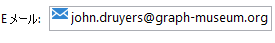
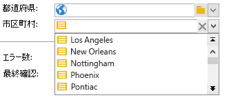
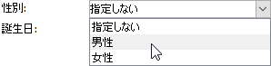
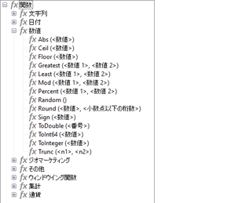

# スキーマの構造{#schema-structure}

`<srcschema>` の基本的な構造は次のとおりです。

```
<srcSchema>
    <enumeration>
        ...          //definition of enumerations
    </enumeration>
   
    <element>         //definition of the root <element>    (mandatory)

        <compute-string/>  //definition of a compute-string
        <key>
            ...        //definition of keys
        </key>
        <sysFilter>
            ...           //definition of filters
        </sysFilter>
        <attribute>
            ...             //definition of fields
        </attribute>
    
            <element>           //definition of sub-<element> 
                  <attribute>           //(collection, links or XML)
                  ...                         //and additional fields
                  </attribute>
                ...
            </element>
      
    </element> 

        <methods>                 //definition of SOAP methods
            <method>
                ...
            </method>
            ...
    </methods>  
          
</srcSchema>
```

データスキーマの XML ドキュメントには、スキーマの名前と名前空間を生成する **name** 属性と **namespace** 属性が設定された **`<srcschema>`** ルート要素を含める必要があります。

```
<srcSchema name="schema_name" namespace="namespace">
...
</srcSchema>
```

次の XML コンテンツを使用して、データスキーマの構造を説明します。

```
<recipient email="John.doe@aol.com" created="AAAA/DD/MM" gender="1"> 
  <location city="London"/>
</recipient>
```

対応するデータスキーマを使用して、次の操作をおこないます。

```
<srcSchema name="recipient" namespace="cus">
  <element name="recipient">
    <attribute name="email"/>
    <attribute name="created"/>
    <attribute name="gender"/>
    <element name="location">
      <attribute name="city"/>
   </element>
  </element>
</srcSchema>
```

## 説明 {#description}

スキーマのエントリポイントは、スキーマのメイン要素です。メイン要素はスキーマと同じ名前なので、識別は容易です。また、メイン要素はルート要素の子でなければなりません。コンテンツの記述は、この要素から始まります。

この例では、メイン要素を次の行で表しています。

```
<element name="recipient">
```

メイン要素の後に続く要素 **`<attribute>`** と **`<element>`** を使用すると、XML 構造内のデータ項目の場所と名前を定義できます。

サンプルスキーマでは、次のようになります。

```
<attribute name="email"/>
<attribute name="created"/>
<attribute name="gender"/>
<element name="location">
  <attribute name="city"/>
</element>
```

次の規則に従う必要があります。

* 各 **`<element>`** と **`<attribute>`** は、**name** 属性を介して名前で識別する必要があります。

   >[!CAUTION]
   >
   >要素名は簡潔なもの（できれば英語）にし、XML 命名規則に従って許可された文字のみを含める必要があります。

* XML 構造に **`<attribute>`** 要素と **`<element>`** 要素を含めることができるのは、**`<element>`** 要素のみです。
* **`<attribute>`** 要素には、**`<element>`** 内で一意の名前が必要です。
* 複数行のデータ文字列では、**`<elements>`** を使用することをお勧めします。

## データタイプ {#data-types}

データタイプは、**`<attribute>`** 要素と **`<element>`** 要素の **type** 属性を介して入力されます。

詳細なリストは、[Campaign Classicv7のドキュメント](https://experienceleague.adobe.com/docs/campaign-classic/using/configuring-campaign-classic/schema-reference/elements-attributes/schema-introduction.html?lang=ja#configuring-campaign-classic)に記載されています。

この属性が空の場合、要素に子要素が含まれていない限り、**string** がデフォルトのデータタイプになります。 子要素が含まれる場合は、要素を階層的に構成するためにのみ使用します（この例では&#x200B;**`<location>`**&#x200B;要素）。

スキーマでは、次のデータタイプをサポートしています。

* **string**：文字列。例：名、町名など

   サイズは、**length** 属性を使用して指定できます。オプションであり、デフォルト値は「255」です。

* **boolean**：ブール値フィールド可能な値の例：true/false、0/1、yes/no など
* **byte**、**short**、**long**：整数（1 バイト、2 バイト、4 バイト）。例：年齢、アカウント番号、ポイント数など
* **double**：倍精度浮動小数点数。例：価格、料金など
* **date**、**datetime**：日付、および日付 + 時刻。例：生年月日、購入日など
* **datetimenotz**：タイムゾーンデータを含まない日付＋時刻。
* **timespan**：継続時間。例：年齢順。
* **memo**：長いテキストフィールド（複数行）。例：説明、注釈など
* **uuid**：「uniqueidentifier」フィールド

   >[!NOTE]
   >
   >**uuid** フィールドを含めるには、「newuuid()」関数を追加し、デフォルト値を設定する必要があります。

次に、入力したタイプのスキーマ例を示します。

```
<srcSchema name="recipient" namespace="cus">
  <element name="recipient">
    <attribute name="email" type="string" length="80"/>
    <attribute name="created" type="datetime"/>
    <attribute name="gender" type="byte"/>
    <element name="location">
      <attribute name="city" type="string" length="50"/>
   </element>
  </element>
</srcSchema>
```

## プロパティ {#properties}

データスキーマの **`<elements>`** 要素と **`<attributes>`** 要素は、様々なプロパティを使用して強化できます。 現在の要素を説明するためにラベルを入力できます。

### ラベルと説明 {#labels-and-descriptions}

* **label** プロパティを使用すると、簡単な説明を入力できます。

   >[!NOTE]
   >
   >ラベルは、インスタンスの現在の言語に関連付けられます。

   **例**：

   ```
   <attribute name="email" type="string" length="80" label="Email"/>
   ```

   ラベルは、Adobe Campaign クライアントコンソールの入力フォームから確認できます。

   

* **desc** プロパティを使用すると、詳細な説明を入力できます。

   説明は、Adobe Campaign クライアントコンソールのメイン画面のステータスバーにある入力フォームから確認できます。

   >[!NOTE]
   >
   >説明は、インスタンスの現在の言語に関連付けられます。

   **例**：

   ```
   <attribute name="email" type="string" length="80" label="Email" desc="Email of recipient"/>
   ```

### デフォルト値 {#default-values}

**default** プロパティを使用すると、コンテンツ作成時にデフォルト値を返す式を定義できます。

値は、XPath 言語に準拠した式である必要があります。 詳細については、[このセクション](#reference-with-xpath)を参照してください。

**例**：

* 現在の日付：**default=&quot;GetDate()&quot;**
* カウンター：**default=&quot;&#39;FRM&#39;+CounterValue(&#39;myCounter&#39;)&quot;**

   この例では、デフォルト値は文字列を連結して構築され、**CounterValue** 関数を任意のカウンター名で呼び出しています。 返される数字は、挿入のたびに 1 ずつ増分されます。

   >[!NOTE]
   >
   >Adobe Campaign クライアントコンソールでは、**[!UICONTROL 管理／カウンター]**&#x200B;ノードを使用してカウンターを管理します。

フィールドにデフォルト値をリンクするには、`<default>  or  <sqldefault>   field.  </sqldefault> </default>` を使用できます

`<default>`：エンティティを作成時にデフォルト値をフィールドに事前入力できます。値はデフォルトの SQL 値ではありません。

`<sqldefault>`：フィールドの作成時に値を追加できます。この値は SQL 結果として表示されます。 スキーマを更新時に、この値の影響を受けるのは新しいレコードだけです。

### 列挙 {#enumerations}

#### 任意の定義済みリスト{#free-enumeration}

**userEnum** プロパティを使用すると、任意の定義済みリストを定義して、このフィールドに入力した値を記憶して表示することができます。構文は以下のようになります。

**userEnum=&quot;定義済みリスト名&quot;**

定義済みリストに付与する名前は自由に選択でき、他のフィールドと共有できます。

これらの値が、入力フォームのドロップダウンリストに表示されます。



>[!NOTE]
>
>Adobe Campaign クライアントコンソールでは、**[!UICONTROL 管理／定義済みリスト]**&#x200B;ノードを使用して、定義済みリストを管理します。

#### 定義済みリストを設定{#set-enumeration}

**enum** プロパティを使用すると、考えられる値のリストが事前にわかっている場合に使用できる、固定の定義済みリストを定義できます。

**enum** 属性は、メイン要素の外側のスキーマに入力される定義済みリストクラスの定義を参照します。

定義済みリストを使用すると、通常の入力フィールドに値を入力する代わりに、ドロップダウンリストから値を選択できるようになります。



データスキーマの定義済みリスト宣言の例：

```
<enumeration name="gender" basetype="byte" default="0">    
  <value name="unknown" label="Not specified" value="0"/>    
  <value name="male" label="male" value="1"/>   
  <value name="female" label="female" value="2"/>   
</enumeration>
```

定義済みリストは、メイン要素の外側で **`<enumeration>`** 要素を介して宣言されます。

定義済みリストのプロパティは次のとおりです。

* **baseType**：値に関連付けられているデータのタイプ。
* **label**：定義済みリストの説明。
* **name**：定義済みリストの名前。
* **default**：定義済みリストのデフォルト値。

定義済みリストの値は、次の属性を持つ **`<value>`** 要素で宣言します。

* **name**：内部的に保存された値の名前。
* **label**：グラフィカルインターフェイスで表示されるラベル

#### dbenum 定義済みリスト{#dbenum-enumeration}

* **dbenum** プロパティを使用すると、**enum** プロパティと類似したプロパティを持つ定義済みリストを定義できます。

   ただし、**name** 属性は値を内部に格納するのではなく、スキーマを変更せずに関連するテーブルを拡張できるコードを格納します。

   値は、**[!UICONTROL 管理／定義済みリスト]**&#x200B;ノードを介して定義します。

   この定義済みリストは、キャンペーンの特性を指定する場合などに使用します。

   

### 例 {#example}

プロパティが設定されたスキーマの例を次に示します。

```
<srcSchema name="recipient" namespace="cus">
  <enumeration name="gender" basetype="byte">    
    <value name="unknown" label="Not specified" value="0"/>    
    <value name="male" label="male" value="1"/>   
    <value name="female" label="female" value="2"/>   
  </enumeration>

  <element name="recipient">
    <attribute name="email" type="string" length="80" label="Email" desc="Email of recipient"/>
    <attribute name="created" type="datetime" label="Date of creation" default="GetDate()"/>
    <attribute name="gender" type="byte" label="gender" enum="gender"/>
    <element name="location" label="Location">
      <attribute name="city" type="string" length="50" label="City" userEnum="city"/>
   </element>
  </element>
</srcSchema>
```

## コレクション {#collections}

コレクションは、同じ名前と同じ階層レベルを持つ要素のリストです。

**unbound** 属性の値が「true」の場合、コレクション要素にデータを埋め込むことができます。

**例**：スキーマ内の **`<group>`** コレクション要素の定義。

```
<element name="group" unbound="true" label="List of groups">
  <attribute name="label" type="string" label="Label"/>
</element>
```

XML コンテンツの投影を使用する場合：

```
<group label="Group1"/>
<group label="Group2"/>
```

## XPath を使用した参照 {#reference-with-xpath}

Adobe Campaign では、XPath 言語を使用して、データスキーマに属する要素または属性を参照します。

XPath は、XML ドキュメントのツリー内にノードを配置するための構文です。

要素は名前で指定し、属性は名前の前に「@」文字を付けて指定します。

**例**：

* **@email**：メールを選択します。
* **location/@city**：**`<location>`** 要素の「市区町村」属性を選択します。
* **../@email**：現在の要素の親要素からメールアドレスを選択します。
* **group`[1]/@label`**：最初の **`<group>`** コレクション要素の子要素である「label」属性を選択します。
* **group`[@label='test1']`**：**`<group>`** 要素の子で、値「test1」を含む「label」属性を選択します。

>[!NOTE]
>
>パスがサブ要素を越えると、制約が追加されます。 この場合、次の式を角括弧で囲む必要があります。
>
>* **location/@city** が無効です。**`[location/@city]`** を使用してください。
>* **`[@email]`** と **@email** は同等です。

>


次の算術演算のように、複雑な式を定義することもできます。

* **@gender+1**：**gender** 属性の内容に 1 を追加します。
* **@email + &#39;(&#39;+@created+&#39;)&#39;**：丸括弧内の作成日に追加された電子メールアドレスの値を受け取って、文字列を作成します（文字列型の場合は、定数を引用符で囲みます）。

この言語の可能性を広げるため、式に高レベルの関数が追加されました。

使用可能な関数のリストについては、Adobe Campaign クライアントコンソールの任意の式エディターを参照してください。



**例**：

* **GetDate()**：現在の日付を返します。
* **Year(@created)**：「created」属性に含まれる日付の年を返します。
* **GetEmailDomain(@email)**：メールアドレスのドメインを返します。

## 文字列計算を使用した文字列の作成 {#building-a-string-via-the-compute-string}

**文字列計算**&#x200B;は、スキーマに関連付けられたテーブルのレコードを表す文字列の構築に使用する XPath 式です。 **文字列計算** は、主にグラフィカルインターフェイスで、選択したレコードのラベルを表示するために使用します。

**文字列計算**&#x200B;は、データスキーマのメイン要素の下の **`<compute-string>`** 要素を介して定義します。**expr** 属性には、表示を計算する XPath 式が含まれます。

**例**：受信者テーブルの文字列を計算します。

```
<srcSchema name="recipient" namespace="nms">  
  <element name="recipient">
    <compute-string expr="@lastName + ' ' + @firstName +' (' + @email + ')' "/>
    ...
  </element>
</srcSchema>
```

受信者の文字列計算の結果：**Doe John (john.doe@aol.com)**

>[!NOTE]
>
>スキーマに文字列計算が含まれていない場合、デフォルトでは、スキーマのプライマリキーの値が文字列計算に入力されます。
