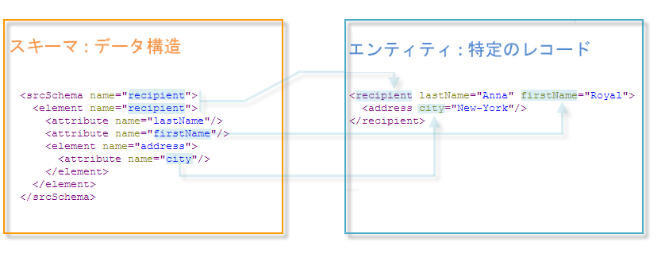
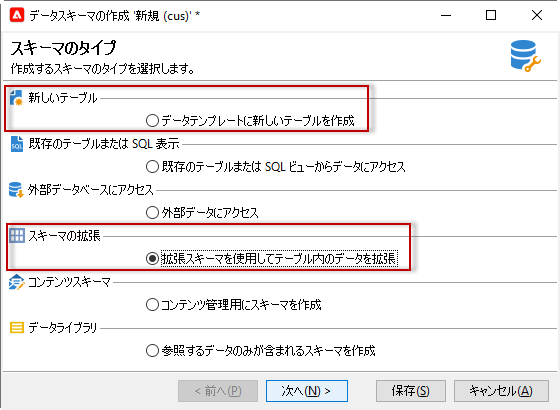
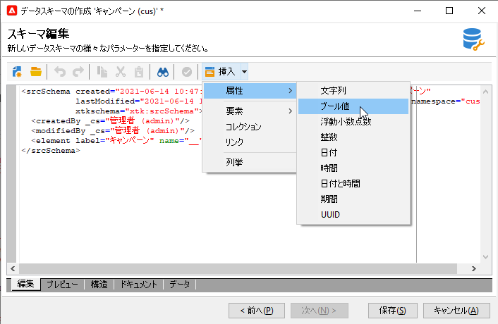
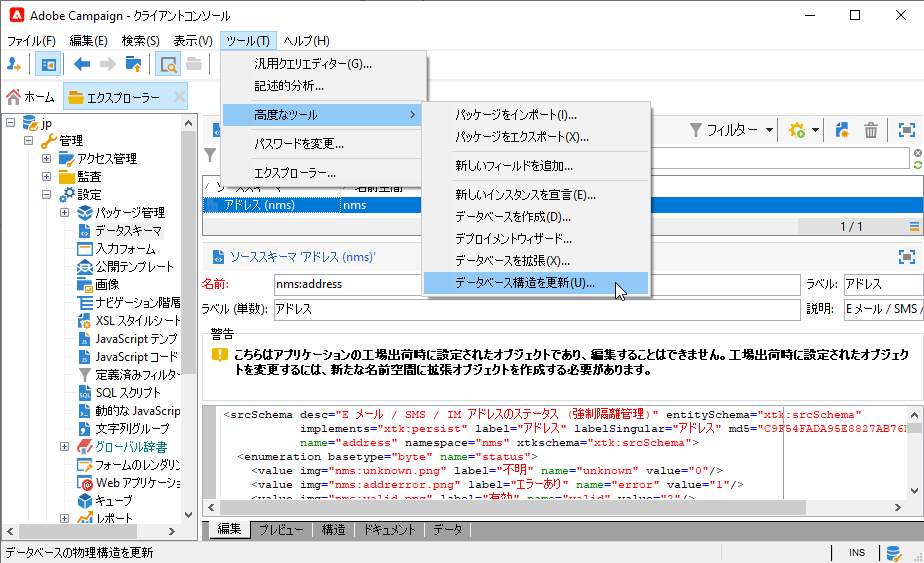

# スキーマの操作{#gs-ac-schemas}

アプリケーションに格納されるデータの物理的および論理的構造は、XML で記述されます。**スキーマ**&#x200B;と呼ばれるAdobe Campaign固有の文法に従います。

スキーマは、データベーステーブルに関連付けられたXMLドキュメントです。 データ構造を定義し、表のSQL定義を説明します。

* テーブルの名前
* フィールド
* 他のテーブルとのリンク

また、データの格納に使用するXML構造についても説明します。

* 要素と属性
* 要素の階層
* 要素と属性の種類
* デフォルト値
* ラベル、説明、およびその他のプロパティ。

スキーマを使用すると、データベース内にエンティティを定義できます。 エンティティごとにスキーマがあります。

Adobe Campaignでは、次の目的でデータスキーマを使用しています。

* アプリケーション内のデータ・オブジェクトと基礎となるデータベース表との関連付け方法を定義します。
* Campaign アプリケーション内での異なるデータオブジェクト間リンクの定義
* 各オブジェクトに含まれている個々のフィールドの定義と記述

キャンペーンの組み込みテーブルとそのやり取りについての詳細は、[このセクション](datamodel.md)を参照してください。

>[!CAUTION]
>
>一部の組み込みキャンペーンスキーマは、Cloudデータベースにスキーマを関連付けています。 これらのスキーマは&#x200B;**Xl**&#x200B;名前空間で識別され、変更できません。

## スキーマの構文{#syntax-of-schemas}

スキーマのルート要素は&#x200B;**`<srcschema>`**&#x200B;です。 **`<element>`**&#x200B;と&#x200B;**`<attribute>`**&#x200B;のサブ要素が含まれます。

最初の&#x200B;**`<element>`**&#x200B;サブ要素は、エンティティのルートに一致します。

```
<srcSchema name="recipient" namespace="cus">
  <element name="recipient">  
    <attribute name="lastName"/>
    <attribute name="email"/>
    <element name="location">
      <attribute name="city"/>
   </element>
  </element>
</srcSchema>
```

>[!NOTE]
>
>エンティティのルートスキーマは、要素と同じ名前を持ちます。



**`<element>`**&#x200B;タグはエンティティ要素の名前を定義します。 **`<attribute>`** スキーマのタグは、リンク先の **`<element>`** タグの属性の名前を定義します。

## スキーマのID {#identification-of-a-schema}

データスキーマは、名前と名前空間で識別されます。

名前空間を使用すると、スキーマのセットを目標領域別にグループ化できます。 例えば、**cus**&#x200B;名前空間は、顧客固有の設定(**customers**)に使用します。

>[!CAUTION]
>
>標準として、名前空間名は簡潔にし、XML命名規則に従って、許可された文字のみを含める必要があります。
>
>識別子の先頭を数字にすることはできません。

## 予約済み名前空間

特定の名前空間は、Adobe Campaignアプリケーションの操作に必要なシステムエンティティの説明のために予約されています。 次の名前空間&#x200B;**は、大文字と小文字の組み合わせで、新しいスキーマを識別するために**&#x200B;使用してはなりません。

* **xl**:Cloudデータベーススキーマに予約、
* **xtk**:プラットフォームシステムデータに予約
* **nl**:アプリケーションの全体的な使用に予約されている
* **nms**:配信(受信者、配信、追跡など)に予約、
* **ncm**:コンテンツ管理に予約
* **temp**:一時スキーマに予約

スキーマのIDキーは、名前空間と名前をコロンで区切った文字列です。例：**nms:受信者**。

## キャンペーンスキーマの作成または拡張{#create-or-extend-schemas}

受信者テーブル(nms:受信者)など、キャンペーンのコアデータスキーマの1つにフィールドやその他の要素を追加するには、そのスキーマを拡張する必要があります。

:bulb:詳しくは、[スキーマの拡張](extend-schema.md)を参照してください。

Adobe Campaignに存在しない全く新しいタイプのデータを追加する（例えば契約表）には、カスタムスキーマを直接作成します。

:bulb:詳しくは、[新しいスキーマの作成](create-schema.md)を参照してください。




作業対象のスキーマを作成または拡張した後は、XMLコンテンツ要素を次に示すのと同じ順序で定義することをお勧めします。

## 列挙 {#enumerations}

定義済みリストは、最初に、スキーマのメイン要素の前に定義されます。 特定のフィールドに対してリストが持つ選択肢を制限するために、ユーザーに値を表示できます。

例：

```
<enumeration basetype="byte" name="exTransactionTypeEnum" default="store">
<value label="Website" name="web" value="0"/>
<value label="Call Center" name="phone" value="1"/>
<value label="In Store" name="store" value="2"/>
</enumeration>
```

フィールドを定義する際、次のように定義済みリストを使用できます。

```
<attribute desc="Type of Transaction" label="Transaction Type" name="transactionType" 
type="string" enum="exTransactionTypeEnum"/>
```

>[!NOTE]
>
>また、ユーザーが管理する定義済みリスト（通常は&#x200B;**[!UICONTROL 管理]** > **[!UICONTROL プラットフォーム]**&#x200B;の下）を使用して、特定のフィールドの値を指定することもできます。 これらは効果的にグローバルな定義済みリストであり、作業対象の特定のスキーマ以外で定義済みリストを使用する場合は、より良い選択肢となります。

## キー{#keys}

各テーブルには少なくとも1つのキーが必要で、多くの場合、**@autouuid=true**&#x200B;属性を&quot;true&quot;に設定すると、スキーマのメイン要素にキーが自動的に設定されます。

主キーは、**internal**&#x200B;属性を使用して定義することもできます。

例：

```
<key name="householdId" internal="true">
  <keyfield xpath="@householdId"/>
</key>
```

この例では、**@autouuid**&#x200B;属性で作成する代わりに、独自の「householdId」プライマリキーを指定する「id」という名前のデフォルトのプライマリキーを作成します。

>[!CAUTION]
>
>新しいスキーマを作成するときや、スキーマ拡張の際には、スキーマ全体で同じプライマリキーシーケンス値（@pkSequence）を維持する必要があります。

:bulb:[このセクション](database-mapping.md#management-of-keys)のキーについての詳細。

## 属性（フィールド） {#attributes--fields-}

属性を使用すると、データオブジェクトを構成するフィールドを定義できます。 スキーマ版ツールバーの「**[!UICONTROL 挿入]**」ボタンを使用して、空の属性テンプレートをカーソルのあるXMLにドロップできます。 詳しくは、 [この節](create-schema.md)を参照してください。



属性の完全なリストは、[Campaign Classicドキュメント](https://experienceleague.adobe.com/docs/campaign-classic/using/configuring-campaign-classic/schema-reference/elements-attributes/attribute.html?lang=en#content-model)の`<attribute>`要素セクションで確認できます。 最も一般的に使用される属性の一部を以下に示します。**@advanced**、**@dataPolicy**、**@default**、**@desc**、**@enum**、**@expr**、**@label13/>,**@length **,**@name **,**@notNull **,**@required **,**@ref **、**@xml **、**@type **。**

:arrow_upper_right:各属性について詳しくは、[Campaign Classicドキュメント](https://experienceleague.adobe.com/docs/campaign-classic/using/configuring-campaign-classic/schema-reference/elements-attributes/schema-introduction.html?lang=en#configuring-campaign-classic)の「属性の説明」を参照してください。

### 例 {#examples}

デフォルト値の定義例：

```
<attribute name="transactionDate" label="Transaction Date" type="datetime" default="GetDate()"/>
```

共通属性をフィールドのテンプレートとして使用する場合の例で、必須ともマークされます。

```
<attribute name="mobile" label="Mobile" template="nms:common:phone" required="true" />
```

**@advanced**&#x200B;属性を使用して非表示にする計算済みフィールドの例：

```
<attribute name="domain" label="Email domain" desc="Domain of recipient email address" expr="GetEmailDomain([@email])" advanced="true" />
```

XMLフィールドの例は、SQLフィールドにも格納され、**@dataPolicy**&#x200B;属性を持ちます。

```
<attribute name="secondaryEmail" label="Secondary email address" length="100" xml="true" sql="true" dataPolicy="email" />
```

>[!CAUTION]
>
>ほとんどの属性はデータベースの物理フィールドに対して1 ～ 1の基数に基づいてリンクされますが、XMLフィールドや計算済みフィールドには該当しません。\
>XMLフィールドは、テーブルのメモ型フィールド(「mData」)に格納されます。\
>ただし、計算済みフィールドは、クエリを起動するたびに動的に作成されるので、アプリケーションレイヤーにのみ存在します。

## リンク {#links}

リンクは、スキーマのメイン要素の最後の要素の一部です。 インスタンス内のすべての様々なスキーマが相互にどのように関連付けられるかを定義します。

リンク先のテーブルの&#x200B;**外部キー**&#x200B;を含むスキーマでリンクが宣言されます。

基数には次の3種類があります。1-1、1-N、N-N。デフォルトで使用される1-N型です。

### 例 {#examples-1}

受信者テーブル(標準搭載のスキーマ)とカスタムトランザクションのテーブル間の1-Nリンクの例を次に示します。

```
<element label="Recipient" name="lnkRecipient" revLink="lnkTransactions" target="nms:recipient" type="link"/>
```

カスタムスキーマ「Car」(「cus」名前空間内)と受信者テーブル間の1-1リンクの例を次に示します。

```
<element label="Car" name="lnkCar" revCardinality="single" revLink="recipient" target="cus:car" type="link"/>
```

受信者テーブルと、主キーではなく、電子メールアドレスに基づくアドレスのテーブルとの外部結合の例：

```
<element name="emailInfo" label="Email Info" revLink="recipient" target="nms:address" type="link" externalJoin="true">
  <join xpath-dst="@address" xpath-src="@email"/>
</element>
```

ここで、「xpath-dst」はターゲットスキーマの主キーに対応し、「xpath-src」はソーススキーマの外部キーに対応します。

## 監査記録 {#audit-trail}

スキーマの下部に含めると便利な要素の1つに、トラッキング要素（監査証跡）があります。

次の例を使用して、テーブル内のすべてのデータの作成日、データを作成したユーザー、日付、および最終変更の作成者に関するフィールドを含めます。

```
<element aggregate="xtk:common:auditTrail" name="auditTrail"/>
```

## データベース構造の更新 {#updating-the-database-structure}

変更が完了し、保存されたら、SQL構造に影響を与える可能性のある変更をデータベースに適用する必要があります。 これを行うには、データベース更新アシスタントを使用します。



詳しくは、[この節](update-database-structure.md)を参照してください。

>[!NOTE]
>
>変更がデータベース構造に影響を与えない場合は、スキーマを再生成する必要があります。 これを行うには、更新するスキーマを選択し、右クリックして&#x200B;**[!UICONTROL Actions/Regenerate selectedスキーマ...を選択します。]**.

