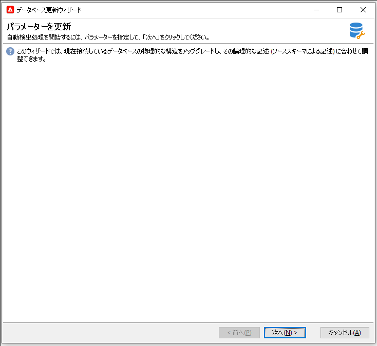
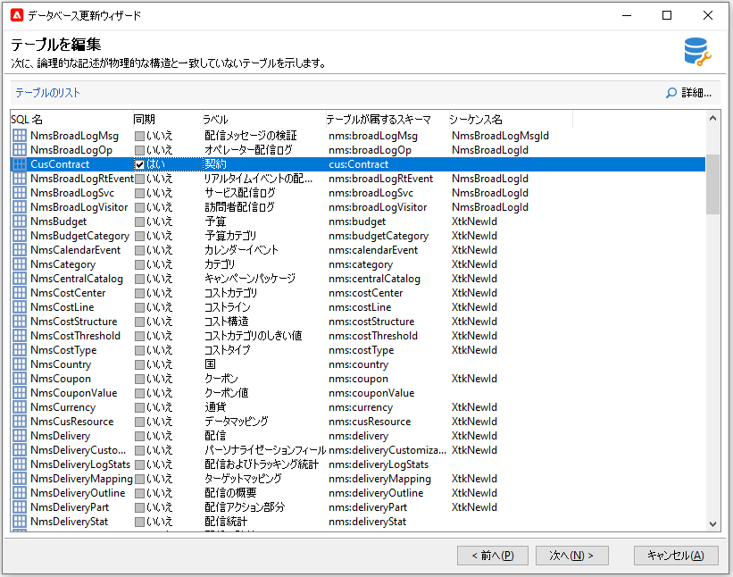
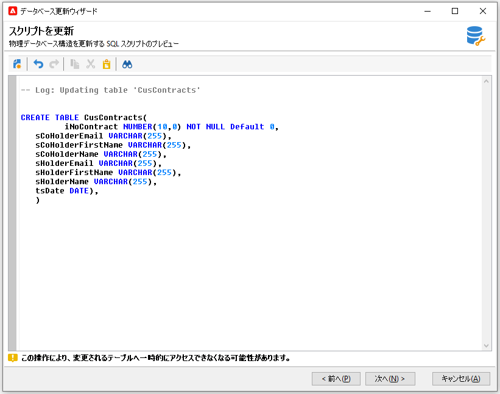
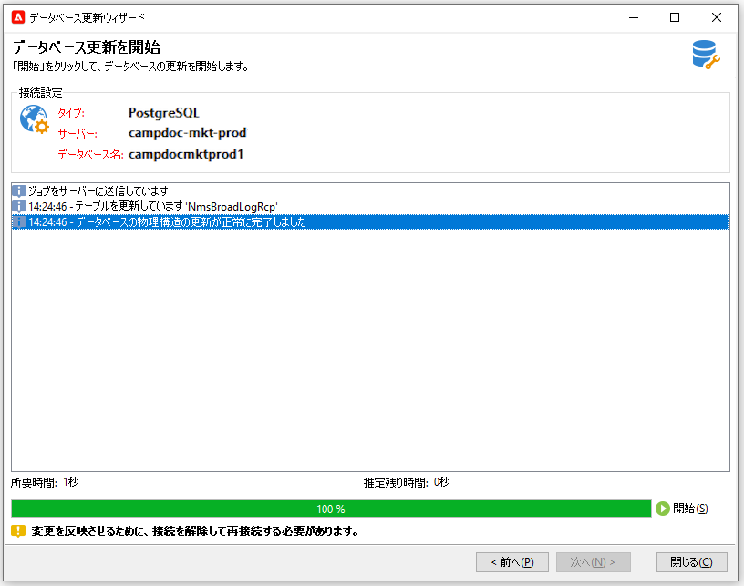

# データベース構造の更新{#updating-the-database-structure}

スキーマに加えた変更を適用するには、データベース更新ウィザードを起動します。この機能は、**[!UICONTROL ツール／詳細／データベース構造を更新]**&#x200B;から利用できます。 データベースの物理構造が論理的な記述と一致するかどうかを確認し、SQL 更新スクリプトを実行します。

データベース内のモジュールが自動的に入力され、アクティブ化されます。

手順に従い、データベース更新 SQL スクリプトを表示します。

>[!NOTE]
>
>このスクリプトは編集フィールドにあり、編集して SQL コードを削除または追加することもできます。

次に、データベースの更新を起動します。

