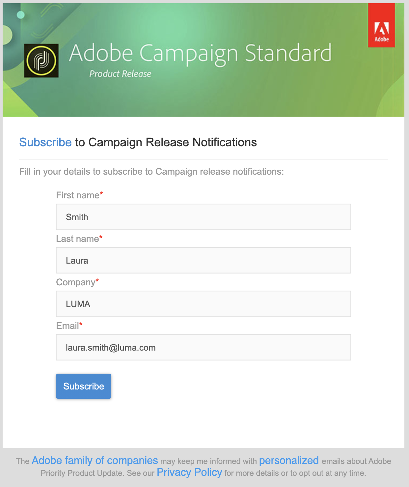

# Web アプリケーションと Web フォームの概要{#gs-ac-web}

Adobe Campaign では、**Web フォーム**&#x200B;を定義して公開するためのグラフィカルなモジュールを統合します。このモジュールでは、入力フィールドと選択フィールドを含むページを作成して、データベースのデータを含めることができます。これにより、お客様はユーザーが閲覧または情報を入力できるよう、Web ページをデザインおよび投稿できます。

 web フォームを作成して公開する方法については、[Campaign Classic v7 ドキュメント](https://experienceleague.adobe.com/docs/campaign-classic/using/designing-content/web-forms/about-web-forms.html?lang=ja#designing-content)を参照してください。{target=&quot;_blank&quot;}

Adobe Campaign では、データベースのデータと接続ユーザーの権限に応じたコンテンツを使用して、動的でインタラクティブな **Web アプリケーション**&#x200B;を作成して公開することができます。

作成できるページには、エクストラネット上の編集フォームのほか、データベースからのデータを含み、テーブル、グラフ、入力フォームなどを備えた通知フォームなどがあります。この機能を使用すると、ユーザーが情報を検索したり入力したりできる Web ページをデザインして投稿できます。

 web アプリケーションを作成して公開する方法については、[Campaign Classic v7 ドキュメント](https://experienceleague.adobe.com/docs/campaign-classic/using/designing-content/web-applications/about-web-applications.html?lang=ja#designing-content)を参照してください。{target=&quot;_blank&quot;}
