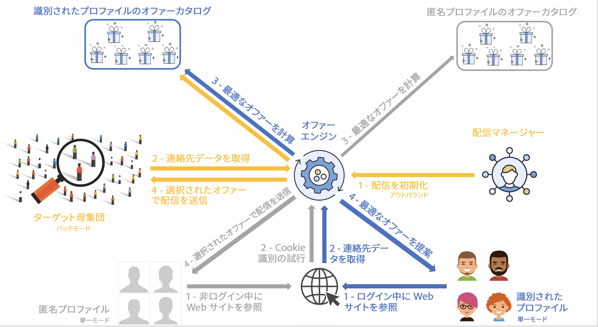

# Campaign インタラクション環境およびアーキテクチャについて

## 環境 {#environments}

オファーを管理する際に使用するターゲティングディメンションごとに、次の 2 つの環境があります。

* **デザイン**&#x200B;環境：オファーマネージャーが、オファーの作成、分類および編集と、オファーを使用可能にするための承認プロセスの開始をここで行います。また、各カテゴリのルール、オファーを提示できるオファースペース、オファーの実施要件の定義に使用される定義済みフィルターもすべて、この環境で定義されます。

   カテゴリは、オンライン環境で手動で公開することもできます。

   オファーの承認プロセスについて詳しくは、[この節を](interaction-offer.md#approve-offers)参照してください。

* **ライブ**&#x200B;環境：デザイン環境で承認されたオファーや、デザイン環境で設定された様々なオファースペース、フィルター、カテゴリおよびルールがすべてここにあります。オファーエンジンの呼び出し時に、エンジンは常にライブ環境のオファーを使用します。

オファーは、承認プロセスで選択されたオファースペースにのみデプロイされます。そのため、ライブ状態のオファースペースで、オファーがライブ状態であっても利用できないことがあります。

## インバウンドおよびアウトバウンドインタラクション {#interaction-types}

Adobe Campaign インタラクションモジュールは、次の 2 種類のインタラクションを提案します。

* **インバウンド**&#x200B;インタラクション：コンタクトで開始されます。[詳細情報](interaction-present-offers.md)
* **アウトバウンド**&#x200B;インタラクション：キャンペーン配信マネージャーによって開始されます。[詳細情報](interaction-send-offers.md)

これら 2 種類のインタラクションは、**単一モード**（オファーが 1 つのコンタクトに対して計算される）か&#x200B;**バッチモード**（オファーが一連のコンタクトに対して計算される）のいずれかで実行できます。通常、インバウンドインタラクションは単一モードで実行され、アウトバウンドインタラクションはバッチモードで実行されます。とは言え、例えば[トランザクションメッセージ](../send/transactional.md)のような例外もあり、その場合アウトバウンドインタラクションは単一モードで実行されます。

（実行された設定に応じて）オファーを提示でき次第、または提示する必要があり次第、オファーエンジンが仲介役を果たします。つまり、コンタクト先に関する受信データとアプリケーションでの指定どおりに適用できる様々なルールを組み合わせて、コンタクト先に最適なオファーを使用可能なオファーの中から自動的に計算します。



## 分散アーキテクチャ

スケーラビリティをサポートし、インバウンドチャネルで 24 時間年中無休のサービスを提供できるようにするために、**インタラクション**&#x200B;モジュールは分散アーキテクチャで実装されています。このタイプのアーキテクチャは、[Message Center](../architecture/architecture.md#transac-msg-archi) で既に使用されており、複数のインスタンスで構成されています。

* アウトバウンドチャネル専用で、マーケティングおよび環境のデザインベースを含む、1 つまたは複数のコントロールインスタンス
* インバウンドチャネル専用の、1 つまたは複数の実行インスタンス


コントロールインスタンスは、インバウンドチャネル専用で、カタログのオンラインバージョンを含みます。各実行インスタンスは独立しており、1 つの連絡先セグメント専用です（例：国ごとに 1 つの実行インスタンス）。オファーエンジンの呼び出しは、実行時に直接実行する必要があります（実行インスタンスごとに 1 つの専用 URL）。インスタンス間の同期は自動的には行われないので、同じコンタクト先からのインタラクションは、同じインスタンスを通じて送信される必要があります。

### 同期 {#synchronization}

オファーの同期は、パッケージで実行されます。実行インスタンスでは、すべてのカタログオブジェクトに、外部アカウント名のプレフィックスが付加されます。これは、同じ実行インスタンスで複数のコントロールインスタンス（例：開発用インスタンスと本番用インスタンス）をサポートできることを意味します。

>[!CAUTION]
>
>内部名には、短くて明確な名前を使用してください。

オファーは、自動的にデプロイされてから、実行インスタンスおよびコントロールインスタンスにパブリッシュされます。

デザイン環境で削除されたオファーは、すべてのオンラインインスタンスで無効化されます。不要になった提案やオファーは、パージ期間（各インスタンスのデプロイメントアシスタントで指定）およびスライド期間（受信提案のタイポロジルールで指定）の後、自動的に削除されます。


提案の同期用に、各環境および外部アカウントごとにワークフローが作成されます。同期の頻度は、環境ごと、外部アカウントごとに調整できます。

以下の同期メカニズムを認識しておく必要があります。

* 匿名環境から識別された環境へのフォールバック機能を使用する場合、それら 2 つの環境が同じ実行インスタンス上にある必要があります。
* 複数の実行インスタンス間の同期は、リアルタイムでは実行されません。同じコンタクト先のインタラクションは、同じインスタンスに送信される必要があります。コントロールインスタンスは、アウトバウンドチャネル（リアルタイムではない）専用である必要があります。
* マーケティングデータベースは、自動的には同期されません。重み付けや実施要件ルールで使用されるマーケティングデータは、実行インスタンスで複製される必要があります。このプロセスは標準では用意されていないので、統合期間中に開発する必要があります。
* 提案の同期は、FDA 接続によって排他的に実行されます。
* インタラクションと Message Center を同じインスタンス上で使用する場合は、どちらについても、同期は FDA プロトコルを使用しておこなわれます。

### パッケージ設定 {#packages-configuration}

**インタラクション**&#x200B;に直接リンクされているスキーマ拡張（オファー、提案、受信者など）は、実行インスタンスにデプロイする必要があります。

**インタラクション**&#x200B;パッケージは、すべてのインスタンス（コントロールインスタンスと実行インスタンス）にインストールされます。2 つの追加パッケージを使用できます。1 つはコントロールインスタンス用のパッケージで、もう 1 つは各実行インスタンス用のパッケージです。

>[!NOTE]
>
>パッケージのインストール時に、**nms:proposition** テーブルの **long** タイプのフィールド（提案 ID など）は **int64** タイプのフィールドになります。このタイプのデータについて詳しくは、[Campaign Classic v7 ドキュメント](https://experienceleague.adobe.com/docs/campaign-classic/using/configuring-campaign-classic/schema-reference/schema-structure.html?lang=ja#mapping-the-types-of-adobe-campaign-dbms-data){target=&quot;_blank&quot;}を参照してください

データ保持期間は、（デプロイメントウィザードの&#x200B;**[!UICONTROL データパージ]**&#x200B;ウィンドウから）インスタンスごとに設定されます。実行インスタンスでは、この期間が、タイポロジルールに必要な履歴深度（スライド期間）および計算される実施要件ルールに対応している必要があります。

コントロールインスタンス上で、次の手順を実行します。

1. 実行インスタンスごとに 1 つの外部アカウントを作成します。

   

   * ラベルを入力し、短くて明示的な内部名を追加します。
   * 「**[!UICONTROL 実行インスタンス]**」を選択します。
   * 「**[!UICONTROL 有効]**」オプションをオンにします。
   * その実行インスタンス用の接続パラメーターを入力します。
   * すべての実行インスタンスは、ID にリンクされている必要があります。この ID は、「**[!UICONTROL 接続を初期化]**」ボタンをクリックすると割り当てられます。
   * 使用するアプリケーションのタイプとして、「**[!UICONTROL Message Center]**」と「**[!UICONTROL インタラクション]**」のどちらか、または両方を選択します。
   * 使用する FDA アカウントを入力します。オペレーターは、実行インスタンスで作成し、次のように、該当するインスタンスのデータベースの読み取り権限と書き込み権限を付与する必要があります。

      ```
      grant SELECT ON nmspropositionrcp, nmsoffer, nmsofferspace, xtkoption, xtkfolder TO user;
      grant DELETE, INSERT, UPDATE ON nmspropositionrcp TO user;
      ```
   >[!NOTE]
   >
   >コントロールインスタンスの IP アドレスは、実行インスタンスで承認されている必要があります。

1. 次のように環境を設定します。

   

   * 実行インスタンスのリストを追加します。
   * インスタンスごとに、同期期間とフィルター条件（例：国ごと）を指定します。

      >[!NOTE]
      >
      >エラーが発生した場合は、同期ワークフローおよびオファー通知を確認してください。これらはアプリケーションのテクニカルワークフローにあります。

最適化のために、実行インスタンスでマーケティングデータベースの一部のみを複製する場合、その実行インスタンスで利用できるデータのみをユーザーに使用させるよう、環境にリンクした制約付きスキーマを指定できます。オファーの作成には、実行インスタンスでは利用できないデータも使用できます。それには、このルールをアウトバウンドチャネルのみに制限することで、他のチャネルに対しては無効にする必要があります（「**[!UICONTROL 次の場合に考慮]**」フィールド）。


### メンテナンスオプション {#maintenance-options}

次に、コントロールインスタンスで使用できるメンテナンスオプションのリストを示します。

>[!CAUTION]
>
>これらのオプションは、特定のメンテナンス事例にのみ使用できます。

* **`NmsInteraction_LastOfferEnvSynch_<offerEnvId>_<executionInstanceId>`**：特定のインスタンスで環境が同期された直近の日付。
* **`NmsInteraction_LastPropositionSynch_<propositionSchema>_<executionInstanceIdSource>_<executionInstanceIdTarget>`**：特定のスキーマの提案があるインスタンスから別のインスタンスに同期された直近の日付。
* **`NmsInteraction_MapWorkflowId`**：生成されるすべての同期ワークフローのリストを含むオプション。

次のオプションは、実行インスタンスで使用できます。

**NmsExecutionInstanceId**：インスタンス ID を含むオプション。

### パッケージのインストール {#packages-installation}

**インタラクション**&#x200B;パッケージをインストールしたことがないインスタンスの場合、移行は必要ありません。デフォルトでは、パッケージがインストールされると、提案テーブルは 64 ビットになります。

>[!CAUTION]
>
>インスタンスの既存の提案の量によっては、この作業に時間がかかることがあります。

* インスタンスに提案がない、または非常に少ない場合、提案テーブルを手作業で修正する必要はありません。パッケージをインストールすると、修正が実行されます。
* インスタンスに多数の提案がある場合、コントロールパッケージをインストールして実行する前に提案テーブルの構造を変更しておくと、より確実です。アクティビティが少ない期間にクエリを実行することをお勧めします。

>[!NOTE]
>
>提案テーブルで特定の設定が実行されている場合、その状況に応じてクエリを変更してください。


次の 2 つの方法があります。

**ワークテーブル**（推奨）

```
CREATE TABLE NmsPropositionRcp_tmp AS SELECT * FROM nmspropositionrcp WHERE 0=1;
ALTER TABLE nmspropositionrcp_tmp
  ALTER COLUMN ipropositionid TYPE bigint,
  ALTER COLUMN iinteractionid TYPE bigint;
INSERT INTO nmspropositionrcp_tmp SELECT * FROM nmspropositionrcp;
DROP TABLE nmspropositionrcp;
CREATE INDEX proposition_id ON NmsPropositionRcp (ipropositionid);
CREATE INDEX nmspropositionrcp_deliveryid ON NmsPropositionRcp (ideliveryid);
CREATE INDEX nmspropositionrcp_lastmodified ON NmsPropositionRcp (tslastmodified);
CREATE INDEX nmspropositionrcp_offerid ON NmsPropositionRcp (iofferid);
CREATE INDEX nmspropositionrcp_offerspaceid ON NmsPropositionRcp (iofferspaceid);
CREATE INDEX nmspropositionrcp_recipientidid ON NmsPropositionRcp (irecipientid);
ALTER TABLE nmspropositionrcp_tmp RENAME TO nmspropositionrcp;
```

**テーブルの変更**

```
ALTER TABLE nmspropositionrcp
  ALTER COLUMN ipropositionid TYPE bigint,
  ALTER COLUMN iinteractionid TYPE bigint;
```
