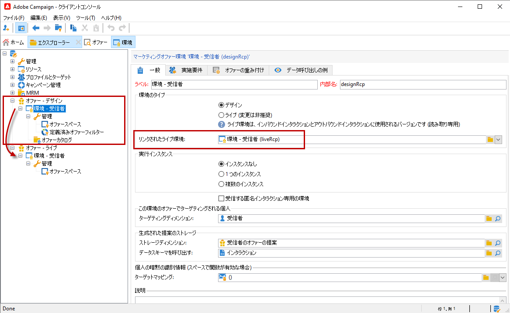
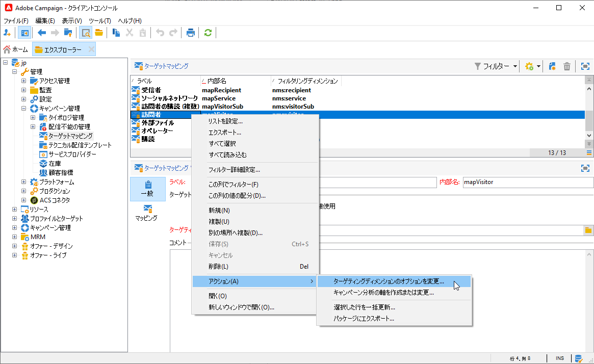
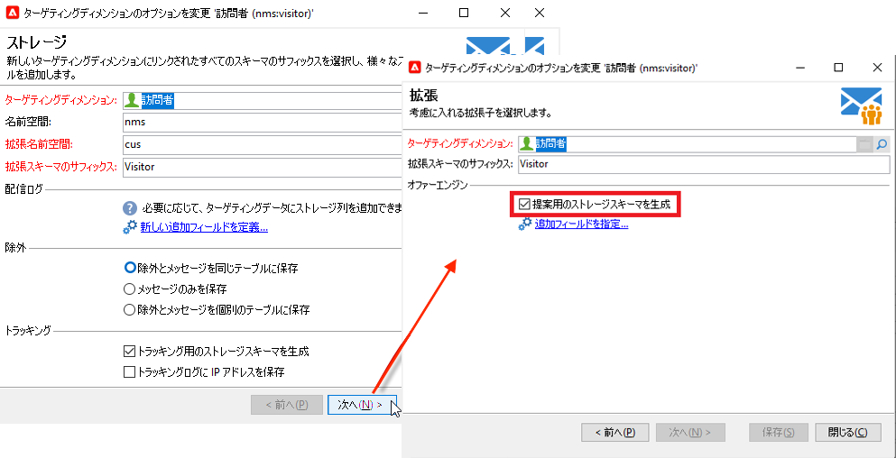

# 環境の操作{#work-with-environments}

## ライブ／デザイン環境{#live-design-environments}

インタラクションは、次の 2 つのオファー環境を使用して運用されます。

* **[!UICONTROL デザイン環境]**：編集の対象となる、変更可能なオファーを含んだオファー環境。これらのオファーは、承認サイクルを経ておらず、コンタクト先には配信されません。
* **[!UICONTROL ライブ環境]**：コンタクト先に提示される承認済みのオファーを含んだオファー環境。この環境のオファーは、読み取り専用です。

各&#x200B;**[!UICONTROL デザイン]**&#x200B;環境は、**[!UICONTROL ライブ]**&#x200B;環境にリンクされています。オファーの作成が完了すると、そのコンテンツと実施要件ルールは、承認サイクルに進みます。承認サイクルを完了したオファーは、**[!UICONTROL ライブ]**&#x200B;環境に自動的にデプロイされ、その瞬間から、配信できるようになります。

デフォルトでは、Campaign には、1 つの&#x200B;**[!UICONTROL デザイン]**&#x200B;環境とそれにリンクされた 1 つの&#x200B;**[!UICONTROL ライブ]**&#x200B;環境が付属しています。これらの環境は、[ビルトインの受信者テーブル](../dev/datamodel.md#ootb-profiles)をターゲットとするように事前に設定されています。

>[!NOTE]
>
>受信者テーブルをターゲットにするには、ターゲットマッピングアシスタントを使用して環境を作成する必要があります。 [詳細情報](#creating-an-offer-environment)。

配信責任者は、**[!UICONTROL ライブ]**&#x200B;環境のみを表示可能で、オファーを活用して配信できます。オファーマネージャーは、**[!UICONTROL デザイン]**&#x200B;環境を表示および使用したり、**[!UICONTROL ライブ]**&#x200B;環境を表示したりできます。[詳細](interaction-operators.md)

## 匿名インタラクション向け環境の作成{#create-an-offer-environment}

Campaign には、受信者テーブル（識別されたオファー）をターゲットにするための環境がデフォルトで組み込まれています。インバウンドインタラクション用の web サイトにアクセスする匿名プロファイルなど、別のテーブルをターゲットにするには、設定を更新する必要があります。

以下の手順に従います。

1. **[!UICONTROL 管理]**／**[!UICONTROL Campaign 管理]**／**[!UICONTROL ターゲットマッピング]**&#x200B;を表示し、使用するターゲットマッピングを右クリックして、**[!UICONTROL アクション]**／**[!UICONTROL ターゲティングディメンションのオプションを変更]**&#x200B;を選択します。

   

1. 「**[!UICONTROL 次へ]**」をクリックし、「**[!UICONTROL 提案のストレージスキーマを生成]**」オプションを選択して、「**[!UICONTROL 保存]**」をクリックします。

   

   >[!NOTE]
   >
   >オプションがが既にオンになっている場合は、一度オフにしてからもう一度オンにしてください。

1. Adobe Campaign は、以前に有効化したターゲットマッピングのターゲティング情報を使用して、**[!UICONTROL デザイン]**&#x200B;と&#x200B;**[!UICONTROL ライブ]**&#x200B;の 2 つの環境を作成します。この環境には、ターゲティング情報があらかじめ設定されています。

**[!UICONTROL 訪問者]**&#x200B;マッピングを有効にした場合、環境の「**[!UICONTROL 一般]**」タブにある「**[!UICONTROL 受信する匿名インタラクション専用の環境]**」ボックスが自動的にオンになります。

このオプションを設定すると、（特に環境のオファースペースを設定する際の）匿名インタラクションに特有の機能を有効にできます。また、「識別された」環境を「匿名」環境に切り替えることができるオプションを設定することもできます。

例えば、受信者環境のオファースペース（識別されたコンタクト先）と訪問者環境に合ったオファースペース（識別されていないコンタクト先）をリンクすると、このようにして、コンタクト先が識別されているかどうかに応じて、異なるオファーがコンタクト先に提示されます。詳しくは、[オファースペースの作成](interaction-offer-spaces.md)を参照してください。

>[!NOTE]
>
>インバウンドチャネルでの匿名インタラクションについて詳しくは、[匿名インタラクション](anonymous-interactions.md)を参照してください。
