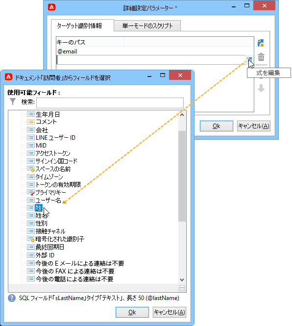

# Web ページへのオファーの追加{#add-an-offer-in-web}

Web ページでオファーエンジンを呼び出すには、ページに JavaScript コードの呼び出しを直接挿入します。この呼び出しは、ターゲット要素のオファーコンテンツを返します。

URL を呼び出すスクリプトは、次のようになります。

```
<script id="interactionProposalScript" src="https://<SERVER_URL>/nl/interactionProposal.js?env=" type="text/javascript"></script>
```

「**env**」パラメーターは、匿名インタラクション専用のライブ環境の内部名を受け取ります。

オファーを提示するには、Adobe Campaign で環境とオファースペースを作成してから、HTML ページを設定する必要があります。

次の使用例で、JavaScript を使用したオファーの統合について考えられるオプションを説明します。

## オプション 1：HTML モード {#html-mode}

### 匿名オファーの提示 {#presenting-an-anonymous-offer}

**手順 1：オファーエンジンを準備**

1. Adobe Campaign インターフェイスを開き、匿名環境を用意します。
1. この匿名環境にリンクしたオファースペースを作成します。
1. このオファースペースにリンクしたオファーとその表示域を作成します。

**手順 2：HTML ページのコンテンツを更新**

HTML ページには、作成したオファースペースの内部名（&quot;i_internal name space&quot;）を値とする @id 属性を持つ要素を含める必要があります。オファーは、インタラクションによってこの要素に挿入されます。

この例では、@id 属性は、値 &quot;i_SPC12&quot; を受け取ります（「SPC12」が先ほど作成したオファースペースの内部名）。

```
<div id="i_SPC12"></div>
```

この例では、スクリプトを呼び出す URL は、次のようになります（「OE3」はライブ環境の内部名）。

```
<script id="interactionProposalScript" src="https://instance.adobe.org:8080/nl/interactionProposal.js?env=OE3" type="text/javascript"></script>
```

>[!CAUTION]
>
>`<script>` タグは、自己終了タグにすることはできません。

この静的呼び出しは、オファーエンジンに必要なすべてのパラメーターを含んだ動的呼び出しを自動的に生成します。

この動作により、同じページ上で複数のオファースペースを使用し、それらをオファーエンジンの 1 回の呼び出しで管理できます。

**手順 3：結果を HTML ページに表示**

オファー表示域のコンテンツが、オファーエンジンによって HTML ページに返されます。

```
<div id="banner_header">
 <div id="i_SPC12">
   <table>
    <tbody>
        <tr>
            <td><h3>Fly to Japan!</h3></td>
        </tr>
        <tr>
            <td></td>
            <td>
            <p>Discover Japan for 2 weeks at an unbelievable price!!</p>
            <p><b>2345 Dollars - All inclusive</b></p>
        </td>
        </tr>
    </tbody>
    </table>
 </div>
<script src="https://instance.adobe.org:8080/nl/interactionProposal.js?env=OE3" id="interactionProposalScript" type="text/javascript"></script>
</div>
```

### 識別されたオファーの提示 {#presenting-an-identified-offer}

識別されたコンタクト先にオファーを提示するには、[この節](#presenting-an-anonymous-offer)で説明したプロセスと同様のプロセスを使用します。

Web ページのコンテンツには、オファーエンジンの呼び出し時にコンタクト先を識別する次のスクリプトを追加する必要があります。

```
<script type="text/javascript">
  interactionTarget = <contact_identifier>;
</script>
```

1. Web ページから呼び出されるオファースペースに移動して、「**[!UICONTROL 詳細設定パラメーター]**」をクリックし、1 つまたは複数の識別キーを追加します。

   

   この例では、識別キーは、E メールと受信者名の両方を基にした複合キーです。

1. Web ページの表示時に、スクリプト評価によって受信者 ID をオファーエンジンに渡すことができます。複合 ID の場合、キーは詳細設定で使用される順序と同じ順序で表示され、 | で区切られます。

   次の例では、コンタクト先は既に web サイトにログオンしており、メールアドレスと名前により、オファーエンジンの呼び出し時に認識されました。

   ```
   <script type="text/javascript">
     interactionTarget = myEmail|myName;
   </script>
   ```

### HTML レンダリング関数の使用 {#using-an-html-rendering-function}

HTML のオファー表示域を自動的に生成するには、レンダリング関数を使用できます。

1. オファースペースに移動し、「**[!UICONTROL 関数を編集]**」リンクをクリックします。
1. 「**[!UICONTROL HTML レンダリング関数をオーバーロード]**」を選択します。
1. 「**[!UICONTROL HTML レンダリング]**」タブに移動し、オファースペースのオファーコンテンツ用に定義されたフィールドに合致する変数を挿入します。

   

   この例では、オファーは、バナーの形式で Web ページに表示され、オファーコンテンツで定義されたフィールドに合致する、クリック可能な画像とタイトルで構成されます。

## オプション 2：XML モード {#xml-mode}

### オファーの提示 {#presenting-an-offer}

Campaign **インタラクション**&#x200B;モジュールを使用すると、オファーエンジンを呼び出した HTML ページに XML ノードを返すことができます。この XML ノードは、顧客側で開発される関数で処理できます。

オファーエンジンの呼び出しは、次のようになります。

```
<script type="text/javascript" id="interactionProposalScript" src="https://<SERVER_URL>/nl/interactionProposal.js?env=&cb="></script>
```

* 「**env**」パラメーターは、ライブ環境の内部名を受け取ります。

* 「**cb**」パラメーターは、（コールバック）提案を含むエンジンから返される XML ノードを読み込む関数の名前を受け取ります。このパラメーターはオプションです。

* 「**t**」パラメーターは、識別されたインタラクションの場合にのみ、ターゲットの値を受け取ります。このパラメーターは **interactionTarget** 変数を使用して渡すこともできます。このパラメーターはオプションです。

* 「**c**」パラメーターは、カテゴリの内部名のリストを受け取ります。このパラメーターはオプションです。

* 「**th**」パラメーターは、テーマのリストを受け取ります。このパラメーターはオプションです。

* 「**gctx**」パラメーターは、ページ全体にグローバル（コンテキスト）な呼び出しデータを受け取ります。このパラメーターはオプションです。

返される XML ノードは、次のようになります。

```
<propositions>
 <proposition id="" offer-id="" weight="" rank="" space="" div=""> //proposition identifiers
   ...XML content defined in Adobe Campaign...
 </proposition>
 ...
</propositions>
```

以下のユースケースでは、Adobe Campaign で実行して XML モードを有効にしたあと、エンジンの呼び出し結果を HTML ページに表示するための設定について詳しく説明します。

1. **環境とオファースペースを作成**

   環境の作成について詳しくは、[このページ](interaction-env.md)を参照してください

   オファースペースの作成について詳しくは、[このページ](interaction-offer-spaces.md)を参照してください。

1. **オファースキーマを拡張して新しいフィールドを追加**

   このスキーマは、「Title 2」（タイトル 2）および「Price」（価格）フィールドを定義します。

   この例のスキーマの名前は **cus:offer** です。

   ```
   <srcSchema _cs="Marketing offers (cus)" created="2013-01-18 17:14:20.762Z" createdBy-id="0"
              desc="" entitySchema="xtk:srcSchema" extendedSchema="nms:offer" img="nms:offer.png"
              label="Marketing offers" labelSingular="Marketing offers" lastModified="2013-01-18 15:20:18.373Z"
              mappingType="sql" md5="F14A7AA009AE1FCE31B0611E72866AC3" modifiedBy-id="0"
              name="offer" namespace="cus" xtkschema="xtk:srcSchema">
     <createdBy _cs="Administrator (admin)"/>
     <modifiedBy _cs="Administrator (admin)"/>
     <element img="nms:offer.png" label="Marketing offers" labelSingular="Marketing offer"
              name="offer">
       <element label="Content" name="view">
         <element label="Price" name="price" type="long" xml="true"/>
         <element label="Title 2" name="title2" type="string" xml="true"/>
   
         <element advanced="true" desc="Price calculation script." label="Script price"
                  name="price_jst" type="CDATA" xml="true"/>
         <element advanced="true" desc="Title calculation script." label="Script title"
                  name="title2_jst" type="CDATA" xml="true"/>
       </element>
     </element>
   </srcSchema>
   ```

   >[!CAUTION]
   >
   >各要素は、2 回ずつ定義する必要があります。CDATA（&quot;_jst&quot;）タイプの要素には、パーソナライゼーションフィールドを含めることができます。
   >
   >データベース構造を忘れずに更新してください。

   オファースキーマを拡張して、バッチモードと単一モードの両方で新しいフィールドを任意の形式（テキスト、HTML および XML）で追加できます。

1. **オファー式を拡張して新しいフィールドを追加および既存のフィールドを修正**

   **オファー（nsm）**&#x200B;入力フォームを編集します。

   「Views」セクションに、次の内容を含んだ 2 つの新しいフィールドを挿入します。

   ```
   <input label="Title 2" margin-right="5" prebuildSubForm="false" type="subFormLink" xpath="title2_jst">
        <form label="Edit title 2" name="editForm" nothingToSave="true">
            <input nolabel="true" toolbarAlign="horizontal" type="jstEdit" xpath="." xpathInsert="/ignored/customizeTitle2">
            <container>
                <input menuId="viewMenuBuilder" options="inbound" type="customizeBtn" xpath="/ignored/customizeTitle2"/>
            </container>
            </input>
        </form>
    </input>
    <input nolabel="true" type="edit" xpath="title2_jst"/>
    <input label="Price" margin-right="5" prebuildSubForm="false" type="subFormLink" xpath="price_jst">
        <form label="Edit price" name="editForm" nothingToSave="true">
        <input nolabel="true" toolbarAlign="horizontal" type="jstEdit" xpath="." xpathInsert="/ignored/customizePrice">
            <container>
                <input menuId="viewMenuBuilder" options="inbound" type="customizeBtn" xpath="/ignored/customizePrice"/>
            </container>
        </input>
        </form>
    </input>
    <input colspan="2" label="Prix" nolabel="true" type="number" xpath="price_jst"/>
   ```

   宛先 URL フィールドをコメントアウトします。

   

   >[!CAUTION]
   >
   >（`<input>`）フォームのフィールドは、作成したスキーマに定義された CDATA タイプの要素を指している必要があります。

   オファー表示域フォームのレンダリングは、次のようになります。

   

   「**[!UICONTROL Title 2]**」および「**[!UICONTROL Price]**」フィールドが追加され、「**[!UICONTROL 宛先 URL]**」フィールドは表示されません。

1. **オファーを作成**

   オファーの作成について詳しくは、[このページ](interaction-offer.md)を参照してください

   次のユースケースでは、オファーは次のように入力されます。

   

1. **オファーを承認**

   オファーを承認するか、誰かにオファーの承認を得てから、前の手順で作成したオファースペースで有効化します。これにより、リンクされたライブ環境でオファーが利用可能になります。

1. **エンジン呼び出しと、HTML ページでの結果**

   HTML ページでのオファーエンジンの呼び出しは、次のようになります。

   ```
   <script id="interactionProposalScript" src="https://<SERVER_URL>/nl/interactionProposal.js?env=OE7&cb=alert" type="text/javascript">
   ```

   「**env**」パラメーターの値は、ライブ環境の内部名です。

   「**cb**」パラメーターの値は、エンジンから返された XML ノードを解釈する必要のある関数の名前です。この例では、呼び出される関数がモーダルウィンドウを開きます（alert() 関数）。

   オファーエンジンから返される XML ノードは、次のようになります。

   ```
   <propositions>
    <proposition id="a28002" offer-id="10322005" weight="1" rank="1" space="SPC14" div="i_SPC14">
     <xmlOfferView>
      <title>Travel to Russia</title>
      <price>3456</price>
      <description>Discover this vacation package!INCLUDES 10 nights. FEATURES buffet breakfast daily. BONUS 5th night free.</description>
      <image>
       <path>https://myinstance.com/res/Track/ae1d2113ed732d58a3beb441084e5960.jpg</path>
       <alt>Travel to Russia</alt>
      </image>
     </xmlOfferView>
    </proposition>
   </propositions>
   ```

### レンダリング関数の使用 {#using-a-rendering-function-}

XML レンダリング関数を使用して、オファー表示域を作成できます。この関数は、オファーエンジンの呼び出し時に HTML ページに返された XML ノードを修正します。

1. オファースペースに移動し、「**[!UICONTROL 関数を編集]**」リンクをクリックします。
1. 「**[!UICONTROL XML レンダリング関数をオーバーロード]**」を選択します。
1. 「**[!UICONTROL XML レンダリング]**」タブに移動し、目的の関数を挿入します。

   関数は、次のようになります。

   ```
   function (proposition) {
     delete proposition.@id;
     proposition.@newAttribute = "newValue";
   } 
   ```


## SOAP 統合のセットアップ

オファー管理のために用意されている SOAP web サービスは、Adobe Campaign で通常使用されるものとは異なります。前の節で説明したインタラクション URL でアクセスして、特定のコンタクト先に対するオファーを提示または更新できます。

### オファーの提案 {#offer-proposition}

SOAP によるオファーの提案の場合、**nms:proposition#Propose** コマンドを追加し、その後に次のパラメーターが続きます。

* **targetId**：受信者のプライマリキー（複合キーも使用可能）。
* **maxCount**：そのコンタクト先に対するオファーの提案の数を指定します。
* **context**：スペーススキーマにコンテキスト情報を追加できます。使用されるスキーマが **nms:interaction** の場合、**`<empty>`** を追加する必要があります。
* **categories**：オファーが属する必要があるカテゴリを指定します。
* **themes**：オファーが属する必要があるテーマを指定します。
* **uuid**：Adobe Campaign の永続 Cookie の値です（&quot;uuid230&quot;）。
* **nli**：Adobe Campaign のセッション Cookie の値です（&quot;nlid&quot;）。
* **noProp**：値「true」を使用すると、提案の挿入が無効化されます。

>[!NOTE]
>
>**targetId** および **maxCount** の指定は必須です。その他のパラメーターはオプションです。

クエリに対するの応答では、SOAP サービスは、次のパラメーターを返します。

* **interactionId**：インタラクションの ID。
* **propositions**：提案のリストを含む XML 要素。それぞれに提案自体の ID と HTML 表現が含まれます。

### オファーの更新 {#offer-update}

URL に **nms:interaction#UpdateStatus** コマンドを追加し、その後に次のパラメーターが続きます。

* **proposition**：文字列。オファー提案中の出力として取得した提案 ID が含まれます。[オファーの提案](#offer-proposition)を参照してください。
* **status**：文字列。オファーの新しいステータスを指定します。使用可能な値のリストについては、**nms:common** スキーマの **propositionStatus** 列挙を参照してください。例えば、デフォルトでは、数字の 3 が&#x200B;**許可済み**&#x200B;ステータスに対応します。
* **context**：XML 要素。スペーススキーマにコンテキスト情報を追加できます。使用されるスキーマが **nms:interaction** の場合、**`<empty>`** を追加する必要があります。

### SOAP 呼び出しの使用例 {#example-using-a-soap-call}

SOAP 呼び出しのコードの例を次に示します。

```
<%
  var space = request.parameters.sp
  var cnx = new HttpSoapConnection(
    "https://" + request.serverName + ":" + request.serverPort + "/interaction/" + env + "/" + space,
    "utf-8",
    HttpSoapConnection.SOAP_12)
  var session = new SoapService(cnx, "nms:interaction")
  var action = request.parameters.a
  if( action == undefined )
    action = 'propose'

  try
  {
    switch( action )
    {
    case "update":
      var proposition = request.parameters.p
      var status      = request.parameters.st
      session.addMethod("UpdateStatus", "nms:interaction#UpdateStatus",
       ["proposition", "string",
        "status",      "string",
        "context",     "NLElement"],
       [])
      session.UpdateStatus(proposition, status, <undef/>)
      var redirect = request.parameters.r
      if( redirect != undefined )
        response.sendRedirect(redirect)
      break;

    case "propose":
      var count = request.parameters.n
      var target = request.parameters.t
      var categorie = request.parameters.c
      var theme = request.parameters.th
      var layout = request.parameters.l
      if( count == undefined )
        count = 1
      session.addMethod("Propose", "nms:proposition#Propose",
       ["targetId",      "string",
        "maxCount",      "string",
         "categories",    "string",
         "themes",        "string",
        "context",       "NLElement"],
       ["interactionId", "string",
        "propositions",  "NLElement"])
      response.setContentType("text/html")
      var result = session.Propose(target, count, category, theme, <empty/>)
      var props = result[1]
  %><table><tr><%
      for each( var propHtml in props.proposition.*.mdSource )
      {
        %><td><%=propHtml%></td><%
      }
  %></tr></table><%
      break;
    }
  }
  catch( e )
  {
  }
  %>
```
