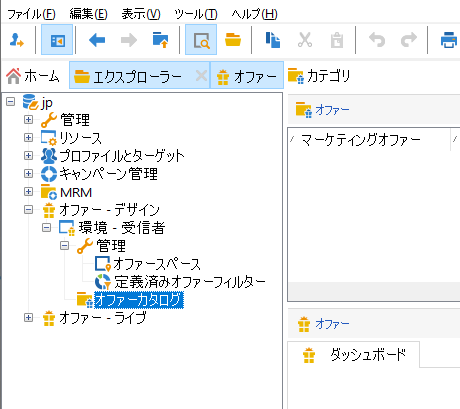
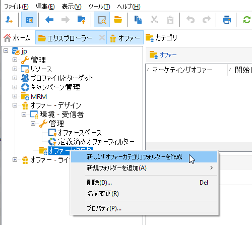
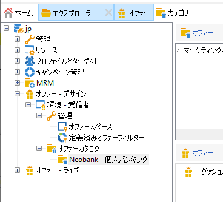
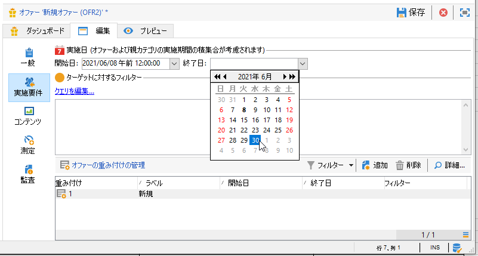
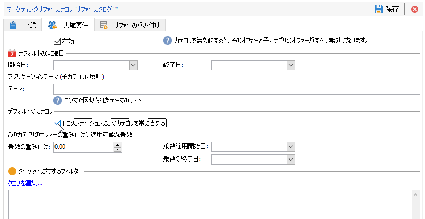

# オファーカタログの作成

**オファーマネージャー**&#x200B;は、オファーカタログの作成を担当します。

1 つのオファーカタログは、1 つの既存環境に関連付けられます。 カタログに含まれるオファーは、その環境で指定されたスペースにのみ関連付けられます。

オファーを作成する前に、まず[環境](interaction-env.md)を指定する必要があります。この環境には、一連のオファーのすべての特性（実施要件、ターゲットに対する制約、プレゼンテーションルール）をカテゴリに分類したものや、スペースのリストが含まれます。

## オファーカテゴリの作成{#creating-offer-categories}

オファーは、カテゴリとサブカテゴリで編成されます。 カテゴリは&#x200B;**[!UICONTROL デザイン]**&#x200B;環境で作成され、そのカテゴリに含まれるオファーが承認されると、自動的に&#x200B;**[!UICONTROL ライブ]**&#x200B;環境にデプロイされます（つまり、利用可能になります）。 **[!UICONTROL デザイン]**&#x200B;環境には、すべてのオファーを受信するデフォルトのカテゴリが含まれています。サブカテゴリを作成すると、カタログオファーに階層を追加できます。

各カテゴリには、**実施日**&#x200B;を定義できます。この日程は、カテゴリに含まれるオファーをターゲットに提示できる期間です。 カテゴリの重み付けを調整して、オファーの提示に優先度を付けることもできます。

新しいカテゴリを作成するには、次の手順をおこないます。

1. **[!UICONTROL オファーカタログ]**&#x200B;フォルダーを参照します。

   

1. 右クリックし、ドロップダウンリストから「**[!UICONTROL 新しい「オファーカテゴリ」フォルダーを作成]**」を選択します。

   

1. カテゴリの名前を変更します。「**[!UICONTROL 一般]**」タブを使用して、後でラベルを編集することもできます。

   

   >[!NOTE]
   >
   >これらの手順を、作成するカテゴリの数だけ繰り返します。

   その後、必要に応じて次の操作を実行します。

   * 「**[!UICONTROL 実施要件]**」タブで、実施日を割り当てます。

      

   * **[!UICONTROL クエリを編集]**&#x200B;して、オファーのターゲットにフィルターを適用します。

   * 実施要件ルールの概要を表示するには、「]**オファーのスケジュールと実施要件ルール**[!UICONTROL 」リンクをクリックします。

## フォールバックカテゴリの追加

すべての受信者にオファーの提案が届くよう、体系的に 1 つまたは様々なオファーカテゴリをレコメンデーションに追加できます。

これらのフォールバックオファーは、重み付けが大きいオファーが実施要件を満たさない場合にのみ考慮されるように、重み付けを小さくしておく（ただし null 以外）必要があります。

また、レコメンデーションに常に含まれるようにするため、これらのオファーには提示ルールを適用しないでおく必要があります。これにより、提案中に重みの大きいオファーがない場合でも、受信者には、このカテゴリのオファーが少なくとも 1 つ届きます。

レコメンデーションにフォールバックカテゴリを含めるには、次の手順を行います。

1. オファーカタログを参照します。
1. 「**[!UICONTROL 実地要件]**」タブをクリックし、「**[!UICONTROL レコメンデーションにこのカテゴリを常に含める]**」チェックボックスをオンにします。
1. 「**[!UICONTROL 保存]**」をクリックします。

   
