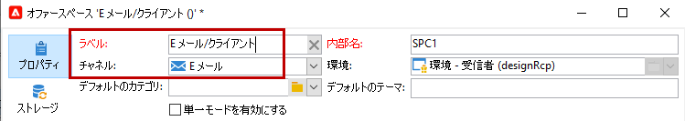
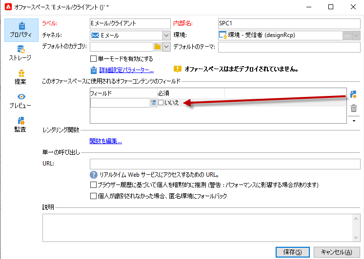

# オファースペースの作成{#creating-offer-spaces}

オファーカタログのコンテンツは、オファースペースで設定します。デフォルトでは、コンテンツに含めることができるフィールドは、**[!UICONTROL タイトル]**、**[!UICONTROL 宛先 URL]**、**[!UICONTROL 画像 URL]**、**[!UICONTROL HTML コンテンツ]**&#x200B;および&#x200B;**[!UICONTROL テキストコンテンツ]**&#x200B;です。フィールドの順序は、オファースペースで設定します。

**技術管理者**&#x200B;は、デザイン環境でオファースペースを作成できます。 オファースペースのサブフォルダーへのアクセス権が必要です。 オファースペースは、作成されると、オファーの承認時にライブ環境へと自動的に複製されます。

レンダリング関数を使用して、HTML レンダリングが作成されます。レンダリング関数で定義するフィールドのシーケンスは、コンテンツで設定したシーケンスと同じである必要があります。


新しいオファースペースを作成するには、次の手順に従います。

1. オファースペースのリストで、「**[!UICONTROL 新規]**」をクリックします。

   

1. 使用するチャネルを選択して、オファースペースのラベルを変更します。

   

1. 「**[!UICONTROL 単一モードを有効にする]**」オプションをオンにします

1. **[!UICONTROL コンテンツフィールド]**&#x200B;ウィンドウに移動して、「**[!UICONTROL 追加]**」をクリックします。

   

1. **[!UICONTROL コンテンツ]**&#x200B;ノードに移動して、フィールドを「**[!UICONTROL タイトル]**」、「**[!UICONTROL 画像 URL]**」、「**[!UICONTROL HTML コンテンツ]**」、「**[!UICONTROL 宛先 URL]**」の順に選択します。

   

1. 各フィールドを必須にするには、「**[!UICONTROL 必須]**」オプションをオンにします。

   >[!NOTE]
   >
   >このオプションはプレビューで使用されます。公開時、オファーの必須フィールドのいずれかが入力されていない場合、オファースペースが無効になります。ただし、既にオファースペース上でオファーがライブになっている場合は、これらの条件は考慮されません。

   

1. 「**[!UICONTROL 関数を編集]**」をクリックし、レンダリング関数を作成します。

   これは、オファースペース上にオファー表示域を生成するために使用される関数です。使用可能な形式：HTML またはテキスト。

   **注意** - XML 形式は、このバージョンの製品では使用できないインバウンドインタラクションに制限されます。[詳細情報](../start/v7-to-v8.md#gs-unavailable-features)

   _

1. 「**[!UICONTROL HTML レンダリング]**」タブに移動して、「**[!UICONTROL HTML レンダリング関数をオーバーロード]**」を選択します。
1. レンダリング関数を挿入します。

   

## オファーの提案ステータス {#offer-proposition-statuses}

オファーの提案ステータスは、ターゲット母集団とのインタラクションに応じて異なります。 Campaign インタラクションモジュールには、ライフサイクル全体でオファーの提案に適用できる値のセットが用意されています。オファーの提案を作成する際や承認時にステータスを変更できるよう、プラットフォームを設定する必要があります。

>[!NOTE]
>
>ステータスの更新は、**非同期**&#x200B;プロセスです。 これは、1 時間ごとにトリガーされるトラッキングワークフローによって実行されます。

### オファーのステータスのリスト {#status-list}

利用可能なオファーのステータスは次のとおりです。

* **[!UICONTROL 許可済み]**
* **[!UICONTROL スケジュール済み]**
* **[!UICONTROL 生成済み]**
* **[!UICONTROL 関心あり]**
* **[!UICONTROL 提示済み]**
* **[!UICONTROL 却下]**

これらの値はデフォルトでは適用されず、設定する必要があります。

>[!NOTE]
>
>「送信済み」ステータスの配信にオファーがリンクされると、そのオファーの提案のステータスは自動的に「提示済み」に変わります。

### 提案作成時のオファーのステータス {#configuring-the-status-when-the-proposition-is-created}

オファーの提案が&#x200B;**作成**&#x200B;されると、そのステータスが更新されます。

**[!UICONTROL デザイン]**&#x200B;環境では、オファーレポートに表示する情報に応じて、提案の作成時に適用するステータスをオファースペースごとに設定します。

そのためには、次の手順に従います。

1. 目的のスペースの「**[!UICONTROL ストレージ]**」タブに移動します。
1. 提案を作成時に提案に適用するステータスを選択します。

   

### 提案承認時のオファーのステータス {#configuring-the-status-when-the-proposition-is-accepted}

オファーの提案が&#x200B;**承認**&#x200B;されると、デフォルトで提供される値のいずれかを使用して、提案の新しいステータスを設定できます。受信者がオファーのリンクをクリックすると、更新が適用されます。

そのためには、次の手順に従います。

1. 目的のスペースの「**[!UICONTROL ストレージ]**」タブに移動します。
1. 提案が承認されたときに提案に適用するステータスを選択します。

   


**インバウンドインタラクション**

「**[!UICONTROL ストレージ]**」タブでは、**提案**&#x200B;および&#x200B;**承認**&#x200B;されたオファーの提案に対してのみステータスを定義できます。インバウンドインタラクションの場合、オファー提案のステータスは、インターフェイスを介してではなく、オファーエンジンを呼び出すための URL で直接指定する必要があります。こうすることで、オファーの提案が却下された場合など、その他の場合に適用されるステータスを指定できるようになります。

```
<BASE_URL>?a=UpdateStatus&p=<PRIMARY_KEY_OF_THE_PROPOSITION>&st=<NEW_STATUS_OF_THE_PROPOSITION>&r=<REDIRECT_URL>
```

例えば、**Neobank** サイトに表示される **Home insurance** オファーに合致する提案（識別子 **40004**）には、次の URL が含まれます。

```
<BASE_URL>?a=UpdateStatus&p=<40004>&st=<3>&r=<"http://www.neobank.com/insurance/subscribe.html">
```

訪問者がこのオファー（URL）をクリックすると、**[!UICONTROL 許可済み]**&#x200B;ステータス（値 **3**）が提案に適用され、訪問者は、保険契約に関する **Neobank** サイトの新しいページにリダイレクトされます。

>[!NOTE]
>
>URL で別のステータスを指定する場合（オファーの提案が却下された場合など）は、望ましいステータスに対応する値を使用します。例：**[!UICONTROL 却下]** = &quot;5&quot;、**[!UICONTROL 提示済み]** = &quot;1&quot; など。
>
>ステータスとその値は、「**[!UICONTROL オファーの提案（nms）]**」 データスキーマで取得できます。詳しくは、[このページ](../dev/create-schema.md)を参照してください。

**アウトバウンドインタラクション**

配信にリンクが含まれる場合は、オファーの提案に&#x200B;**[!UICONTROL 関心あり]**&#x200B;のステータスを自動適用できます。 単に **_urlType=&quot;11&quot;** という値をリンクに付加します。

```
<a _urlType="11" href="<DEST_URL>">Link inserted into the delivery</a>
```

## スペースごとのオファーのプレビュー {#offer-preview-per-space}

「**[!UICONTROL プレビュー]**」タブで、受信者がそのメソッドでの実施要件を満たすオファーを表示できます。次の例では、受信者は、メールでのオファーの提案 3 件に対して実施要件を満たしています。


受信者が実施要件を満たしているオファーがない場合、プレビュー画面は次のように表示されます。


プレビューでは、特定のスペースに限定されているコンテキストを無視できます。これは、インタラクションスキーマを拡張して、インバウンドチャネルを使用してスペースで参照されるフィールドを追加した場合です。

 詳しくは、[Campaign Classic v7 ドキュメント](https://experienceleague.adobe.com/docs/campaign-classic/using/managing-offers/advanced-parameters/extension-example.html?lang=ja){target=&quot;_blank&quot;}でこのサンプルを参照してください。