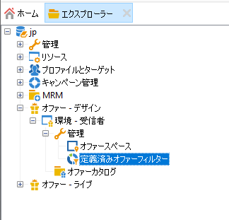
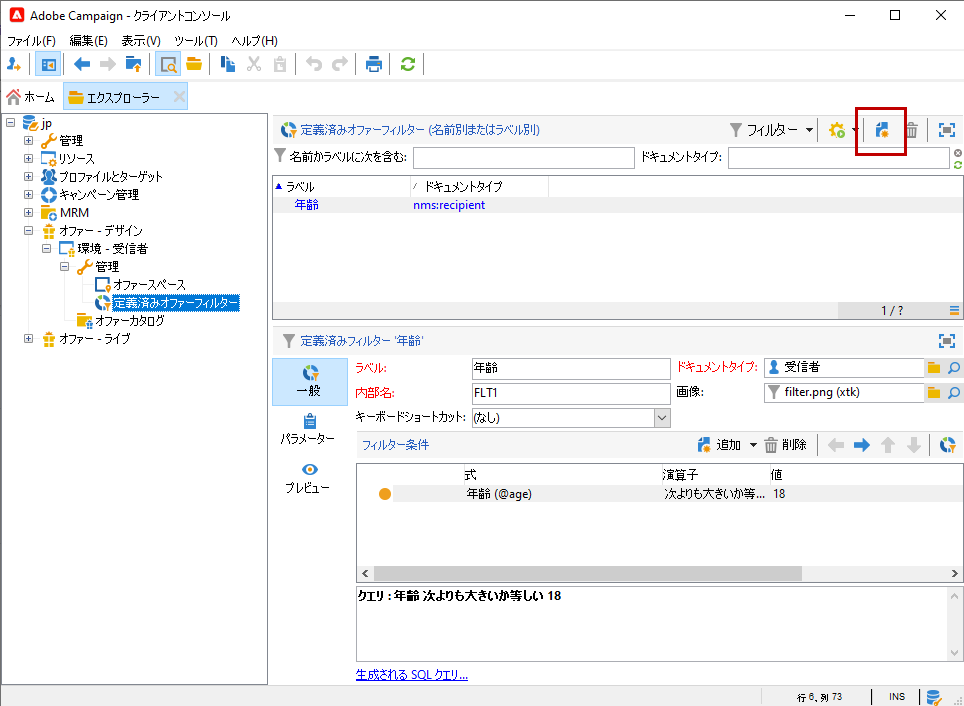
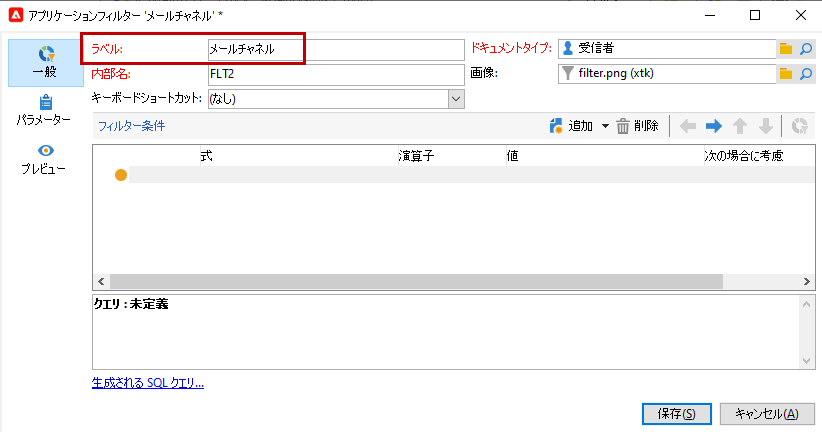
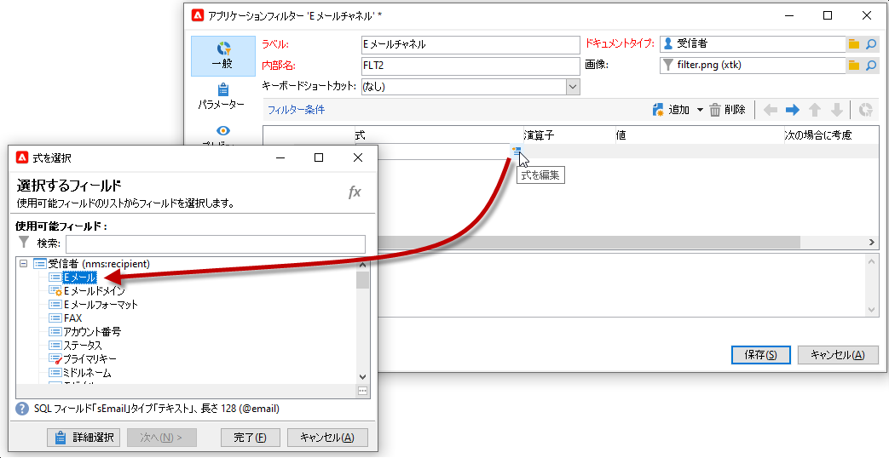
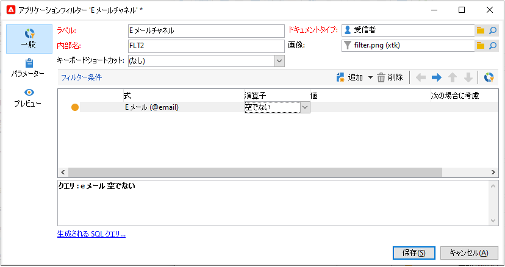
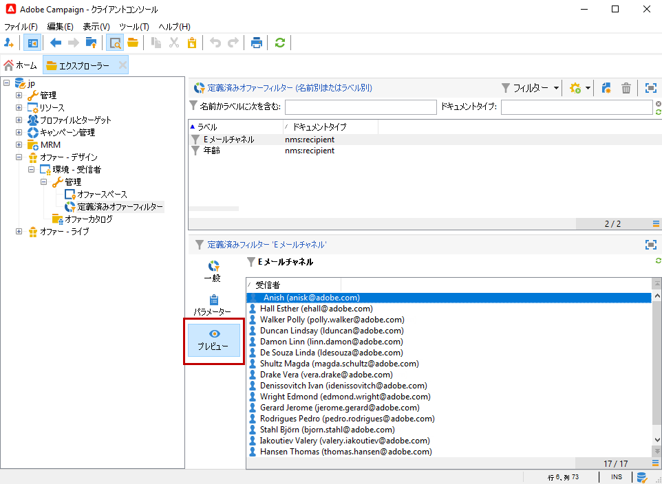

# 定義済みフィルターの作成{#creating-pre-defined-filters}

定義済みのフィルターを作成すると、オファーの作成時に簡単に再利用できるターゲット母集団の実施要件ルールを定義できます。 定義済みフィルターは各環境に固有で、オファーのパラメーターが考慮されます。

>[!NOTE]
>
>Adobe Campaign web UI では、特定のニーズに合わせて定義済みフィルターを簡単に管理およびカスタマイズできる、使いやすいインターフェイスを提供します。 1 回作成し、後で使用するために保存します。 Web UI 用の定義済みフィルターについて詳しくは、[Adobe Campaign web UI ドキュメント](https://experienceleague.adobe.com/ja/docs/campaign-web/v8/start/predefined-filters){target=_blank}を参照してください。

定義済みフィルターを作成するには、次の手順に従います。

1. **[!UICONTROL 管理]**&#x200B;フォルダーで「**[!UICONTROL 定義済みオファーフィルター]**」を選択します。

   

1. 「**[!UICONTROL 新規]**」をクリックします。

   

1. 後でフィルターを識別できるように、ラベルを変更します。

   

1. フィルター条件が関係するフィールドを選択します。

   

1. 必要に応じて演算子と値を選択して、クエリを保存します。

   

1. 「**[!UICONTROL プレビュー]**」をクリックし、フィルターの適用結果を表示します。

   
