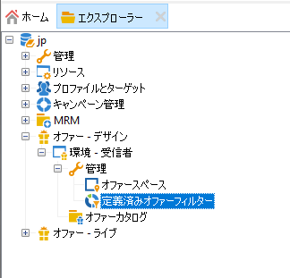
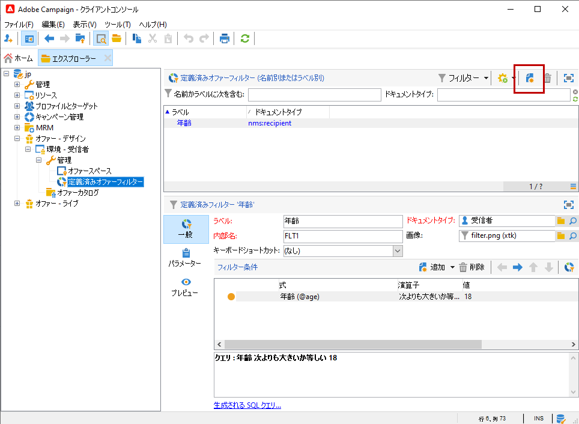
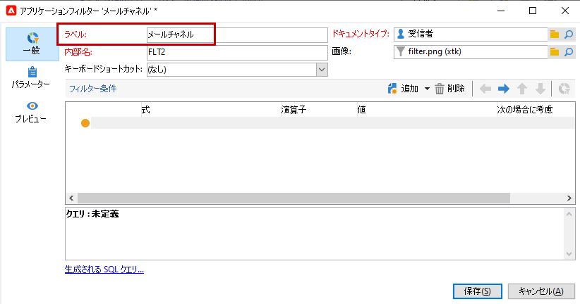
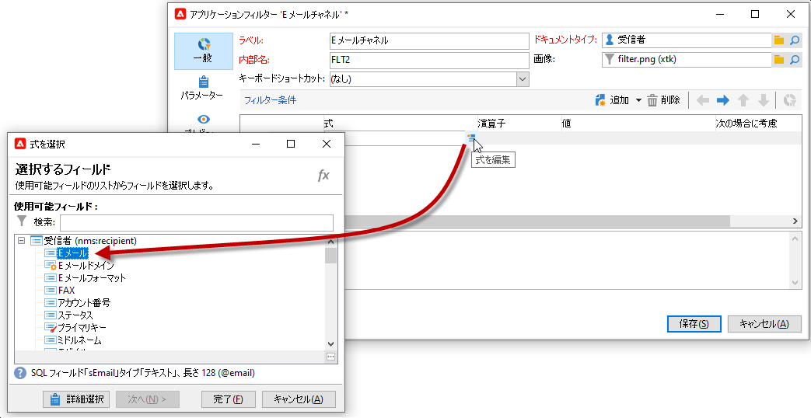
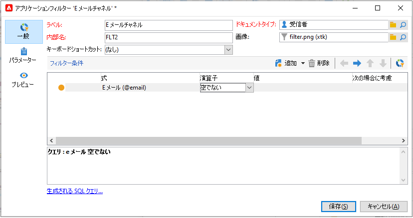
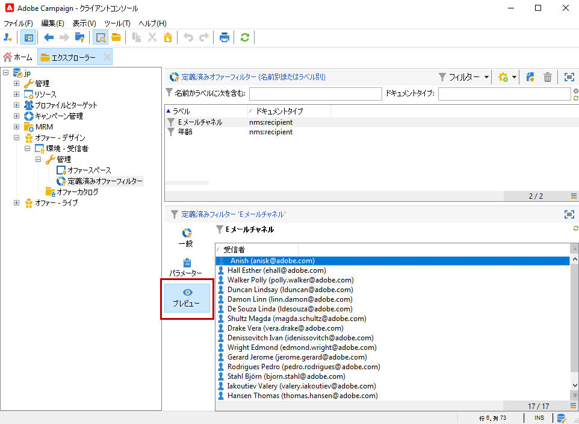

# 定義済みフィルターの作成{#creating-pre-defined-filters}

定義済みのフィルターを作成すると、オファーの作成時に簡単に再利用できるターゲット母集団の実施要件ルールを定義できます。定義済みフィルターは各環境に固有で、オファーのパラメーターが考慮されます。

定義済みフィルターを作成するには、次の手順に従います。

1. **[!UICONTROL 管理]**&#x200B;フォルダーで「**[!UICONTROL 定義済みオファーフィルター]**」を選択します。

   

1. 「**[!UICONTROL 新規]**」をクリックします。

   

1. 後でフィルターを識別できるように、ラベルを変更します。

   

1. フィルター条件が関係するフィールドを選択します。

   

1. 必要に応じて演算子と値を選択して、クエリを保存します。

   

1. 「**[!UICONTROL プレビュー]**」をクリックし、フィルターの適用結果を表示します。

   
