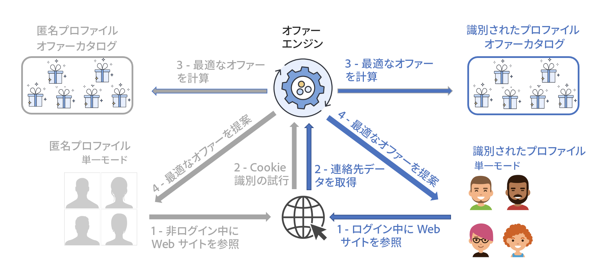

# 最適なオファーの提示{#interaction-present-offers}

オファーは、[インバウンドチャネルまたはアウトバウンドチャネル](interaction-architecture.md#interaction-types)を使用して、様々なオファースペースに提示できます。この章では、インバウンドチャネルに特有の機能について詳しく説明します。

オファーがオファーエンジンで選択されるためには、オファーが承認されてライブ環境で使用可能でなければなりません。

 詳しくは、[Campaign Classic v7 ドキュメント](https://experienceleague.adobe.com/docs/campaign-classic/using/managing-offers/managing-an-offer-catalog/approving-and-activating-an-offer.html?lang=ja#approving-offer-content)を参照してください。

インバウンドコンタクト先のコンテキストでは、コンタクト先つまりページを閲覧しているユーザーが web サイトで識別できるかどうかです。オファーエンジンは、識別されたプロファイル用と匿名プロファイル用に、異なるオファーを提示します。

インバウンドチャネルでオファーを提示できるようにするには、まず、オファーを提示する場所にオファーエンジン呼び出しを設定する必要があります。インバウンドインタラクションでは、ほとんどの場合、これは web ページです。

>[!NOTE]
>
>インバウンドインタラクションの場合は、1 つまたは複数のオファーを提示および更新するようにオファーエンジンを明確に設定する必要があります。
>
>また、オファースペースで単一モードを有効にする必要があります。詳しくは、[このページ](interaction-offer-spaces.md)を参照してください。
