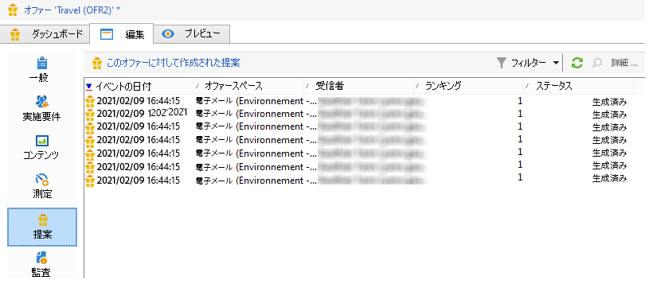
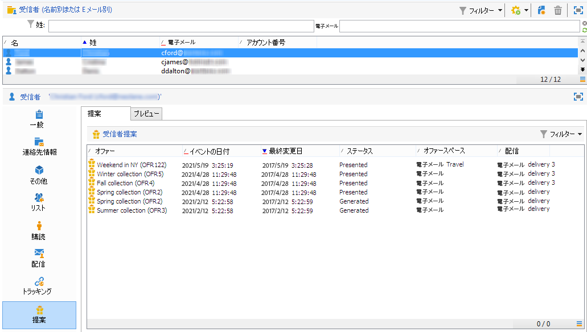
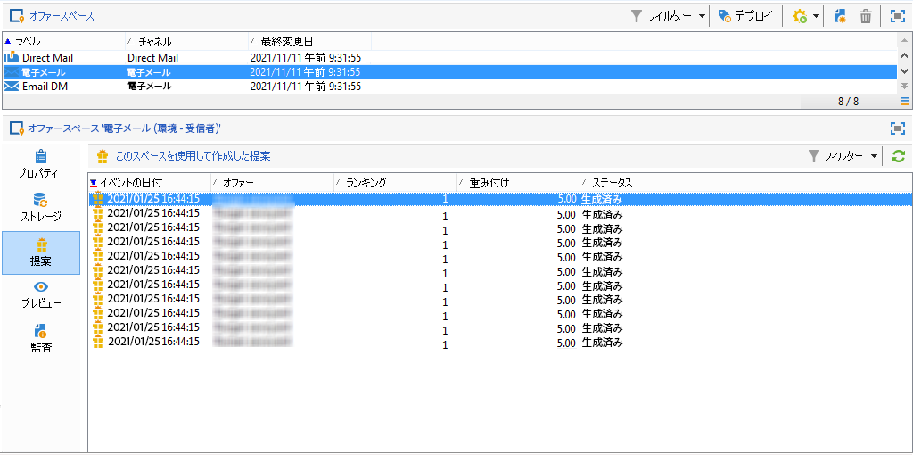
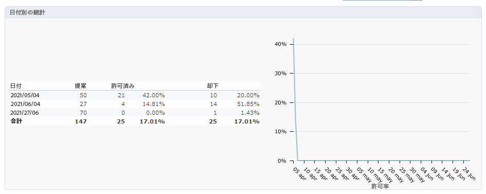
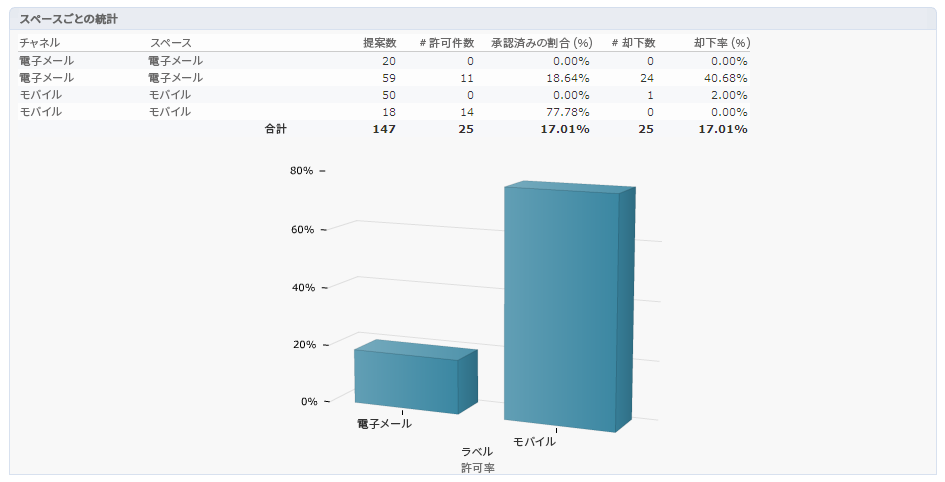
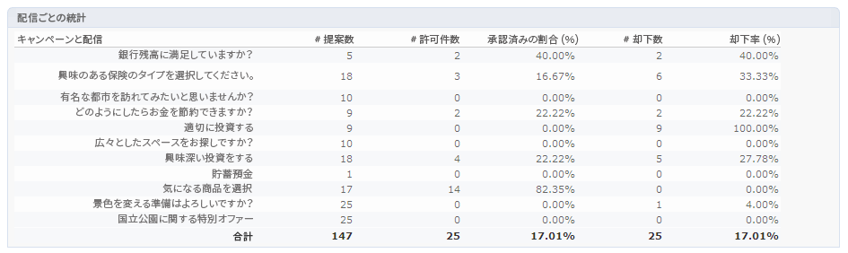

# リアルタイムのインタラクション履歴およびレポート

>[!NOTE]
>
>これらの機能は、オンライン時にのみ、**配信マネージャー**&#x200B;にのみ表示されます。

## オファーの提案履歴{#offer-proposition-history}

オファーの提案を実行したら、プレゼンテーション履歴を表示できます。

* オファーのレベルで、「**[!UICONTROL 編集]**」タブの「**[!UICONTROL 提案]**」をクリックします。

   

* 受信者のプロファイルから、「**[!UICONTROL 提案]**」タブをクリックします。

   

* オファースペースのレベルで、「**[!UICONTROL 提案]**」タブをクリックします。

   

## オファー分析レポート{#offer-analysis-report}

**[!UICONTROL オファー分析]**&#x200B;レポートは、承認または却下された提案の件数の概要を示します。

統計は、次の 3 つの条件に基づいて並べ替えられます。

* 日付別：

   

* スペース別：

   

* 配信別：

   

レポートの上部で使用できる様々な条件に基づいて、データをフィルタリングできます。目的の基準を選択して、「**[!UICONTROL 更新]**」リンクをクリックすると、レポートに適用されます。
