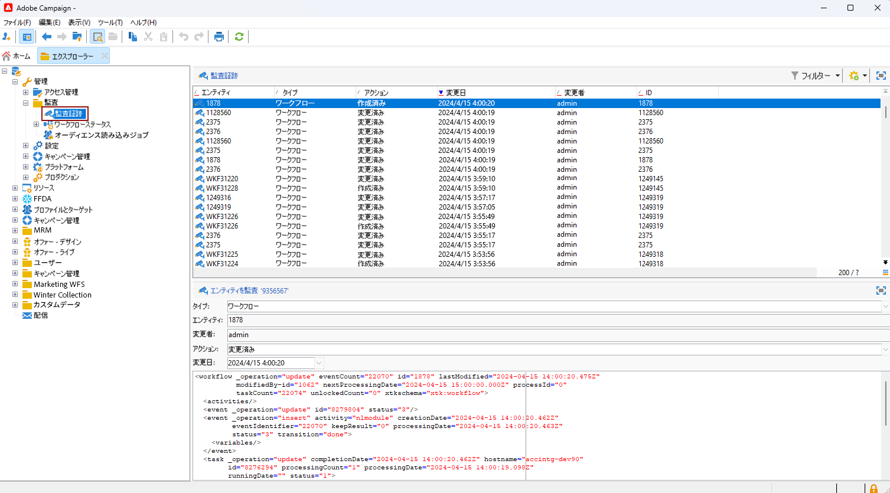
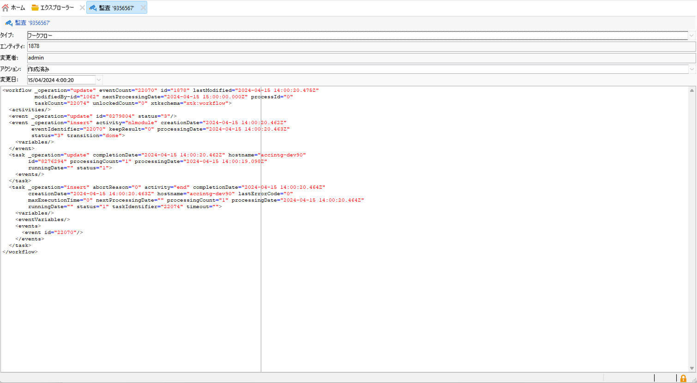
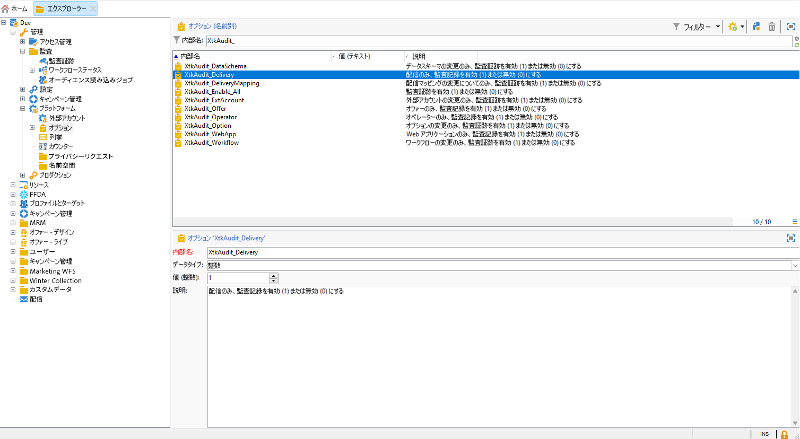
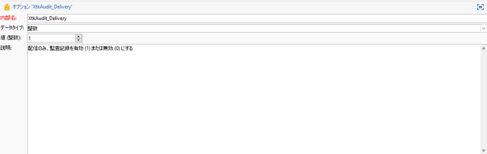

# 監査記録{#audit-trail}

Adobe Campaign 内の&#x200B;**[!UICONTROL 監査記録]**&#x200B;機能では、インスタンス内の重要なエンティティに対して行われたすべての変更（通常はインスタンスのスムーズな操作に大きな影響を与えるエンティティ）の詳細な記録を提供します。リアルタイムログとして機能し、アクションとイベントが発生した際にその詳細なリストを取得します。

>[!NOTE]
>
>Adobe Campaign では、ユーザー権限、テンプレート、パーソナライゼーションまたはキャンペーン内で行われた変更を監査しません。\
>監査記録は、インスタンスの管理者のみが管理できます。

+++ 監査記録が使用可能なエンティティについて説明します

* **スキーマ監査記録**：スキーマに行った変更を調べて、変更を行ったユーザーとタイミングを特定できます。

  スキーマについて詳しくは、[ページ](../dev/schemas.md)を参照してください。

* **ワークフロー監査記録**&#x200B;では、以下を含む、ワークフローに関連するすべてのアクションを追跡します。

   * 開始
   * 一時停止
   * 停止
   * 再度開始
   * クリーンアップ（「履歴をパージ」アクションと同じ）
   * シミュレーション（「シミュレーションモードで開始」アクションと同じ）
   * ウェイクアップ（「保留中のタスクを今すぐ実行」アクションと同じ）
   * 無条件停止

  ワークフローについて詳しくは、この[ページ](../../automation/workflow/about-workflows.md)を参照してください。

  ワークフローの監視方法について詳しくは、[該当する節](../../automation/workflow/monitor-workflow-execution.md)を参照してください。

* **オプション監査記録**&#x200B;では、アクティビティと、オプションに最後に行った変更を確認できます。

  オプションについて詳しくは、この[ページ](https://experienceleague.adobe.com/ja/docs/campaign-classic/using/installing-campaign-classic/appendices/configuring-campaign-options)を参照してください。

* **配信監査記録**&#x200B;では、アクティビティと、配信に最後に行った変更を確認できます。

  配信について詳しくは、この[ページ](../start/create-message.md)を参照してください。

* **外部アカウント**&#x200B;では、テクニカルワークフローやキャンペーンワークフローなどの技術プロセスで使用される、外部アカウントに行った変更を確認できます。

  外部アカウントについて詳しくは、この[ページ](../config/external-accounts.md)を参照してください。

* **配信マッピング**&#x200B;では、配信マッピングに対して行ったアクティビティと最新の変更を監視できます。

  配信マッピングについて詳しくは、この[ページ](../audiences/target-mappings.md)を参照してください。

* **Web アプリケーション**&#x200B;では、入力フィールドと選択フィールドを含むページの作成に使用される Campaign V8 の web フォームに行った変更を確認できます。これには、データベースのデータが含まれている場合があります。

  Web アプリケーションについて詳しくは、この[ページ](../dev/webapps.md)を参照してください。

* **オファー**&#x200B;では、アクティビティと、オファーに最後に行った変更を確認できます。

  オファーについて詳しくは、この[ページ](../interaction/interaction.md)を参照してください。

* **オペレーター**&#x200B;では、アクティビティと、オペレーターに行った最新の変更を監視できます。

  オペレーターについて詳しくは、この[ページ](../interaction/interaction-operators.md)を参照してください。

+++

## 監査記録へのアクセス {#accessing-audit-trail}

インスタンスの&#x200B;**[!UICONTROL 監査記録]**&#x200B;にアクセスするには：

1. インスタンスの&#x200B;**[!UICONTROL エクスプローラー]**&#x200B;メニューにアクセスします。

1. **[!UICONTROL 管理]**&#x200B;メニューで、「**[!UICONTROL 監査]**」、「**[!UICONTROL 監査記録]**」の順に選択します。

   

1. **[!UICONTROL 監査記録]**&#x200B;ウィンドウが開き、エンティティのリストが表示されます。Adobe Campaign では、様々なエンティティの作成、編集、削除アクションを監査します。

   最後の変更の詳細を確認するには、いずれかのエンティティを選択します。

1. **[!UICONTROL エンティティを監査]**&#x200B;ウィンドウには、選択したエンティティに関する次のような詳細情報が表示されます。

   * **[!UICONTROL タイプ]**：ワークフロー、オプション、配信、スキーマ。
   * **[!UICONTROL エンティティ]**：アクティビティの内部名。
   * **[!UICONTROL 変更者]**：このエンティティを最後に変更したユーザーのユーザー名。
   * **[!UICONTROL アクション]**：このエンティティで最後に実行されたアクション（作成済み、変更済み、削除済み）。
   * **[!UICONTROL 変更日]**：このエンティティで最後に実行されたアクションの日付。

   

>[!NOTE]
>
>デフォルトでは、**[!UICONTROL 監査ログ]**&#x200B;の保持期間は 180 日に設定されています。この値は、デプロイメントウィザードで変更できます。

## 監査記録を有効／無効にする {#enable-disable-audit-trail}

例えば、データベースの容量を節約する場合など、監査記録を特定のアクティビティに対して簡単にアクティブ化または非アクティブ化できます。

それには、次の手順に従います。

1. インスタンスの&#x200B;**[!UICONTROL エクスプローラー]**&#x200B;メニューにアクセスします。

1. **[!UICONTROL 管理]**&#x200B;メニューで、「**[!UICONTROL プラットフォーム]**」、「**[!UICONTROL オプション]**」の順に選択します。

1. アクティブ化／非アクティブ化するエンティティに応じて、次のオプションのいずれかを選択します。

   * ワークフローの場合：**[!UICONTROL XtkAudit_Workflows]**
   * スキーマの場合：**[!UICONTROL XtkAudit_DataSchema]**
   * オプションの場合：**[!UICONTROL XtkAudit_Option]**
   * 配信の場合：**[!UICONTROL XtkAudit_Delivery]**
   * 外部アカウントの場合：**[!UICONTROL XtkAudit_ExtAccount]**
   * 配信マッピングの場合：**[!UICONTROL XtkAudit_DeliveryMapping]**
   * Web アプリケーションの場合：**[!UICONTROL XtkAudit_WebApp]**
   * オファーの場合：**[!UICONTROL XtkAudit_Offer]**
   * 演算子の場合：**[!UICONTROL XtkAudit_Operator]**
   * すべてのエンティティの場合：**[!UICONTROL XtkAudit_Enable_All]**

   

1. エンティティを有効にする場合は&#x200B;**[!UICONTROL 値]**&#x200B;を 1 に、無効にする場合は 0 に変更します。

   

1. 「**[!UICONTROL 保存]**」をクリックします。
