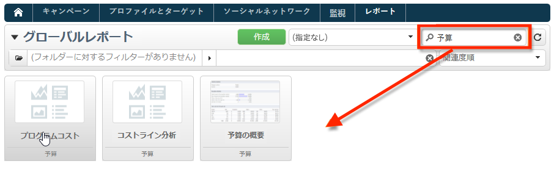

# Adobe Campaignの組み込みレポート{#ootb-reports}

このページには、Adobe Campaignの組み込みレポート、その内容およびコンテキストの一覧が表示されます。 Adobe Campaignには、クライアントコンソールまたはインターネットブラウザーからアクセスできる、様々な組み込みレポートが用意されています。

使用可能なレポートのタイプは次のとおりです。

* プラットフォーム全体のレポート。 [詳細情報](global-reports.md)。
* 配信レポート. [詳細情報](delivery-reports.md)。

組み込みレポートは、Campaign ホームページ、専用のレポートダッシュボードまたは配信リストからアクセスできます。 UI でのレポートの表示方法は、そのコンテキストに応じて異なります。

主要レポートのリストはホームページで使用でき、配信データにすばやくアクセスできます。 このリストは、ニーズに合わせて変更可能です。また、「**[!UICONTROL レポート]**」タブに独自のレポートを追加する方法についても説明します。

これらのカスタム設定について詳しくは、次を参照してください。 [Campaign Classicv7 ドキュメント](https://experienceleague.adobe.com/docs/campaign-classic/using/reporting/creating-new-reports/configuring-access-to-the-report.html).

## ビルトインレポートへのアクセス {#access-ootb-reports}

Campaign のビルトインレポートにアクセスするには次の手順に従います。

1. Adobe Campaign インターフェイスの「**[!UICONTROL レポート]**」タブを選択します。

   

1. 検索フィールドを使用して、表示されるレポートをフィルターします。

1. 次に、表示するレポートをクリックします。

   

1. 画面上部にある「**[!UICONTROL 戻る]**」リンクをクリックすると、レポートのリストに戻ります。

   

キャンペーンや配信に特有のレポートには、それぞれのダッシュボードからアクセスできます。

次に示すように、リスト、サービス、オファーなどについて、原則は同じです。

## 配信に関するレポート {#reports-on-deliveries}

以下の表に、Adobe Campaign によって提供されるビルトインレポートを示します。

これらのレポートの内容について詳しくは、[この節](delivery-reports.md)を参照してください。

<table> 
 <tbody> 
  <tr> 
   <td> <strong>ラベルと内部名</strong>  </td> 
   <td> <strong>説明</strong>  </td> 
   <td> <strong>スキーマ</strong>  </td> 
  </tr> 
  <tr> 
   <td> ユーザーアクティビティ（recipientActivity）  </td> 
   <td> 開封数、クリック数およびトランザクション数の時間別の分類。  </td> 
   <td> nms:delivery  </td> 
  </tr> 
  <tr> 
   <td> 配信スループット（throughput）  </td> 
   <td> メッセージ数/時間および M ビット/秒の配信スループットのグラフ。  </td> 
   <td> nms:delivery  </td> 
  </tr> 
  <tr> 
   <td> 配信不能件数とバウンス数（errors）  </td> 
   <td> 原因別ドメイン別バウンス数と配信不能件数  </td> 
   <td> nms:delivery  </td> 
  </tr> 
  <tr> 
   <td> トラッキング指標（deliveryFeedback）  </td> 
   <td> 受信者の行動をトラッキングするための主要指標の概要。  </td> 
   <td> nms:delivery  </td> 
  </tr> 
  <tr> 
   <td> トラッキング指標（mobileAppDeliveryFeedback）  </td> 
   <td> モバイルアプリケーションへの配信のトラッキング指標。  </td> 
   <td> nms:delivery  </td> 
  </tr> 
  <tr> 
   <td> ブラウザー（browserStatistics）  </td> 
   <td> メッセージをクリックした受信者が使用するブラウザーに関する統計。  </td> 
   <td> xtk:none  </td> 
  </tr> 
  <tr> 
   <td> ソーシャルネットワークへの共有（deliveryForward）  </td> 
   <td> 共有アクティビティとメール開封に関する統計。  </td> 
   <td> nms:delivery  </td> 
  </tr> 
  <tr> 
   <td> ホットクリック（hoturls）  </td> 
   <td> メッセージとクリック率を重ねて表示。  </td> 
   <td> nms:delivery  </td> 
  </tr> 
  <tr> 
   <td> 仮説レポート（deliveryHypothesis）  </td> 
   <td> 配信仮説に関する測定の概要の表示。  </td> 
   <td> nms:delivery  </td> 
  </tr> 
  <tr> 
   <td> 配信統計（statisticsPerDelivery）  </td> 
   <td> E メールドメインごとの統計（処理メッセージ数、配信メッセージ数、ハードバウンス数、ソフトバウンス数、クリック数、購読解除数）。  </td> 
   <td> nms:delivery  </td> 
  </tr> 
  <tr> 
   <td> 共有アクティビティの統計（forwardActivities）  </td> 
   <td> 期間ごとの共有アクティビティ数、開封数および購読数の分析。  </td> 
   <td> nms:delivery  </td> 
  </tr> 
  <tr> 
   <td> トラッキング統計（trackingStatistics）  </td> 
   <td> 開封率、クリック率、トランザクション率に関するレポート。  </td> 
   <td> nms:delivery  </td> 
  </tr> 
  <tr> 
   <td> 配信の概要（deliverySending）  </td> 
   <td> 配信概要の指標：ターゲット数、除外数および送信メッセージ数。  </td> 
   <td> nms:delivery  </td> 
  </tr> 
  <tr> 
   <td> 配信の概要（deliveryStatistics）  </td> 
   <td> 選択した配信の概要テーブル : ターゲット、除外および送信されたメッセージ。  </td> 
   <td> nms:delivery  </td> 
  </tr> 
  <tr> 
   <td> オペレーティングシステム（osStatistics）  </td> 
   <td> メッセージをクリックした受信者が使用するオペレーティングシステムに関する統計。  </td> 
   <td> xtk:none  </td> 
  </tr> 
  <tr> 
   <td> 反応率（deliveryFeedbackSocial）  </td> 
   <td> 配信の反応率および反応の分類。  </td> 
   <td> nms:delivery  </td> 
  </tr> 
  <tr> 
   <td> URL とクリックスループット（topUrlDelivery）  </td> 
   <td> 最も反応の良い URL および関連するクリックストリーム。  </td> 
   <td> nms:delivery  </td> 
  </tr> 
 </tbody> 
</table>

## キャンペーンに関するレポート {#reports-on-campaigns}

キャンペーンに関するレポートは **nms:operation** テーブル内のデータに関係します。

<table> 
 <tbody> 
  <tr> 
   <td> <strong>ラベルと内部名</strong>  </td> 
   <td> <strong>説明</strong>  </td> 
  </tr> 
  <tr> 
   <td> ユーザーアクティビティ（operationRecipientActivity）  </td> 
   <td> 開封数、クリック数およびトランザクション数の時間別の分類（Campaign に依存）。  </td> 
  </tr> 
  <tr> 
   <td> 配信スループット（operationThroughput）  </td> 
   <td> メール数/時間および M ビット/秒の配信スループットのグラフ（Campaign に依存）。  </td> 
  </tr> 
  <tr> 
   <td> キャンペーン費用（budgetOperationExpenses）  </td> 
   <td> キャンペーンのライン項目の詳細を表示（Campaign に依存）。  </td> 
  </tr> 
  <tr> 
   <td> 配信不能件数とバウンス数（operationErrors）  </td> 
   <td> 原因別およびドメイン別バウンス数と配信不能件数（Campaign に依存）。  </td> 
  </tr> 
  <tr> 
   <td> コストラインの調査（budgetExplorerOperation）  </td> 
   <td> コストラインの記述的分析（MRM に依存）。  </td> 
  </tr> 
  <tr> 
   <td> トラッキング指標（operationFeedback）  </td> 
   <td> 重要なトラッキング指標の概要 : 開封数、クリック数、トランザクション数（Campaign に依存）。  </td> 
  </tr> 
  <tr> 
   <td> ソーシャルネットワークへの共有（operationForward）  </td> 
   <td> 共有アクティビティとメール開封に関する統計（Campaign に依存）。  </td> 
  </tr> 
  <tr> 
   <td> 仮説レポート（operationHypothesis）  </td> 
   <td> キャンペーン配信の仮説測定の概要を表示（Campaign に依存）。  </td> 
  </tr> 
  <tr> 
   <td> 共有アクティビティの統計（forwardActivityOpt）  </td> 
   <td> 期間ごとの共有アクティビティ数、開封数および購読数の分析（Campaign に依存）。  </td> 
  </tr> 
  <tr> 
   <td> 配信の概要（operationStatistics）  </td> 
   <td> キャンペーン配信の概要グラフ : ターゲット数、除外数および送信メッセージ数。  </td> 
  </tr> 
  <tr> 
   <td> URL とクリックスループット（operationTopUrlDelivery）  </td> 
   <td> 最も反応の良い URL および関連するクリックストリーム（Campaign に依存）。  </td> 
  </tr> 
 </tbody> 
</table>

## サービスに関するレポート {#reports-on-services}

サービスに関するレポートは **nms:service** テーブル内のデータに関係します。

<table> 
 <tbody> 
  <tr> 
   <td> <strong>ラベルと内部名</strong>  </td> 
   <td> <strong>説明</strong>  </td> 
  </tr> 
  <tr> 
   <td> ファン獲得（socialAcquisitionsByWebapp）  </td> 
   <td> 見込み客の獲得を有効にした Web アプリケーションの分析。ソーシャルマーケティングのアドオンに依存します。  </td> 
  </tr> 
  <tr> 
   <td> 購読の分類（mobileAppDistribution）  </td> 
   <td> モバイルアプリケーションごとのアクティブな購読の分類（モバイルアプリチャネルのアドオンに依存）。  </td> 
  </tr> 
  <tr> 
   <td> 購読のトラッキング （subscriptionsProgress）  </td> 
   <td> 情報サービスの購読数の変化。  </td> 
  </tr> 
  <tr> 
   <td> 反応率（socialReactionRate）  </td> 
   <td> 最新の配信の反応率。ソーシャルマーケティングのアドオンに依存します。  </td> 
  </tr> 
  <tr> 
   <td> 反応率（mobileAppReactivityRate）  </td> 
   <td> 最新の配信の反応率（モバイルアプリチャネルのアドオンに依存）。  </td> 
  </tr> 
 </tbody> 
</table>

## 予算レポート {#budget-reports}

以下の表に、Adobe Campaign によって提供されるビルトインレポートを示します。

<table> 
 <tbody> 
  <tr> 
   <td> <strong>ラベルと内部名</strong>  </td> 
   <td> <strong>説明</strong>  </td> 
   <td> <strong>スキーマ</strong>  </td> 
  </tr> 
  <tr> 
   <td> プログラムに関連するコスト（budgetProgramCost）  </td> 
   <td> プログラムコストの内訳。  </td> 
   <td> nms:program  </td> 
  </tr> 
  <tr> 
   <td> 予算の変化（budgetEvolution）  </td> 
   <td> コミットメントレベル別の予算コストの変化。  </td> 
   <td> nms:budget  </td> 
  </tr> 
  <tr> 
   <td> 予算の累積変化（budgetCumulativeEvolution）  </td> 
   <td> コミットメントレベルで分類した累積予算コストの変化。  </td> 
   <td> nms:budget  </td> 
  </tr> 
  <tr> 
   <td> コストラインの調査（budgetExplorerBudget）  </td> 
   <td> コストラインの記述的分析。  </td> 
   <td> nms:budget  </td> 
  </tr> 
  <tr> 
   <td> コストラインの調査（budgetExplorer）  </td> 
   <td> コストラインの記述的分析。  </td> 
   <td> nms:costLine  </td> 
  </tr> 
  <tr> 
   <td> コストラインの調査（budgetExplorerPlan）  </td> 
   <td> コストラインの記述的分析。  </td> 
   <td> nms:plan  </td> 
  </tr> 
  <tr> 
   <td> コストラインの調査（budgetExplorerProgram）  </td> 
   <td> コストラインの記述的分析。  </td> 
   <td> nms:program  </td> 
  </tr> 
  <tr> 
   <td> 予算の概要（budget）  </td> 
   <td> メインコスト、費用カテゴリおよび予算のスナップショット。  </td> 
   <td> nms:budget  </td> 
  </tr> 
 </tbody> 
</table>

## シミュレーションに関するレポート {#reports-on-simulations}

シミュレーションに関するレポートは **nms:simulation** テーブル内のデータに関係します。

<table> 
 <tbody> 
  <tr> 
   <td> <strong>ラベルと内部名</strong>  </td> 
   <td> <strong>説明</strong>  </td> 
  </tr> 
  <tr> 
   <td> シミュレーションの除外の詳細（dlvSimuLossesDetail）  </td> 
   <td> 除外のすべての原因の詳細テーブル。  </td> 
  </tr> 
  <tr> 
   <td> オファーのランク別分類（offerSimulationRanking）  </td> 
   <td> シミュレーションでのオファーの分類（ランク別）。  </td> 
  </tr> 
  <tr> 
   <td> シミュレーションの概要（dlvSimuLossesSummary）  </td> 
   <td> シミュレーションの規模と除外条件の概要。  </td> 
  </tr> 
  <tr> 
   <td> 重複統計情報（dlvSimuOverlapping）  </td> 
   <td> 配信ターゲットの重複数。  </td> 
  </tr> 
  <tr> 
   <td> シミュレーションによる除外の概要（dlvSimuLossesSimu）  </td> 
   <td> シミュレーションによる除外のテーブル。  </td> 
  </tr> 
 </tbody> 
</table>

## Web アプリケーションに関するレポート {#reports-on-web-applications}

Web アプリケーションに関するレポートは **nms:WebApp** テーブル内のデータに関係します。

<table> 
 <tbody> 
  <tr> 
   <td> <strong>ラベルと内部名</strong>  </td> 
   <td> <strong>説明</strong>  </td> 
  </tr> 
  <tr> 
   <td> ドキュメント（surveyDictionary）  </td> 
   <td> 調査の構造の説明（調査マネージャーのアドオンに依存）。  </td> 
  </tr> 
  <tr> 
   <td> メイン（surveyProperties）  </td> 
   <td> 調査のプロパティ。  </td> 
  </tr> 
  <tr> 
   <td> 回答の分類（surveyDistribution）  </td> 
   <td> 質問に対する回答の分類。  </td> 
  </tr> 
 </tbody> 
</table>

## その他の標準レポート {#other-ootb-reports}

次のビルトインレポートも用意されています。詳しくは、それぞれが関係する機能についてのドキュメントを参照してください。

<table> 
 <tbody> 
  <tr> 
   <td> <strong>ラベルと内部名</strong>  </td> 
   <td> <strong>説明</strong>  </td> 
   <td> <strong>スキーマ</strong>  </td> 
  </tr> 
  <tr> 
   <td> オファー分析（offerAnalysis）  </td> 
   <td> 日付別およびチャネル別のオファー分析（インタラクションのアドオンに依存）。  </td> 
   <td> nms:offer  </td> 
  </tr> 
  <tr> 
   <td> リマーケティングの効率（remarketingEffect）  </td> 
   <td> リマーケティングの効率の測定。  </td> 
   <td> nms:webEvent  </td> 
  </tr> 
  <tr> 
   <td> ソーシャル見込み客の獲得履歴（socialVisitorStatistics）  </td> 
   <td> Twitter および Facebook の見込み客獲得履歴（ソーシャルマーケティングのアドオンに依存）。  </td> 
   <td> nms:visitor  </td> 
  </tr> 
  <tr> 
   <td> 最近の提案トラッキング（recentPropositions）  </td> 
   <td> リアルタイム提案トラッキング。  </td> 
   <td> nms:propositionRcp  </td> 
  </tr> 
 </tbody> 
</table>
