# キューブの作成{#create-a-cube}

## キューブワークスペース {#cube-workspace}

キューブにアクセスするには、 **[!UICONTROL 管理/設定/キューブ]** Campaign エクスプローラーから。

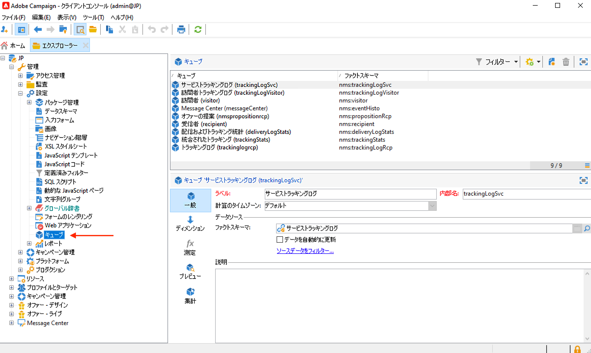

キューブを使用すると、次のことができます。

* データをレポートに直接書き出す ( **[!UICONTROL レポート]** 」タブを使用します。

   それには、新しいレポートを作成し、使用するキューブを選択します。

   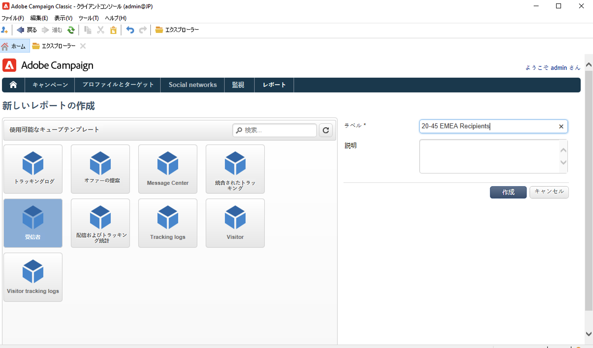

   キューブは、作成するレポートの基になるテンプレートのように表示されます。テンプレートを選択したら、「 **[!UICONTROL 作成]** をクリックして、新しいレポートを設定および表示します。

   測定の適合化、表示モードの変更またはテーブルの設定をおこなってから、メインボタンを使用してレポートを表示できます。

   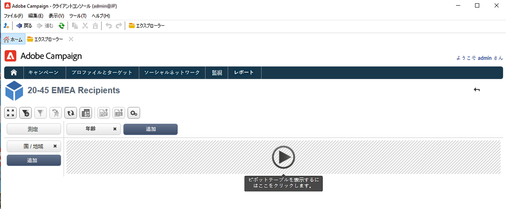

* でのキューブの参照 **[!UICONTROL クエリ]** 次に示すように、レポートのボックスで、指標を使用します。

   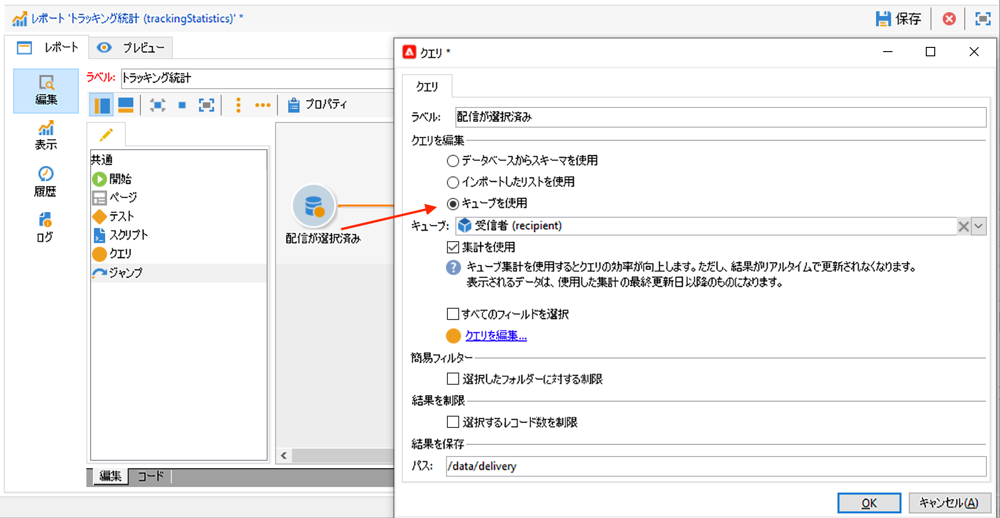

* キューブに基づくピボットテーブルをレポートの任意のページに挿入します。 それには、該当するページにあるピボットテーブルの「**[!UICONTROL データ]**」タブで、使用するキューブを参照します。

   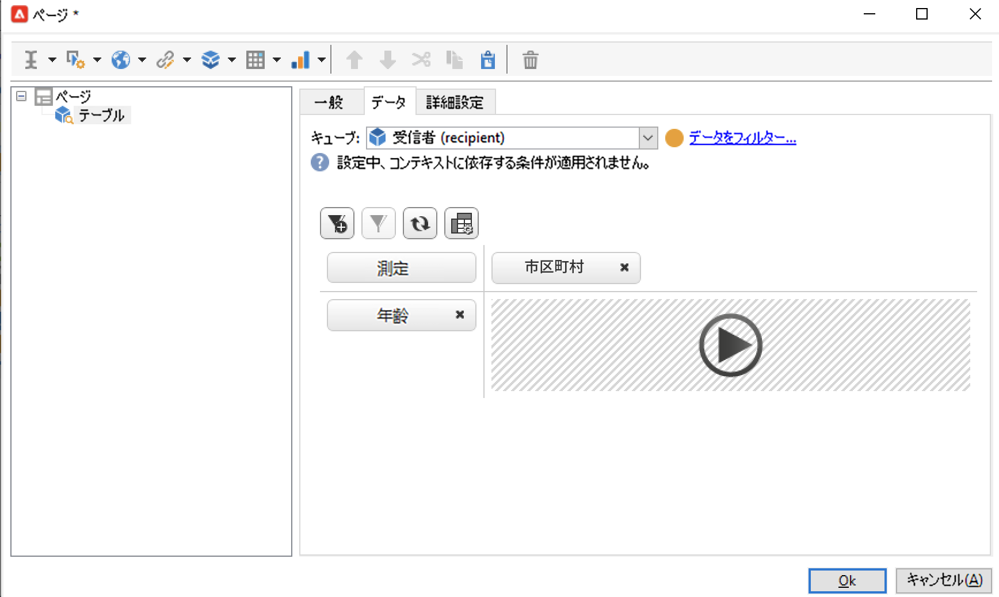

   詳しくは、[レポートのデータを調べる](cube-tables.md#explore-the-data-in-a-report)を参照してください。

>[!CAUTION]
>
>キューブを作成するには、管理者権限が必要です。

## キューブの作成{#cube-create}

キューブレポートの作成を開始する前に、関連するディメンションと測定を特定し、キューブに作成します。

キューブを作成するには、次の手順に従います。

1. 作業用テーブルを選択します。[詳細情報](#select-the-work-table)。
1. ディメンションを定義します。[詳細情報](#define-dimensions)。
1. 測定を定義します。[詳細情報](#build-indicators)。
1. 集計を作成します（オプション）。[詳細情報](cube-best-practices.md#calculate-and-use-aggregates)。

次の例では、レポートにシンプルなキューブをすばやく作成して、そのキューブの測定をエクスポートする方法を説明します。

### 作業用テーブルを選択します。 {#select-the-work-table}

キューブを作成するには、次の手順に従います。

1. 次をクリック： **[!UICONTROL 新規]** 」ボタンをクリックします。

   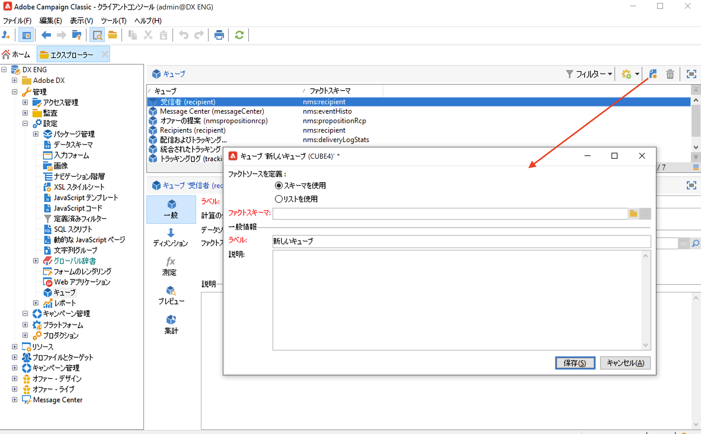

1. 調査する要素を含むスキーマ（「ファクトスキーマ」とも呼ばれます）を選択します。 この例では、デフォルトの **受信者** 表。
1. クリック **[!UICONTROL 保存]** キューブを作成するには：キューブのリストに追加されます。 これで、タブを使用して設定できます。

1. 次をクリック： **[!UICONTROL ソースデータをフィルター…]** このキューブの計算をデータベース内のデータに適用するためのリンク。

   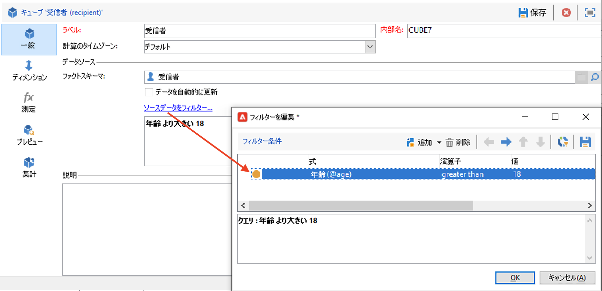

### ディメンションを定義します。 {#define-dimensions}

キューブを作成したら、そのディメンションを定義します。 Dimensionとは、関連するファクトスキーマに基づいてキューブごとに定義された分析軸です。 これらは、時間（年、月、日付）、製品または契約の分類（ファミリー、参照など）、母集団セグメント（市区町村別、年齢グループ別、ステータス別など）など、分析に表示されるディメンションです。

ディメンションを作成するには、次の手順に従います。

1. 次を参照： **[!UICONTROL Dimension]** タブで、 **[!UICONTROL 追加]** ボタンをクリックして、新しいディメンションを作成します。
1. 内 **[!UICONTROL 式フィールド]**、 **[!UICONTROL 式を編集]** アイコンをクリックして、該当するデータを含むフィールドを選択します。

   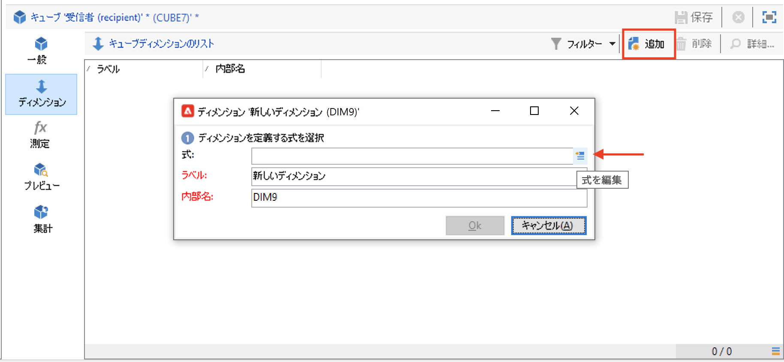

1. この例では、受信者を選択しています **年齢**. このフィールドに対して、ビニングを定義して年齢をグループ化し、情報を読み取りやすくすることができます。いくつかの独立した値を扱う可能性がある場合は、ビニングを使用することをお勧めします。

それには、「**[!UICONTROL ビニングを有効にする]**」オプションにチェックを入れます。[詳細情報](cube-best-practices.md#data-binning)。

1. **日付**&#x200B;タイプのディメンションを追加します。ここでは、受信者プロファイルの作成日を表示します。。それには、「**[!UICONTROL 追加]**」をクリックし、受信者テーブルの&#x200B;**[!UICONTROL 作成日]**&#x200B;フィールドを選択します。日付の表示モードはカスタマイズできます。 それには、使用する階層と生成するレベルを選択します。

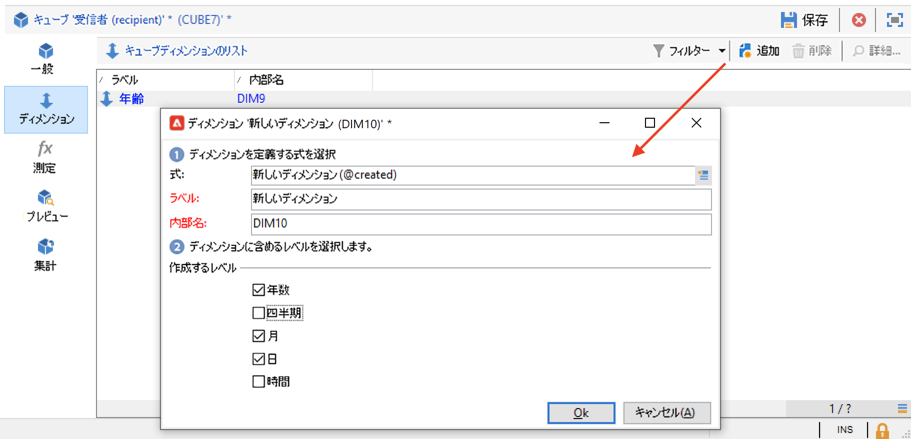

この例では、年、月、日のみを表示します。 週と学期/月を同時に扱うことはできません。これらのレベルは互換性がありません。

1. 別のディメンションを作成して、受信者の市区町村に関連するデータを分析します。 それには、新しいディメンションを追加し、受信者スキーマの&#x200B;**[!UICONTROL 場所]**&#x200B;ノードに属している「市区町村」を選択します。

ビニングを有効にして情報を読み取りやすくし、値を列挙にリンクします。

ドロップダウンリストから列挙を選択します。。この列挙は、 **[!UICONTROL ビニング用に予約]**.

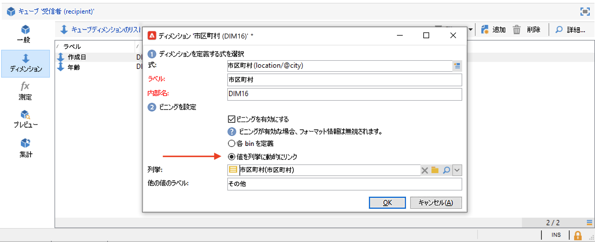

その列挙の値のみ表示されます。それ以外は、「**[!UICONTROL 他の値のラベル]**」フィールドで定義したラベルの下にグループ化されます。

詳しくは、[この節](cube-best-practices.md#dynamically-manage-bins)を参照してください。

### 指標の構築 {#build-indicators}

ディメンションを定義したら、セルに表示する値の計算モードを指定します。

それには、「 **[!UICONTROL 測定]** タブをクリックします。 このキューブに基づいて、レポートに表示する列と同じ数の測定を作成します。

指標を作成するには、次の手順に従います。

1. 次を参照： **[!UICONTROL 測定]** 」タブで、 **[!UICONTROL 追加]** 」ボタンをクリックします。
1. 測定のタイプと適用する式を選択します。この例では、受信者の中から女性の数をカウントしています。 この場合の測定はファクトスキーマに基づいたもので、使用する演算子は&#x200B;**[!UICONTROL カウント]**&#x200B;です。

   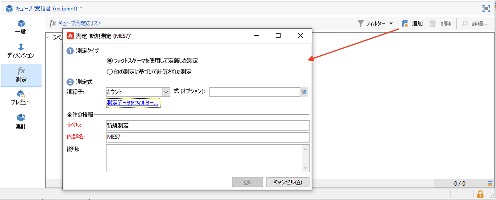

   以下を使用： **[!UICONTROL 測定データをフィルター…]** 女性のみを選択するリンク。 [詳細情報](cube-best-practices.md#define-measures)。

   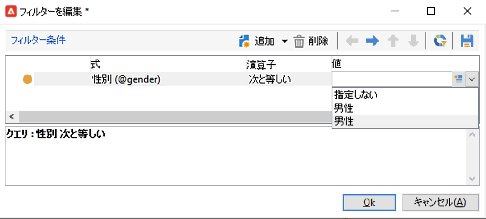

1. 測定のラベルを入力し、測定を保存します。

   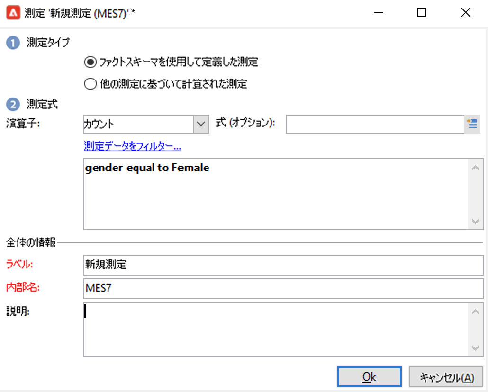

1. キューブを保存します。

これで、このキューブに基づくレポートを作成できます。 [詳細情報](cube-tables.md)。