# キューブのカスタマイズ{#cube-custom}

## データビニング {#data-binning}

データビニングを使用すると、条件に従って値がグループ化されるので、データの表示をシンプル化できます。使用できる情報に応じて、年齢グループの定義、E メールドメインのグループ化、値の列挙への制限、表示するデータの明示的な制限、専用の行や列への他のすべてのデータのグループ化などをおこなえます。

概して、使用可能なビニングは、次の 3 タイプです。

1. 定義された値範囲を手動で使用する。例えば、年齢、平均的なショッピングカート、開封された配信の数などです。詳しくは、[各 bin の定義](#defining-each-bin)を参照してください。
1. 列挙の値に応じて動的に管理する。列挙に含まれている値のみ表示し、その他のすべての値は「その他」にまとめられます。詳しくは、[bin の動的管理](#dynamically-managing-bins)を参照してください。
1. 値の範囲を使用し、その他はすべて 1 つにグループ化する。例えば、18～25 歳、26～59 歳、その他などです。詳しくは、[値範囲の作成](#creating-value-ranges)を参照してください。

ビニングを有効にするには、ディメンションの作成時に適切なボックスにチェックを入れます。

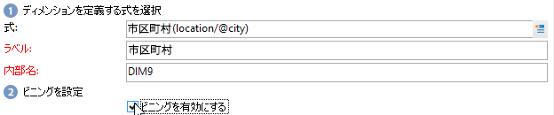

bin を手動で作成することも、既存の列挙にリンクすることもできます。

Adobe Campaign には自動ビニングのアシスタントも用意されています。値は、N 個のグループに分類することも、データベース内の最も頻度の高い値に従ってグループ化することもできます。

### 各 bin の定義 {#define-each-bin}

各 bin を個別に作成するには、「**[!UICONTROL 各 bin を定義]**」オプションを選択し、テーブルを使用して様々な bin を作成します。

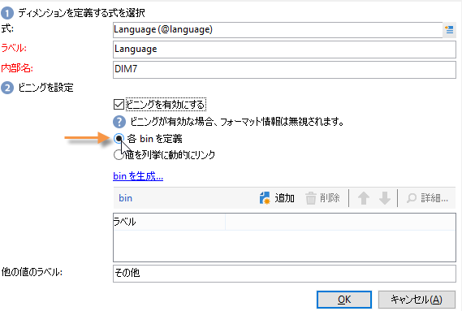

「**[!UICONTROL 追加]**」ボタンをクリックすると、新しい bin を作成でき、その bin にグループ化される値を一覧表示できます。

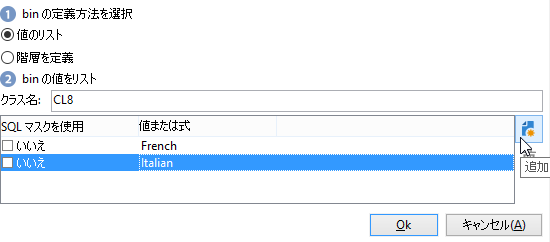

次の例では、言語が 3 つのカテゴリ（英語／ドイツ語／オランダ語、フランス語／イタリア語／スペイン語、その他）にグループ化されています。

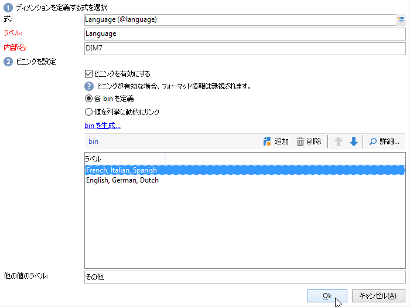

SQL マスクを使用して、複数の値を組み合わせてフィルターにすることができます。それには、「**[!UICONTROL SQL マスクを使用]**」列で「**[!UICONTROL はい]**」にチェックを入れ、適用する SQL フィルターを「**[!UICONTROL 値または式]**」列に入力します。

<!--In the example below, all email domains that start with **yahoo** (yahoo.fr, yahoo.com, yahoo.be, etc.), or with **ymail** (ymail.com, ymail.eu, etc.) will be grouped under the label **YAHOO!**, as well as addresses with the **rocketmail.com** domain.-->

### bin の動的管理 {#dynamically-manage-bins}

値は、列挙を通じて動的に管理できます。これは、その列挙に含まれている値のみ表示されることを意味します。列挙の値が変わったら、キューブの内容は、それに合わせて自動的に変更されます。

このタイプの値ビニング例を作成するには、次の手順に従います。

1. 新しいディメンションを作成し、ビニングを有効にします。
1. 「**[!UICONTROL 値を列挙に動的にリンク]**」オプションを選択し、対応する列挙を選択します。

   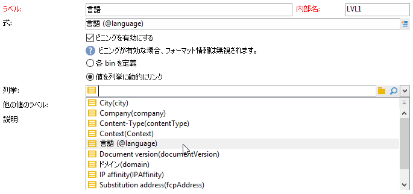

   列挙の値が更新されるたびに、対応する bin がそれに合わせて自動的に変更されます。

### 値の範囲の作成 {#create-value-ranges}

所定の区間に基づいて、値を範囲にグループ化できます。

範囲を手動で定義するには、「**[!UICONTROL 追加]**」ボタンをクリックし、「**[!UICONTROL 範囲を定義]**」を選択します。

次に、上限と下限を指定し、「**[!UICONTROL OK]**」をクリックして確定します。

### bin を自動的に生成 {#generate-bins-automatically}

bin を自動的に生成することもできます。それには、「**[!UICONTROL bin を生成]**」リンクをクリックします。

次のいずれかが可能です。

* **[!UICONTROL 最も頻繁に使用されている値を復元]**

   4 つの bin を生成すると、最も頻繁に使用されている 4 つの値が表示される一方、それ以外は「その他」カテゴリにカウントされ、グループ化されます。

* **[!UICONTROL スロットの形式で bin を生成]**

   同じサンプルに対して、同じサイズの 4 つの値スロットが Adobe Campaign によって自動的に作成され、そこにデータベース内の値が表示されます。

この場合、ファクトスキーマで選択したフィルターは無視されます。

### 列挙 {#enumerations}

レポートの関連度と読みやすさを向上させるために、Adobe Campaign では、特定の列挙を作成して、異なる値を同じ bin にグループ化し直すことができます。これらの列挙はビニング用に確保されており、キューブで参照され、したがってレポートに表示されます。

また、Adobe Campaign には、ドメインに関する列挙も用意されており、それを使用すると、次の例に示すように、データベースに格納されているすべての連絡先の E メールドメインのリストを、ISP でグループ化し直して表示できます。

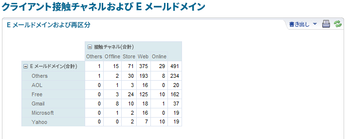

これは次のテンプレートを使用して作成されます。

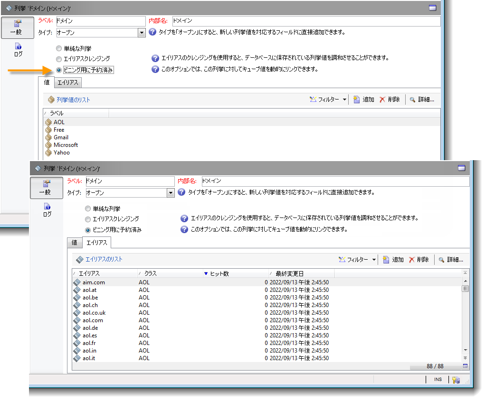

この列挙を使用してレポートを作成するには、**[!UICONTROL E メールドメイン]**&#x200B;ディメンションを使用してキューブを作成します。「**[!UICONTROL ビニングを有効にする]**」オプションを選択してから、「**[!UICONTROL 値を列挙に動的にリンク]**」を選択します。次に、先ほど示した&#x200B;**ドメイン**&#x200B;列挙を選択します。エイリアスが指定されていない値はすべて、**その他**&#x200B;というラベルでグループ化し直されます。

次に、このキューブに基づくレポートを作成して、これらの値を表示します。

関係するレポートを更新するには、列挙を変更するだけです。例えば、**Adobe** という値を作成し、**adobe.com** というエイリアスを追加すると、列挙レベルの Adobe 値でレポートが自動的に更新されます。

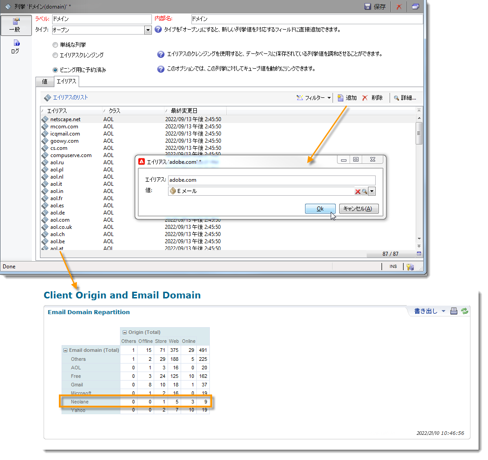

**[!UICONTROL ドメイン]**&#x200B;列挙は、ドメインのリストを表示するビルトインレポートの生成に使用されています。これらのレポートの内容を調整するには、このリストを編集します。

ビニング用に確保される他の列挙を作成し、それらを他のキューブで使用できます。最初の列挙タブで指定された bin に、すべてのエイリアス値がグループ化し直されます。

## キューブの集計 {#calculate-and-use-aggregates}

最大のデータ量を集計で計算できます。

集計は、大量のデータを操作するときに役に立ちます。専用のワークフローボックスで定義した設定に基づいて集計が自動的に更新され、最近収集したデータが指標に統合されます。

集計は各キューブの関連タブで定義されます。

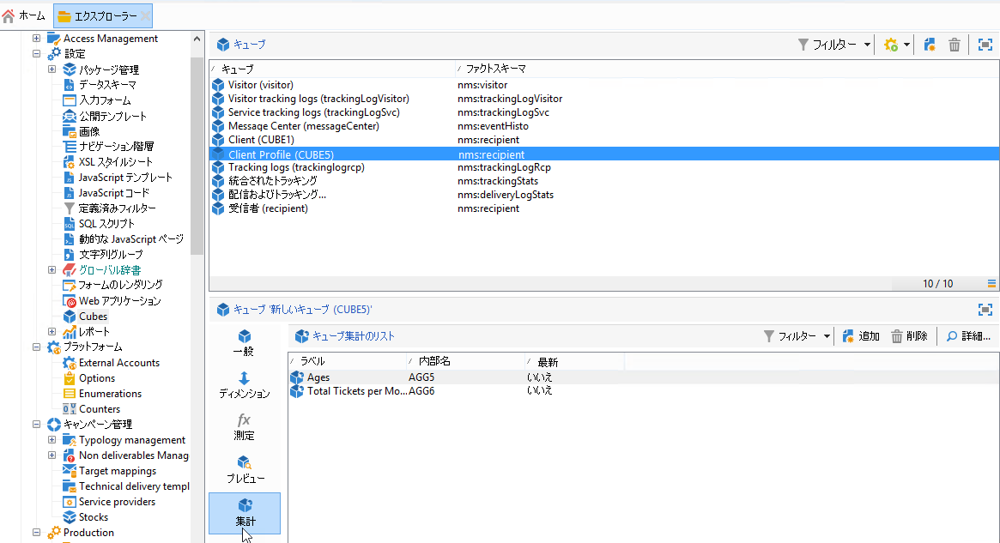

>[!NOTE]
>
>集計の計算を更新するためのワークフローを集計そのものに設定できます。または、関連するキューブにリンクされた外部ワークフローを通じて集計を更新することもできます。

新しい集計を作成するには、次の手順に従います。

1. キューブの「**[!UICONTROL 集計]**」タブをクリックした後、「**[!UICONTROL 追加]**」ボタンをクリックします。
1. 集約のラベルを入力してから、計算するディメンションを追加します。
1. ディメンションとレベルを選択します。ディメンションおよびレベルごとに、この手順を繰り返します。
1. 「**[!UICONTROL ワークフロー]**」タブをクリックして、集計ワークフローを作成します。

   * **[!UICONTROL スケジューラー]**&#x200B;アクティビティでは、計算の更新の頻度を定義できます。スケジューラーについて詳しくは、[この節](../../automation/workflow/scheduler.md)を参照してください。
   * **[!UICONTROL 集計の更新]**&#x200B;アクティビティでは、適用する更新モード（完全更新または部分的更新）を選択できます。

      デフォルトでは、各計算時に完全更新が実行されます。部分的更新を有効にするには、該当するオプションを選択し、更新の条件を定義します。

## 測定の定義 {#define-measures}

測定のタイプは、キューブの「**[!UICONTROL 測定]**」タブで定義します。合計、平均、偏差などを計算できます。

測定を必要な数だけ作成できます。その後、テーブルに表示または非表示にする測定を選択します。詳しくは、[この節](#displaying-measures)を参照してください。

新しい測定を定義するには、次の手順に従います。

1. 測定のリストの上にある「**[!UICONTROL 追加]**」ボタンをクリックし、測定のタイプと計算する式を選択します。

   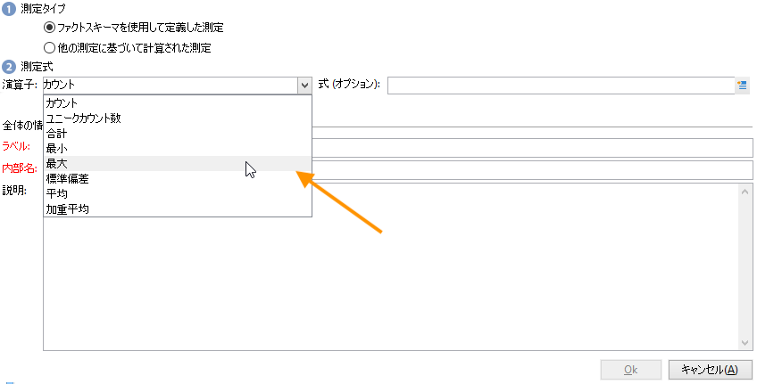

1. 必要に応じて、および演算子によっては、演算に関係する式を選択します。

   「**[!UICONTROL 詳細選択]**」ボタンをクリックすると、複雑な計算式を作成できます。詳しくは、[この節](../../automation/workflow/query.md)を参照してください。

1. 「**[!UICONTROL 測定データをフィルター]**」リンクをクリックすると、計算フィールドを制限し、データベース内の特定のデータにのみ適用できます。

   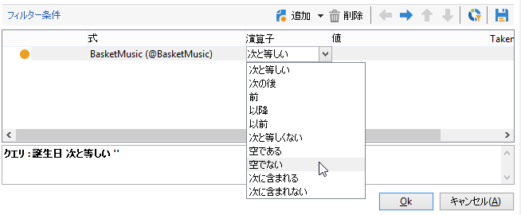

1. 測定のラベルを入力し、説明を追加した後、「**[!UICONTROL 完了]**」をクリックして測定を作成します。

## 測定のカスタマイズ {#display-measures}

必要に応じて、テーブルでの測定の表示を設定できます。

* 測定の表示順序。[詳細情報](#display-sequence)
* レポートに表示する／非表示にする情報。[詳細情報](#configuring-the-display)
* 表示する測定値：パーセンテージ、合計、小数点以下の桁数など[詳細情報](#changing-the-type-of-measure-displayed)

### 表示順序 {#display-sequence}

キューブ内の計算済みの測定を、「**[!UICONTROL 測定]**」ボタンを通じて設定します。

行を前後に移動して、表示順序を変更します。次の例では、フランス語のデータをリストの末尾に移動しています。つまり、最後の列に表示されるようになります。

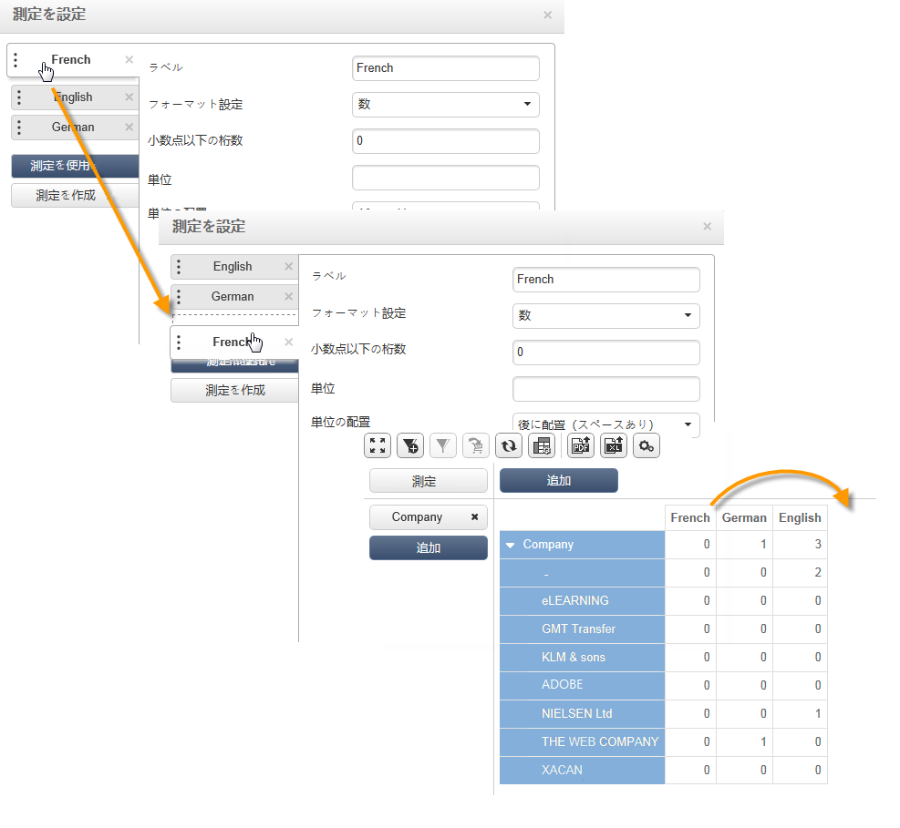

### ディスプレイの設定 {#configuring-the-display}

測定、行および列の設定は、測定ごとに個別に実行することも、全部まとめて実行することもできます。特定のアイコンをクリックすると、表示モード選択ウィンドウにアクセスできます。

* 「**[!UICONTROL ピボットテーブルの設定を編集]**」アイコンをクリックして、設定ウィンドウにアクセスします。

   測定のラベルを表示するかどうかを選択できるほか、ラベルのレイアウト（行または列）を設定できます。

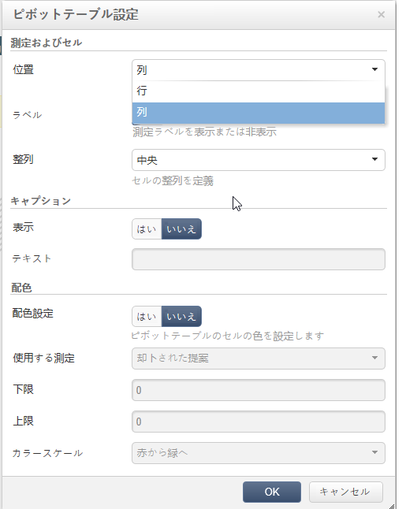

配色オプションでは、重要な値を強調表示して読みやすくすることができます。

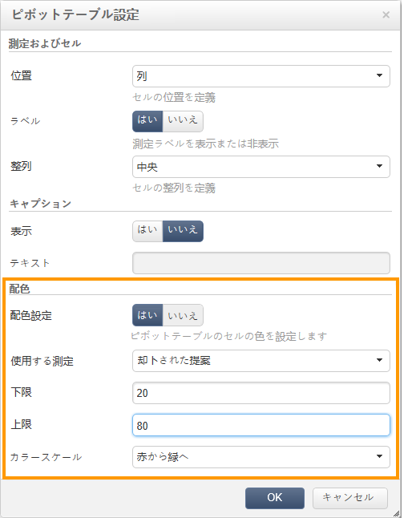

### 表示する測定のタイプの変更 {#changing-the-type-of-measure-displayed}

各測定内で、適用する単位とフォーマット設定を定義できます。

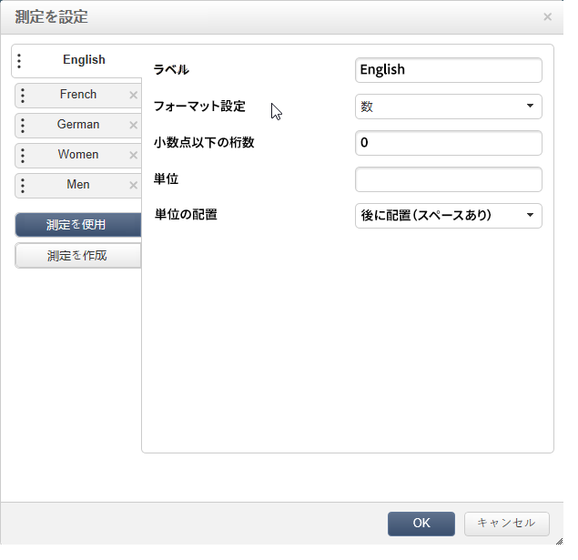

## レポートの共有 {#share-a-report}

レポートを設定したら、それを保存して他のオペレーターと共有できます。

それには、「**[!UICONTROL レポートのプロパティを表示]**」アイコンをクリックし、「**[!UICONTROL レポートを共有]**」オプションを有効にします。

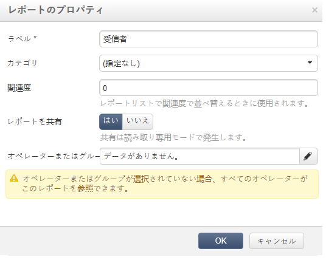

レポートのカテゴリと関連度を指定します。<!--For more on this, refer in [this page](../../reporting/using/configuring-access-to-the-report.md#report-display-context) to the **Display sequence** and **Defining the filtering options** sections.-->

これらの変更を確定するには、レポートを保存する必要があります。

## フィルターの作成 {#create-filters}

データの一部分を表示するためのフィルターを作成できます。

手順は次のとおりです。

1. 「**[!UICONTROL フィルターを追加]**」アイコンをクリックします。

   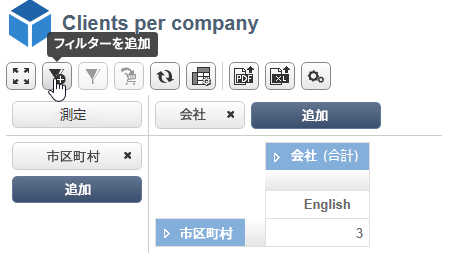

1. フィルターに関係するディメンションを選択します。

1. フィルターのタイプと精度を選択します。

   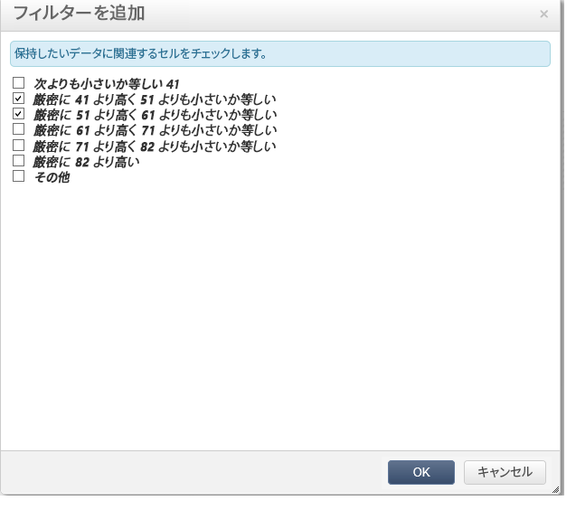

1. 作成したフィルターは、レポートの上に表示されます。

   フィルターをクリックすると、編集できます。「×」アイコンをクリックすると、フィルターを削除できます。

   フィルターを必要な数だけ組み合わせることができます。それらはすべて、このエリアに表示されます。

   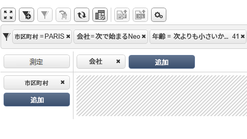

フィルターを変更（追加、削除、編集）するたびに、レポートを再計算する必要があります。

選択した項目に基づいてフィルターを作成することもできます。それには、ソースとなるセル、行および列を選択した後、「**[!UICONTROL フィルターを追加]**」アイコンをクリックします。

行、列またはセルを選択するには、それを左クリックします。選択を解除するには、もう一度クリックします。

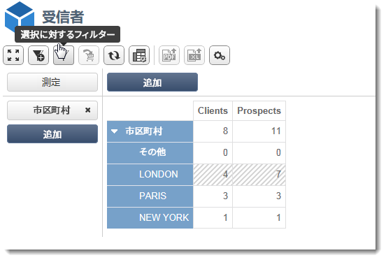

フィルターが自動的に適用され、レポートの上のフィルターゾーンに追加されます。

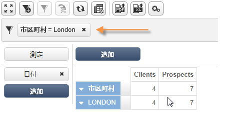
