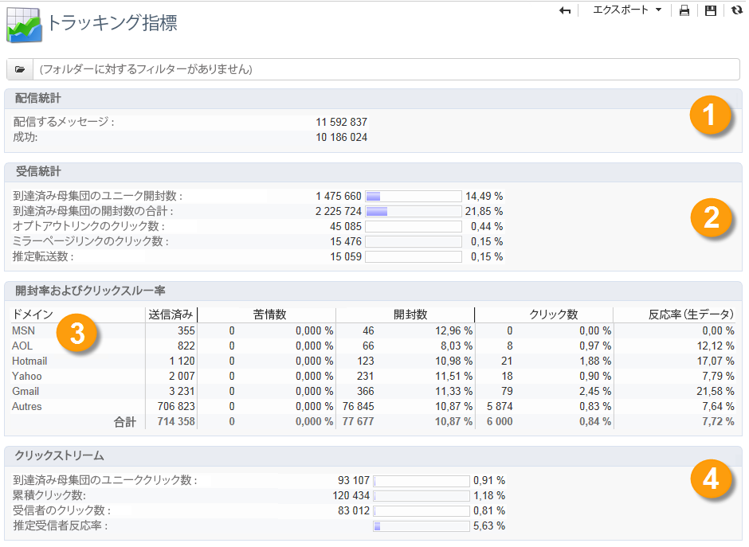

# 配信レポート {#delivery-reports}

配信の概要からアクセスできる様々なレポートを介して、配信の実行をトラッキングできます。

レポートにアクセスするには、次の手順に従います。

1. 「**[!UICONTROL キャンペーン]**」タブを参照し、「**[!UICONTROL 配信]**」リンクをクリックして、配信のリストを表示します。
1. アクセスするレポートの配信名をクリックします。
1. 「**[!UICONTROL 概要]**」タブを選択し、「**[!UICONTROL レポート]**」リンクをクリックして配信に関連するレポートにアクセスします。

   

   デフォルトでは、次のレポートが使用可能です。

   * **[!UICONTROL 配信スループット]**
   * **[!UICONTROL ソーシャルネットワークへの共有]**
   * **[!UICONTROL 共有アクティビティの統計]**
   * **[!UICONTROL ホットクリック]**
   * **[!UICONTROL トラッキング統計]**
   * **[!UICONTROL URL とクリックストリーム]**
   * **[!UICONTROL トラッキング指標]**
   * **[!UICONTROL 配信不能件数とバウンス数]**
   * **[!UICONTROL ユーザーアクティビティ]**
   * **[!UICONTROL 配信の概要]**
   * **[!UICONTROL 購読のトラッキング]**
   * **[!UICONTROL 配信統計]**
   * **[!UICONTROL 開封数の分類]**

## トラッキング指標 {#tracking-indicators}

このレポートは、配信を受信したときの受信者の行動をトラッキングするための主要な指標を組み合わせています。配信統計と受信統計、開封率とクリックスルー率、生成されたクリックストリーム、Web トラッキングだけでなく、ソーシャルネットワークへの共有アクティビティにもアクセスできます。

>[!NOTE]
>
>メッセージの開封数に基づいて計算される値は、テキスト形式の E メールに関する誤差があるので、常に推定値です。「**[!UICONTROL 到達済み母集団のユニーク開封数／到達済み母集団の開封数の合計]**」の指標は、この誤差を考慮したものになっています。[詳細情報](metrics-calculation.md#tracking-opens-)。

**[!UICONTROL 1.配信統計]**

* **[!UICONTROL 配信メッセージ]**：配信の分析後に配信されるメッセージの合計数。
* **[!UICONTROL 成功]**：正常に処理されたメッセージ数。

**[!UICONTROL 2.受信統計]**

>[!NOTE]
>
>関連する割合は、正常に転送されたメッセージの数に基づいて計算されます。

* **[!UICONTROL 到達済み母集団のユニーク開封数]**：メッセージを少なくとも 1 回開封したターゲット受信者数の推定値。リンクをクリックするにはメールを開く必要があるので、トラッキングされる URL でのクリック数が考慮されます。
* **[!UICONTROL 到達済み母集団の開封数の合計]**：ターゲット受信者による開封数の合計の推定値。
* **[!UICONTROL オプトアウトリンクのクリック数]**：購読解除リンクのクリック数。
* **[!UICONTROL ミラーページリンクのクリック数]**：ミラーページへのリンクでのクリック数。考慮されるようにするには、リンクは配信ウィザード（トラッキングされる URL）と同じように定義する必要があります。<!--Refer to this [page](../../delivery/using/about-delivery-monitoring.md).-->
* **[!UICONTROL 推定転送数]**：ターゲット受信者によって転送される E メール数の推定値。この値は、ユニークユーザーの数と E メールをクリックしたユニーク受信者の数を引くことによって計算されます。

   >[!NOTE]
   >
   >ユニークユーザーとターゲット受信者の違いについて詳しくは、[ターゲットユーザー／ターゲット受信者](metrics-calculation.md#targeted-persons---recipients)を参照してください。

**[!UICONTROL 3.開封率およびクリックスルー率]**

この値のテーブルは、インターネットドメインごとの配信、開封数、クリック数および反応率（生データ）を示しています。次の指標が使用されています。

* **[!UICONTROL 送信済み]**：このドメインで送信されたメッセージの合計数。
* **[!UICONTROL 苦情数]**：受信者によって望ましくないとレポートされた、このドメインのメッセージ数。この率は、このドメインでの送信メッセージの合計数に基づいて計算されます。
* **[!UICONTROL 開封数]**：メッセージを少なくとも 1 回開封した、このドメインのユニークターゲット受信者の数。この率は、このドメインでの送信メッセージの合計数に基づいて計算されます。
* **[!UICONTROL クリック数]**：同じ配信で少なくとも 1 回クリックしたユニークターゲット受信者の数。この率は、このドメインでの送信メッセージの合計数に基づいて計算されます。
* **[!UICONTROL 反応率（生データ）]**：配信を少なくとも 1 回開封した受信者数に対する、配信で少なくとも 1 回クリックした受信者数の割合。

>[!NOTE]
>
>このレポートに表示されるドメイン名は、キューブレベルで使用される定義済みリストで定義されます。デフォルトのドメインの変更、追加、削除をおこなうには、「**[!UICONTROL ドメイン]**」定義済みリストを編集し、値とエイリアスを修正します。「**[!UICONTROL その他]**」のカテゴリには、定義済みリストのどの値にも属さないドメイン名が含まれます。
>
>で列挙にアクセスして設定する方法を説明します。 [Campaign Classicv7 ドキュメント](https://experienceleague.adobe.com/docs/campaign-classic/using/getting-started/administration-basics/managing-enumerations.html?lang=ja){target="_blank"}.

**[!UICONTROL 4.クリックストリーム]**

>[!NOTE]
>
>関連する割合は、正常に転送されたメッセージの数に基づいて計算されます。

* **[!UICONTROL 到達済み母集団のユニーククリック数]**：配信で少なくとも 1 回クリックしたユニークユーザーの数。
* **[!UICONTROL 累積クリック数]**：ターゲット受信者によるクリック総数（購読解除リンクおよびミラーページを除く）。
* **[!UICONTROL 受信者のクリック数]**：同じ配信で少なくとも 1 回クリックしたユニークターゲット受信者の数。
* **[!UICONTROL 推定受信者反応率]**：配信を少なくとも 1 回開封した推定受信者数に対する、配信で少なくとも 1 回クリックした受信者数の割合。オプトアウトリンクおよびミラーページリンクでのクリック数は考慮されません。
<!--
**[!UICONTROL 5. Web tracking]**

* **[!UICONTROL Visited pages]** : Number of web pages visited following message reception.
* **[!UICONTROL Transactions]** : Number of purchases following message reception.
* **[!UICONTROL Total amount]** : Total amount of purchases following message reception. 
* **[!UICONTROL Average transaction amount]** : Average purchase made by distinct delivery recipients. 
* **[!UICONTROL Articles]** : Number of articles purchased by the delivery recipients. 
* **[!UICONTROL Average count of articles per transaction]** : Average number of items per purchase made by distinct recipients.
* **[!UICONTROL Average amount per message]** : Average amount of purchases generated per message.

  >[!NOTE]
  >
  >In order for a visited page, transaction, amount or article to be taken into account, a webtracking tag must be inserted into the matching web page. Webtracking configuration is presented in [this section](../../configuration/using/about-web-tracking.md).

**[!UICONTROL 6. Sharing activities to email and social networks]**

This section shows the number of messages shared on each social network. For more on this, refer to [Sharing to social networks](../../reporting/using/global-reports.md#sharing-to-social-networks).

## URLs and click streams {#urls-and-click-streams}

This report shows the list of pages visited following a delivery. 

You can configure the contents of this report by selecting: the score chart to be displayed, the time filter (since the action launch, over the first 6 hours following launch, etc.) and the data display mode (by label, by URL, by category. Click **[!UICONTROL Refresh]** to confirm your selection.

The following rates are displayed in the upper section of the report:

* **[!UICONTROL Reactivity]** : Ratio of the number of targeted recipients having clicked in a delivery, in relation to the estimated number of targeted recipients having opened a delivery. Clicks on the opt-out link and on the mirror page are not taken into account.

  >[!NOTE]
  >
  >For more information on tracking opens, refer to [this section](metrics-calculation.md#tracking-opens-).

* **[!UICONTROL Distinct clicks]** : Number of distinct people having clicked at least once (excluding unsubscription link and mirror page) in a delivery. The rate displayed is calculated based on the number of messages delivered successfully. 
* **[!UICONTROL Cumulated clicks]** : Total number of clicks by targeted recipients (excluding unsubscription link and mirror page). The rate displayed is calculated based on the number of messages forwarded successfully.

**[!UICONTROL Platform average]** : This average rate, displayed under each rate (reactivity, distinct clicks, and cumulated clicks), is calculated for deliveries sent over the previous six months. Only deliveries with the same typology and on the same channel are taken into account. Proofs are excluded.

The central table provides the following information:

* **[!UICONTROL Clicks]** : Number of cumulated clicks, per link. 
* **[!UICONTROL Clicks (in %)]** : Breakdown of the number of clicks per link, in relation to the total number of cumulated clicks.

**[!UICONTROL Breakdown of clicks in time]**

This chart shows the breakdown of cumulated clicks per day.
-->

## 配信の概要 {#delivery-summary}

このレポートは、配信に関するすべての主要な情報を表示します。

**[!UICONTROL ターゲット母集団]**

このセクションには、2 つの指標があります。

* **[!UICONTROL 初期母集団]**：配信アクションの対象となる受信者の合計数。
* **[!UICONTROL 除外ルールによって却下されたメッセージ]**：タイポロジルール（アドレスが不明、強制隔離された、ブロックリストに登録されているなど）を適用する際、分析中に無視されたアドレスの数。<!--For more information on typology rules, refer to this [page](../../delivery/using/steps-validating-the-delivery.md#validation-process-with-typologies).-->

**[!UICONTROL 除外の理由]**

中央のグラフは、分析中に却下されたメッセージのルールごとの分類を示しています。

**[!UICONTROL 配信統計]**

このセクションには、次の指標が含まれます。

* **[!UICONTROL 配信されるメッセージ]**：配信の分析後に配信されるメッセージの合計数。
* **[!UICONTROL 成功]**：正常に処理されたメッセージ数。付随している率は、配信されるメッセージ数の割合です。
* **[!UICONTROL エラー]**：配信と自動リバウンド処理の間に累積したエラーの合計数。付随している率は、配信されるメッセージ数の割合です。
* **[!UICONTROL 新しい強制隔離]**：配信の失敗後（不明なユーザー、無効なドメイン）、強制隔離されたアドレスの数。付随している率は、配信されるメッセージ数の割合です。

## ホットクリック {#hot-clicks}

このレポートは、各リンクでのメッセージのコンテンツ（HTML および／またはテキスト）を、リンクでのクリック率と共に表示します。パーソナライゼーションブロックの購読解除リンク、ミラーページリンクおよびオファーリンクは、累積クリック数の合計では考慮されますが、レポートには表示されません。

>[!NOTE]
>
>配信にオファー（インタラクション）が含まれる場合は、オファーでのクリック率を表示するレポートの上の部分にボックスが表示されます。

## トラッキング統計 {#tracking-statistics}

このレポートは、開封数、クリック数およびトランザクションの統計を表示します。

これにより、配信の市場への影響をトラッキングできます。期間（1 時間、3 時間または 24 時間表示など）を変更することで、値の表示方法を設定できます。「**[!UICONTROL 更新]**」をクリックして選択内容を確定します。

このレポートは、値のテーブルと、配信が最大効率に到達するのに必要な時間を表示するパレート図を表示します。次の指標が使用されています。

* **[!UICONTROL 開封数]**：開封されたメッセージの合計数の割合に到達するのに必要な推定時間。テキスト形式の E メールは考慮されません。[詳細情報](metrics-calculation.md#tracking-opens-)。
* **[!UICONTROL クリック数]**：記録されたクリック総数の割合に到達するのに必要な推定時間。オプトアウトリンクおよびミラーページでのクリック数は考慮されません。
<!--
* **[!UICONTROL Transactions]** : Time required to achieve a percentage of the total number of transactions following message reception. In order for a transaction to be taken into account, a transaction type webtracking tag must be inserted into the matching web page. Webtracking configuration is presented in [this section](../../configuration/using/about-web-tracking.md).
-->

## 累積レポート {#cumulated-reports}

配信に関する累積レポートを表示できます。そのためには、比較する配信を選択してこれらの配信のレポートのリストを取得します。

リストから連続しない配信を選択するには、Ctrl キーを押したまま選択をおこないます。

異なるフォルダーに保存された配信を選択するには、「**[!UICONTROL サブレベルを表示]**」アイコン（ツールバーでアクセス可能）をクリックします。これで同じリストに表示されるようになります。
