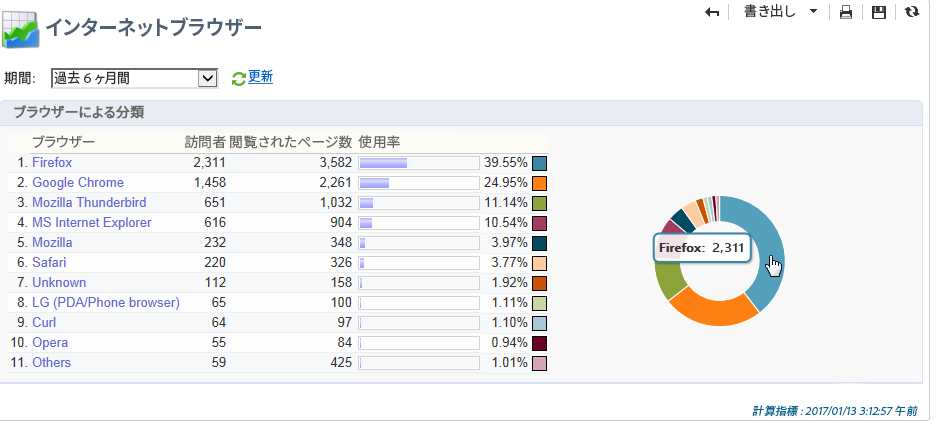

# グローバルレポート {#global-reports}

これらのレポートは、データベース全体のデータのアクティビティを基に生成されています。レポートダッシュボードを表示するには、「**[!UICONTROL レポート]**」タブに移動します。

レポートを表示するには、その名前をクリックします。次のレポートはデフォルトで使用可能です。

>[!NOTE]
>
>この節では、配信にリンクされたレポートのみを表示しています。

* **[!UICONTROL 配信スループット]**：[配信スループット](#delivery-throughput)を参照してください。
* **[!UICONTROL ブラウザー]**：[ブラウザー](#browsers)を参照してください。
* **[!UICONTROL ソーシャルネットワークへの共有]**：[ソーシャルネットワークへの共有](#sharing-to-social-networks)を参照してください。
* **[!UICONTROL 共有アクティビティの統計]**：[共有アクティビティの統計](#statistics-on-sharing-activities)を参照してください。
* **[!UICONTROL オペレーティングシステム]**：[オペレーティングシステム](#operating-systems)を参照してください。
* **[!UICONTROL URL とクリックストリーム]**：[URL とクリックストリーム](delivery-reports.md#urls-and-click-streams)を参照してください。
* **[!UICONTROL トラッキング指標]**：[トラッキング指標](delivery-reports.md#tracking-indicators)を参照してください。
* **[!UICONTROL 配信不能件数とバウンス数]**：[配信不能件数とバウンス数](#non-deliverables-and-bounces)を参照してください。
* **[!UICONTROL ユーザーアクティビティ]**：[ユーザーアクティビティ](#user-activities)を参照してください。
* **[!UICONTROL 購読のトラッキング]**：[購読のトラッキング](#subscription-tracking)を参照してください。
* **[!UICONTROL 配信の概要]**：[配信の概要](delivery-reports.md#delivery-summary)を参照してください。
* **[!UICONTROL 配信統計]**：[配信統計](#delivery-statistics)を参照してください。
* **[!UICONTROL 開封数の分類]**：[開封数の分類](#breakdown-of-opens)を参照してください。

## 配信スループット {#delivery-throughput}

このレポートには、一定期間のプラットフォーム全体の配信スループットに関する情報が含まれます。メッセージが配信される速度を測定するには、1 時間に送信されたメッセージの数とメッセージのサイズ（bps）が基準になります。次の例では、最初のグラフに正常な配信を青で、誤った配信をオレンジで示しています。

期間（1 時間表示、3 時間表示または 24 時間表示など）を変更することで、表示される値を設定できます。「**[!UICONTROL 更新]**」をクリックして選択内容を確定します。

>[!NOTE]
>
>また、1 時間に送信された配信数を [Campaign コントロールパネル](https://experienceleague.adobe.com/docs/control-panel/using/sftp-management/sftp-storage-management.html?lang=ja).
>
>コントロールパネルは、すべての管理者ユーザーがアクセスできます。 ユーザーに管理者アクセス権を付与する手順については、[このページ](https://experienceleague.adobe.com/docs/control-panel/using/discover-control-panel/managing-permissions.html?lang=ja#discover-control-panel)で詳しく説明しています。

## ユーザーアクティビティ {#user-activities}

このレポートは、30 分、1 時間または 1 日あたりの開封数、クリック数およびトランザクション数の分類をグラフ形式で表示します。

次のオプションを使用できます。

* **[!UICONTROL 開封数]**：開封されたメッセージの合計数。テキスト形式の E メールは考慮されません。[詳細情報](metrics-calculation.md#tracking-opens-)。
* **[!UICONTROL クリック数]**：配信におけるリンクの合計クリック数。購読解除のリンクおよびミラーページでのクリック数は考慮されません。
<!--
* **[!UICONTROL Transactions]** : Total number of transactions after a message is received. In order for a transaction to be taken into account, a transaction type webtracking tag must be inserted into the matching web page. Webtracking configuration is presented in [this section](../../configuration/using/about-web-tracking.md).
-->

## 配信不能件数とバウンス数 {#non-deliverables-and-bounces}

このレポートは、配信不能件数の分類だけでなく、インターネットドメインごとのバウンス数の分類についても表示します。

「**[!UICONTROL 処理されたメッセージ数]**」には、配信サーバーによって処理されたメッセージの合計数が表示されます。この値は、一部の配信が（サーバーによって処理される前に）停止されるか一時停止されると、配信されるメッセージ数よりも小さくなります。

**[!UICONTROL タイプ別のエラーの分類]**

>[!NOTE]
>
>このレポートに表示されるエラーにより、強制隔離プロセスが実行されることになります。強制隔離の管理について詳しくは、[強制隔離管理](../send/quarantines.md)を参照してください。

このレポートの最初のセクションには、配信不能件数の分類が値のテーブルとグラフの形式で表示されます。

それぞれのエラータイプには、次の内容が含まれます。

* このタイプのエラーメッセージの数。
* エラーを含むメッセージの合計数に対する、このタイプのエラーを含むメッセージの割合。
* 処理されたメッセージの合計数に対する、このタイプのエラーメッセージの割合。

次の指標が使用されています。

* **[!UICONTROL 不明なユーザー]**：E メールアドレスが無効であることを示すエラータイプで、配信中に生成される。
* **[!UICONTROL 無効なドメイン]**：E メールアドレスが正しくないか存在しないことを示すエラータイプで、配信の送信中に生成される。
* **[!UICONTROL メールボックス容量超過]**：受信者の受信ボックスにあるメッセージの数が多すぎることを示すエラータイプで、5 回の配信の試行後に生成される。
* **[!UICONTROL 無効なアカウント]**：アドレスが存在しないことを示すエラータイプで、配信の送信中に生成される。
* **[!UICONTROL 却下]**：アドレスが IAP（インターネットアクセスプロバイダー）によって却下される場合に生成されるエラータイプ。例えば、セキュリティルールのアプリケーション（スパム対策ソフトウェア）によって却下されるなどがある。
* **[!UICONTROL 未到達]**：SMTP リレーでのインシデント、ドメインへの一時的な未到達など、メッセージ配分文字列で発生するエラータイプ。
* **[!UICONTROL 未接続]**：受信者の携帯電話の電源が入っていない、または送信時にネットワーク接続が切断されていることを示すエラータイプ。

   >[!NOTE]
   >
   >この指標は、 [モバイルチャネル](../send/send.md) のみ。

   `[+]` 記号をクリックすると、値テーブルの各行を開くことができます。それぞれのエラータイプについて、ドメインごとにエラーメッセージの分類を表示できます。

**[!UICONTROL ドメインごとのエラーの分類]**

このレポートの 2 つ目のセクションには、インターネットドメインごとのエラーの分類が値のテーブルとグラフの形式で表示されます。

それぞれのドメイン名には、次の内容が含まれます。

* このドメインでエラーを含むメッセージの数。
* このドメインで処理されたメッセージの合計数に対する、このドメインでエラーを含むメッセージの割合。
* エラーメッセージの合計数に対する、このドメインでのエラーメッセージの割合。

[+] 記号をクリックすると、値テーブルの各行を開くことができます。それぞれのドメインタイプについて、エラータイプごとにエラーメッセージの分類を表示できます。

>[!NOTE]
>
>このレポートに表示されるドメイン名は、キューブレベルで定義されます。これらの値を変更するには、「**[!UICONTROL 配信ログ（broadlogrcp）]**」キューブを編集します。詳しくは、[この節](gs-cubes.md)を参照してください。「**[!UICONTROL その他]**」のカテゴリには、特定のクラスに属さないドメイン名が含まれます。

## ブラウザー {#browsers}

このレポートは、該当する期間中、配信の受信者によって使用されるインターネットブラウザーの分類を表示します。

>[!NOTE]
>
>このレポートに表示される値は推定値であり、配信でクリックした受信者のみが考慮されます。

**グローバル統計**

ブラウザー使用のグローバル統計は、値のテーブルとグラフの形式で表示されます。

次の指標が使用されています。

* **[!UICONTROL 訪問者]**：（インターネットブラウザーごとに）ターゲットに設定され、配信で少なくとも 1 回クリックした受信者の合計数。
* **[!UICONTROL 閲覧されたページ数]**：すべての配信に対する、（インターネットブラウザーごとの）配信におけるリンクの合計クリック数。
* **[!UICONTROL 使用率]**：この率は、訪問者の合計数に関する、（インターネットブラウザーごとの）訪問者の分類を示しています。

**ブラウザーごとの統計**

グローバル統計の値のテーブルで、各ブラウザー名をクリックすると、使用統計を表示できます。

統計は曲線、グラフおよび値のテーブルの形式で表示されます。

「**[!UICONTROL 履歴]**」の曲線は、このブラウザーの 1 日あたりの稼動率を示しています。この率は、最も高い稼動率が測定された日の訪問者数に対する、（このブラウザーでの）1 日あたりの訪問者数の割合です。

「**[!UICONTROL バージョンによる分類]**」のグラフは、（このブラウザーでの）訪問者の合計数に対する、バージョンごとの訪問者の分類を示しています。

値のテーブルでは、次の指標が使用されています。

* **[!UICONTROL グローバルレート]**：この率は、（すべてのブラウザーでの）訪問者の合計数に対する、バージョンごとの訪問者の分類を示しています。
* **[!UICONTROL 相対的比率]**：この率は、（このブラウザーでの）訪問者の合計数に対する、バージョンごとの訪問者の分類を示しています。

<!--
### Sharing to social networks {#sharing-to-social-networks}

Viral marketing lets delivery recipients share information with their contact network: they can add a link to their profile (Facebook, Twitter, etc.) or send a message to a friend. Each share and each access to shared information is tracked within the delivery. For more information on viral marketing, refer to [this section](../../delivery/using/viral-and-social-marketing.md).

This report shows the breakdown of shared and opened messages per social network (Facebook, Twitter, etc.) and/or per email.

**[!UICONTROL Email delivery statistics]**

In the email delivery statistics, two values are displayed:

* **[!UICONTROL Number of messages to be delivered]** : Total number of messages processed during delivery analysis.
* **[!UICONTROL Number of successful deliveries]** : Number of messages processed successfully.

**[!UICONTROL Sharing activities and mail open statistics]**

The central table shows the statistics on email shares and opens.

In the **[!UICONTROL Shares]** column, we have the following indicators:

* **[!UICONTROL No. of sharing activities]** : Total number of messages shared on each social network. This value equals the total number of clicks on the icon of the matching **[!UICONTROL Links for sharing to social networks]** personalization block.
* **[!UICONTROL Breakdown]** : This rate represents the breakdown of shares per social network, in relation to the total number of shares.
* **[!UICONTROL Sharing rate]** : This rate represents the breakdown of shares per social network, in relation to the number of messages to be delivered.

In the **[!UICONTROL Opens]** column, we have the following indicators:

* **[!UICONTROL No. of opens]** : Total number of messages opened by people whom the message was forwarded to (via the **[!UICONTROL Links for sharing to social networks]** personalization block). This value equals the number of times the mirror page was displayed. Opens by delivery recipients are not taken into account.
* **[!UICONTROL Breakdown]** : This rate represents the breakdown of opens per social network, in relation to the total number of opens.
* **[!UICONTROL Rate of opens]** : This rate represents the breakdown of opens per social network, in relation to the total number of shares.

**[!UICONTROL Breakdown of sharing activities and opens]**

This section includes two charts which represent the breakdown of sharing activities and opens per social network.

## Statistics on sharing activities {#statistics-on-sharing-activities}

This report shows the evolution of shares to social media in time.

For more information on viral marketing, refer to [this section](../../delivery/using/viral-and-social-marketing.md).

Statistics are presented in the form of a table of values and a chart.

The following indicators are used:

* **[!UICONTROL New contacts]** : Number of new subscriptions following the reception of a message shared via email. This value matches the number of people who received a message shared via email, clicked the **[!UICONTROL Subscription link]** and filled in the subscription form. 
* **[!UICONTROL Opens]** : Total number of messages opened by people whom the message was transferred to (via the **[!UICONTROL Link for sharing to social networks]** personalization block). This value equals the number of times the mirror page was displayed. Opens by delivery recipients are not taken into account.
* **[!UICONTROL Sharing activities]** : Total number of messages shared via social networks. This value matches the total number of clicks on the icon of the **[!UICONTROL Links for sharing to social networks]** personalization block.
-->

## オペレーティングシステム {#operating-systems}

このレポートは、該当する期間中、配信の受信者によって使用されるオペレーティングシステムの分類を表示します。

>[!NOTE]
>
>このレポートに表示される値は推定値であり、配信でクリックした受信者のみが考慮されます。

**グローバル統計**

オペレーティングシステムのグローバル使用統計は、値のテーブルとグラフの形式で表示されます。

次の指標が使用されています。

* **[!UICONTROL 訪問者]**：配信で少なくとも 1 回クリックした（オペレーティングシステムごとの）ターゲット受信者の合計数の日平均。
* **[!UICONTROL 閲覧されたページ数]**：すべての配信に対する、（オペレーティングシステムごとの）配信リンクでのクリック総数の日平均。
* **[!UICONTROL 使用率]**：この率は、訪問者の合計数に関する、（オペレーティングシステムごとの）訪問者の分類を示しています。

**オペレーティングシステムごとの統計**

グローバル統計の値のテーブルで、各オペレーティングシステムの名前をクリックすると、オペレーティングシステムごとの統計を表示できます。

統計は曲線、グラフおよび値のテーブルの形式で表示されます。

「**[!UICONTROL 履歴]**」の曲線は、このオペレーティングシステムの 1 日あたりの使用率を示しています。この率は、最も高い稼動率が測定された日の訪問者数に関する、（このオペレーティングシステムでの）1 日あたりの訪問者数の割合です。

「**[!UICONTROL バージョンによる分類]**」のグラフは、このオペレーティングシステムでの訪問者の合計数に関する、バージョンごとの訪問者の分類を示しています。

値のテーブルでは、次の指標が使用されています。

* **[!UICONTROL グローバルレート]**：この率は、オペレーティングシステム全体での訪問者の合計数に関する、（バージョンごとの）訪問者の分類を示しています。
* **[!UICONTROL 相対的比率]**：この率は、このオペレーティングシステムでの訪問者の合計数に関する、（バージョンごとの）訪問者の分類を示しています。

## 購読のトラッキング {#subscription-tracking}

このレポートでは、情報サービスの購読を監視できます。購読および購読解除について表示されます。

ホームページまたはエクスプローラーの&#x200B;**[!UICONTROL プロファイルとターゲット／サービスと購読]**&#x200B;ノードをクリックすると、購読を表示することができます。目的の購読を選択して、「**[!UICONTROL レポート]**」タブをクリックします。**[!UICONTROL 購読のトラッキング]**レポートはデフォルトで使用可能です。サブスクリプションおよびサブスクリプション解除のトレンドと、一定期間のロイヤルティ率を確認できます。
ドロップダウンリストでこのデータの表示を設定できます。「**[!UICONTROL 更新]**」をクリックして、選択した設定を有効にしてください。

詳しくは、[このページ](../start/subscriptions.md)を参照してください。

「**[!UICONTROL これまでの購読数]**」は、現在購読しているユーザーの合計数を示しています。

**[!UICONTROL 購読の全体的な動き]**

値のテーブルでは、次の指標が使用されています。

* **[!UICONTROL 購読者]**：該当する期間中の購読者の合計数。
* **[!UICONTROL 購読]**：該当する期間中の購読数。
* **[!UICONTROL 購読解除]**：該当する期間中の購読解除数。
* **[!UICONTROL 変化]**：購読解除数から購読数を引いた数。この率は、購読者の合計数に基づいて計算されます。
* **[!UICONTROL ロイヤルティ]**：該当期間のサブスクライバーのロイヤルティ率。

**[!UICONTROL 購読変化曲線]**

このグラフは、該当する期間中の、購読と購読解除の推移を示しています。

## 配信統計 {#delivery-statistics}

このレポートは、処理されて送信されたすべてのメッセージのハードバウンスやソフトバウンス、開封数、クリック数、購読解除数をインターネットドメインごとに分類表示します。

次の指標が使用されています。

* **[!UICONTROL 処理済みの E メール]**：配信サーバーによって処理されたメッセージの合計数。
* **[!UICONTROL 配信済み]**：処理されたメッセージの合計数に対する、正常に処理されたメッセージ数の割合。
* **[!UICONTROL ハードバウンス]**：処理されたメッセージの合計数に対する、ハードバウンス数の割合。
* **[!UICONTROL ソフトバウンス]**：処理されたメッセージの合計数に対する、ソフトバウンス数の割合。

   >[!NOTE]
   >
   >ハードバウンスおよびソフトバウンスについて詳しくは、 [このページ](../send/quarantines.md).

* **[!UICONTROL 開封数]**：正常に処理されたメッセージ数に対する、メッセージを少なくとも 1 回開封したターゲット受信者数の割合。
* **[!UICONTROL クリック数]**：正常に処理されたメッセージ数に対する、配信で少なくとも 1 回クリックしたユーザー数の割合。
* **[!UICONTROL 購読解除]**：正常に処理されたメッセージ数に対する、購読解除リンクでのクリック数の割合。

## 開封数の分類 {#breakdown-of-opens}

このレポートは、該当する期間中の、オペレーティングシステム、デバイスおよびブラウザーごとの開封の分類を表示します。それぞれのカテゴリで、2 つのグラフが使用されます。最初のグラフは、コンピューターおよびモバイルデバイスでの開封数に関する統計を示しています。2 つ目のグラフはモバイルデバイスでの開封数のみに関する統計を示しています。

開封数は、開封されたメッセージの合計数に対応しています。テキスト形式の E メールはカウントされません。開封数のトラッキングについて詳しくは、 [この節](metrics-calculation.md#tracking-opens-).

>[!NOTE]
>
>ブラウザーとオペレーティングシステムの名前は、メッセージが開封されたブラウザーのユーザーエージェントによって送信される情報に含まれています。Adobe Campaign は、そのデバイス情報を使用してデバイスのタイプを推測します。
