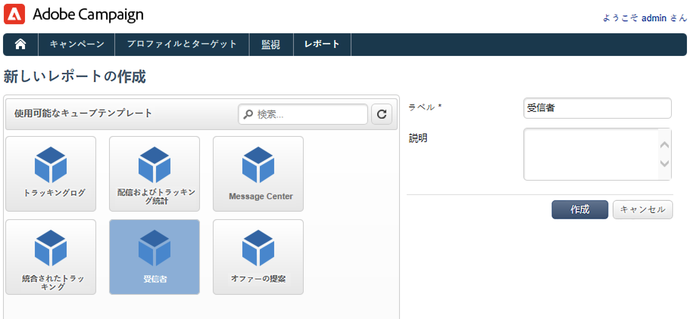
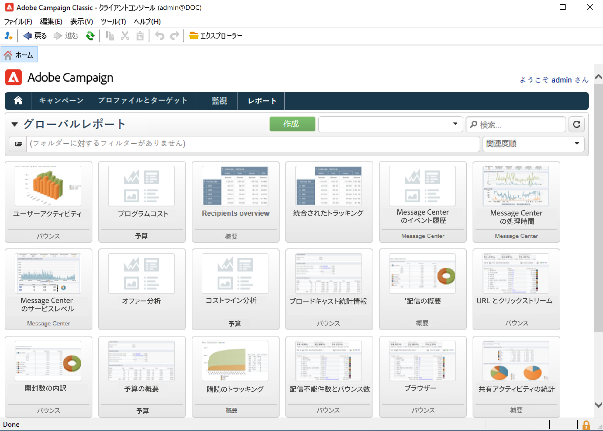
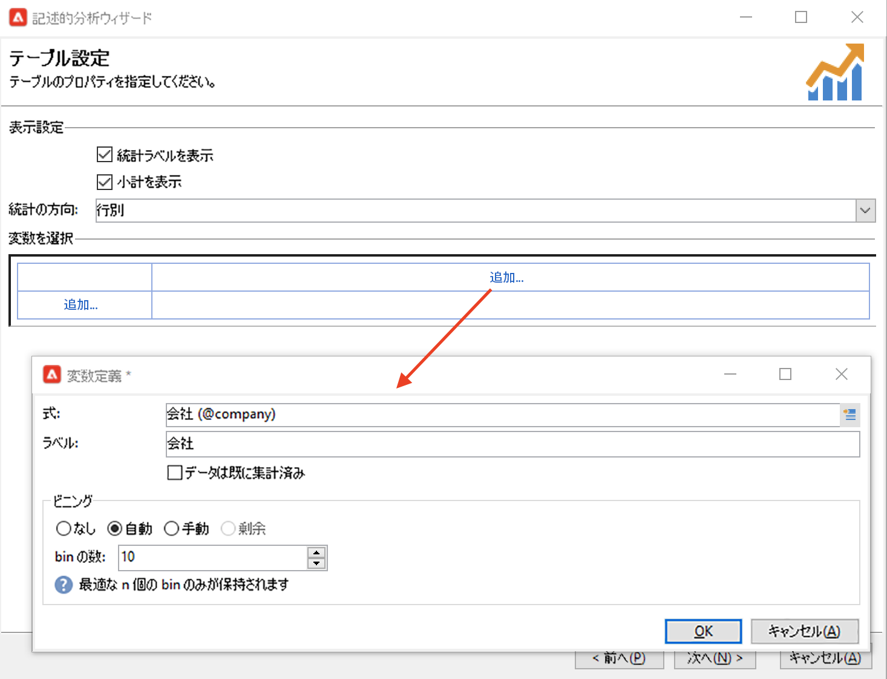

# レポートの概要{#gs-ac-reports}

Adobe Campaign では、このページにリストされている一連のレポートツールを提供しています。

* **キューブ**

   Adobe Campaignには、動的なレポートを作成するための直感的なデータ調査ツールが付属しています。

   マーケティング分析機能を使用して、データの分析と測定、統計の計算、レポートの作成と計算のシンプル化と最適化をおこないます。 レポートを作成し、ターゲット母集団を作成して、リストに保存できます。リストは、Adobe Campaignでターゲティングやセグメント化のタスクに使用できます。

   

   これらのレポートで分析するデータは、クエリ、計算、量などの複雑さに応じて、クエリで収集したり、リスト（データ管理タイプのワークフロー）やキューブ（Marketing Analytics を使用）で事前に集計したりすることができます。データは、ピボットテーブルやグループリストの形式で表示されます。

   詳しくは、[この節](gs-cubes.md)を参照してください。

* **ビルトインレポート**

   Adobe Campaign には、配信、キャンペーン、プラットフォームアクティビティ、オプション機能などに関するレポートが付属しています。これらのレポートは、関連する様々な機能を通じて使用できます。具体的なニーズに合わせてレポートをカスタマイズすることもできます。

   これらのレポートにアクセスするには、「**レポート**」タブを使用します。

   

   詳しくは、[この節](built-in-reports.md)を参照してください。

* **記述的データ分析**

   Adobe Campaign では、データベース内のデータに関する統計情報を生成できる視覚的なツールを提供しています。専用のアシスタントを使用して記述的な分析レポートを作成し、ニーズに応じてコンテンツやレイアウトをカスタマイズできます。

   **[!UICONTROL ツール／記述的分析...]**&#x200B;メニューを使用して、新しいレポートを作成します。

   

   Campaign の記述的分析レポートは、[Campaign Classic v7 ドキュメント](https://experienceleague.adobe.com/docs/campaign-classic/using/reporting/analyzing-populations/about-descriptive-analysis.html?lang=ja){target=&quot;_blank&quot;}に記載されています。

* **カスタムレポート**

   Adobe Campaign を使用すると、データベース内のデータに関するレポートを作成できます。作成したレポートは、適切なコンテキストで参照できるようになります。

    レポートの作成手順について詳しくは、[Campaign Classic v7 ドキュメント](https://experienceleague.adobe.com/docs/campaign-classic/using/reporting/creating-new-reports/about-reports-creation-in-campaign.html?lang=ja){target=&quot;_blank&quot;}を参照してください。パーソナライズされたレポートの作成は、上級ユーザーがおこないます。
