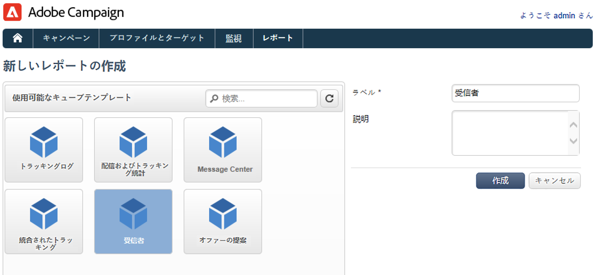
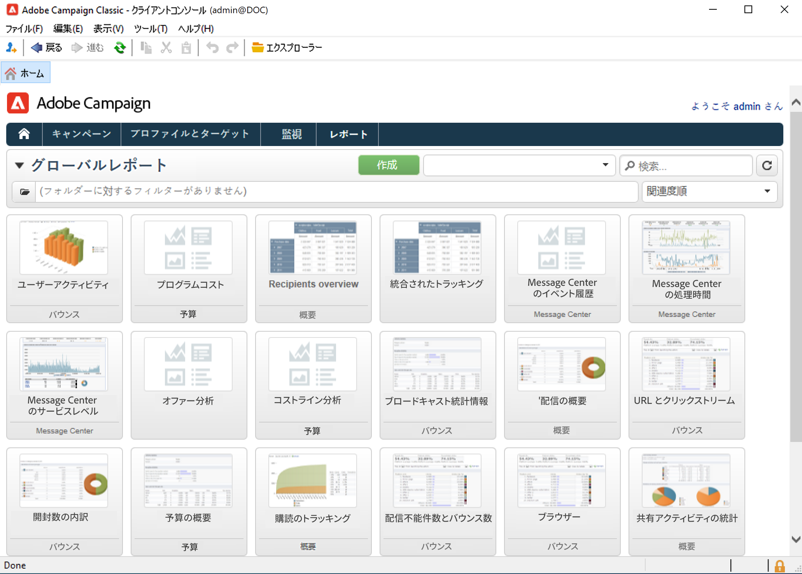
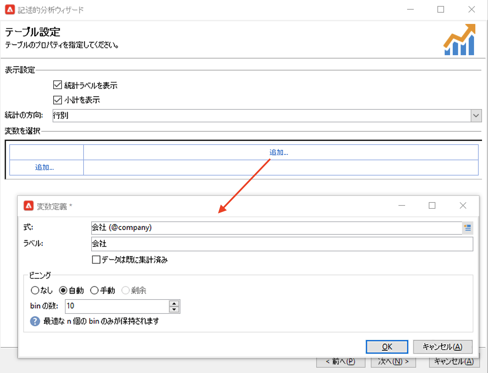

# レポートの概要{#gs-ac-reports}

Adobe Campaign では、このページにリストされている一連のレポートツールを提供しています。

* **動的レポート**

  Adobe Dynamic Reportingは、Campaign Web UIで利用でき、マーケティング活動の影響を測定するための、完全にカスタマイズ可能なリアルタイムのレポートを提供します。 プロファイルデータへのアクセスが追加され、開封数やクリック数などの機能的なメールキャンペーンデータに加えて、性別、市区町村、年齢などのプロファイルディメンション別のデモグラフィック分析が可能になります。 [Web UI v7 ドキュメント ](https://experienceleague.adobe.com/docs/campaign-web/v8/reports/dynamic-reporting/get-started-reporting.html){target="_blank"}を参照してください。

* **キューブ**

  Adobe Campaign には、動的レポートを作成するための直感的なデータ調査ツールが付属しています。

  マーケティング分析機能を使用すると、データの分析と測定、統計の計算、レポートの作成と計算の簡素化および最適化を行うことができます。 レポートを作成し、ターゲット母集団を作成して、リストに保存できます。このリストは、Adobe Campaign でターゲティングやセグメント化のタスクに使用できます。

  

  これらのレポートで分析するデータは、クエリ、計算、量などの複雑さに応じて、クエリで収集したり、リスト（データ管理タイプのワークフロー）やキューブ（Marketing Analytics を使用）で事前に集計したりすることができます。 データはピボットテーブルまたはグループリストの形式で表示されます。

  詳しくは、[この節](gs-cubes.md)を参照してください。

* **ビルトインレポート**

  Adobe Campaignには、配信、キャンペーン、プラットフォームアクティビティ、オプション機能などに関するレポートが付属しています。これらのレポートは、関連するさまざまな機能を通じて利用できます。 具体的なニーズに合わせてレポートをカスタマイズすることもできます。

  これらのレポートにアクセスするには、「**レポート**」タブを使用します。

  

  詳しくは、[この節](built-in-reports.md)を参照してください。

* **記述的データ分析**

  Adobe Campaign では、データベース内のデータに関する統計情報を生成できる視覚的なツールを提供しています。 専用のアシスタントを使用して記述的な分析レポートを作成し、ニーズに応じてコンテンツやレイアウトをカスタマイズできます。

  **[!UICONTROL ツール／記述的分析...]**&#x200B;メニューを使用して、新しいレポートを作成します。

  

  キャンペーン記述分析レポートは、[Campaign Classic v7 ドキュメント ](https://experienceleague.adobe.com/docs/campaign-classic/using/reporting/analyzing-populations/about-descriptive-analysis.html?lang=ja){target="_blank"}に記載されています。

* **カスタムレポート**

  Adobe Campaign を使用すると、データベース内のデータに関するレポートを作成できます。 作成したレポートは、適切なコンテキストで参照できるようになります。

  レポートを作成する手順については、[Campaign Classic v7 ドキュメント ](https://experienceleague.adobe.com/docs/campaign-classic/using/reporting/creating-new-reports/about-reports-creation-in-campaign.html?lang=ja){target="_blank"}を参照してください。 パーソナライズされたレポートの作成は、上級ユーザーが行います。
