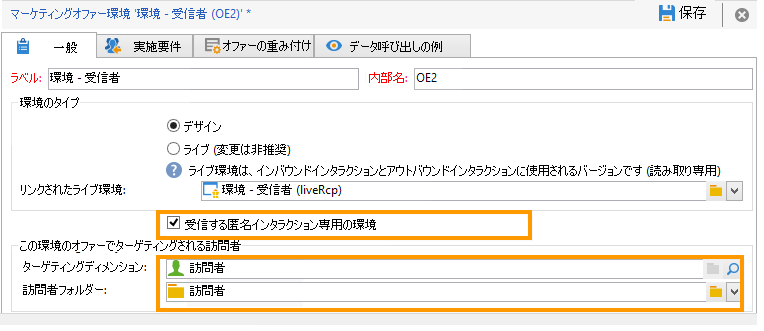
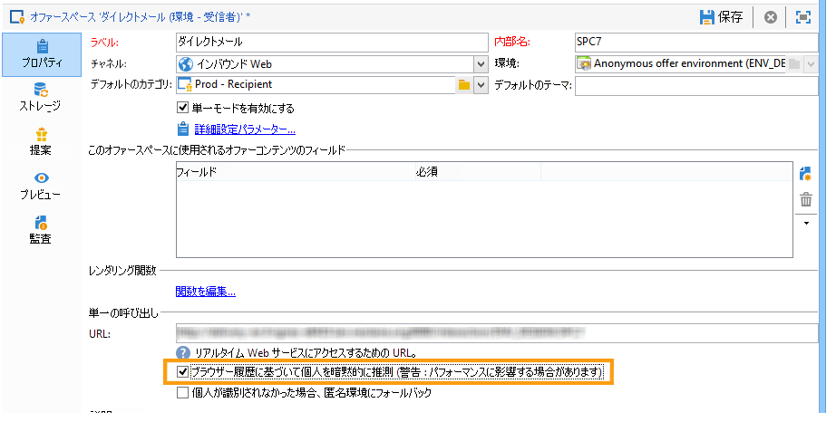
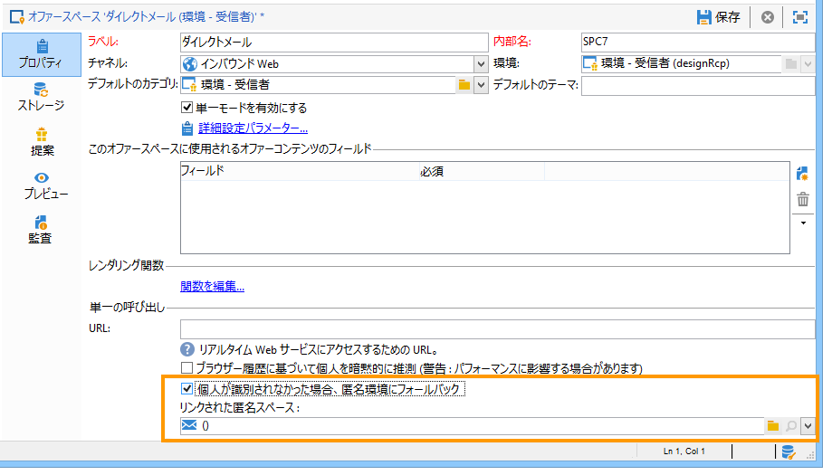

# 匿名のインタラクション{#anonymous-interactions}

## 匿名インタラクション向け環境 {#environment-for-anonymous-interactions}

デフォルトでは、Campaign **インタラクション** モジュールには、組み込みの受信者テーブル（識別されたオファー）をターゲットに設定した事前設定済みの環境が付属しています。 別のテーブル、匿名オファー用の訪問者テーブル、カスタム受信者テーブルなどをターゲットにする必要がある場合、ターゲットマッピングウィザードを使用して環境を作成する必要があります。 [環境の詳細を説明します](interaction-env.md).

マッピング作成ウィザードで匿名環境を作成する場合、環境の「**[!UICONTROL 一般]**」タブにある「**[!UICONTROL 受信する匿名インタラクション専用の環境]**」ボックスが自動的にオンになります。

「**[!UICONTROL ターゲティングディメンション]**」は自動的に入力されます。デフォルトでは、このフィールドは訪問者テーブルにリンクされます。

「**[!UICONTROL 訪問者フォルダー]**」フィールドが表示され、**[!UICONTROL 訪問者]**&#x200B;フォルダーへのリンクが自動的に入力されます。このフィールドでは、訪問者プロファイルを格納する場所を選択できます。

>[!NOTE]
>
>1 つまたは複数のブランドを提供する匿名オファーの場合など、複数のタイプの訪問者にフィルターするには、各ブランドに環境を作成して、各環境用に&#x200B;**[!UICONTROL 訪問者]**&#x200B;タイプのフォルダーを作成する必要があります。

## 匿名インタラクション用のオファーカタログ {#offer-catalog-for-anonymous-interactions}

アウトバウンドインタラクションの場合と同様、インバウンドインタラクションも、カテゴリやオファーで構成されたオファーカタログで管理されます。

カテゴリやスペースを作成するには、識別された訪問者の場合と同じ手順を実行します。 参照： [オファーカテゴリの作成](interaction-offer-catalog.md#creating-offer-categories) および [オファー環境の作成](interaction-env.md#creating-an-offer-environment)) をクリックします。

## 匿名の訪問者 {#anonymous-visitors}

匿名の訪問者が接続する際に、それらの訪問者が Cookie 識別プロセスに送信されることがあります。この暗黙の認識は、訪問者のブラウザーの履歴に基づいています。

この手順では、Cookie から復元されたデータとデータベースのデータの比較がおこなわれます。訪問者が認識される（暗黙的に推測される）場合もあれば、認識されない（したがって匿名のままの）場合もあります。

この分析を実行するには、オファースペースで、「**[!UICONTROL ブラウザー履歴に基づいて個人を暗示的に識別]**」オプションをオンにします。

## 識別されていない匿名訪問者の処理 {#processing-unidentified-anonymous-visitors}

分析の結果、匿名の訪問者が識別されなかった場合、そのデータを所定のスペースに格納できます。これにより、指定したタイポロジルールに合致する、特にこのタイプの訪問者向けのオファーを提案できます。

コンタクト先を識別できる要素がない場合や、暗黙的な推測が可能なコンタクト先に識別済みオファーを提案する意思がない場合は、匿名環境のフォールバックを実行できます。

それには、「**[!UICONTROL 個人が識別されなかった場合、匿名環境にフォールバックします]**」をオンにして、オファースペースを指定する際に、「**[!UICONTROL リンクされた匿名スペース]**」で識別されない訪問者専用の環境を指定します。

