# メールへのファイルの添付{#attaching-files}

## メールの添付ファイルについて {#about-email-attachments}

メール配信には 1 つまたは複数のファイルを添付できます。

>[!NOTE]
>
>パフォーマンスの問題を回避するために、1 つのメールに複数の添付ファイルを含めないことをお勧めします。推奨しきい値は、Campaign オプションのリストから設定できます。[Campaign Classic ドキュメント](https://experienceleague.adobe.com/docs/campaign-classic/using/installing-campaign-classic/appendices/configuring-campaign-options.html?lang=ja#delivery)を参照してください。

次の 2 つの場合が考えられます。

* ファイルを選択し、そのまま配信に添付する。
* 添付ファイルのコンテンツを受信者ごとにパーソナライズする。この場合、**計算済み添付ファイル**&#x200B;を作成する必要があります。添付ファイルの名前は、各メッセージの送信時に、受信者に応じて自動生成されます。また、**Variable Digital Printing** オプションがインストールされている場合は、コンテンツをパーソナライズし、配信時に PDF 形式に変換して添付することもできます。

>[!NOTE]
>
>多くの場合、このタイプの設定は配信テンプレートを使用して実行されます。詳しくは、この[ページ](../send/create-templates.md)を参照してください。

## ガードレール {#attachments-guardrails}

パフォーマンスの問題を回避するために、メールに含める画像のサイズは 100 KB 以下にする必要があります。この制限は、デフォルトで設定されており、`NmsDelivery_MaxDownloadedImageSize` オプションから変更できます。ただし、アドビでは、メール配信で大きな画像を使用しないことを強くお勧めします。

また、アドビでは、添付ファイルのサイズと数を制限することもお勧めします。デフォルトでは、メールに添付ファイルとして追加できるファイルは 1 つだけです。このしきい値は、`NmsDelivery_MaxRecommendedAttachments` オプションから設定できます。

Campaign オプションのリストについて詳しくは、[Campaign Classic ドキュメント](https://experienceleague.adobe.com/docs/campaign-classic/using/installing-campaign-classic/appendices/configuring-campaign-options.html?lang=ja#delivery)を参照してください。

## ローカルファイルの添付 {#attaching-a-local-file}

ローカルファイルを配信に添付するには、以下の手順に従います。

>[!NOTE]
>
>配信には複数個のファイルを添付できます。添付ファイルは、任意のフォーマット（zip 形式を含む）で指定できます。

1. 「**[!UICONTROL 添付ファイル]**」リンクをクリックします。
1. 「**[!UICONTROL 追加]**」ボタンをクリックします。
1. 「**[!UICONTROL ファイル…]**」をクリックして、配信に添付するファイルを選択します。

   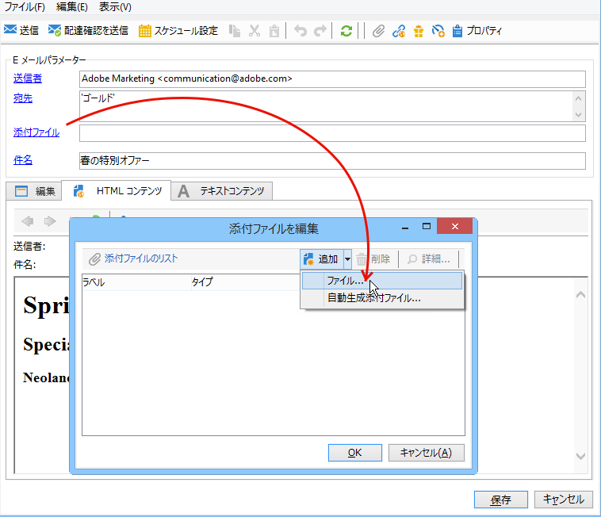

また、配信の「**[!UICONTROL 添付ファイル]**」フィールドにファイルを直接ドラッグ＆ドロップしたり、配信アシスタントのツールバーから&#x200B;**[!UICONTROL 添付]**&#x200B;アイコンを使用したりできます。

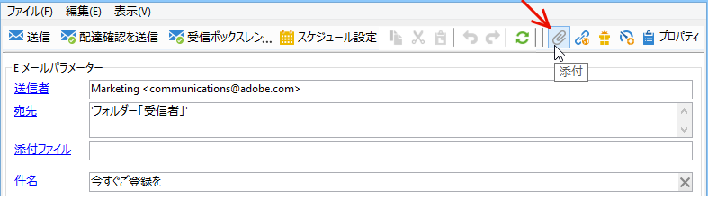

配信の際に利用できるよう、選択したファイルは、ただちにサーバー上へとアップロードされます。「**[!UICONTROL 添付ファイル]**」フィールドに一覧表示されます。

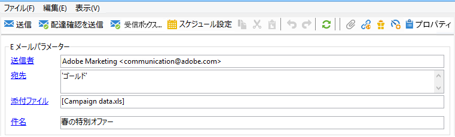

## 計算済み添付ファイルの作成 {#creating-a-calculated-attachment}

計算済み添付ファイルを作成する際には、各メッセージの分析または配信時にファイル名を生成させることができ、受信者に応じて異なるファイル名を付けることができます。また、内容をパーソナライズして PDF に変換することもできます。

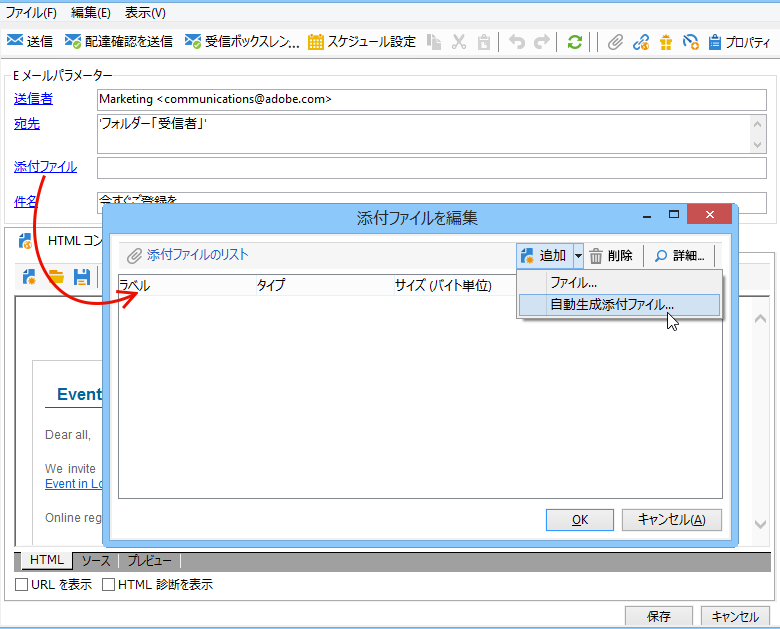

パーソナライズされた添付ファイルを作成するには、次の手順に従います。

1. 「**[!UICONTROL 添付ファイル]**」リンクをクリックします。
1. 「**[!UICONTROL 追加]**」ボタンをクリックし、「**[!UICONTROL 計算済み添付ファイル]**」を選択します。
1. **[!UICONTROL タイプ]**&#x200B;ドロップダウンリストから、使用する計算のタイプを選択します。

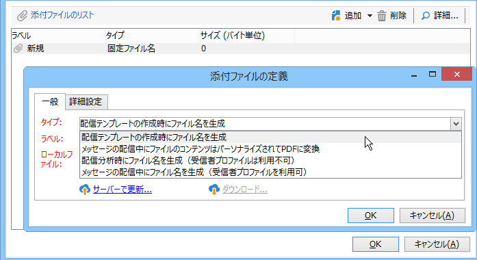

次のオプションを使用できます。

* **配信テンプレートの作成時にファイル名を生成**
* **メッセージの配信中にファイルのコンテンツはパーソナライズされて PDF に変換**
* **配信分析時にファイル名を生成（受信者プロファイルは利用不可）**
* **メッセージの配信中にファイル名を生成（受信者プロファイルを利用可）**

### ローカルファイルの添付 {#attach-a-local-file}

添付ファイルがローカルファイルの場合は、「**[!UICONTROL 配信テンプレートの作成時にファイル名を生成]**」オプションを選択します。ファイルはローカルで選択され、サーバーにアップロードされます。次の手順に従います。

1. アップロードするファイルを、「**[!UICONTROL ローカルファイル]**」フィールドで選択します。
1. 必要な場合はラベルを指定します。このラベルは、メッセージングシステム上でファイル名の代わりに表示されます。指定しない場合はデフォルトでファイル名が表示されます。

   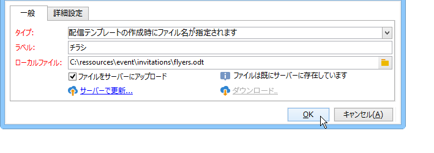

1. 必要に応じて、「**[!UICONTROL ファイルをサーバーにアップロード]**」を選択し、「**[!UICONTROL サーバーで更新]**」をクリックして転送を開始します。

   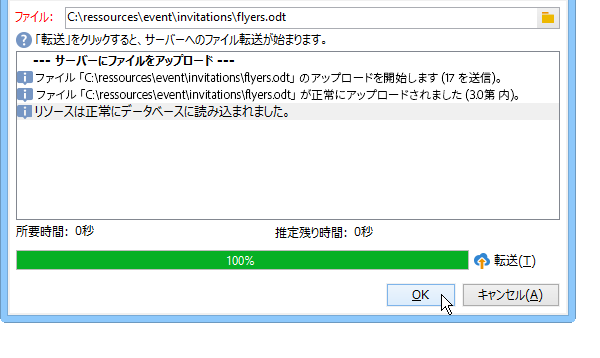

このファイルは、サーバー上で、このテンプレートから作成された別の配信に添付できるようになります。

### パーソナライズされたメッセージの添付 {#attach-a-personalized-message}

「**[!UICONTROL 各メッセージの配信時に、ファイルコンテンツをパーソナライズして PDF 形式に変換します]**」オプションを使用すると、パーソナライゼーションフィールドでファイルを選択できます（対象の受信者の姓と名など）。

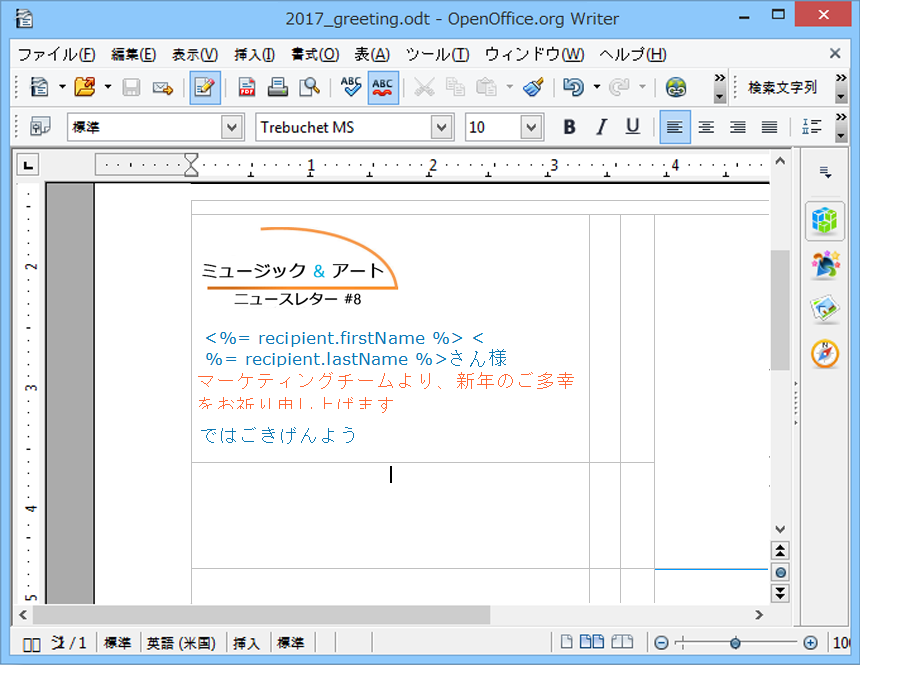

このタイプの添付ファイルについては、次の設定手順に従います。

1. アップロードするファイルを選択します。
1. 必要な場合はラベルを指定します。
1. 「**[!UICONTROL ファイルをサーバーにアップロード]**」を選択し、「**[!UICONTROL サーバーで更新]**」をクリックして転送を開始します。
1. プレビューを表示するには、受信者を選択します。

   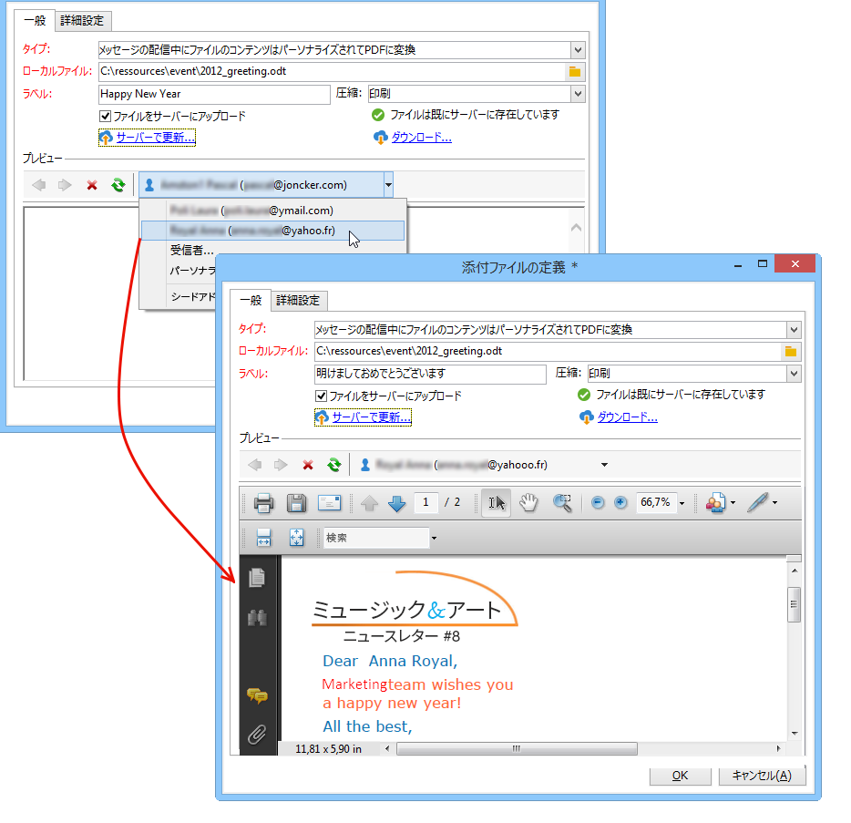

1. 配信を分析し、開始します。

   各受信者に、配信に添付されたパーソナライズ済み PDF が届きます。

   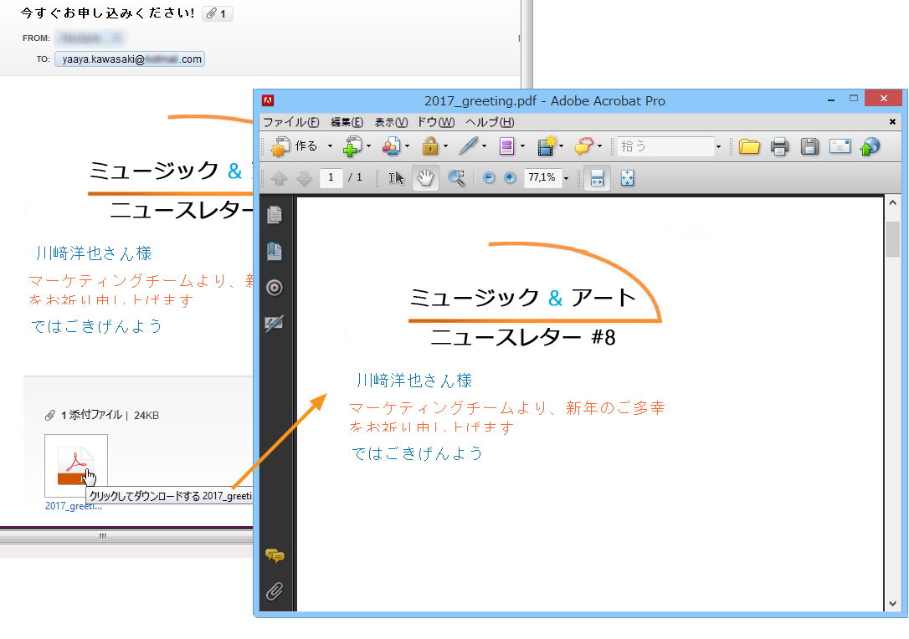

### 計算済みファイルの添付 {#attach-a-calculated-file}

配信の準備中に添付ファイルの名前を計算できます。これをおこなうには、「**[!UICONTROL 配信分析時にファイル名を生成（受信者プロファイルは利用不可）]**」オプションを選択します。

>[!NOTE]
>
>このオプションは、配信が外部のプロセスまたはワークフローによって送信される場合にのみ使用されます。

1. 添付ファイルに適用するラベルを指定します。
1. 定義ウィンドウで、ファイルのパスと正確な名前を指定します。

   >[!IMPORTANT]
   >
   >ファイルはサーバー上に置かれている必要があります。

   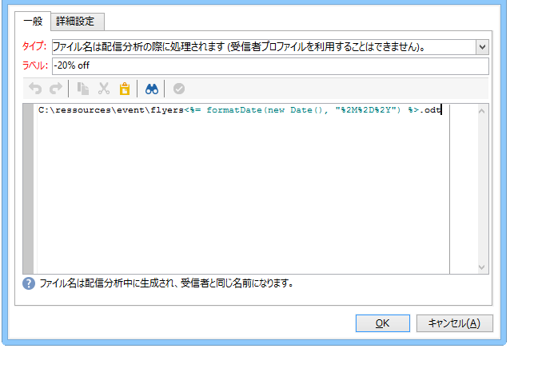

1. 配信を分析し、開始します。

   ファイル名の処理は分析ログに記録されます。

   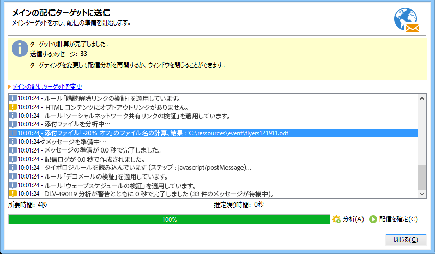

### パーソナライズされたファイルの添付 {#attach-a-personalized-file}

添付ファイルを選択するときに、「**[!UICONTROL メッセージの配信中にファイル名を生成（受信者プロファイルを利用可）]**」オプションを選択できます。その後、送信するファイル名と受信者のパーソナライズデータをマップできます。

>[!NOTE]
>
>このオプションは、配信が外部のプロセスまたはワークフローによって送信される場合にのみ使用されます。

1. 添付ファイルに適用するラベルを指定します。
1. 定義ウィンドウで、ファイルのパスと正確な名前を指定します。ファイル名をパーソナライズする場合は、パーソナライゼーションフィールドを使用して適切な値を取得できます。

   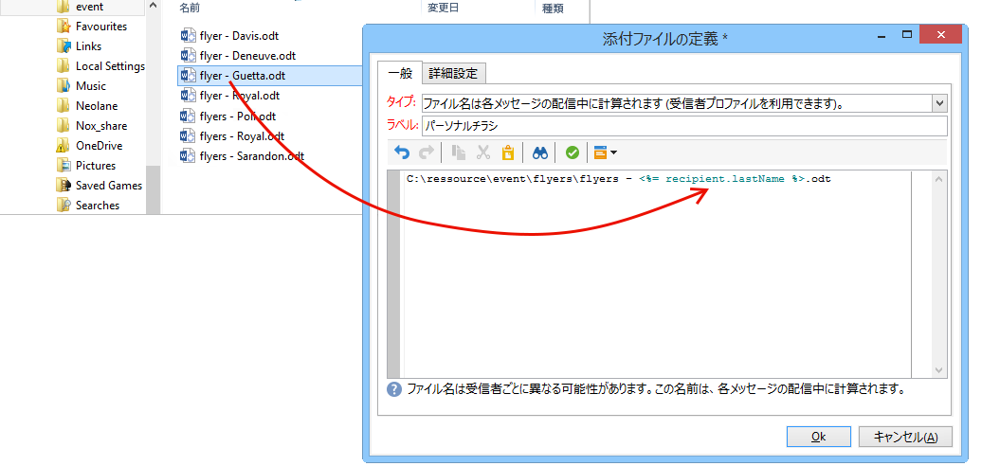

   >[!IMPORTANT]
   >
   >ファイルはサーバー上に置かれている必要があります。

1. 配信を分析し、開始します。

   下の例では、結合フィールドを使用して定義されたファイル名に基づいて添付ファイルを選択しています。

   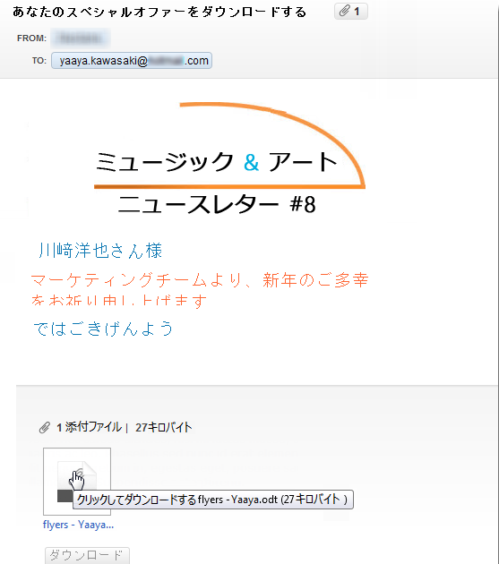

### 添付ファイルの設定 {#attachment-settings}

1 番目と 2 番目のオプションについては、「**[!UICONTROL ファイルをサーバーにアップロード]**」を選択し、適切なオプションを設定します。「**[!UICONTROL サーバーで更新...]**」リンクをクリックすると、アップロードが開始されます。

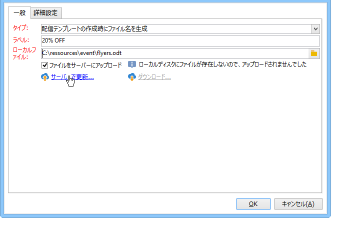

ファイルがアップロードされていることを示す、次のようなメッセージが表示されます。

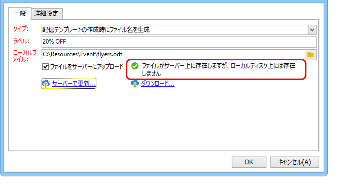

ファイルが変更されている場合は、次のような警告メッセージが表示されます。

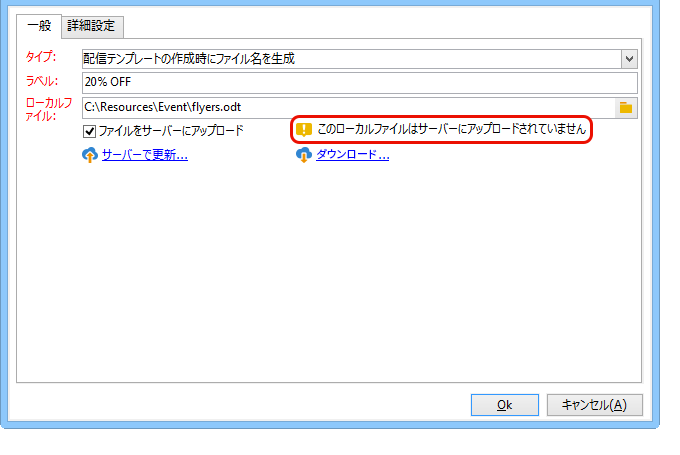

「**[!UICONTROL 詳細設定]**」タブでは、添付ファイルについて次のような詳細設定オプションを指定できます。

* フィルターオプションを指定すると、添付ファイルの送り先とする受信者を限定できます。「**[!UICONTROL 添付ファイルを受信する受信者のフィルターを有効にする]**」オプションを選択すると、受信者選択用スクリプトを記述するための入力フィールドが有効になります。このスクリプトは JavaScript で記述する必要があります。
* ファイル名をパーソナライズするためのスクリプトを指定できます。

  ウィンドウにテキストを入力し、ドロップダウンリストから使用可能なパーソナライゼーションフィールドを選択します。次の例では、ファイル名がパーソナライズされ、今日の日付と受信者の名前が含まれています。

  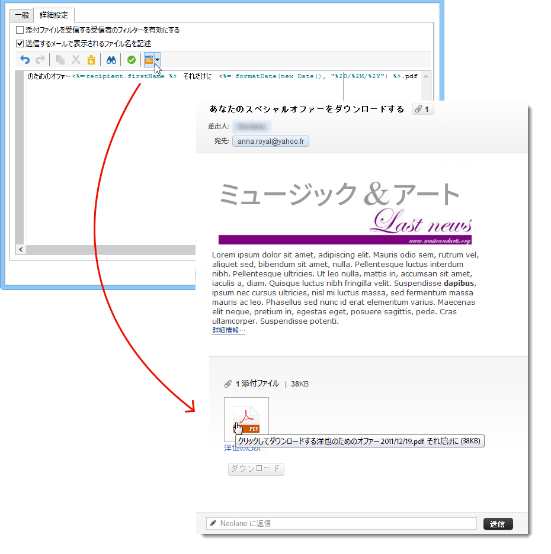
