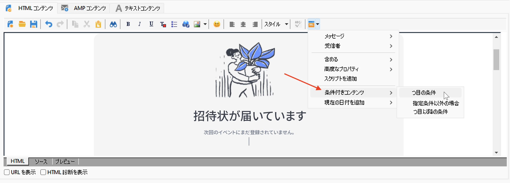
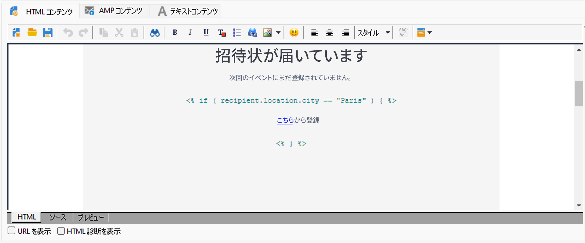

# 条件付きコンテンツの作成{#conditional-content}

条件付きコンテンツフィールドを設定すると、高度なパーソナライゼーションを作成できます。特定の条件が成立した場合、テキストブロックや画像がすべて置き換わります。


## メール内での条件の使用 {#conditions-in-an-email}

次の例では、受信者の市区町村と興味の対象に基づいて動的にパーソナライズされるメッセージを作成する方法について説明します。

* 受信者の市区町村に応じてメッセージを変更します。
* 受信者の興味に応じて、オファーのコンテンツをパーソナライズします。

あるフィールドの値に基づく条件付きコンテンツを作成するには、次の手順に従います。

1. 既存の配信を開くか、新しいメール配信を作成します。
1. メールコンテンツエディターで、パーソナライゼーションアイコンをクリックし、**[!UICONTROL 条件付きコンテンツ／「If」]** を選択します。

   

   パーソナライゼーション要素がメッセージ本文に挿入されます。それらを設定する必要があります。

1. **if** 式のパラメーターを入力します。

   * 式の最初の要素 **`<FIELD>`** を選択し、パーソナライゼーションアイコンをクリックしてテストフィールドに置き換えます。
   * **`<VALUE>`** を、条件が成立するためのフィールド値に置き換えます。この値は二重引用符で囲む必要があります。
   * 条件が成立したときに挿入するコンテンツを指定します。これにはテキスト、画像、フォーム、ハイパーテキストリンクなどを含めることができます。

   

1. 「**[!UICONTROL プレビュー]**」タブをクリックして、配信の受信者に応じたメッセージコンテンツを表示します。条件が成立する受信者を選択して、コンテンツを確認します。次に、条件が成立しない別の受信者を選択し、再度確認します。

さらに多くの場合分けを追加し、1 つまたは複数のフィールドに基づいてコンテンツの切り替えを定義することもできます。そのためには、**[!UICONTROL 条件付きコンテンツ／Else]** および&#x200B;**[!UICONTROL 条件付きコンテンツ／Else if]** を使用します。式の設定方法は、**If** 式の場合と同様です。

>[!CAUTION]
>
>**Else** 条件や **Else if** 条件を追加した後は、**%> &lt;%** の文字を削除する必要があります。


## ユースケース：多言語メールの作成 {#creating-multilingual-email}

以下の例では、多言語メールの作成方法について説明します。コンテンツは、受信者の優先言語に基づいて、いずれかの言語で表示されます。

1. E メールを作成し、ターゲット母集団を選択します。この例では、表示するバージョンを決定する条件は、受信者のプロファイルの&#x200B;**言語**&#x200B;の値に基づいています。これらの値は、**EN**、**FR**、**ES** に設定されています。
1. E メールの HTML コンテンツで、「**[!UICONTROL ソース]**」タブをクリックし、次のコードを貼り付けます。

   ```
   <% if (language == "EN" ) { %>
   <DIV id=en-version>Hello <%= recipient.firstName %>,</DIV>
   <DIV>Discover your new offers!</DIV>
   <DIV><a href="https://www.adobe.com/products/en">www.adobe.com/products/en</A></FONT></DIV><%
    } %>
   <% if (language == "FR" ) { %>
   <DIV id=fr-version>Bonjour <%= recipient.firstName %>,</DIV>
   <DIV>Découvrez nos nouvelles offres !</DIV>
   <DIV><a href="https://www.adobe.com/products/fr">www.adobe.com/products/fr</A></DIV><%
    } %>
    <% if (language == "ES" ) { %>
   <DIV id=es-version><FONT face=Arial>
   <DIV>Olà <%= recipient.firstName %>,</DIV>
   <DIV>Descubra nuestros nuevas ofertas !</DIV>
   <DIV><a href="https://www.adobe.com/products/es">www.adobe.com/products/es</A></DIV>
   <% } %>
   ```

1. 「**[!UICONTROL プレビュー]**」タブで、優先言語が異なる受信者を選択して、E メールコンテンツをテストします。

   >[!NOTE]
   >
   >この E メールコンテンツには代替バージョンが定義されていないので、E メールを送信する前にターゲット母集団をフィルタリングしてください。

## チュートリアルビデオ {#conditionnal-content-video}

多言語ニュースレターを例に、条件付きコンテンツを配信に追加する方法を説明します。

>[!VIDEO](https://video.tv.adobe.com/v/335682?quality=12)

