# 配信の設定と送信 {#configure-delivery}

配信パラメーターにアクセスしてさらに設定を行い、メッセージの送信方法を定義します。配信の[優先度](#delivery-priority)を定義し、[ウェーブ](#sending-using-multiple-waves)設定し、配信の送信をテストできます。この設定が完了したら、[この節](#confirm-delivery)の説明に従って送信を確認できます。その後、メッセージは直ちに送信されるか、配信[スケジュール](#schedule-delivery-sending)に基づいて送信されます。

## 追加パラメーターの設定 {#delivery-additional-parameters}

配信を送信する前に、配信プロパティの「**[!UICONTROL 配信]**」タブで送信パラメーターを定義できます。

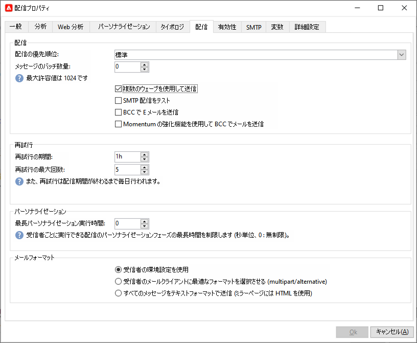

### 配信の優先順位 {#delivery-priority}

「**[!UICONTROL 配信の優先順位]**」オプションを使用して、優先度レベルを&#x200B;**[!UICONTROL 非常に低い]**&#x200B;から&#x200B;**[!UICONTROL 非常に高い]**&#x200B;に設定することで、配信の送信順序を変更できます（デフォルト値は&#x200B;**[!UICONTROL 標準]**）。

### バッチサイズ

「**[!UICONTROL メッセージのバッチサイズ]**」オプションを使用すると、1 つの XML 配信パッケージ内でグループ化するメッセージの件数を定義できます。このパラメーターが 0 に設定されている場合、メッセージは自動的にグループ化されます。パッケージサイズは、`<delivery size>/1024` という計算に基づいて決定されます（ただし、パッケージあたりのメッセージ件数は最小 8、最大 256）。

>[!IMPORTANT]
>
>既存の配信を複製して配信を作成すると、このパラメーターはリセットされます。

### 配信送信のテスト

「**[!UICONTROL SMTP 配信をテスト]**」オプションを使用すると、SMTP 経由での送信をテストできます。配信は SMTP サーバーに接続するまで処理されますが、送信はされません。配信のすべての受信者について、Campaign は SMTP プロバイダーサーバーに接続し、「SMTP RCPT TO」コマンドを実行して、「SMTP DATA」コマンドの前に接続を閉じます。

>[!NOTE]
>
>* このオプションは、ミッドソーシングで設定しないでください。
>
>* SMTP サーバー設定について詳しくは、[Campaign Classic v7 ドキュメント](https://experienceleague.adobe.com/docs/campaign-classic/using/installing-campaign-classic/additional-configurations/configure-delivery-settings.html?lang=ja#smtp-relay){target="_blank"}を参照してください。

## 複数のウェーブを使用して送信 {#sending-using-multiple-waves}

負荷を分散するには、配信を複数のバッチに分割します。全体の配信を基準にしてバッチの数とその比率を設定します。

### ウェーブを有効にする {#enable-waves}

ウェーブを定義するには、次の手順に従います。

1. 配信プロパティを開き、「**[!UICONTROL 配信]**」タブに移動します。
1. 「**[!UICONTROL 複数のウェーブを使用して送信]**」オプションを有効にし、「**[!UICONTROL ウェーブを定義...]**」リンクをクリックします。

   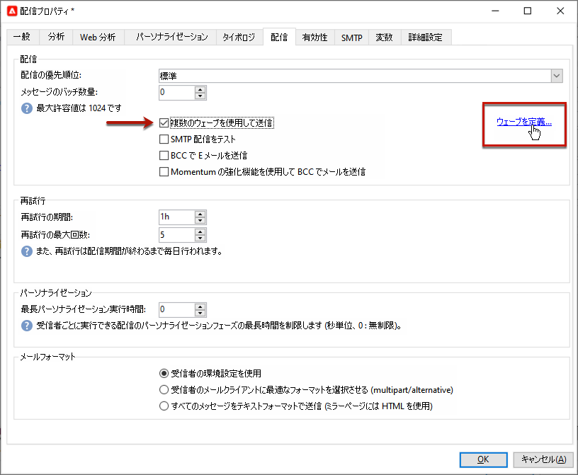

### ウェーブの設定 {#config-waves}

>[!NOTE]
>
>定義できるのは、サイズと 2 つの連続するウェーブの間隔のみです。受信者の選択条件をウェーブごとに設定することはできません。

各ウェーブのサイズを定義するか、カレンダーに追加できます。

* **各ウェーブのサイズを定義します**。例えば、対応するフィールドに **[!UICONTROL 30％]**&#x200B;と入力した場合、各ウェーブは、配信に含まれるメッセージの 30％を表します（ただし、最後のウェーブは除きます。最後のウェーブは、メッセージの 10％を表します）。

  「**[!UICONTROL 期間]**」フィールドで、2 つの連続するウェーブの開始間隔を指定します。例えば、**[!UICONTROL 2d]** と入力した場合、最初のウェーブは直ちに開始され、2 番目のウェーブは 2 日後に、3 番目のウェーブは 4 日後にといった具合に開始されます。

  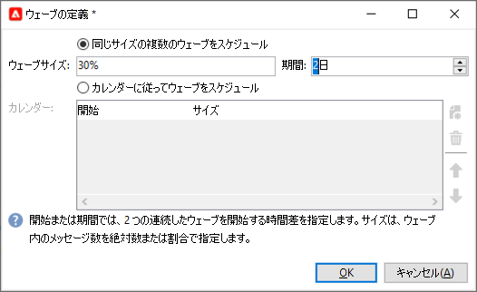

* **各ウェーブを送信するためのカレンダーを定義します**。例えば、最初のウェーブは、配信に含まれるメッセージ総数の 25％を表しており、ただちに開始されます。次の 2 つのウェーブで配信が完了しますが、これらのウェーブは、6 時間間隔で開始するように設定されています。

  「**[!UICONTROL 開始日]**」列では、2 つの連続するウェーブの開始間隔を指定します。「**[!UICONTROL サイズ]**」列では、固定の数値または割合を入力します。

  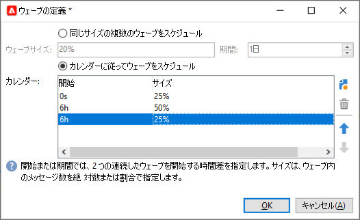

### ウェーブスケジュールの検証 {#check-waves}

特別なタイポロジルールである「**[!UICONTROL ウェーブスケジュールの検証]**」では、最後のウェーブが配信の有効期限の前に計画されているかどうかが確認されます。キャンペーンタイポロジとそのルールは、配信プロパティの「**[!UICONTROL タイポロジ]**」タブで設定します。詳しくは、[この節](../../automation/campaign-opt/campaign-typologies.md#typology-rules)<!--ref TBC-->を参照してください。

>[!IMPORTANT]
>
>最後の 2 つのウェーブが配信期限を過ぎないことを確認してください。配信期限は、「**[!UICONTROL 有効性]**」タブで定義されています。配信期限を過ぎると、一部のメッセージが送信されない場合があります。配信の有効期間について詳しくは、[この節](delivery-failures.md#valid-period)を参照してください。
>
>また、最後のウェーブを設定するときに、再試行に十分な時間を設定する必要があります。再試行について詳しくは、[この節](delivery-failures.md#retries)を参照してください。

### ウェーブの監視 {#monitor-waves}

送信状況を監視するには、配信ログを参照してください。[このページ](send.md)を参照してください

処理済みのウェーブで既に送信された配信（ステータスが&#x200B;**[!UICONTROL 送信済み]**）と、残りのウェーブで送信されるウェーブ（ステータスが&#x200B;**[!UICONTROL 保留中]**）を確認できます。

### ウェーブのサンプル {#samples-waves}

以下の 2 つの例は、最も一般的な複数のウェーブの使用例です。

* **ランプアッププロセス時**

  新しいプラットフォームを使用してメールが送信された場合、インターネットサービスプロバイダー（ISP）は認識されない IP アドレスを疑わしく思います。多くの場合、大量のメールが突然送信されると、ISP はそれらのメールをスパムとしてマークします。

  ウェーブを使用して送信するボリュームを徐々に増やすことで、スパムとしてマークされないようにできます。この方法により、スタートアップフェーズをスムーズに進め、無効なアドレスが全体に占める割合を減らすことができます。

  そのためには、「**[!UICONTROL カレンダーに従ってウェーブをスケジュール]**」オプションを選択します。例えば、最初のウェーブを 10％に、2 番目のウェーブを 15％にといった具合に設定します。

  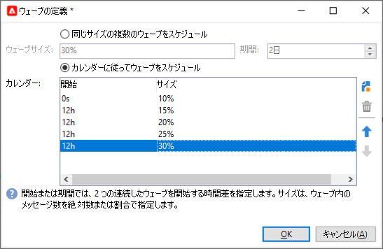

* **コールセンターが関与するキャンペーン**

  電話によるロイヤリティキャンペーンを管理する場合、組織が処理できる購読者への電話の本数には限界があります。

  例えば、コールセンターの 1 日あたりの処理能力を考慮して、ウェーブを使用すると、1 日あたりのメッセージ数を 20 件に制限できます。

  これをおこなうには、「**[!UICONTROL 同じサイズの複数のウェーブをスケジュール]**」オプションを選択します。ウェーブのサイズとして **[!UICONTROL 20]** を入力し、「**[!UICONTROL 期間]**」フィールドに **[!UICONTROL 1d]** と入力します。

  

## 配信を確定 {#confirm-delivery}

配信の設定が終わり、送信準備が整ったら、送信を確定する前に必ず配信分析を実行してください。

それには、次の手順に従います。

1. 「**[!UICONTROL 送信]**」をクリックし、目的のアクションを選択します。

   * 配信をすぐに送信するには、「[**可能な限り早く配信**]」を選択します。
   * 送信を後の日付にスケジュールするには、「**[!UICONTROL 配信を延期]**」を選択します。[詳細情報](#schedule-delivery-sending)

1. 「**[!UICONTROL 分析]**」をクリックします。詳しくは、[この節](delivery-analysis.md)を参照してください。

   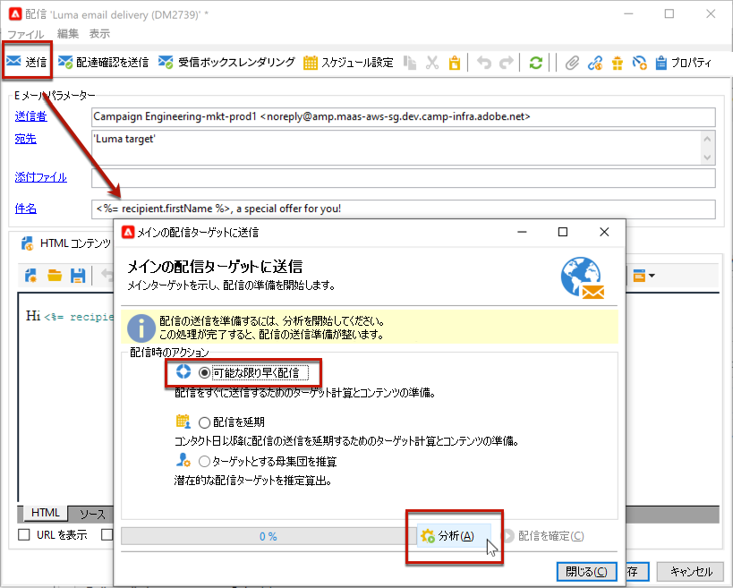

1. 完了したら、「**[!UICONTROL 配信を確定]**」をクリックし、メッセージの配信を開始します。

   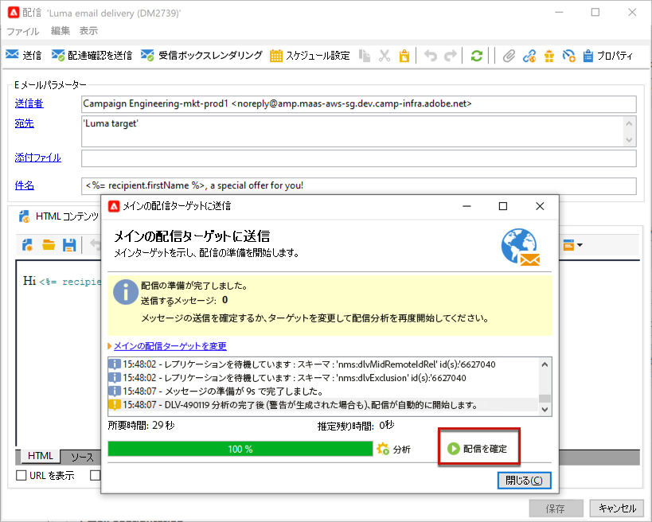

1. 配信ウィザードを閉じて、「**[!UICONTROL 配信]**」タブから配信の実行を追跡できます。このタブには、この配信の詳細または配信のリストからアクセスできます。

   詳しくは、以下の節を参照してください。

   * [配信の監視](send.md)
   * [配信エラーについて](delivery-failures.md)

<!--About message tracking-->

## 配信送信のスケジュール設定 {#schedule-delivery-sending}

配信をスケジュールしたり、母集団に対する営業頻度を管理して過剰な営業活動をしないようするために、メッセージの配信を遅らせることができます。

1. 「**[!UICONTROL 送信]**」ボタンをクリックし、「**[!UICONTROL 配信を延期]**」オプションを選択します。

1. 「**[!UICONTROL 連絡日]**」フィールドに開始日を入力します。

   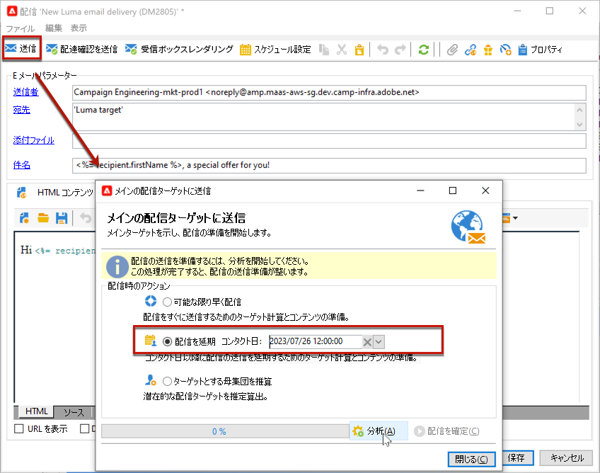

1. 配信分析を開始し、配信の送信を確定します。ただし、配信の送信は、「**[!UICONTROL 連絡日]**」フィールドで指定した日付まで開始されません。

   >[!IMPORTANT]
   >
   >分析を開始すると、定義した連絡日が固定されます。この日付を修正する場合は、修正内容が考慮されるように、分析を再度実行する必要があります。

   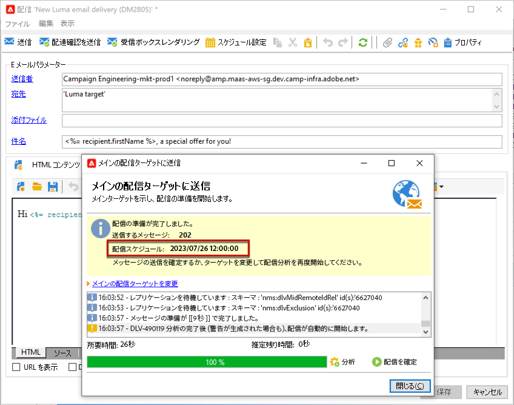

配信リストには、配信が「**[!UICONTROL 保留中]**」ステータスで表示されます。

スケジュールは、配信の「**[!UICONTROL スケジュール設定]**」ボタンを使用してアップストリーム設定することも可能です。

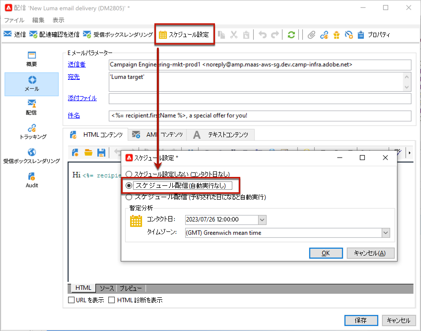

これにより、配信を後の日付まで遅らせたり、暫定カレンダーに配信を保存したりできます。

* 「**[!UICONTROL 予約配信（自動実行なし）]**」オプションでは、配信の暫定的な分析をスケジュールできます。

  この設定を保存すると、配信のステータスは「**[!UICONTROL ターゲティングを保留中]**」に変化します。分析は指定した日付に開始されます。

* 「**[!UICONTROL 予約配信（予約された日になると自動実行）]**」オプションでは、配信日を指定できます。

  「**[!UICONTROL 送信]**」をクリックし、「**[!UICONTROL 配信を延期]**」を選択してから、分析を開始して配信を確定します。分析が完了すると、配信ターゲットの準備ができた状態になり、メッセージは指定した日付が来ると自動的に送信されます。

日付と時刻は、作業しているオペレーターのタイムゾーンに基づいて表されます。連絡日の入力フィールドの下にある&#x200B;**[!UICONTROL タイムゾーン]**&#x200B;ドロップダウンリストを使用すると、入力した日付と時刻が、指定したタイムゾーンに自動変換されます。

例えば、ロンドン時間の 8:00 に配信を自動実行するスケジュールを設定すると、時間は選択したタイムゾーンに自動的に変換されます。

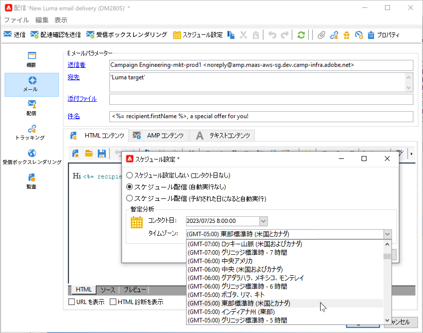

<!--
## Adjust delivery failure management {#delivery-failure-management}

### Configure retries {#configure-retries}

Temporarily undelivered messages due to a **Soft** or **Ignored** error are subject to an automatic retry. The delivery failure types and reasons are presented in this [section](../../delivery/using/understanding-delivery-failures.md#delivery-failure-types-and-reasons).

>[!IMPORTANT]
>
>For hosted or hybrid installations, if you have upgraded to the [Enhanced MTA](../../delivery/using/sending-with-enhanced-mta.md), the retry settings in the delivery are no longer used by Campaign. Soft bounce retries and the length of time between them are determined by the Enhanced MTA based on the type and severity of the bounce responses coming back from the message's email domain.

For on-premise installations and hosted/hybrid installations using the legacy Campaign MTA, the central section of the **[!UICONTROL Delivery]** tab for delivery parameters indicates how many retries should be performed the day after the delivery and the minimum delay between retries.

By default, five retries are scheduled for the first day of the delivery with a minimum interval of one hour spread out over the 24 hours of the day. One retry per day is programmed after that and until the delivery deadline, which is defined in the **[!UICONTROL Validity]** tab (see [Defining validity period](#defining-validity-period)).

### Define the validity period {#define-validity-period}

When the delivery has been launched, the messages (and any retries) can be sent until the delivery deadline. This is indicated in the delivery properties, via the **[!UICONTROL Validity]** tab.

* The **[!UICONTROL Delivery duration]** field lets you enter the limit for global delivery retries. This means that Adobe Campaign sends the messages beginning on the start date, and then, for messages returning an error only, regular, configurable retries are performed until the validity limit is reached.

  You can also choose to specify dates. To do this, select **[!UICONTROL Explicitly set validity dates]**. In this case, the delivery and validity limit dates also let you specify the time. The current time is used by default, but you can modify this directly in the input field.

  >[!IMPORTANT]
  >
  >For hosted or hybrid installations, if you have upgraded to the [Enhanced MTA](../../delivery/using/sending-with-enhanced-mta.md), the **[!UICONTROL Delivery duration]** setting in your Campaign email deliveries will be used only if set to **3.5 days or less**. If you define a value higher than 3.5 days, it will not be taken into account.

* **Validity limit of resources**: The **[!UICONTROL Validity limit]** field is used for uploaded resources, mainly for the mirror page and images. The resources on this page are valid for a limited time (to save disk space).

  The values in this field can be expressed in the units listed in [this section](../../platform/using/adobe-campaign-workspace.md#default-units).
-->
