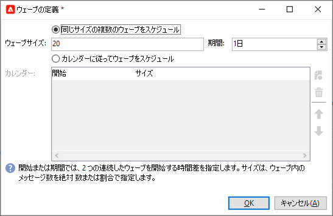

# 配信の設定と送信 {#configure-delivery}

## 追加のパラメーターの設定 {#delivery-additional-parameters}

配信を送信する前に、配信プロパティの「**[!UICONTROL 配信]**」タブで送信パラメーターを定義できます。

* **[!UICONTROL 配信の優先順位]**:配信の優先順位レベルを次の順に設定して、配信の送信順序を変更するには、このオプションを使用します。 **[!UICONTROL 非常に低い]** から **[!UICONTROL 高画質]** ( デフォルト値は **[!UICONTROL 標準]**) をクリックします。

* **[!UICONTROL メッセージのバッチサイズ]**：1 つの XML 配信パッケージ内でグループ化するメッセージの件数を定義します。このパラメーターが 0 に設定されている場合、メッセージは自動的にグループ化されます。パッケージサイズは、`<delivery size>/1024` という計算に基づいて決定されます（ただし、パッケージあたりのメッセージ件数は最小 8、最大 256）。

  >[!IMPORTANT]
  >
  >既存の配信を複製して配信を作成すると、このパラメーターはリセットされます。

* **[!UICONTROL 複数のウェーブを使用して送信]**：メッセージを一度にオーディエンス全体に送信するのではなく、バッチで送信します。[詳細情報](#sending-using-multiple-waves)。

* **[!UICONTROL SMTP 配信をテスト]**：SMTP 経由での送信をテストします。配信は SMTP サーバーに接続するまで処理されますが、送信はされません。配信のすべての受信者について、Campaign は SMTP プロバイダーサーバーに接続し、「SMTP RCPT TO」コマンドを実行して、「SMTP DATA」コマンドの前に接続を閉じます。

  >[!NOTE]
  >
  >* このオプションは、ミッドソーシングで設定しないでください。
  >
  >* SMTP サーバー設定の詳細については、 [Campaign Classicv7 ドキュメント](https://experienceleague.adobe.com/docs/campaign-classic/using/installing-campaign-classic/additional-configurations/configure-delivery-settings.html#smtp-relay){target="_blank"}.

* **[!UICONTROL BCC で E メールを送信]**：BCC アドレスをメッセージのターゲットに追加するだけで、BCC 経由で E メールを外部システムに保存します。[詳細情報](email-parameters.md)。

## 複数のウェーブを使用して送信 {#sending-using-multiple-waves}

負荷を分散するには、配信を複数のバッチに分割します。全体の配信を基準にしてバッチの数とその比率を設定します。

>[!NOTE]
>
>定義できるのは、サイズと 2 つの連続するウェーブの間隔のみです。受信者の選択条件をウェーブごとに設定することはできません。

1. 配信プロパティウィンドウを開き、「**[!UICONTROL 配信]**」タブをクリックします。
1. 「**[!UICONTROL 複数のウェーブを使用して送信]**」オプションを選択し、「**[!UICONTROL ウェーブを定義...]**」リンクをクリックします。

   

1. ウェーブを設定するには、次のいずれかをおこないます。

   * 各ウェーブのサイズを定義します。例えば、対応するフィールドに **[!UICONTROL 30％]**&#x200B;と入力した場合、各ウェーブは、配信に含まれるメッセージの 30％を表します（ただし、最後のウェーブは除きます。最後のウェーブは、メッセージの 10％を表します）。

     「**[!UICONTROL 期間]**」フィールドで、2 つの連続するウェーブの開始間隔を指定します。例えば、**[!UICONTROL 2d]** と入力した場合、最初のウェーブは直ちに開始され、2 番目のウェーブは 2 日後に、3 番目のウェーブは 4 日後にといった具合に開始されます。

     

   * 各ウェーブを送信するためのカレンダーを定義します。

     「**[!UICONTROL 開始日]**」列では、2 つの連続するウェーブの開始間隔を指定します。「**[!UICONTROL サイズ]**」列では、固定の数値または割合を入力します。

     以下の例では、最初のウェーブは、配信に含まれるメッセージ総数の 25％を表しており、直ちに開始されます。次の 2 つのウェーブで配信が完了しますが、これらのウェーブは、6 時間間隔で開始するように設定されています。

     

   特別なタイポロジルールである「**[!UICONTROL ウェーブスケジュールの検証]**」では、最後のウェーブが配信の有効期限の前に計画されているかどうかが確認されます。キャンペーンタイポロジとそのルール (「 **[!UICONTROL タイポロジ]** 配信プロパティの「 」タブについては、 [この節](../../automation/campaign-opt/campaign-typologies.md#typology-rules)<!--ref TBC-->.

   >[!IMPORTANT]
   >
   >最後の 2 つのウェーブが配信期限を過ぎないことを確認してください。配信期限は、「**[!UICONTROL 有効性]**」タブで定義されています。配信期限を過ぎると、一部のメッセージが送信されない場合があります。
   >
   >また、最後のウェーブを設定するときに、再試行の時間を十分にみておく必要があります。<!--See [this section]().-->

1. 送信状況を監視するには、配信ログを参照してください。[このページ](send.md)<!--ref TBC-->を参照してください。

   処理済みのウェーブで既に送信された配信（ステータスが&#x200B;**[!UICONTROL 送信済み]**）と、残りのウェーブで送信されるウェーブ（ステータスが&#x200B;**[!UICONTROL 保留中]**）を確認できます。

以下の 2 つの例は、最も一般的な複数のウェーブの使用例です。

* **ランプアッププロセス時**

  新しいプラットフォームを使用して E メールが送信された場合、インターネットサービスプロバイダー（ISP）は認識されない IP アドレスを疑わしく思います。多くの場合、大量の E メールが突然送信されると、ISP はそれらの E メールをスパムとしてマークします。

  ウェーブを使用して送信するボリュームを徐々に増やすことで、スパムとしてマークされないようにできます。この方法により、スタートアップフェーズをスムーズに進め、無効なアドレスが全体に占める割合を減らすことができます。

  そのためには、「**[!UICONTROL カレンダーに従ってウェーブをスケジュール]**」オプションを選択します。例えば、最初のウェーブを 10％に、2 番目のウェーブを 15％にといった具合に設定します。

  

* **コールセンターが関与するキャンペーン**

  電話によるロイヤルティキャンペーンを管理する場合、組織が処理できるサブスクライバーへの電話の本数には限界があります。

  ウェーブを使用して、1 日あたりのメッセージ数を 20 に制限できます（コールセンターの 1 日あたりの処理能力）。

  これをおこなうには、「**[!UICONTROL 同じサイズの複数のウェーブをスケジュール]**」オプションを選択します。ウェーブのサイズとして **[!UICONTROL 20]** を入力し、「**[!UICONTROL 期間]**」フィールドに **[!UICONTROL 1d]** と入力します。

  

<!--
## Adjust delivery failure management {#delivery-failure-management}

### Configure retries {#configure-retries}

Temporarily undelivered messages due to a **Soft** or **Ignored** error are subject to an automatic retry. The delivery failure types and reasons are presented in this [section](../../delivery/using/understanding-delivery-failures.md#delivery-failure-types-and-reasons).

>[!IMPORTANT]
>
>For hosted or hybrid installations, if you have upgraded to the [Enhanced MTA](../../delivery/using/sending-with-enhanced-mta.md), the retry settings in the delivery are no longer used by Campaign. Soft bounce retries and the length of time between them are determined by the Enhanced MTA based on the type and severity of the bounce responses coming back from the message's email domain.

For on-premise installations and hosted/hybrid installations using the legacy Campaign MTA, the central section of the **[!UICONTROL Delivery]** tab for delivery parameters indicates how many retries should be performed the day after the delivery and the minimum delay between retries.

By default, five retries are scheduled for the first day of the delivery with a minimum interval of one hour spread out over the 24 hours of the day. One retry per day is programmed after that and until the delivery deadline, which is defined in the **[!UICONTROL Validity]** tab (see [Defining validity period](#defining-validity-period)).

### Define the validity period {#define-validity-period}

When the delivery has been launched, the messages (and any retries) can be sent until the delivery deadline. This is indicated in the delivery properties, via the **[!UICONTROL Validity]** tab.

* The **[!UICONTROL Delivery duration]** field lets you enter the limit for global delivery retries. This means that Adobe Campaign sends the messages beginning on the start date, and then, for messages returning an error only, regular, configurable retries are performed until the validity limit is reached.

  You can also choose to specify dates. To do this, select **[!UICONTROL Explicitly set validity dates]**. In this case, the delivery and validity limit dates also let you specify the time. The current time is used by default, but you can modify this directly in the input field.

  >[!IMPORTANT]
  >
  >For hosted or hybrid installations, if you have upgraded to the [Enhanced MTA](../../delivery/using/sending-with-enhanced-mta.md), the **[!UICONTROL Delivery duration]** setting in your Campaign email deliveries will be used only if set to **3.5 days or less**. If you define a value higher than 3.5 days, it will not be taken into account.

* **Validity limit of resources**: The **[!UICONTROL Validity limit]** field is used for uploaded resources, mainly for the mirror page and images. The resources on this page are valid for a limited time (to save disk space).

  The values in this field can be expressed in the units listed in [this section](../../platform/using/adobe-campaign-workspace.md#default-units).

## Confirm the delivery {#confirm-delivery}

When the delivery is configured and ready to be sent, make sure you have run the delivery analysis.

To do this, click **[!UICONTROL Send]**, select the desired action and click **[!UICONTROL Analyze]**. For more on this, see [Launching the analysis](../../delivery/using/steps-validating-the-delivery.md#analyzing-the-delivery).

Once done, click **[!UICONTROL Confirm delivery]** to launch the delivery of messages.

You can then close the delivery wizard and track the execution of the delivery from the **[!UICONTROL Delivery]** tab, accessible via the detail of this delivery or via the list of deliveries.

After sending messages, you can monitor and track your deliveries. For more on this, refer to these sections:

* [Monitoring a delivery](send.md)
* [Understanding delivery failures](delivery-failures.md)
* [About message tracking]

## Schedule the delivery sending {#schedule-delivery-sending}

You can defer the delivery of messages in order to schedule the delivery or to manage sales pressure and avoid over-soliciting a population.

1. Click the **[!UICONTROL Send]** button and select the **[!UICONTROL Postpone delivery]** option.

1. Specify a start date in the **[!UICONTROL Contact date]** field.

  

1. You can then start the delivery analysis, then confirm the delivery sending. However, the delivery sending will not start until the date given in the **[!UICONTROL Contact date]** field.

  >[!IMPORTANT]
  >
  >Once you have started the analysis, the contact date that you defined is fixed. If you modify this date, you will have to restart the analysis so that your modifications are taken into account.

  

In the delivery list, the delivery will appear with **[!UICONTROL Pending]** status.

Scheduling can also be configured upstream via the **[!UICONTROL Scheduling]** button of the delivery.

It lets you defer the delivery to a later date or save the delivery in the provisional calendar.

* The **[!UICONTROL Schedule delivery (no automatic execution)]** option lets you schedule a provisional analysis of the delivery.

  When this configuration is saved, the delivery changes to **[!UICONTROL Targeting pending]** status. The analysis will be launched on the specified date.

* The **[!UICONTROL Schedule delivery (automatic execution on planned date)]** option lets you specify the delivery date.

  Click **[!UICONTROL Send]** and select **[!UICONTROL Postpone delivery]** then launch the analysis and confirm delivery. When the analysis is complete, the delivery target is ready and messages will automatically be sent on the specified date.

Dates and times are expressed in the time zone of the current operator. The **[!UICONTROL Time zone]** drop-down list located below the contact date input field lets you automatically convert the entered date and time into the selected time zone.

For instance, if you schedule a delivery to be executed automatically at 8 o'clock London time, the time is automatically converted into the selected time zone:

-->