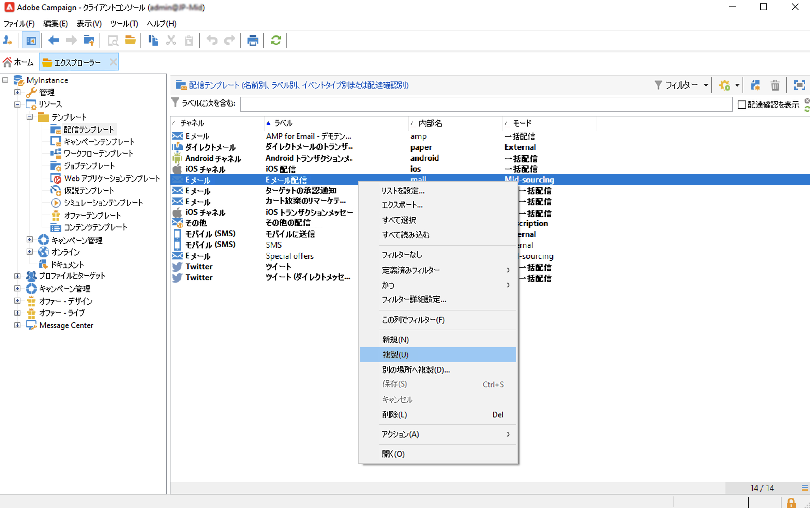
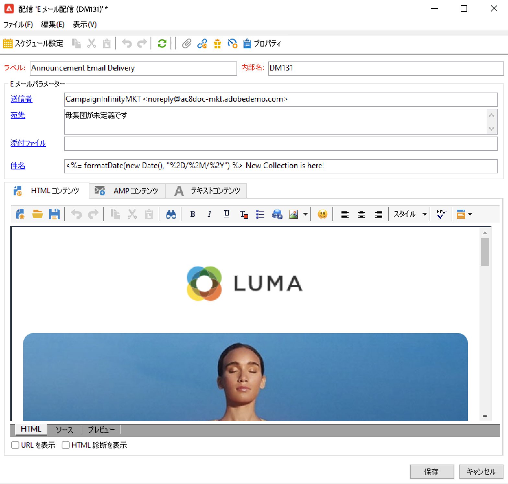
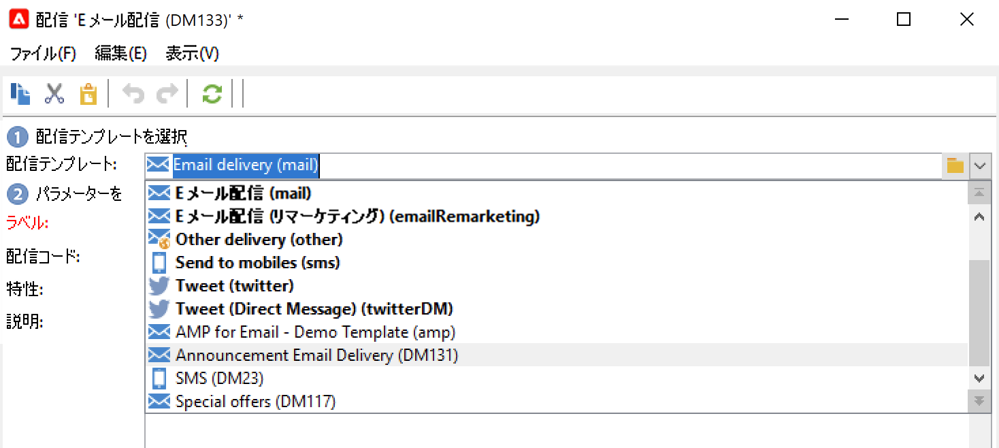
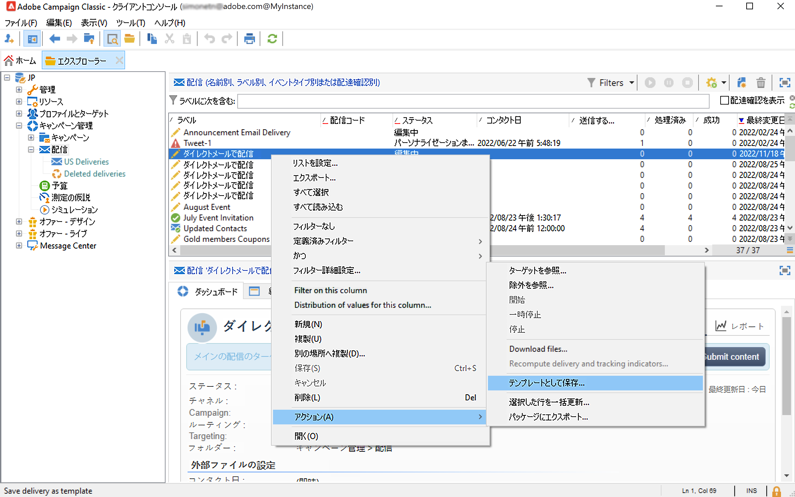
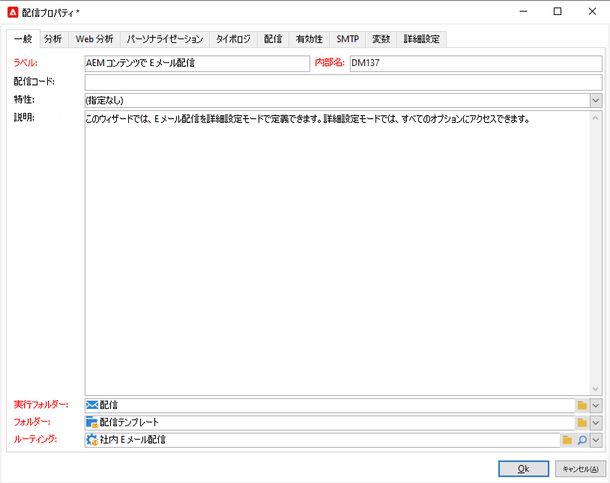
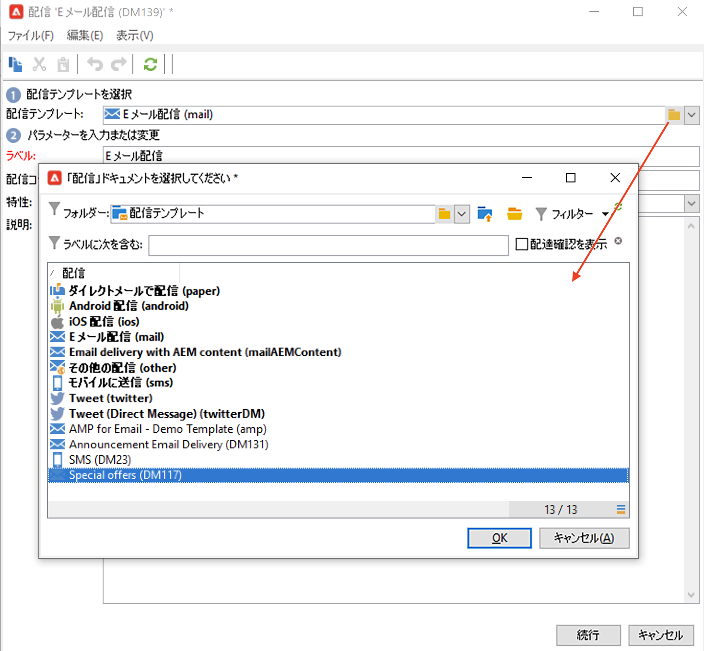
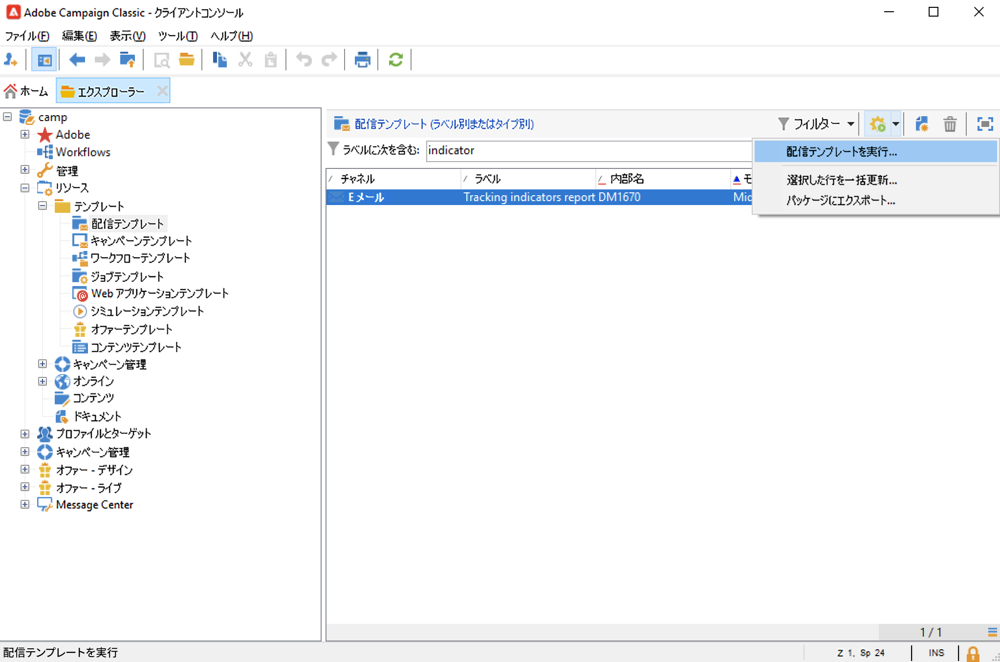

# 配信テンプレートの使用{#creating-a-delivery-template}

キャンペーンの実行と開始を迅速におこなうために、配信テンプレートを使用してクリエイティブなルックアンドフィールを標準化します。

テンプレートには、次の項目を体系的に含めることができます。

* タイポロジ
* 送信者と返信先のアドレス
* 基本的なパーソナライゼーションブロック
* ミラーページや購読解除へのリンク リンク
* コンテンツ、会社のロゴまたは署名
* リソースの有効性、再試行パラメーター、強制隔離設定など、その他の配信プロパティ。

 [ビデオでこの機能を確認する](#delivery-template-video)

配信テンプレートを作成するには、組み込みテンプレートの複製、既存の配信のテンプレートへの変換、または最初から配信テンプレートの作成をおこないます。

## 既存のテンプレートのコピー{#copy-an-existing-template}

Campaign には、各チャネル用の一連の組み込みテンプレートが付属しています。電子メール、プッシュ、SMS、ダイレクトメールなど。

配信テンプレートを作成する最も簡単な方法は、組み込みテンプレートを複製してカスタマイズすることです。

配信テンプレートを複製するには、次の手順に従います。

1. 参照先 **[!UICONTROL リソース/テンプレート/配信テンプレート]** Adobe Campaign explorer.
1. 組み込みの配信テンプレートを選択します。 組み込みテンプレートはリスト内で太字で表示されています。
1. 右クリックして「 」を選択します。 **[!UICONTROL 複製]**.

   

1. テンプレート設定を定義し、新しいテンプレートを保存します。

   

このテンプレートが配信テンプレートのリストに追加されます。 これで、新しい配信を作成する際に選択できます。

## 既存の配信のテンプレートへの変換 {#convert-an-existing-delivery}

配信をテンプレートに変換すると、新しい繰り返し配信アクションの作成に使用できます。

配信をテンプレートに変換するには、次の手順に従います。

1. 配信リストから配信を選択します。配信リストには、 **[!UICONTROL キャンペーン管理]** Campaign エクスプローラーのノード。

1. 右クリックして&#x200B;**[!UICONTROL アクション／テンプレートとして保存]**&#x200B;を選択します。

   

1. 配信プロパティを編集し、新しいテンプレートを保存する必要があるフォルダーを選択します ( **[!UICONTROL フォルダー]** フィールド ) と、このテンプレートに基づいて作成された配信を作成する必要があるフォルダー ( **[!UICONTROL 実行フォルダー]** フィールド ) に書き込まれます。

   

## 新しいテンプレートを作成 {#create-a-new-template}

>[!NOTE]
>
>設定エラーを回避するため、Adobeでは次のことをお勧めします。 [組み込みテンプレートの複製](#copy-an-existing-template) 新しいテンプレートを作成するのではなく、プロパティをカスタマイズします。

配信テンプレートを最初から設定するには、次の手順に従います。

1. 次を参照： **リソース** Campaign エクスプローラーでフォルダーを選択し、「 」を選択します。 **テンプレート** その後 **配信テンプレート**.
1. ツールバーで「**新規**」をクリックして、新しい配信テンプレートを作成します。
1. を **ラベル** そして **内部名** 」と入力します。
1. テンプレートを保存してから再度開きます。
1. 次の **プロパティ** ボタンをクリックし、設定を調整します。
1. 「**一般**」タブで、**実行フォルダー**、**フォルダー**、**ルーティング**&#x200B;の各ドロップダウンメニューで選択された場所を確定または変更します。
1. 「**E メールパラメーター**」カテゴリに E メールの件名とターゲット母集団を入力します。
1. **HTML コンテンツ**&#x200B;を追加してテンプレートをパーソナライズします。ミラーページのリンクと購読解除リンクを追加することもできます。
1. 「**プレビュー**」タブを選択します。**パーソナライゼーションをテスト**&#x200B;ドロップダウンメニューで&#x200B;**受信者**&#x200B;を選択し、選択したプロファイルとしてテンプレートをプレビューします。
1. 「**保存**」をクリックします。これで、テンプレートを配信で使用できるようになります。

## テンプレートからの配信の作成{#create-a-delivery-from-a-template}

既存のテンプレートをベースにして配信を作成するには、利用可能な配信テンプレートのリストからテンプレートを選択します。

テンプレートが表示されない場合は、 **[!UICONTROL リンクを選択]** フォルダーを開き、Campaign フォルダーを参照します。

目的のディレクトリを「**[!UICONTROL フォルダー]**」フィールドから選択するか、**[!UICONTROL サブレベルを表示]**&#x200B;アイコンをクリックして現在のディレクトリのサブツリーに含まれるディレクトリのコンテンツを表示します。

使用する配信テンプレートを選択し、「**[!UICONTROL OK]**」をクリックします。

### テンプレートの実行 {#execute-a-template}

最初に配信を作成することなく、テンプレートリストから直接テンプレートの実行を開始できます。

そのためには、実行するテンプレートを選択して右クリックし、**[!UICONTROL アクション／配信テンプレートを実行]**&#x200B;を選択します。

また、**[!UICONTROL ファイル／アクションメニューで「配信テンプレートを実行」]**&#x200B;を選択することもできます。

配信パラメーターを入力し、「**[!UICONTROL 送信]**」をクリックします。

この操作により、テンプレートに関連付けられたフォルダーに配信が生成されます。 配信の名前は、ベースにした配信テンプレートの名前と同じになります。

## チュートリアルビデオ {#delivery-template-video}

### 配信テンプレートの設定方法

次のビデオでは、アドホック配信用のテンプレートを設定する方法について説明します。

>[!VIDEO](https://video.tv.adobe.com/v/342082?quality=12)

### 配信テンプレートのプロパティの設定方法

次のビデオでは、配信テンプレートのプロパティを設定する方法と各プロパティの詳細について説明します。

>[!VIDEO](https://video.tv.adobe.com/v/338969?quality=12)

### アドホック配信テンプレートのデプロイ方法

このビデオでは、アドホック E メール配信テンプレートを導入する方法と、E メール配信と配信ワークフローの違いについて説明します。

>[!VIDEO](https://video.tv.adobe.com/v/338965?quality=12)

Campaign Classic に関するその他のハウツービデオは[こちら](https://experienceleague.adobe.com/docs/campaign-classic-learn/tutorials/overview.html?lang=ja)で参照できます。
