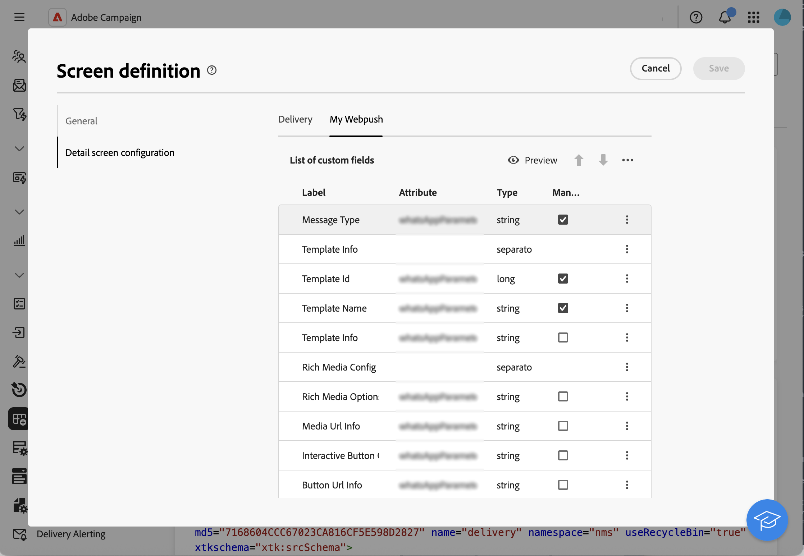

# カスタムチャネルの基本を学ぶ {#gs-custom-channel}

Adobe Campaignでは、カスタムの外部チャネルまたは API チャネルをサードパーティと統合して作成できます。 その後、これらのチャネルに基づいて配信を調整および実行できます。

配信の作成と送信は、クライアントコンソールと web UI の両方で実行できます。ただし、カスタムチャネル設定は、クライアントコンソールでのみ実行されます。

カスタムチャネルに基づいて配信を作成して送信する方法については、この [ ページ ](https://experienceleague.adobe.com/docs/campaign-web/v8/msg/gs-custom-channel.html?lang=ja){target="_blank"} を参照してください。

クライアントコンソールで新しいカスタムチャネルを設定する手順を以下に示します。 次の手順は、カスタム外部チャネルと API チャネルに共通です。

1. スキーマを設定します。[詳細情報](#configure-schema)
1. 新しい外部アカウントを作成します。[詳細情報](#create-ext-account)
1. 新しい配信テンプレートを作成します。[詳細情報](#create-template)

カスタム API チャネルには、追加の設定が必要です。[詳細情報](#api-additional)

## スキーマの設定{#configure-schema}

まず、スキーマを設定して、使用可能なチャネルのリストに新しいチャネルを追加する必要があります。

1. Campaign エクスプローラーから、**管理**／**設定**／**データスキーマ**&#x200B;を選択します。

1. スキーマ拡張を作成して、新しいチャネルで **messageType**[enumeration](../config/enumerations.md) を拡張します。

   例：

   ```
   <enumeration basetype="byte" default="mail" label="Channel" name="messageType">
   <value desc="My Webpush" img="ncm:channels.png" label="My Webpush" name="webpush"
          value="122"/>
   </enumeration>
   ```

   {zoomable="yes"}

## 新しい外部アカウントの作成{#create-ext-account}

次に、新しいルーティング外部アカウントを作成する必要があります。

1. Campaign エクスプローラーから、**管理**／**プラットフォーム**／**外部アカウント**&#x200B;を選択します。

1. 新しい外部アカウントを作成します。

1. チャネルを選択して、配信モードを変更します。 カスタム外部チャネルの場合は「**外部**」を選択し、カスタム API チャネルの場合は「**一括**」を選択します。

   {zoomable="yes"}

## 新しい配信テンプレートの作成{#create-template}

次に、新しいチャネルに関連付ける新しいテンプレートを作成します。

1. Campaign エクスプローラーから、**リソース**／**テンプレート**／**配信テンプレート**&#x200B;を選択します。

1. 新しいテンプレートを作成します。

1. 「**プロパティ**」をクリックし、適切なフォルダーとルーティングを選択します。

   {zoomable="yes"}

新しいチャネルが使用できるようになりました。このチャネルに基づいて配信を作成および実行できます。

## カスタム API の追加設定{#api-additional}

カスタム API チャネルを設定するための主な追加手順を以下に示します。

### スキーマの拡張{#api-additional-schema}

クライアントコンソールから、カスタムチャネルに必要なすべての追加プロパティと共に **配信** スキーマを拡張します。

スキーマ拡張について詳しくは、この [ ページ ](../dev/extend-schema.md) を参照してください。

### カスタム画面定義の設定{#api-additional-screen}

Campaign web UI で、カスタム画面定義を設定します。

1. **配信** スキーマを開き、「**画面編集**」をクリックします。

   {zoomable="yes"}

1. チャネルに対応するタブを選択し、配信のコンテンツ画面でのフィールドの表示方法を定義します。 画面編集について詳しくは、この [ ページ ](https://experienceleague.adobe.com/docs/campaign-web/v8/conf/schemas.html#fields){target="_blank"} を参照してください。

   {zoomable="yes"}

1. **コンテンツをシミュレートするためのプレビュー** セクションで、専用の JSPP を選択します。 これはオプションです。 これにより、配信シミュレーション画面のプレビューがアクティブ化されます。 [詳細情報](#api-additional-preview)

### プレビューの設定{#api-additional-preview}

この設定はオプションです。 Web UI のプレビューをアクティブにする場合、配信シミュレーション画面で、クライアントコンソールに専用の JSSP を設定する必要があります。

Web UI の配信シミュレーション画面で「**プレビューを開く**」をクリックすると、URL で次のパラメーターが渡されます。

`https://adobe.campaign.adobe.com/cus/webPushMessagePreview.jssp?deliveryId=%40ToPzTurO9aGzQxYcMArBbA%3D%3D&id=%40oF8Fi17txuLmtiOFj4OIjQ%3D%3D`

* `deliveryId`：配信識別子
* `id`：プロファイル識別子

クライアントコンソールで、**管理**/**設定**/**動的JavaScriptページ** を選択し、新しい JSSP を作成します。 取得する必要のあるパラメーターの例を次に示します。

```
<%@ page import="xtk:shared/nl.js"
%><%
  NL.require("/nl/core/shared/core.js")
    .require('/nl/core/jsspcontext.js')
    .require('/nl/core/shared/dataTypes.js')
    .require('/nl/core/schema.js');
    
  //response.setContentType("text/plain");
  var parameters = request.parameters;
  var deliveryId = decryptString(parameters.deliveryId);
  var oldUserContext = logonEscalation("neolane")
  
   var delivery = xtk.queryDef.create(<queryDef schema="nms:delivery" operation="getIfExists">
                                         <select>
                                           <node expr="[WebpushParameters/@richMediaOptions]" alias="@richMediaOptions"/>
                                           <node expr="[WebpushParameters/@mediaUrlInfo]" alias="@mediaUrlInfo"/>
                                           <node expr="[WebpushParameters/@WebpushMessageType]"/>
                                         </select>
                                         <where>
                                           <condition expr={"@id = " + NL.XTK.toXTKString(deliveryId)}/>
                                         </where>
                                       </queryDef>).ExecuteQuery();

  // Restore previous context
  logonWithContext(oldUserContext)
%>

<!DOCTYPE html ...
```

### 技術的実装{#api-additional-technical}

カスタムチャネルに応じて、外部アカウント、ターゲットマッピング、API 用 JavaScript コードなど、アプリケーションの他の部分を設定する必要があります。

