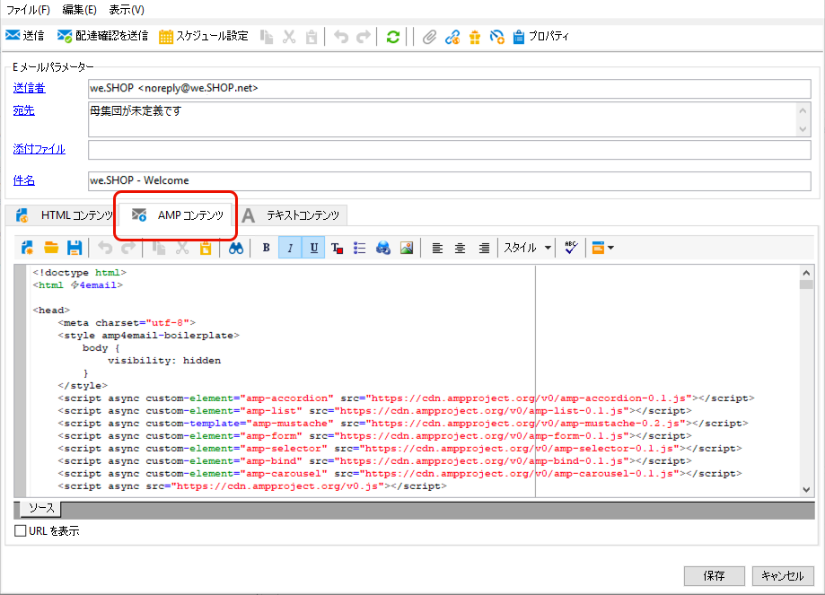

# インタラクティブコンテンツの定義{#defining-interactive-content}

Adobe Campaign では、特定の条件下での動的なメールの送信を可能にする、インタラクティブな [AMP for Email](https://amp.dev/ja/about/email/) 形式を使用することができます。

AMP for Email を使用して、次のことができます。
* 適切に設定された特定のアドレスに対する AMP メールの配信をテストする
* 対応するプロバイダーに登録した後、AMP メールを Gmail または Mail.ru アドレスに配信します。

AMP メールのテストと送信について詳しくは、[この節](#targeting-amp-email)を参照してください。

この機能は、Adobe Campaign の専用パッケージを通じて使用できます。権限とデプロイメントモデルに応じて、このパッケージをインストールするか、アドビに問い合わせてインストールしてもらうことができます。

## AMP for Email について {#about-amp-for-email}

新しい **AMP for Email** フォーマットを使用すると、メッセージに AMP コンポーネントを組み込み、アクションにつながるリッチコンテンツでメールエクスペリエンスを向上させることができます。メール内で直接利用できる最新のアプリ機能により、受信者はメッセージ自体のコンテンツを動的に操作できます。

次に例を示します。
* AMP を使用して記述されたメールには、画像カルーセルなどのインタラクティブな要素を含めることができます。
* コンテンツはメッセージ内で最新の状態に保たれます。
* 受信者は、受信ボックスを離れることなく、フォームに返信できます。

AMP for Email は、既存のメールと互換性があります。メッセージの AMP バージョンは、HTML やプレーンテキストに加えて、新しい MIME パートとしてメールに埋め込まれ、すべてのメールクライアント間での互換性を確保します。

AMP 用メールフォーマット、仕様および要件について詳しくは、[AMP 開発者向けドキュメント](https://amp.dev/ja/documentation/guides-and-tutorials/learn/email-spec/amp-email-format/?format=email)を参照してください。

 [ビデオでこの機能を確認する](#amp-email-video)

## Adobe Campaign で AMP for Email を使用するための主要な手順 {#key-steps-to-use-amp}

Adobe Campaign で AMPメールを正常にテストして送信するには、次の手順に従います。
1. Adobe Campaign 内でメールを作成し、AMP コンテンツを作成します。[Adobe Campaign での AMPメールコンテンツの作成](#build-amp-email-content)を参照してください。
1. AMP フォーマットをサポートするメールプロバイダーからのすべての配信要件に従っていることを確認します。[AMP for Email の配信要件](#amp-for-email-delivery-requirements)を参照してください。
1. ターゲットを定義する場合、AMP フォーマットを表示できる受信者を選択していることを確認してください。[AMPメールのターゲティング](#targeting-amp-email)を参照してください。

   >[!NOTE]
   >
   >現在、AMP メールは、[特定のメールアドレス](#testing-amp-delivery-for-selected-addresses)（テスト用）にのみ配信できるか、サポートされているメールクライアントへの[登録](#delivering-amp-emails-by-registering)後にのみ配信できます。

1. 通常どおりにメールを送信します。[AMPメールの送信](#sending-amp-email)を参照してください。

## Adobe Campaign での AMP メールコンテンツの作成 {#build-amp-email-content}

AMP フォーマットを使用してメールを作成するには、以下の手順に従います。

>[!IMPORTANT]
>
>[AMP 開発者向けドキュメント](https://amp.dev/ja/documentation/guides-and-tutorials/learn/email_fundamentals/?format=email)に記載されている AMP for Email の要件と仕様に従ってください。また、[AMP for Email のベストプラクティス](https://amp.dev/ja/documentation/guides-and-tutorials/develop/amp_email_best_practices/?format=email)も参照してください。

1. メール配信を作成する際に、任意のテンプレートを選択します。

   >[!NOTE]
   >
   >特定の AMP テンプレートには、製品リスト、カルーセル、ダブルオプトイン、調査、高度なサーバーリクエストなど、使用できる主な機能の例が含まれています。

1. 「**[!UICONTROL AMP コンテンツ]**」タブをクリックします。

   

1. 必要に応じて AMP コンテンツを編集します。

   >[!NOTE]
   >
   >最初の AMPメールの作成について詳しくは、[AMP 開発者向けドキュメント](https://amp.dev/ja/documentation/guides-and-tutorials/start/create_email/?format=email)を参照してください。

   例えば、AMP テンプレートの製品リストコンポーネントを使用して、サードパーティ製システムの製品リストを維持したり、Adobe Campaign 内部で製品リストを維持したりできます。価格やその他の要素を調整するたびに、その変更は、受信者がメールボックスからメールを開いたときに自動的に反映されます。

1. 必要に応じて AMP コンテンツをパーソナライズします。通常、Adobe Campaign で HTML フォーマットに対しておこなう場合と同様に、パーソナライゼーションフィールドとパーソナライゼーションブロックを使用します。

   

1. 編集が完了したら、AMP コンテンツ全体を選択して、[AMP Web ベースのバリデーター](https://validator.ampproject.org)または類似の Web サイトにコピー＆ペーストします。

   >[!NOTE]
   >
   >画面の上部にあるドロップダウンリストから **AMP4 EMAIL** を選択していることを確認します。

   

   エラーにはインラインでフラグが付けられます。

   >[!NOTE]
   >
   >Adobe Campaign AMP エディターは、コンテンツの検証用には設計されていません。[AMP web ベースバリデーター](https://validator.ampproject.org)などの外部 web サイトを使用して、コンテンツが正しいことを確認します。

1. AMP コンテンツが検証に合格するまで、必要に応じて修正を加えます。

   

1. コンテンツをプレビューするには、検証済みのコンテンツをコピーして [AMP Playground](https://playground.amp.dev) または類似の web サイトに貼り付けます。

   >[!NOTE]
   >
   >画面の上部にあるドロップダウンリストから **AMP for Email** を選択していることを確認します。

   

   >[!NOTE]
   >
   >AMP コンテンツを Adobe Campaign で直接プレビューすることはできません。[AMP Playground](https://playground.amp.dev) などの外部 Web サイトを使用します。

1. Adobe Campaign に戻り、検証済みのコンテンツを「**[!UICONTROL AMP コンテンツ]**」タブにコピー＆ペーストします。

1. 「**[!UICONTROL HTML コンテンツ]**」タブまたは「**[!UICONTROL テキストコンテンツ]**」タブに切り替えて、これら 2 つのフォーマットのうち少なくとも 1 つに対してコンテンツを定義します。

   >[!IMPORTANT]
   >
   >AMP コンテンツに加えて HTML またはプレーンテキストバージョンがメールに含まれていない場合、そのメールは送信できません。

## AMP for Email の配信要件 {#amp-for-email-delivery-requirements}

Adobe Campaign で AMP コンテンツを作成する場合は、動的なメールの配信条件を満たす必要があります。これは、受信者のメールプロバイダーに固有の条件です。

現在、この形式のテストをサポートしているメールプロバイダーは、Gmail と Mail.ru の 2 つです。

Gmail アカウントに対して AMP 形式で配信をテストするために必要なすべての手順と仕様については、該当する [Gmail](https://developers.google.com/gmail/ampemail?) および [Mail.ru](https://postmaster.mail.ru/amp) 開発者向けドキュメントを参照してください。

特に、次の要件を満たす必要があります。
* [Gmail](https://developers.google.com/gmail/ampemail/security-requirements) および [Mail.ru](https://postmaster.mail.ru/amp/#howto) 特有の AMP セキュリティ要件に従います。
* AMP MIME パートには、[有効な AMP ドキュメント](https://amp.dev/ja/documentation/guides-and-tutorials/learn/validation-workflow/validate_emails/?format=email)が含まれている必要があります。
* AMP MIME パートは 100 KB 未満である必要があります。

また、[Gmail のヒントと既知の制限事項](https://developers.google.com/gmail/ampemail/tips)ドキュメントも参照してください。

## AMP メールのターゲティング {#targeting-amp-email}

現在、次の 2 つの手順で AMPメールの送信をテストできます。

1. Adobe Campaign では、適切に設定されたメールアドレスに対して AMP を利用した動的なメールを配信し、その内容と動作を検証できます。[選択したアドレスに対する AMPメール配信のテスト](#testing-amp-delivery-for-selected-addresses)を参照してください。

1. テストが完了すると、該当するメールプロバイダーに登録して、送信者ドメインを許可リストに追加することにより、AMP for Email プログラムの一環として配信またはキャンペーンを送信できます。[メールプロバイダーへの登録による AMPメールの配信](#delivering-amp-emails-by-registering)を参照してください。

### 選択したアドレスへの AMPメール配信のテスト {#testing-amp-delivery-for-selected-addresses}

Adobe Campaign から選択したメールアドレスへの動的なメッセージの送信をテストできます。

>[!NOTE]
>
>AMP 形式のテストは、Gmail および Mail.ru でのみサポートされています。

Gmail の場合、まずはターゲットとする Gmail アカウント用に Adobe Campaign からの配信に使用する送信者のアドレスを許可リストに追加する必要があります。

手順は次のとおりです。
1. 該当するメールプロバイダーに対して、動的なメールを有効にするオプションがオンになっていることを確認します。
1. 配信の「**[!UICONTROL 送信者]**」フィールドに表示された送信者のアドレスをコピーし、メールプロバイダーのアカウント設定の適切なセクションに貼り付けます。

詳しくは、[Gmail](https://developers.google.com/gmail/ampemail/testing-dynamic-email) 開発者向けドキュメントを参照してください。

Mail.ru アドレスへの AMPメールの送信をテストするには、[Mail.ru 開発者向けドキュメント](https://postmaster.mail.ru/amp/#howto)（**ユーザーの場合**&#x200B;の節）の手順に従います。

### メールプロバイダーへの登録による AMPメールの配信 {#delivering-amp-emails-by-registering}

サポート対象のメールプロバイダーに登録して、送信者ドメインを許可リストに追加することにより、動的なメールの配信を試すことができます。

>[!NOTE]
>
>Gmail と Mail.ru のみが AMP 形式をサポートしています。

複数のアドレスでテストが完了したら、任意の Gmail アドレスに AMP メールを送信できます。そのためには、Google に登録し、回答を待つ必要があります。[Gmail](https://developers.google.com/gmail/ampemail/register) 開発者向けドキュメントに記載されている手順に従います。登録が完了すると、許可された送信者になります。

AMPメールを Mail.ru アドレスに送信するには、[Mail.ru 開発者向けドキュメント](https://postmaster.mail.ru/amp/#howto)に記載されている要件と手順に従います（**メールの送信者の場合**&#x200B;の節を参照）。

## AMP メールの送信 {#sending-amp-email}

AMP コンテンツとフォールバックの準備が整い、互換性のあるターゲットを定義したら、通常どおりにメールを送信できます。

現在、AMP フォーマットは、Gmail と Mail.ru でのみ、特定の条件下でサポートされています。他のメールプロバイダーからのアドレスをターゲットにすることはできますが、メールの HTML またはプレーンテキストバージョンを受信することになります。

>[!IMPORTANT]
>
>AMP コンテンツに加えて HTML またはプレーンテキストバージョンがメールに含まれていない場合、そのメールは送信できません。

合致する受信者は、メールボックスにメールの AMP バージョンが表示されます。

例えば、メールに製品リストを含めた場合、サードパーティ製システムで価格を編集すると、受信者がメールボックスでメールを再び開くたびに、価格が自動的に調整されます。

>[!NOTE]
>
>デフォルトでは、「**[!UICONTROL AMP インクルージョン]**」オプションは「**[!UICONTROL いいえ]**」に設定されています。

## チュートリアルビデオ {#amp-email-video}

以下のビデオでは、Adobe Campaign で AMP をアクティブ化する方法を説明し、使用法を紹介しています。

>[!VIDEO](https://video.tv.adobe.com/v/29940?quality=12&learn=on)
