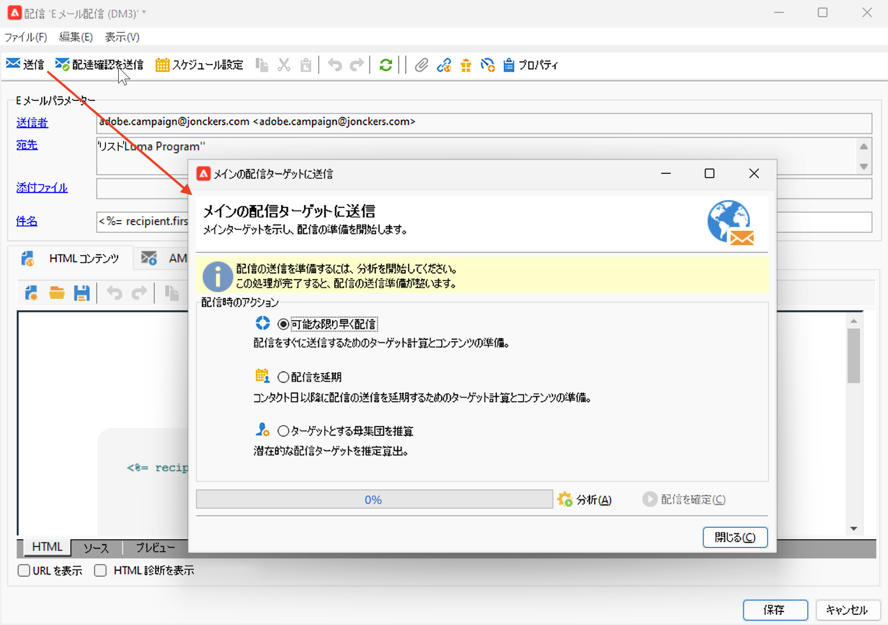
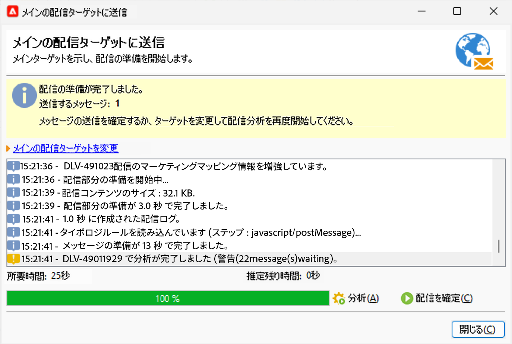
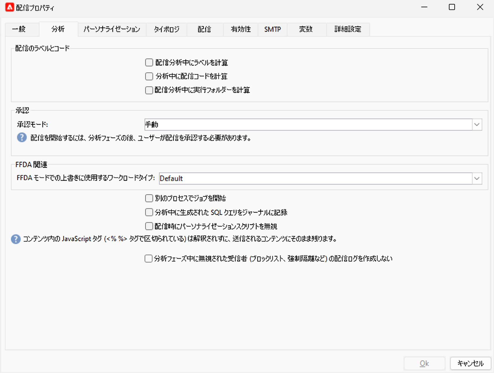

# 配信分析 {#analyze-delivery}

分析は配信の準備段階です。ターゲットオーディエンスが定義され、メッセージコンテンツの準備とテストが完了したら、開始できます。配信分析時に、ターゲット母集団が計算され、配信コンテンツが準備されます。この段階が完了すると、配信は送信できる状態になります。

## 分析の開始 {#start-the-analysis}

配信を準備するには、配信のコンテンツとターゲットが定義されていることを確認し、次の手順に従います。

1. 配信ウィンドウで、「**[!UICONTROL 送信]**」ボタンをクリックします。
1. 「**[!UICONTROL できるだけ早く配信]**」を選択すると、オーディエンス数の計算と、即時に送信するコンテンツの準備が行われます。また、後日まで配信を延期したり、コンテンツを準備せずに母集団の推定数を取得したりすることもできます。

   

1. 「**[!UICONTROL 分析]**」をクリックして、分析を手動で開始します。分析の進捗状況がプログレスバーに表示されます。

   配信分析時に、一連のチェックルールが適用されます。これらのルールは、配信プロパティの「**[!UICONTROL タイポロジ]**」タブで選択する&#x200B;**タイポロジ**&#x200B;で定義されます。タイポロジについて詳しくは、[この節](../../automation/campaign-opt/campaign-typologies.md)を参照してください。

   E メールの場合、デフォルトでは、分析には次の点が含まれます。

   * オブジェクトの検証
   * URL と画像の検証
   * URL ラベルの検証
   * 購読解除リンクの検証
   * 配達確認のサイズの検証
   * 有効期間の検証
   * ウェーブのスケジュールの検証

1. 分析は、「**[!UICONTROL 停止]**」ボタンをクリックしていつでも停止できます。

   準備フェーズでは、メッセージが送信されないので、安全に分析を開始またはキャンセルできます。

   >[!IMPORTANT]
   >
   >分析の実行中、配信（または配達確認）は停止します。配信（または配達確認）への変更を適用するには、再度分析する必要があります。

   分析が終了すると、ウィンドウの上部に、配信準備が完了した、またはエラーが発生したことを示すメッセージが表示されます。すべての検証手順、警告およびエラーが表示されます。色付きのアイコンは、メッセージタイプを示します。

   * 青色のアイコンは、情報メッセージを示します。
   * 黄色のアイコンは、重大ではない処理エラーを示します。
   * 赤色のアイコンは、配信の送信を妨げる重大なエラーを示します。

   {width="800" align="left"}

1. 「**[!UICONTROL 閉じる]**」をクリックし、該当する場合はエラーを修正します。変更を行った後、「**[!UICONTROL 分析]**」をクリックして分析を再開します。

   >[!NOTE]
   >
   >送信するメッセージの数が想定と一致しない場合は、「**[!UICONTROL メインの配信ターゲットを変更]**」リンクをクリックします。このオプションにより、ターゲット母集団の定義を変更して、分析を再開します。

1. 分析の結果を確認した後、「**[!UICONTROL 配信を確定]**」をクリックして、メインターゲットにメッセージを送信します。

## 分析設定 {#analysis-settings}

配信プロパティの「**[!UICONTROL 分析]**」タブを参照して、分析フェーズでのメッセージの準備に関する設定を定義します。

{width="800" align="left"}

このタブで設定できるオプションを次に示します。

* **[!UICONTROL 配信のラベルとコード]**：このセクションのオプションは、配信分析フェーズでこれらのフィールドの値を計算するために使用されます。「**[!UICONTROL 配信分析中に実行フォルダーを計算]**」フィールドを選択すると、分析フェーズにこの配信アクションを格納するフォルダーの名前が計算されます。

* **[!UICONTROL 承認モード]**：このフィールドでは、分析が完了した後に手動で配信するか、自動で配信するかを定義できます。

   分析時に警告が発生した場合（例えば、あるアクセント記号付き文字が配信の件名に含まれていた場合）、配信を設定して、配信を実行するかどうかを定義できます。デフォルトでは、分析フェーズの最後に、メッセージの送信をユーザーが確認する必要があります（**手動**&#x200B;検証）。

   承認モードのフィールドで、ドロップダウンリストから別の承認モードを選択します。

   選択できる承認モードは次のとおりです。

   * **[!UICONTROL 手動]**：分析の終了時に、配信の送信開始をユーザーが確認する必要があります。「**[!UICONTROL 配信を確定]**」ボタンをクリックすると、配信が開始されます。
   * **[!UICONTROL 半自動]**：分析フェーズで警告が発生しなかった場合には送信が自動的に開始されます。
   * **[!UICONTROL 自動]**：分析が終了した時点で、その結果にかかわらず送信が自動的に開始されます。

* **[!UICONTROL 別のプロセスでジョブを開始]**：このオプションを選択すると、別のプロセスで配信分析を開始できます。分析機能は、デフォルトでは、Adobe Campaign アプリケーションサーバープロセス（web nlserver）を使用します。このオプションを選択すると、アプリケーションサーバーにエラーが発生した場合でも分析を完了できます。
* **[!UICONTROL ログの分析中に生成された SQL クエリを記録]**：分析フェーズ中、配信ログに SQL クエリのログを記録します。
* **[!UICONTROL 配信時にパーソナライゼーションスクリプトを無視]**：HTML コンテンツに含まれる JavaScript ディレクティブの解釈をスキップします。このオプションを選択すると、配信されるコンテンツ内に、これらのディレクティブは `<%=` タグで導入されます。

