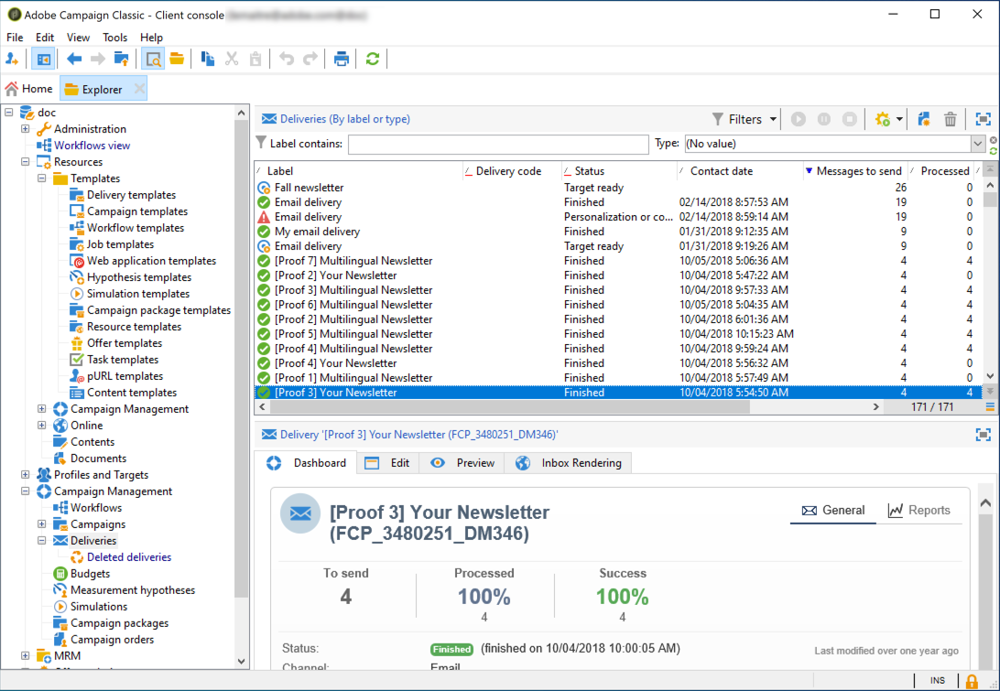
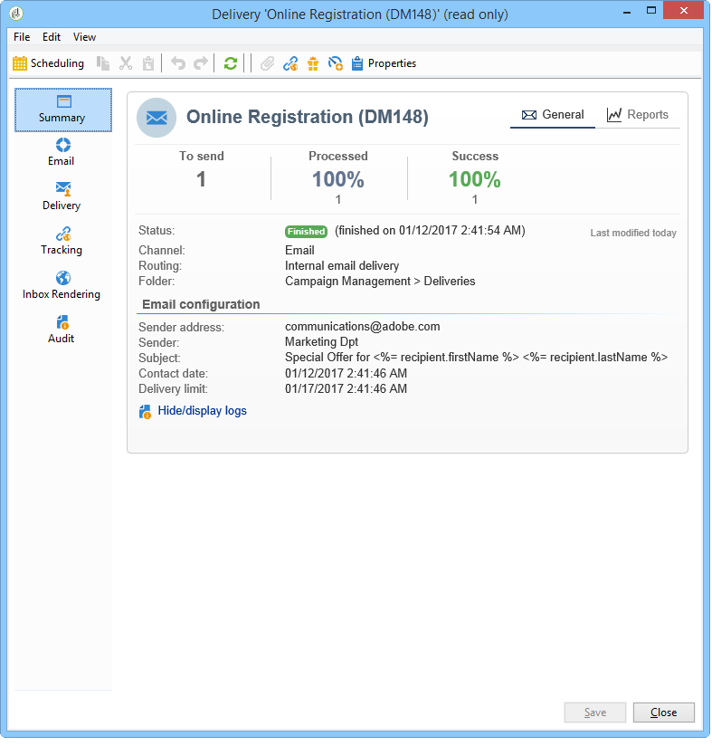
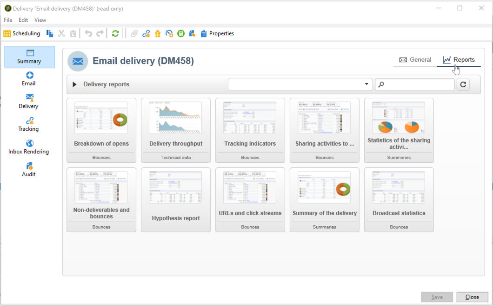
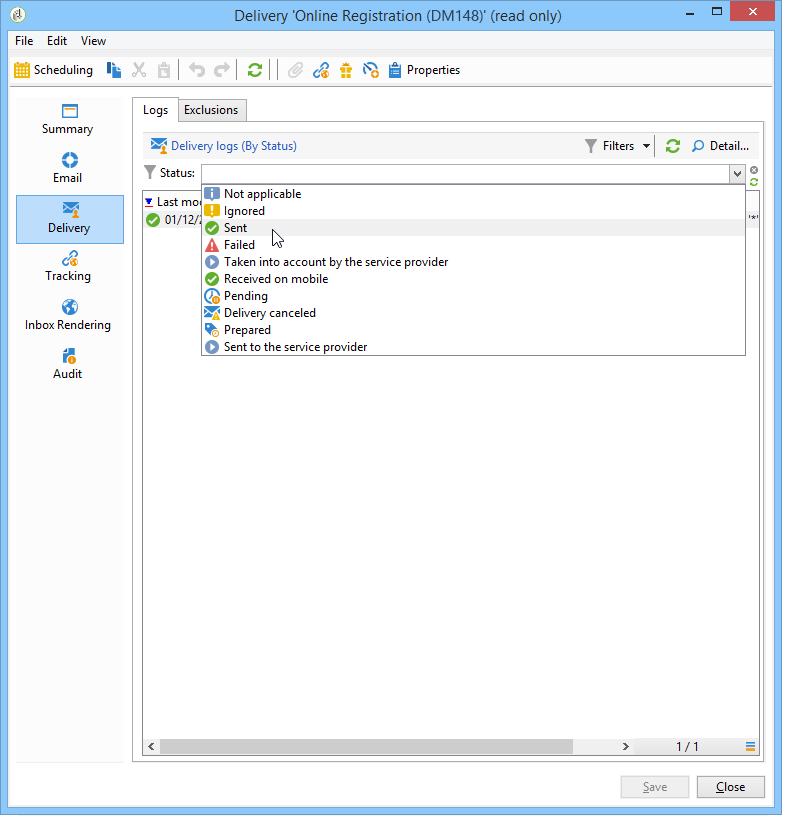
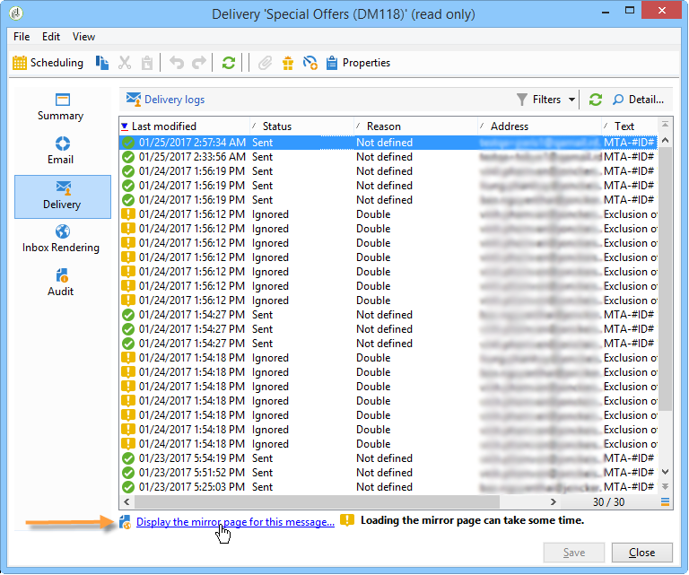
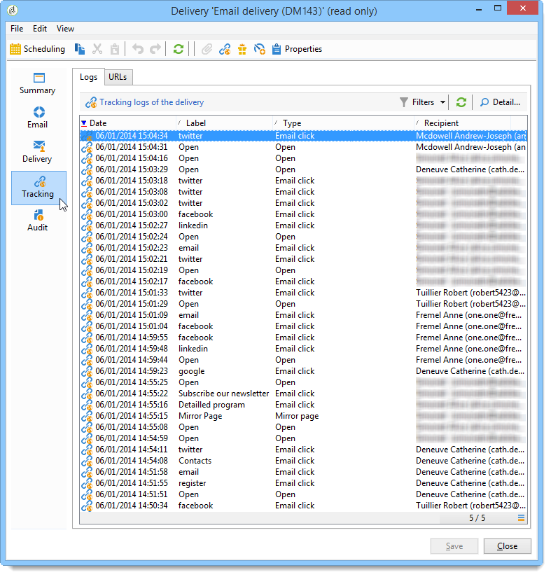
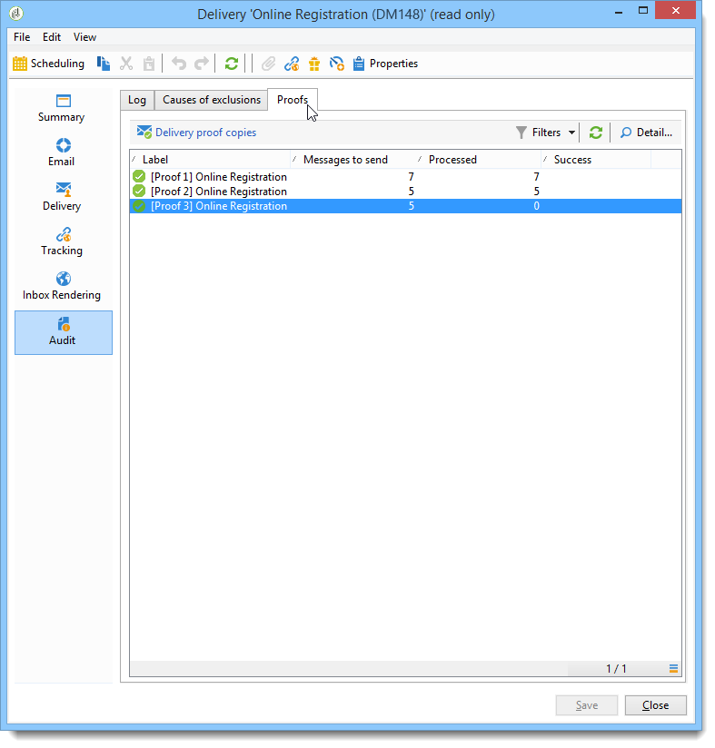

# Campaign UIでの配信の監視 {#delivery-dashboard}

配信を監視することは、キャンペーンを効率的に実施し、顧客にリーチするために不可欠です。 Adobe Campaignには、配信リストと配信ダッシュボードを通じて、配信にアクセスし、そのパフォーマンスを監視するためのツールが用意されています。

## 配信のリストへのアクセス {#list-of-deliveries}

配信には、配信リストからアクセスします。配信リストには、ツリーの&#x200B;**[!UICONTROL キャンペーン管理／配信]**&#x200B;ノードからアクセスします。

デフォルトでは、配信のリストには、選択したノードで作成された配信の名前とステータスが含まれます。 送信するメッセージ数、処理されたメッセージ数および送信が成功したメッセージ数も表示されます。

* **[!UICONTROL 送信するメッセージ]**&#x200B;の数は、分析後かつ配信前にターゲットとされている受信者数に一致します。
* 「**[!UICONTROL 成功]**」列のメッセージの数は、サーバーが送信し、受信者が受け取ったメッセージの数に一致します。
* **[!UICONTROL 処理済み]**&#x200B;メッセージ数は、受信されたメッセージの数にエラーになったメッセージ数を加えたものです。

>[!NOTE]
>
>大量配信時にこれらの値を更新したい場合は、 該当する配信を選択して右クリックします。 **[!UICONTROL アクション／配信とトラッキング指標を再計算]**&#x200B;を選択し、アシスタントを使用してこの情報を更新します。

## 配信ダッシュボードの概要 {#delivery-dashboard-overview}

**配信ダッシュボード**&#x200B;は、配信と、メッセージの送信時に結果として起こる問題を監視するための重要な要素です。

配信の情報を取得し、必要に応じて編集できます。 配信を送信すると、タブのコンテンツは変更できません。

ダッシュボードで使用可能ないくつかのタブを使用して監視できる情報は、次のとおりです。

* [配信の概要](#delivery-summary)
* [配信レポート](#delivery-reports)
* [配信ログ、ミラーページ、除外](#delivery-logs-and-history)
* [配信トラッキングログと履歴](#tracking-logs)
* [配信レンダリング](#delivery-rendering)
* [配信監査](#delivery-audit-)

**関連トピック：**

* [配信失敗について](delivery-failures.md)
* [強制隔離の管理](quarantines.md)
* [配信のベストプラクティス](../start/delivery-best-practices.md)
* [配信品質の管理](about-deliverability.md)

## 配信の概要 {#delivery-summary}

「**[!UICONTROL 概要]**」タブには、配信のステータス、使用するチャネル、送信者に関する情報、件名、実行に関連する情報など、配信の特性が表示されています。

## 配信レポート {#delivery-reports}

「**[!UICONTROL レポート]**」リンクは、「**[!UICONTROL 概要]**」タブからアクセスでき、一般配信レポート、詳細レポート、配信レポート、失敗したメッセージの配信、開封率、クリック数、トランザクション数などの、配信操作に関連するレポートのセットを確認できます。

このタブの内容は、必要に応じて設定できます。 配信レポートについて詳しくは、[この節](../reporting/delivery-reports.md)を参照してください。

## 配信ログ、履歴および除外 {#delivery-logs-and-history}

「**[!UICONTROL 配信]**」タブには、この配信内で発生した事象の履歴が表示されます。 このタブには、配信ログ、つまり、送信されたメッセージのリストとそのステータスおよび関連メッセージが含まれます。

1 つの配信について、（例えば）配信が失敗した受信者や、アドレスが強制隔離中の受信者のみを表示できます。 そのためには、「**[!UICONTROL フィルター]**」ボタンをクリックして、「**[!UICONTROL ステータス別]**」を選択します。 ドロップダウンリストでステータスを選択します。 様々なステータスが[配信ステータス ページ &#x200B;](delivery-statuses.md)に一覧表示されます。

>[!NOTE]
>
>配信ログを表示するリストは、Campaignの任意のリストと同様にカスタマイズできます。 例えば、配信で各メールを送信した IP アドレスを示す列を追加できます。 リストの表示について詳しくは、[この節](../config/ui-settings.md#customize-lists)を参照してください。

「**[!UICONTROL このメッセージのミラーページを表示]**」リンクを使用して、リストから選択した配信のコンテンツのミラーページを新しいウィンドウに表示できます。

ミラーページは、HTML コンテンツが定義済みの配信に対してのみ表示できます。 詳しくは、[&#x200B; ミラーページへのリンク &#x200B;](mirror-page.md)を参照してください。

## 配信トラッキングのログと履歴 {#tracking-logs}

「**[!UICONTROL トラッキング]**」タブには、この配信のトラッキング履歴が一覧表示されます。 このタブには、送信されたメッセージのトラッキングデータ、つまり、Adobe Campaign によってトラッキングされたすべての URL が表示されます。 トラッキングデータは 1 時間ごとに更新されます。

>[!NOTE]
>
>配信トラッキングが有効になっていない場合、このタブは表示されません。

トラッキング設定は、配信アシスタントの適切なステージで実行されます。 [トラッキングするリンクの設定方法](tracking.md)を参照してください。

**[!UICONTROL トラッキング]**&#x200B;データは、配信レポートに表示されます。 詳しくは、[この節](../reporting/delivery-reports.md)を参照してください。

## 受信ボックスレンダリング {#delivery-rendering}

「**[!UICONTROL 受信ボックスレンダリング]**」タブにより、異なるコンテキストで受信される可能性のある送信済みのメッセージをプレビューして、メジャーなデスクトップおよびアプリケーションの互換性を確認できます。

これにより、様々な Web クライアント、Web メールおよびデバイスで受信者へのメッセージの表示が最適化されていることを確認してください。

受信ボックスレンダリングについて詳しくは、[このページ](inbox-rendering.md)を参照してください。

## 配信監査 {#delivery-audit-}

「**[!UICONTROL 監査]**」タブには、配信ログと、配達確認に関連するすべてのメッセージが含まれます。

**[!UICONTROL 更新]**&#x200B;ボタンを使用してデータを更新できます。 「**[!UICONTROL フィルター]**」ボタンを使用して、データに対してフィルターを定義します。

特別なアイコンによって、エラーまたは警告を識別できます。 [配信分析](delivery-analysis.md)を参照してください。

「**[!UICONTROL 配達確認]**」サブタブには、送信済みの配達確認のリストが表示されます。

表示する列を選択することによって、このウィンドウ（および「**[!UICONTROL 配信]**」タブと「**[!UICONTROL トラッキング]**」タブ）に表示される情報を変更できます。 そのためには、右下隅にある&#x200B;**[!UICONTROL リストを設定]**&#x200B;アイコンをクリックします。 リストの表示について詳しくは、[この節](../config/ui-settings.md#customize-lists)を参照してください。

## 配信ダッシュボードの同期 {#delivery-dashboard-synchronization}

配信が正常に送信されたことを確認するために、配信ダッシュボードから、処理されたメッセージおよび配信ログを確認できます。

一部の指標またはステータスが間違っていたり、最新ではないことがあります。これは、次の解決策で解消できる場合があります。

* 配信ステータスが正しくない場合は、この配信に必要なすべての承認が実行されているか、**[!UICONTROL operationMgt]**&#x200B;および&#x200B;**[!UICONTROL deliveryMgt]**&#x200B;のテクニカルワークフローがエラーなしで実行されていることを確認してください。

* 配信カウンターが配信と一致しない場合は、Adobe Campaign エクスプローラーで関連する配信を右クリックし、**[!UICONTROL アクション]**／**[!UICONTROL 配信とトラッキング指標を再計算]**&#x200B;を選択して、指標を再計算して再同期してください。 トラッキング指標について詳しくは、この[節](../reporting/delivery-reports.md#tracking-indicators)を参照してください。

配信ダッシュボードで各種レポートの配信をトラッキングすることもできます。 詳しくは、[この節](../reporting/delivery-reports.md)を参照してください。

>[!NOTE]
>
>Campaign v8 Managed Cloud Services ユーザーの場合、インフラストラクチャはAdobeによって監視および管理されます。 配信指標またはダッシュボードの同期に関して永続的な問題が発生した場合は、Adobe カスタマーケアにお問い合わせください。

## 配信が遅い場合のトラブルシューティング {#troubleshooting-slow-deliveries}

**[!UICONTROL 送信]** ボタンをクリックした後、配信に通常よりも時間がかかるようであれば、次の可能性のある原因を確認してください。

### IP アドレスのレピュテーションの問題

一部のメールプロバイダーが、ブロックリストに IP アドレスを追加している可能性があります。 レピュテーションの問題を示すバウンスメッセージについては、**[!UICONTROL 配信]** タブで配信ログ（ブロードログ）を確認してください。 レピュテーション管理に関するガイダンスについては、[配信品質モニタリング &#x200B;](monitoring-deliverability.md) セクションを参照してください。

### 配信のサイズと複雑さ

配信が大きすぎて迅速に処理できない場合があります。 この問題は、次の場合に発生する可能性があります。

JavaScriptを詳細にパーソナライズするには、受信者ごとに膨大なデータ処理が必要です。

HTMLのコンテンツが大きく、画像が組み込まれているか、大規模なパーソナライゼーションが原因で、重さが60 キロバイトを超える配信。

コンテンツガイドラインとパーソナライゼーションのベストプラクティスについて詳しくは、[配信のベストプラクティス &#x200B;](../start/delivery-best-practices.md)を参照してください。 最適なパフォーマンスを得るために、推奨される最大サイズは約35 KBです。

### システムパフォーマンス

システムの問題により、サーバーが配信を効率的に処理できなくなる可能性があります。 パフォーマンスの問題が疑われる場合は、配信ログでタイムアウトエラーまたは通信の問題を確認してください。

>[!NOTE]
>
>Campaign v8 Managed Cloud Services ユーザーの場合、サーバーインフラストラクチャの監視はAdobeによって管理されます。 配信送信で永続的なパフォーマンスの問題が発生した場合は、Adobe カスタマーケアに配信ログを送信します。
