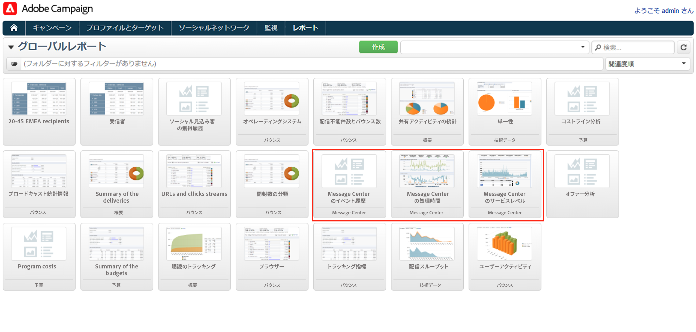
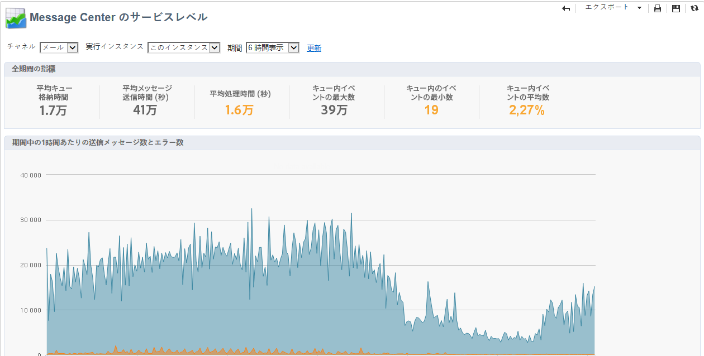
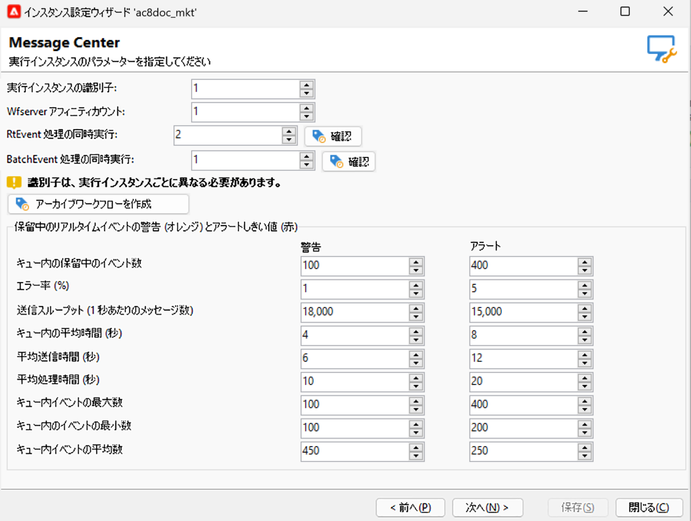

# トランザクションメッセージの送信と監視 {#delivery-execution}

## メッセージの送信{#send-transactional-msg}

エンリッチメントが完了し、配信テンプレートをイベントにリンクすると、配信は実行インスタンスから送信されます。

>[!NOTE]
>
>トランザクションメッセージは、他の配信よりも優先されます。

すべての配信は、**[!UICONTROL 管理／プロダクション／Message Center／デフォルト／配信]**&#x200B;フォルダーにまとめられます。

デフォルトでは、配信は配信月ごとにサブフォルダーに並べ替えられます。これは、メッセージテンプレートプロパティで変更できます。

## メッセージの監視 {#monitor-transactional-msg}

トランザクションメッセージを監視するには、[配信ログ](send.md)を確認します。

実行インスタンスから送信されるトランザクション配信は、1 時間ごとに実行されるテクニカルワークフロー（**[!UICONTROL Message Center 実行インスタンス]**）を通じてコントロールインスタンスに同期されます。

>[!NOTE]
>
>配信は、イベント作成日ではなく、最新のイベント更新に基づいて、毎週イベントを累積します。したがって、コントロールインスタンスからトランザクションメッセージング配信ログを抽出する場合、各配信ログ ID に関連付けられている配信 ID は、ログが更新されると、時間の経過と共に変わる場合があります（例えば、イベントに対して受信したバウンス）。

<!--
To monitor the activity and running of the execution instance(s), see [Transactional messaging reports](transactional-messaging-reports.md).-->

## レポート{#reporting-transactional-msg}

Adobe Campaign では、実行インスタンスのアクティビティとスムーズな運用をコントロールできるように、複数のレポートを用意しています。

これらの Message Center レポートは、**コントロールインスタンス**&#x200B;の「**[!UICONTROL レポート]**」タブからアクセスできます。

### Message Center のイベント履歴 {#history-events}

この **[!UICONTROL Message Center のイベント履歴]** レポートには、Message Center モジュールのアクティビティの概要、つまり、処理済みのイベント数とトランザクションメッセージとして配信されたイベント数が表示されます。

レポートを開いた際にデフォルトで表示される情報は、送信に成功したトランザクションメッセージの割合を示します。その他のレベルを閲覧するには、各ノードを開き、適切なレベルにカーソルを合わせて選択します。

各イベントタイプのデータを一定期間ごとに表示することができます。「**[!UICONTROL イベント数]**」の列は、それぞれのコントロールインスタンスが受信したイベントの数を示します。パーソナライズされたトランザクションメッセージに変換済みのイベントの数は、「**[!UICONTROL 送信数]**」の列に表示されます。

### Message Center の処理時間 {#processing-time}

この **[!UICONTROL Message Center の処理時間]** レポートには、リアルタイムキューに関する主な指標が表示されます。 このレポートには、 **[!UICONTROL 監視]** 」タブをクリックします。

グローバルな統計または特定の実行インスタンスに関する統計を表示するように選択できます。 チャネル別や、指定の期間でデータをフィルタリングすることもできます。

「**[!UICONTROL 全期間の指標]**」セクションに表示される指標は、選択した期間を対象に計算されます。

* **[!UICONTROL 平均キュー格納時間]**：Message Center が処理に成功したイベントに費やした時間。処理時間のみが考慮されます。
* **[!UICONTROL 平均メッセージ送信時間（秒）]**：Message Center が処理に成功したイベントに費やした時間。MTA 配信時間のみが考慮されます。
* **[!UICONTROL 平均処理時間（秒）]**：Message Center が処理に成功したイベントに費やした時間。この計算では処理時間および MTA 送信時間が考慮されます。
* **[!UICONTROL キュー内イベントの最大数]**：任意の時点で Message Center 内に存在したイベント数の最大値。
* **[!UICONTROL キュー内イベントの最小数]**：任意の時点で Message Center 内に存在したイベント数の最小値。
* **[!UICONTROL キュー内イベントの平均数]**：任意の時点で Message Center 内に存在したイベント数の平均値。

>[!NOTE]
>
>警告（オレンジ）およびアラート（赤）指標のしきい値は、Adobe Campaign デプロイウィザードで設定することができます。[しきい値の監視](#thresholds)を参照してください。

### Message Center のサービスレベル {#service-level}

この **[!UICONTROL Message Center サービスレベル]** レポートには、トランザクションメッセージに関する配信統計と、エラーの分類が表示されます。 エラーのタイプをクリックするとエラーの詳細を表示できます。

このレポートには、 **[!UICONTROL 監視]** 」タブをクリックします。

グローバルな統計または特定の実行インスタンスに関する統計を表示するように選択できます。 チャネル別や、指定の期間でデータをフィルタリングすることもできます。

「**[!UICONTROL 全期間の指標]**」セクションに表示される指標は、選択した期間を対象に計算されます。

* **[!UICONTROL 受信 (スループット、1 時間あたりのイベント数)]**：Message Center のキューに入ったイベントの 1 時間あたりの平均数。
* **[!UICONTROL 受信 (イベントの量)]**：Message Center のキューに入ったイベントの数。
* **[!UICONTROL 送信 (スループット、1 時間あたりのメッセージ数)]**：送信に成功した Message Center のイベントの 1 時間あたりの平均数（配信による送信）。
* **[!UICONTROL 送信（メッセージの量）]**：送信に成功した Message Center のイベントの数（配信による送信）。
* **[!UICONTROL 平均送信時間（秒）]**：Message Center が処理に成功したイベントに費やした平均時間。この計算では処理時間および MTA 送信時間が考慮されます。
* **[!UICONTROL エラー率]**：Message Center のキューに入ったイベント数に対する、エラーとなったイベント数、考慮されるエラーは、ルーティングエラー、期限切れのイベント（期限を超えてキューに残っていたイベント）、配信エラー、配信で無視（強制隔離など）です。

>[!NOTE]
>
>警告（オレンジ）およびアラート（赤）指標のしきい値は、Adobe Campaign デプロイウィザードで設定することができます。[しきい値の監視](#thresholds)を参照してください。

### しきい値の監視 {#thresholds}

警告（オレンジ）およびアラート（赤）のしきい値は、 **Message Center サービスレベル** および **Message Center の処理時間** レポート。

これを行うには、次の手順に従います。

1. でデプロイウィザードを開きます。 **実行インスタンス**&#x200B;をクリックし、 **[!UICONTROL Message Center]** ページ。
1. 矢印でしきい値を変更します。

   

