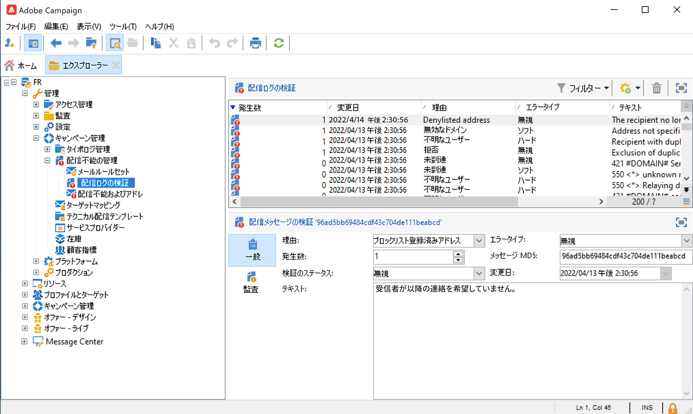
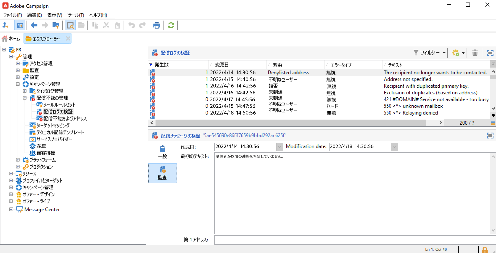
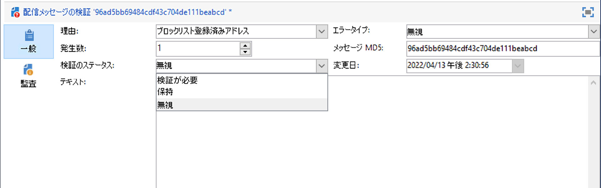

# 配信の失敗について{#delivery-failures}

バウンスは、配信の試行とエラーの結果、ISP からエラー通知が返されたものを表します。バウンス処理は、リストの衛生状態の重要な部分です。特定のメールが連続して複数回バウンスした後、このプロセスにより、抑制のフラグが設定されます。このプロセスでは、システムが無効なメールアドレスの送信を継続するのを防ぎます。バウンスは、IP レピュテーションを判断するために ISP が使用する、データの重要な要素の 1 つです。この指標に目を通すことが重要です。「配信済み」と「バウンス済み」は、おそらくマーケティングメッセージの配信を測定する際の、最も一般的な方法です。配信率が高いほど、より良い結果が得られます。

メッセージをプロファイルに送信できない場合、リモートサーバーは自動的にエラーメッセージを Adobe Campaign に送信します。このエラーは、メールアドレス、電話番号、またはデバイスを強制隔離する必要があるかどうかを判断するために適合されます。[バウンスメールの管理](#bounce-mail-qualification)を参照してください。

メッセージを送信すると、各プロファイルの配信ステータス、関連するエラーのタイプと理由が配信ログに表示されます。

メールアドレスが強制隔離された場合、またはプロファイルがブロックリストに登録されている場合、配信の準備段階で受信者が除外されます。除外されたメッセージのリストは、配信ダッシュボードに表示されます。

## メッセージの配信が失敗した理由 {#delivery-failure-reasons}

メッセージエラーには次の 2 つのタイプがあります。それぞれのエラータイプによって、アドレスが[強制隔離](quarantines.md#quarantine-reason)されるかどうかが決まります。


* **ハードバウンス**
ハードバウンスは、ISP が加入者アドレスへのメーリングの試行を配信不能と判断した後に生成される、永続的なエラーです。Adobe Campaign 内では、配信不能と分類されたハードバウンスは強制隔離に追加され、再試行されません。エラーの原因が不明な場合、ハードバウンスが無視されることがあります。

   ハードバウンスの一般的な例：アドレスが存在しない、無効なアカウント、無効な構文、無効なドメイン


* **ソフトバウンス**
ソフトバウンスは、メールの配信が困難な場合に ISP によって生成される、一時的なエラーです。ソフトエラーは、配信を成功させる試みとして、複数回（カスタム配信設定または標準提供の配信設定の使用に応じて異なる）再試行されます。継続的にソフトバウンスを行うアドレスは、再試行の最大回数に到達するまで強制隔離に追加されません（設定によって異なります）。

   ソフトバウンスの一般的な原因：メールボックス容量超過、受信メールサーバーの停止、送信者の評判の問題


**無視**&#x200B;は、一時的であることがわかっているエラー（「外出中」など）、または技術的エラー（送信者タイプが「postmaster」である場合など）です。


### バウンスメールの選定 {#bounce-mail-qualification}

配信エラーを検証するために Campaign で使用されるルールは、 **[!UICONTROL 管理／キャンペーン管理／配信不能件数の管理／配信ログの検証]**&#x200B;ノードにリストされます。このリストは完成形ではなく、Adobe Campaign によって定期的に更新されます。ユーザーが管理することもできます。



**[!UICONTROL 配信ログの検証]**&#x200B;テーブルのバウンス選定は、**同期**&#x200B;配信の失敗エラーメッセージには使用されなくなりました。Momentum は、バウンスのタイプと選定を決定し、その情報を Campaign に返します。

**非同期**&#x200B;バウンスは、引き続き、**[!UICONTROL インバウンド E メール]**&#x200B;ルールを通じて inMail プロセスで選定されます。

このエラータイプが最初に発生したときにリモートサーバーから返されたメッセージは、「**[!UICONTROL 監査]**」タブの&#x200B;**[!UICONTROL 最初のテキスト]**&#x200B;列に表示されます。



Adobe Campaign は、このメッセージをフィルター処理して変数コンテンツ（ID、日付、E メールアドレス、電話番号など）を削除し、フィルター処理した結果を&#x200B;**[!UICONTROL テキスト]**&#x200B;列に表示します。変数は、**`#xxx#`** で置き換えられます（ただし、アドレスは **`*`** で置き換えられます）。

このプロセスで同じタイプのすべてのエラーをまとめることにより、同じようなエラーの複数のエントリが配信ログの検証テーブルに含まれないようにすることができます。

>[!NOTE]
>
>「**[!UICONTROL 発生数]**」フィールドには、リスト内のメッセージの発生回数が表示されます。上限は 100,000 回です。このフィールドは、リセットする場合など、必要に応じて編集できます。

バウンスメールは、次の検証ステータスを持つことができます。

* **[!UICONTROL 検証必要]**：バウンスメールを選定できませんでした。選定を配信品質チームに割り当てて、効率的なプラットフォーム配信品質を保証する必要があります。選定されていないバウンスメールは、メール管理ルールのリストのエンリッチメントには使用されません。
* **[!UICONTROL 保持]**：バウンスメールは選定されました。**配信品質の更新**&#x200B;ワークフローは、このバウンスメールを既存のメール管理ルールとの比較およびリストのエンリッチメントに使用します。
* **[!UICONTROL 無視]**：バウンスメールは無視され、このバウンスによって受信者のアドレスが隔離されることはありません。**配信品質の更新**&#x200B;ワークフローでは使用されず、クライアントインスタンスに送信されません。




>[!NOTE]
>
>ISP を利用できなくなった場合、Campaign を通じて送信された E メールは、誤ってバウンスとしてマークされます。 これを修正するには、バウンスの認定条件を更新する必要があります。 


## 再試行管理 {#retries}

一時的なエラー（**ソフト**&#x200B;または&#x200B;**無視**）の後でメッセージ配信が失敗した場合、Campaign は送信を再試行します。これらの再試行は、配信期間が終了するまで実行できます。再試行の回数と頻度は、メッセージの ISP から返されるバウンス応答のタイプと重大度に基づいて、Momentum によって設定されます。

デフォルトの設定では、1 時間間隔で 5 回、その後 4 日間は 1 日に 1 回再試行されます。再試行の回数は、グローバルに変更することも、配信または配信テンプレートごとに変更することもできます。配信期間と再試行を適応させる必要がある場合は、アドビサポートにお問い合わせください。

## 同期エラーと非同期エラー {#synchronous-and-asynchronous-errors}

メッセージの配信は、即座に失敗することがあります。その場合は、同期エラーと見なします。メッセージの送信が失敗した場合や送信後に失敗した場合、エラーは非同期的になります。

これらのタイプのエラーは、次のように管理されます。

* **同期エラー**：Adobe Campaign 配信サーバーからアクセスされたリモートサーバーが即座にエラーメッセージを返します。配信をプロファイルのサーバーに送ることは許可されません。Adobe Campaign が個々のエラーを評価して、そのメールアドレスを強制隔離すべきかどうかを判断します。[バウンスメールの選定](#bounce-mail-qualification)を参照してください。

* **非同期エラー**：バウンスメールまたは SR が受信サーバーによって後で再送信されます。このエラーは、エラーに関連するラベルで検証されます。 非同期エラーは、配信の送信から 1 週間は発生する可能性があります。

   >[!NOTE]
   >
   >Managed Services のユーザーの場合、バウンスメールボックスの設定はアドビが実行します。

   フィードバックループはバウンス E メールのように機能します。ユーザーがメールをスパムとみなしたら、Adobe Campaign でメールルールを設定して、このユーザーへのすべての配信をブロックできます。このようなユーザーのアドレスは、購読解除リンクをクリックしなかった場合でも、ブロックリストに登録されます。アドレスは、（**NmsRecipient**）受信者テーブルではなく、（**NmsAddress**）強制隔離テーブルでブロックリストに登録されます。フィードバックループのメカニズムについて詳しくは、[Adobe 配信品質のベストプラクティスガイド](https://experienceleague.adobe.com/docs/deliverability-learn/deliverability-best-practice-guide/transition-process/infrastructure.html?lang=ja#feedback-loops)を参照してください。


## メールのエラータイプ {#email-error-types}

メールチャネルについて、配信エラーの考えられる理由を以下に示します。

<table> 
 <tbody> 
  <tr> 
   <td> エラーラベル </td> 
   <td> エラータイプ </td> 
   <td> 技術値 </td> 
   <td> 説明 </td> 
  </tr> 
  <tr> 
   <td> 無効なアカウント </td> 
   <td> ソフト／ハード </td> 
   <td> 4 </td> 
   <td> アドレスにリンクされているアカウントはもはやアクティブではありません。インターネットアクセスプロバイダー（IAP）は、長期間使用されていないことを検出すると、そのユーザーのアカウントをクローズできます。そのユーザーのアドレスへの配信は不可能になります。アカウントが 6 か月間使用されていないことが原因で一時的に無効になっていて、まだ有効化することができる場合は、エラーありステータスが割り当てられ、エラーカウンターが 5 に達するまでアカウントが再試行されます。アカウントが永続的に無効化されたことをエラーが示している場合は、アカウントは直接強制隔離に設定されます。<br /> </td> 
  </tr> 
  <tr> 
   <td> 強制隔離中のアドレス </td> 
   <td> ハード </td> 
   <td> 9 </td> 
   <td> アドレスは強制隔離されました。<br /> </td> 
  </tr> 
  <tr> 
   <td> アドレスが未指定 </td> 
   <td> ハード </td> 
   <td> 7 </td> 
   <td> 受信者のアドレスが指定されていません。<br /> </td> 
  </tr> 
  <tr> 
   <td> 低品質のアドレス </td> 
   <td> 無視 </td> 
   <td> 14 </td> 
   <td> このアドレスの品質評価が低すぎます。<br /> </td> 
  </tr> 
  <tr> 
   <td> ブロックリスト登録済みアドレス </td> 
   <td> ハード </td> 
   <td> 8 </td> 
   <td> 送信時にアドレスがブロックリストに追加されました。このステータスは、外部リストおよび外部システムからデータを Adobe Campaign の強制隔離リストにインポートするために使用します。<br /> </td> 
  </tr> 
  <tr> 
   <td> 制御アドレス </td> 
   <td> 無視 </td> 
   <td> 127 </td> 
   <td> 受信者のアドレスはコントロール母集団に含まれています。<br /> </td> 
  </tr> 
  <tr> 
   <td> 重複 </td> 
   <td> 無視 </td> 
   <td> 10 </td> 
   <td> 受信者のアドレスがこの配信に既に存在しました。<br /> </td> 
  </tr> 
  <tr> 
   <td> 無視されたエラー </td> 
   <td> 無視 </td> 
   <td> 25 </td> 
   <td> アドレスは許可リストに登録されています。したがってエラーは無視され、E メールは送信されます。<br /> </td> 
  </tr> 
  <tr> 
   <td> 判別後に除外 </td> 
   <td> 無視 </td> 
   <td> 12 </td> 
   <td> 受信者が「判別」タイプのキャンペーンタイポロジルールによって除外されました。<br /> </td> 
  </tr> 
  <tr> 
   <td> SQL ルールによって除外 </td> 
   <td> 無視 </td> 
   <td> 11 </td> 
   <td> 受信者が「SQL」タイプのキャンペーンタイポロジルールによって除外されました。<br /> </td> 
  </tr> 
  <tr> 
   <td> 無効なドメイン </td> 
   <td> ソフト </td> 
   <td> 2 </td> 
   <td> E メールアドレスのドメインが正しくないか、存在しません。このプロファイルは、エラーカウントが 5 にならない限り、再びターゲットになります。その後、レコードは強制隔離ステータスに設定され、以降は再試行されなくなります。<br /> </td> 
  </tr> 
  <tr> 
   <td> メールボックス容量超過 </td> 
   <td> ソフト </td> 
   <td> 5 </td> 
   <td> このユーザーのメールボックスはいっぱいになっていて、メッセージをこれ以上受け入れることができません。このプロファイルは、エラーカウントが 5 にならない限り、再びターゲットになります。その後、レコードは強制隔離ステータスに設定され、以降は再試行されなくなります。<br />このタイプのエラーはクリーンアッププロセスによって管理されます。アドレスは 30 日後に有効なステータスに設定されます。<br />警告：強制隔離されたアドレスのリストからアドレスを自動的に削除するには、データベースのクリーンアップテクニカルワークフローを開始する必要があります。<br /> </td> 
  </tr> 
  <tr> 
   <td> 未接続 </td> 
   <td> 無視 </td> 
   <td> 6 </td> 
   <td> メッセージが送信されたときに受信者の携帯電話の電源が切れていたか、ネットワークに接続されていませんでした。<br /> </td> 
  </tr> 
  <tr> 
   <td> 未定義 </td> 
   <td> 未定義 </td> 
   <td> 0 </td> 
   <td> エラーがまだインクリメントされていないので、アドレスは選定中です。このタイプのエラーは、サーバーが新しいエラーメッセージを送信すると発生します。単独のエラーである可能性もありますが、再度発生した場合はエラーカウンターがインクリメントされ、テクニカルチームに警告されます。その後、テクニカルチームは、ツリー構造の<span class="uicontrol">管理</span>／<span class="uicontrol">キャンペーン管理</span>／<span class="uicontrol">配信不能件数の管理</span>ノードからメッセージの分析を実行し、このエラーを検証します。<br /> </td> 
  </tr> 
  <tr> 
   <td> オファーを受ける資格がない </td> 
   <td> 無視 </td> 
   <td> 16 </td> 
   <td> 受信者には配信でオファーを受ける資格がありませんでした。<br /> </td> 
  </tr> 
  <tr> 
   <td> 拒否 </td> 
   <td> ソフト／ハード </td> 
   <td> 20 </td> 
   <td> アドレスは、スパムレポートであるというセキュリティフィードバックが原因で強制隔離されました。アドレスは、エラーに応じて、エラーカウンターが 5 に達するまで再試行されるか、直接強制隔離されます。<br /> </td> 
  </tr> 
  <tr> 
   <td> サイズが制限されたターゲット </td> 
   <td> 無視 </td> 
   <td> 17 </td> 
   <td> 受信者に対する最大配信サイズに達しました。<br /> </td> 
  </tr> 
  <tr> 
   <td> 未適合のアドレス </td> 
   <td> 無視 </td> 
   <td> 15 </td> 
   <td> 郵便物の送付先住所が選定されていません。<br /> </td> 
  </tr> 
  <tr> 
   <td> 未到達 </td> 
   <td> ソフト／ハード </td> 
   <td> 3 </td> 
   <td> メッセージ配信チェーンでエラーが発生しました。SMTP リレーに関するインシデント、ドメインへの一時的な未到達などの可能性があります。アドレスは、エラーに応じて、エラーカウンターが 5 に達するまで再試行されるか、直接強制隔離されます。<br /> </td> 
  </tr> 
  <tr> 
   <td> 不明なユーザー </td> 
   <td> ハード </td> 
   <td> 1 </td> 
   <td> アドレスが存在しません。このプロファイルに対する配信はこれ以上試行されません。<br /> </td> 
  </tr> 
 </tbody> 
</table>


## プッシュ通知のエラータイプ {#push-error-types}

モバイルアプリチャネルの場合に考えられる配信エラーの理由を次に示します。

### iOS での強制隔離 {#ios-quarantine}

HTTP/V2 プロトコルでは、プッシュ配信ごとの直接フィードバックおよびステータスを使用できます。HTTP/V2 プロトコルコネクタを使用する場合、フィードバックサービスが **[!UICONTROL mobileAppOptOutMgt]** ワークフローによって呼び出されることはありません。モバイルアプリケーションのアンインストールまたは再インストールがおこなわれた場合、トークンは登録解除されたものとみなされます。

同時に、APNs がメッセージに対して登録解除ステータスを返した場合、ターゲットトークンはただちに強制隔離されます。

<table> 
 <tbody> 
  <tr> 
   <td> <strong>シナリオ</strong><br /> </td> 
   <td> <strong>ステータス</strong><br /> </td> 
   <td> <strong>エラーメッセージ</strong><br /> </td> 
   <td> <strong>エラータイプ</strong><br /> </td> 
   <td> <strong>エラーの理由</strong><br /> </td> 
   <td> <strong>再試行</strong><br /> </td> 
  </tr> 
  <tr> 
   <td> ターゲットデバイスの電源がオン<br /> </td> 
   <td> OK<br /> </td> 
   <td> </td> 
   <td> </td> 
   <td> </td> 
   <td> </td> 
  </tr> 
  <tr> 
   <td> ターゲットデバイスの電源がオフ<br /> </td> 
   <td> OK<br /> </td> 
   <td> </td> 
   <td> </td> 
   <td> </td> 
   <td> </td> 
  </tr> 
  <tr> 
   <td> ユーザーがアプリケーションの通知を無効化<br /> </td> 
   <td> OK<br /> </td> 
   <td> </td> 
   <td> </td> 
   <td> </td> 
   <td> </td> 
  </tr> 
  <tr> 
   <td> メッセージの作成／分析フェーズ - ペイロードが大きすぎる<br /> </td> 
   <td> 失敗<br /> </td> 
   <td> ペイロードが長すぎる<br /> </td> 
   <td> ソフト<br /> </td> 
   <td> 拒否<br /> </td> 
   <td> ×<br /> </td> 
  </tr> 
  <tr> 
   <td> メッセージの作成／分析フェーズ - 予期しないコンテンツ形式の問題<br /> </td> 
   <td> 失敗<br /> </td> 
   <td> エラーによってエラーメッセージが異なる<br /> </td> 
   <td> ソフト<br /> </td> 
   <td> 未定義<br /> </td> 
   <td> ×<br /> </td> 
  </tr> 
  <tr> 
   <td> 証明書の問題（パスワード、破損など）と、APNs へのテスト接続の問題<br /> </td> 
   <td> 失敗<br /> </td> 
   <td> エラーによってエラーメッセージが異なる<br /> </td> 
   <td> ソフト<br /> </td> 
   <td> 拒否<br /> </td> 
   <td> ×<br /> </td> 
  </tr> 
  <tr> 
   <td> 送信中にネットワーク接続が切断<br /> </td> 
   <td> 失敗<br /> </td> 
   <td> 接続エラー<br /> </td> 
   <td> 未定義<br /> </td> 
   <td> 未到達<br /> </td> 
   <td> ○<br /> </td> 
  </tr> 
  <tr> 
   <td> APNs メッセージ却下：登録解除<br />ユーザーがアプリケーションを削除した、またはトークンの期限切れ<br /> </td> 
   <td> 失敗<br /> </td> 
   <td> 登録解除<br /> </td> 
   <td> ハード<br /> </td> 
   <td> 不明なユーザー<br /> </td> 
   <td> ×<br /> </td> 
  </tr> 
  <tr> 
   <td> APNs メッセージ却下：その他のすべてのエラー<br /> </td> 
   <td> 失敗<br /> </td> 
   <td> エラー拒否の原因がエラーメッセージに表示されます<br /> </td> 
   <td> ソフト<br /> </td> 
   <td> 拒否<br /> </td> 
   <td> ×<br /> </td> 
  </tr> 
 </tbody> 
</table>

### Android での強制隔離 {#android-quarantine}

**Android V1 の場合**

Adobe Campaign は通知ごとに FCM サーバーから直接同期エラーを受け取ります。Adobe Campaign はこれを即時に処理し、エラーの重大度に応じてハードエラーまたはソフトエラーを生成します。これにより再試行が実行できるようになります。

* ペイロードの長さの超過、接続の問題、サービスの使用可否の問題：再試行が実行され、ソフトエラーが生成されます。エラーの理由は「**[!UICONTROL 拒否]**」です。
* デバイスの割当量の超過：再試行はなく、ソフトエラーが生成されます。エラーの理由は「**[!UICONTROL 拒否]**」です。
* 無効または登録解除されたトークン、予期しないエラー、送信者のアカウントの問題：再試行はなく、ハードエラーが生成されます。エラーの理由は「**[!UICONTROL 拒否]**」です。

**[!UICONTROL mobileAppOptOutMgt]** ワークフローは 6 時間ごとに実行されます。このワークフローは **AppSubscriptionRcp** テーブルを更新します。登録解除または無効と宣言されたトークンについて、「**無効**」フィールドが「**True**」に設定され、そのデバイストークンにリンクされている購読は自動的にそれ以降の配信から除外されます。

配信分析中に、ターゲットから除外されたすべてのデバイスが自動的に **excludeLogAppSubRcp** テーブルに追加されます。

>[!NOTE]
>
>Baidu コネクタを使用している場合、さらに別の種類のエラーがあります。
>
>* 配信開始時の接続の問題：エラータイプは「**[!UICONTROL 未定義]**」で、エラーの理由は「**[!UICONTROL 未到達]**」です。再試行は実行されます。
>* 配信中の接続切断：ソフトエラーが生成され、エラーの理由は「**[!UICONTROL 拒否]**」です。再試行は実行されます。
>* 送信中に Baidu により同期エラーが返される：ハードエラーが生成され、エラーの理由は「**[!UICONTROL 拒否]**」です。再試行はありません。
>
>Adobe Campaign は 10 分ごとに Baidu サーバーにアクセスし、送信済みメッセージのステータスを取得し、broadLog を更新します。メッセージが送信済みと宣言されると、broadLog のメッセージのステータスが「**[!UICONTROL 受信済み]**」に設定されます。Baidu がエラーを宣言すると、ステータスは「**[!UICONTROL 失敗]**」に設定されます。

**Android V2 の場合**

Android V2 の強制隔離メカニズムでは、Android V1 と同じプロセスを使用しており、同じことがサブスクリプションと除外の更新にも当てはまります。詳しくは、[Android V1](#android-quarantine) の節を参照してください。

<table> 
 <tbody> 
  <tr> 
   <td> <strong>シナリオ</strong><br /> </td> 
   <td> <strong>ステータス</strong><br /> </td> 
   <td> <strong>エラーメッセージ</strong><br /> </td> 
   <td> <strong>エラータイプ</strong><br /> </td> 
   <td> <strong>エラーの理由</strong><br /> </td> 
   <td> <strong>再試行</strong><br /> </td> 
  </tr> 
  <tr> 
   <td> メッセージの作成／分析フェーズ：カスタムフィールドでの不正なキーワードの使用<br /> </td> 
   <td> 失敗<br /> </td> 
   <td> 次のキーワードは使用できません：{1}<br /> </td> 
   <td> ソフト<br /> </td> 
   <td> </td> 
   <td> ×<br /> </td> 
  </tr> 
  <tr> 
   <td> メッセージの作成／分析フェーズ：ペイロードが大きすぎる<br /> </td> 
   <td> 失敗<br /> </td> 
   <td> 通知が長すぎます：{1} ビット。許可されているのは {2} ビットのみです<br /> </td> 
   <td> ソフト<br /> </td> 
   <td> 拒否<br /> </td> 
   <td> ×<br /> </td> 
  </tr> 
  <tr> 
   <td> 送信中にネットワーク接続が切断<br /> </td> 
   <td> 失敗<br /> </td> 
   <td> 次のアドレスの Firebase Cloud Messaging サービスからの応答がありません：{1}<br /> </td> 
   <td> ソフト<br /> </td> 
   <td> 未到達<br /> </td> 
   <td> ○<br /> </td> 
  </tr> 
  <tr> 
   <td> FCM メッセージ却下：FCM サーバーが一時的に使用不可（タイムアウトなど）<br /> </td> 
   <td> 失敗<br /> </td> 
   <td> Firebase Cloud Messaging サービスを一時的に利用できません<br /> </td> 
   <td> ソフト<br /> </td> 
   <td> 未到達<br /> </td> 
   <td> ○<br /> </td> 
  </tr> 
  <tr> 
   <td> FCM メッセージ却下：送信者アカウントの認証中にエラー発生<br /> </td> 
   <td> 失敗<br /> </td> 
   <td> 開発者アカウントを識別できませんでした。ID とパスワードを確認してください<br /> </td> 
   <td> ソフト<br /> </td> 
   <td> 拒否<br /> </td> 
   <td> ×<br /> </td> 
  </tr> 
  <tr> 
   <td> FCM メッセージ却下：デバイスの割当量を超過<br /> </td> 
   <td> 失敗<br /> </td> 
   <td> </td> 
   <td> ソフト<br /> </td> 
   <td> 拒否<br /> </td> 
   <td> ○<br /> </td> 
  </tr> 
  <tr> 
   <td> FCM メッセージ却下：無効な登録または未登録<br /> </td> 
   <td> 失敗<br /> </td> 
   <td> </td> 
   <td> ハード<br /> </td> 
   <td> 不明なユーザー<br /> </td> 
   <td> ×<br /> </td> 
  </tr> 
  <tr> 
   <td> FCM メッセージ却下：その他すべてのエラー<br /> </td> 
   <td> 失敗<br /> </td> 
   <td> Firebase Cloud Messaging サーバーから予期しないエラーコードが返されました：{1} </td> 
   <td> </td> 
   <td> 拒否<br /> </td> 
   <td> ×<br /> </td> 
  </tr> 
    <tr> 
   <td> FCM メッセージ却下：無効な引数<br /> </td> 
   <td> 失敗<br /> </td> 
   <td> INVALID_ARGUMENT </td> 
   <td> 無視</td> 
   <td> 未定義<br /> </td> 
   <td> ×<br /> </td> 
  </tr>
    <tr> 
   <td> FCM メッセージ却下：サードパーティ認証エラー<br /> </td> 
   <td> 失敗<br /> </td> 
   <td> THIRD_PARTY_AUTH_ERROR </td> 
   <td> 無視</td>
   <td> 拒否<br /> </td> 
   <td> ○<br /> </td> 
  </tr>
    <tr> 
   <td> FCM メッセージ却下：送信者 ID が一致しません<br /> </td> 
   <td> 失敗<br /> </td> 
   <td> SENDER_ID_MISMATCH </td> 
   <td> ソフト</td>
   <td> 不明なユーザー<br /> </td> 
   <td> ×<br /> </td> 
  </tr>
    <tr> 
   <td> FCM メッセージ却下：登録解除<br /> </td> 
   <td> 失敗<br /> </td>
   <td> UNREGISTERED </td> 
   <td> ハード</td> 
   <td> 不明なユーザー<br /> </td> 
   <td> ×<br /> </td> 
  </tr>
    <tr> 
   <td> FCM メッセージ却下：内部<br /> </td> 
   <td> 失敗<br /> </td> 
   <td> INTERNAL </td> 
   <td> 無視</td> 
   <td> 拒否<br /> </td> 
   <td> ○<br /> </td> 
  </tr>
    <tr> 
   <td> FCM メッセージ却下：使用不可<br /> </td> 
   <td> 失敗<br /> </td> 
   <td> UNAVAILABLE</td> 
   <td> 無視</td> 
   <td> 拒否<br /> </td> 
   <td> ○<br /> </td> 
  </tr>
    <tr> 
   <td> FCM メッセージ却下：予期しないエラーコード<br /> </td> 
   <td> 失敗<br /> </td> 
   <td> 予期しないエラーコード</td> 
   <td> 無視</td> 
   <td> 拒否<br /> </td> 
   <td> ×<br /> </td> 
  </tr>
  <tr> 
   <td> 認証：接続の問題<br /> </td> 
   <td> 失敗<br /> </td> 
   <td> 認証サーバーに接続できません </td> 
   <td> 無視</td>
   <td> 拒否<br /> </td> 
   <td> ○<br /> </td> 
  </tr>
    <tr> 
   <td> 認証：リクエストで許可されていないクライアントまたは範囲です。<br /> </td> 
   <td> 失敗<br /> </td> 
   <td> unauthorized_client </td> 
   <td> 無視</td>
   <td> 拒否<br /> </td> 
   <td> ×<br /> </td> 
  </tr>
    <tr> 
   <td> 認証：クライアントは、このメソッドを使用してアクセストークンを取得する権限がありません。または、要求された範囲に対してクライアントが承認されていません。<br /> </td> 
   <td> 失敗<br /> </td> 
   <td> unauthorized_client </td> 
   <td> 無視</td>
   <td> 拒否<br /> </td> 
   <td> ×<br /> </td> 
  </tr>
    <tr> 
   <td> 認証：アクセス拒否<br /> </td> 
   <td> 失敗<br /> </td>
   <td> access_denied</td> 
   <td> 無視</td>
   <td> 拒否<br /> </td> 
   <td> ×<br /> </td> 
  </tr>
    <tr> 
   <td> 認証：無効な E メール<br /> </td> 
   <td> 失敗<br /> </td> 
   <td> Invalid_grant </td> 
   <td> 無視</td> 
   <td> 拒否<br /> </td> 
   <td> ×<br /> </td> 
  </tr>
    <tr> 
   <td> 認証：無効な JWT<br /> </td> 
   <td> 失敗<br /> </td> 
   <td> Invalid_grant </td> 
   <td> 無視</td> 
   <td> 拒否<br /> </td> 
   <td> ×<br /> </td> 
  </tr>
    <tr> 
   <td> 認証：無効な JWT 署名<br /> </td> 
   <td> 失敗<br /> </td> 
   <td> Invalid_grant </td> 
   <td> 無視</td> 
   <td> 拒否<br /> </td> 
   <td> ×<br /> </td> 
  </tr>
    <tr> 
   <td> 認証：無効な OAuth 範囲または ID トークンオーディエンスが指定されました<br /> </td> 
   <td> 失敗<br /> </td> 
   <td> unauthorized_client</td> 
   <td> 無視</td> 
   <td> 拒否<br /> </td> 
   <td> ×<br /> </td> 
  </tr>
    <tr> 
   <td> 認証：OAuth クライアントが無効です<br /> </td> 
   <td> 失敗<br /> </td> 
   <td> Disabled_client</td> 
   <td> 無視</td> 
   <td> 拒否<br /> </td> 
   <td> ×<br /> </td> 
  </tr>
 </tbody> 
</table>

## SMS の強制隔離 {#sms-quarantines}

**標準コネクタの場合**

SMS チャネル特有の方式を以下に示します。

>[!NOTE]
>
>**[!UICONTROL 配信ログの選定]**&#x200B;テーブルは、**拡張された汎用 SMPP** コネクタには適用されません。

<table> 
 <tbody> 
  <tr> 
   <td> <strong>シナリオ</strong><br /> </td> 
   <td> <strong>ステータス</strong><br /> </td> 
   <td> <strong>エラーメッセージ</strong><br /> </td> 
   <td> <strong>エラータイプ</strong><br /> </td> 
   <td> <strong>エラーの理由</strong><br /> </td> 
  </tr> 
  <tr> 
   <td> プロバイダーに送信済み<br /> </td> 
   <td> 送信済み<br /> </td> 
   <td> </td> 
   <td> </td> 
   <td> </td> 
  </tr> 
  <tr> 
   <td> モバイルで受信済み<br /> </td> 
   <td> 受信済み<br /> </td> 
   <td> </td> 
   <td> </td> 
   <td> </td> 
  </tr> 
  <tr> 
   <td> プロバイダーがエラーを返した<br /> </td> 
   <td> 失敗<br /> </td> 
   <td> データの受信中にエラーが発生しました (SR または MO)<br /> </td> 
   <td> ソフト<br /> </td> 
   <td> 未到達<br /> </td> 
  </tr> 
  <tr> 
   <td> MT 確認が無効<br /> </td> 
   <td> 失敗<br /> </td> 
   <td> 送信クエリの確認フレームの処理中にエラー「{1}」が発生しました<br /> </td> 
   <td> ソフト<br /> </td> 
   <td> 未到達<br /> </td> 
  </tr> 
  <tr> 
   <td> MT の送信中にエラーが発生<br /> </td> 
   <td> 失敗<br /> </td> 
   <td> メッセージの送信中にエラーが発生<br /> </td> 
   <td> ソフト<br /> </td> 
   <td> 未到達<br /> </td> 
  </tr> 
 </tbody> 
</table>

**拡張された汎用 SMPP コネクタの場合**

SMPP プロトコルを使用して SMS メッセージを送信する場合のエラー管理の方法は異なります。

SMPP コネクタは、返された SR（ステータスレポート）メッセージからデータを取得し、正規表現（regex）を使用して、そのコンテンツをフィルター処理します。このデータは、次に、**[!UICONTROL 配信ログの検証]**&#x200B;テーブル（**[!UICONTROL 管理]**／**[!UICONTROL キャンペーン管理]**／**[!UICONTROL 配信不能件数の管理]**&#x200B;メニューから使用できます）に見つかった情報と照合されます。

新しいタイプのエラーが検証される前に、エラーの理由はデフォルトで常に「**拒否**」に設定されます。

>[!NOTE]
>
>エラーのタイプと理由はメールの場合と同じです。
>
>配信ログの検証テーブルに適切なエラータイプおよび理由を設定するために、ステータスコードおよびエラーコードのリストをプロバイダーに問い合わせてください。

生成されるメッセージの例：

```
SR Generic DELIVRD 000|#MESSAGE#
```

* SMS のエラーコードを E メールのエラーコードと区別するために、すべてのエラーメッセージは **SR** で始まります。
* エラーメッセージの 2 つ目の部分（この例では **Generic**）は、SMSC 実装の名前（例えば、SMS 外部アカウントの「**[!UICONTROL SMSC 実装名]**」フィールドに定義されている名前）を指します。

   同じエラーコードであってもプロバイダーごとに意味が異なる場合があるので、エラーコードを生成したプロバイダーがこのフィールドでわかります。これにより、該当するプロバイダーのドキュメントでエラーを調べることができます。

* エラーメッセージの 3 つ目の部分（この例では **DELIVRD**）は、SMS 外部アカウントに定義されたステータス抽出用正規表現を使用して SR から取得されたステータスコードに対応します。

   この正規表現は、外部アカウントの「**[!UICONTROL SMSC 特異性]**」タブで指定します。
デフォルトでは、**SMPP 3.4 仕様**&#x200B;の&#x200B;**付録 B** に規定されているとおり、**stat:** フィールドが抽出されます。

* エラーメッセージの 4 つ目の部分（この例では **000**）は、SMS 外部アカウントに定義されたエラーコード抽出用正規表現を使用して SR から抽出されたエラーコードに対応します。

   この正規表現は、外部アカウントの「**[!UICONTROL SMSC 特異性]**」タブで指定します。

   デフォルトでは、**SMPP 3.4 仕様**&#x200B;の&#x200B;**付録 B** に規定されているとおり、**err:** フィールドが抽出されます。

* パイプ記号（|）以降の文字列は、**[!UICONTROL 配信ログの検証]**&#x200B;テーブルの&#x200B;**[!UICONTROL 最初のテキスト]**&#x200B;列にのみ表示されます。このコンテンツは、常に、メッセージが正規化された後に **#MESSAGE#** で置き換えられます。これにより、同じようなエラーに対して複数のエントリが含まれるのを防ぐことができます。メールの場合と同じです。

拡張された汎用 SMPP コネクタは、ヒューリスティックを適用して実用的なデフォルト値を見つけます。例えば、**DELIV** で始まるステータスは、ほとんどのプロバイダーでよく使用されている **DELIVRD** または **DELIVERED** と一致するので、成功とみなされます。これ以外のステータスはハードエラーとみなされます。
