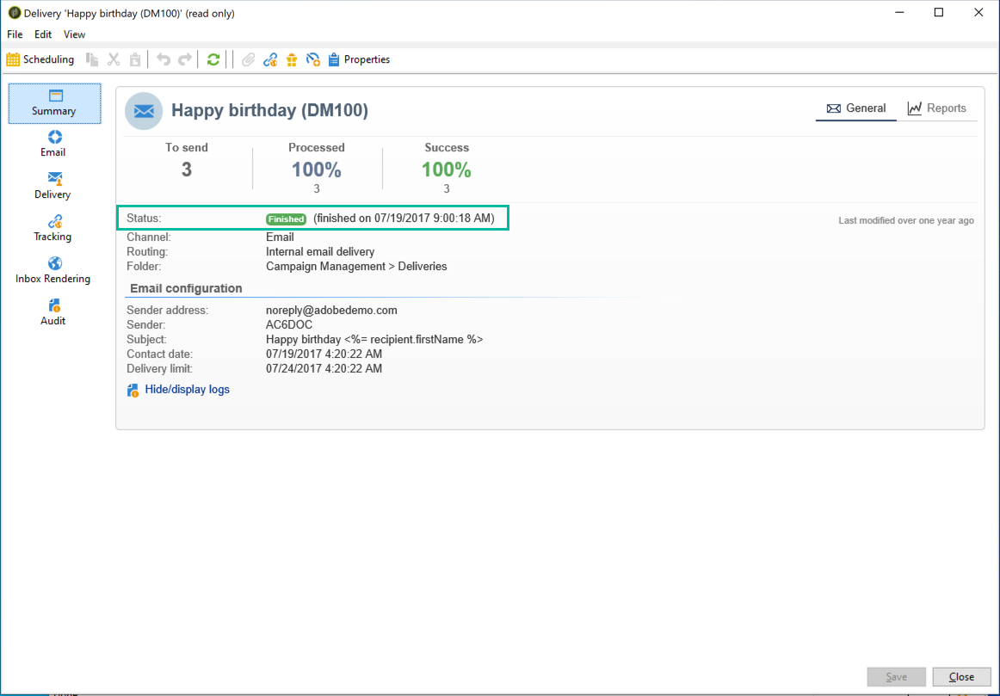

# 配信ステータス {#delivery-statuses}

配信の送信が完了すると、配信ダッシュボードにステータスが表示され、送信が成功したかどうかを監視できます。 可能なステータスについては、次の節で詳しく説明します。

様々な配信エラーの詳細と解決方法については、[配信エラーについて](delivery-failures.md)を参照してください。

**関連トピック：**

* [メールの送信と監視](send.md)
* [配信失敗について](delivery-failures.md)
* [配信品質の概要](about-deliverability.md)

## 配信ステータスのリスト {#list-delivery-statuses}

<table> 
 <thead> 
  <tr> 
   <th> ステータス  </th> 
   <th> 定義と解決策  </th> 
  </tr> 
 </thead> 
 <tbody> 
  <tr> 
   <td> 送信済み  </td> 
   <td> 配信は、メッセージプロバイダーに正しく送信されました（ただし、受信者が受信しているとは限りません）。  </td> 
  </tr> 
  <tr> 
   <td> 無視  </td> 
   <td> 配信は、アドレスにエラーがあるので受信者に送信されませんでした。 ブロックリストへの登録、強制隔離、未指定または重複の可能性があります。  </td> 
  </tr> 
  <tr> 
   <td> 失敗  </td> 
   <td> 無効なアドレスやインボックスが満杯であることが原因で、配信は受信者に到達できませんでした。 パーソナライゼーションブロックの問題に関係していることもあり、その場合、スキーマが配信マッピングと一致しないとエラーが生成されます。 <a href="delivery-failures.md" target="_blank">配信エラーの理解</a> を参照してください。 </td> 
  </tr>
  <tr> 
   <td> 保留中  </td> 
   <td> 配信の送信の準備が完了し、配信サーバー（MTA）によって処理されます。 <a href="#pending-status" target="_blank">保留中ステータス</a>を参照してください。  </td> 
  </tr> 
  <tr> 
   <td> 該当なし  </td> 
   <td> メッセージはサーバー（MTA）に取り込まれましたが、まだ処理されていません。  </td> 
  </tr>  
  <tr> 
   <td> 配信がキャンセル済み  </td> 
   <td> 操作がオペレーターによってキャンセルされました。  </td> 
  </tr> 
  <tr> 
   <td> サービスプロバイダーで受信済み  </td> 
   <td> SMS配信の場合、SMS サービス プロバイダーは配信を受信しました。  メール配信の場合、メッセージはCampaignからMTA （メール転送エージェント）に正常に中継されました。</td> 
  </tr> 
  <tr> 
   <td> モバイルで受信済み  </td> 
   <td> 受信者がモバイルデバイスで SMS を受信しました。  </td> 
  </tr>
  <tr> 
   <td> サービスプロバイダーに送信済み  </td> 
   <td> 配信はSMS サービスプロバイダーに送信されましたが、まだ受信されていません。 
   </td> 
  </tr> 
  <tr> 
   <td> 準備済み  </td> 
   <td> 外部コネクタ（モバイルチャネルなど）でのみ使用される中間ステータス。 「保留中」ステータスの次に遷移するステータスであり、後続のステータスは外部コネクタが決定します。  </td> 
  </tr> 
 </tbody> 
</table>

Adobe Campaign のメールの配信品質を最適化する方法について、[この節](about-deliverability.md)を参照してください。 配信品質の詳細については、[アドビの配信品質のベストプラクティスガイド](https://experienceleague.adobe.com/docs/deliverability-learn/deliverability-best-practice-guide/introduction.html?lang=ja)を参照してください。

## 保留中ステータス {#pending-status}

配信を確認した後に、配信のステータスが&#x200B;**[!UICONTROL 保留中]**&#x200B;である場合があります。 このステータスは、一部のリソースが使用可能になるのを実行プロセスが待機していることを意味します。

**[!UICONTROL 保留中]**&#x200B;ステータスは、配信はスケジュールされたが特定の日付まで保留されることを意味している可能性があります。 詳しくは、[配信の送信スケジュール &#x200B;](configure-and-send.md#schedule-delivery-sending)の節を参照してください。

配信が送信されず、ステータスが&#x200B;**[!UICONTROL 保留中]**&#x200B;のままである場合は、次のことが原因である可能性があります。

* **同時に実行しているキャンペーンが多すぎます**

  同時キャンペーンの制限は、**[!UICONTROL NmsOperation_LimitConcurrency]** オプションで定義されています。 デフォルト値は 10 です。

  Managed Cloud Services ユーザーは、Adobeと連携して、必要に応じてこの制限を調整できます。 オプションについて詳しくは、[Campaign Classic v7 ドキュメント &#x200B;](https://experienceleague.adobe.com/docs/campaign-classic/using/installing-campaign-classic/appendices/configuring-campaign-options.html?lang=ja){target="_blank"}を参照してください。

* **リソースの可用性に関する問題**

  MTA （Message Transfer Agent）は、配信を処理する前にリソースが利用可能になるのを待っている可能性があります。

>[!NOTE]
>
>Campaign v8 Managed Cloud Services ユーザーの場合、MTA インフラストラクチャはAdobeによって監視および管理されます。 保留中の配信に関して永続的な問題が発生した場合は、Adobe カスタマーケアにお問い合わせください。

**関連トピック：**

* [メールの送信と監視](send.md#email-monitoring)
* [配信失敗について](delivery-failures.md)
* [Campaign環境のモニタリング](../start/monitor.md#monitor-deliveries)
