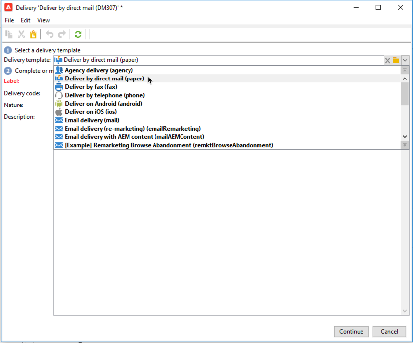
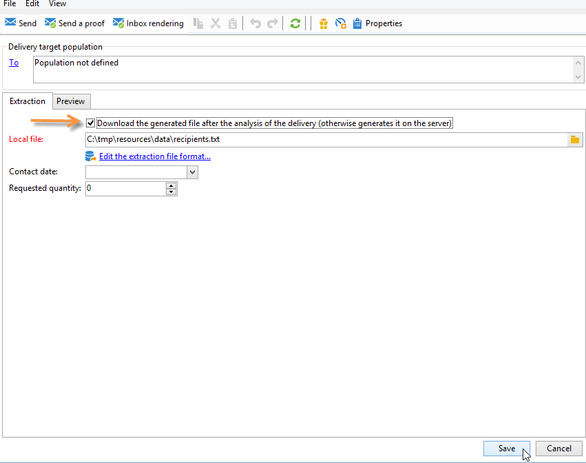
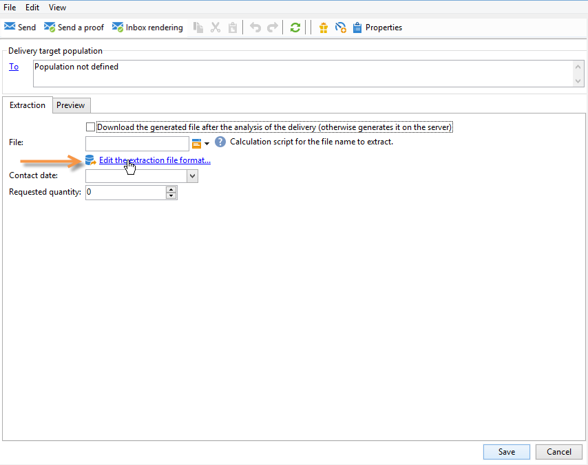
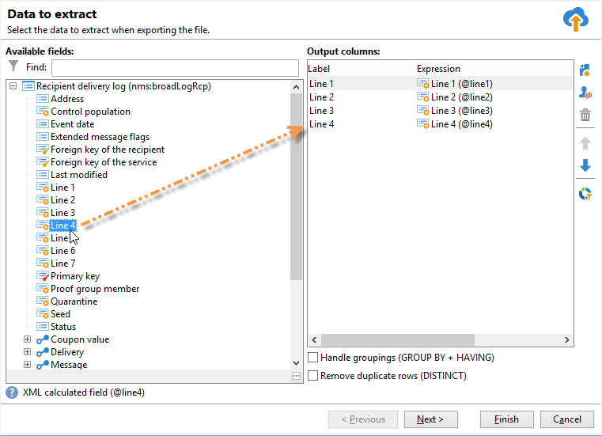

# ダイレクトメール配信の作成

ダイレクトメール配信では、ターゲット母集団に関するデータを含む抽出ファイルを生成できます。その後、このファイルを、ターゲット母集団にメッセージを配信するプロバイダーと共有できます。

ファイルを生成する手順は次のとおりです。

1. [配信の作成](#creating-a-direct-mail-delivery)
1. [オーディエンスを定義](#defining-the-direct-mail-audience)
1. [ファイルのコンテンツの定義](#defining-the-direct-mail-content)
1. [配信の検証](#validating)
1. [配信の開始](#start-delivery)

## 配信の作成{#creating-a-direct-mail-delivery}

テンプレートに基づいてダイレクトメール配信を作成します。 **[!UICONTROL ダイレクトメールで配信（紙）]**&#x200B;ビルトインテンプレートを複製し、設定できます。

新しいダイレクトメール配信を作成するには、次の手順に従います。

>[!NOTE]
>
>配信の作成に関するグローバルな概念については、[この節](../start/create-message.md)で説明しています。

1. 新しい配信を作成します（例えば、配信ダッシュボードから）。
1. **ダイレクトメールで配信（紙）**&#x200B;配信テンプレートを選択します。

   

1. ラベル、コードおよび説明を設定して配信を識別します。詳しくは、[この節](../start/create-message.md#create-the-delivery)を参照してください。
1. 「**続行**」をクリックすると、入力した情報が確定され、メッセージ設定ウィンドウが表示されます。

## オーディエンスの定義{#defining-the-direct-mail-audience}

受信者のプロファイルには、少なくとも受信者の名前と郵送先住所が登録されている必要があります。

郵送先住所は、計算フィールドです。1 つのアドレスは、デフォルトで最大 6 つの行から構成されます。最初の行には名前の姓および名、続く数行には郵送先住所の番地など、最後の行には、郵便番号や市区町村が含まれます。デフォルトの計算済み postalAddress フィールドの定義は、nms:recipient スキーマで確認できます。

名前、郵便番号、市区町村フィールドが空でない場合、アドレスは完全に入力されているとみなされます。アドレスが不完全な受信者はダイレクトメールの配信から除外されます。

詳しくは、[こちら](../start/create-message.md#target-population)を参照してください。

## ファイルのコンテンツの定義{#defining-the-direct-mail-content}

抽出ウィザードを使用して、出力ファイルにエクスポートする情報（列）を定義します。

抽出したデータを格納するファイルの名前は、「**[!UICONTROL ファイル]**」フィールドで定義します。フィールドの右にあるボタンを使用すると、ファイルネームを生成するためのパーソナライゼーションフィールドを指定できます。

抽出ファイルは、デフォルトではサーバー上に作成され、格納されますが、コンピューター上に保存することもできます。そのためには、「**[!UICONTROL 配信の分析後に、生成されたファイルをダウンロードする]**」をオンにします。この場合、ローカルストレージディレクトリのアクセスパスおよびファイル名を指定する必要があります。

ダイレクトメール配信の場合、抽出するデータのコンテンツは「**[!UICONTROL 抽出ファイルのフォーマットを編集]**」リンクを使用して定義します。

このリンクをクリックすると、抽出アシスタントにアクセスして、出力ファイルにエクスポートする情報（列）を定義できます。

パーソナライズされた URL を抽出ファイルに挿入できます。 詳しくは、Adobe Campaign Classic[&#x200B; ドキュメント &#x200B;](https://experienceleague.adobe.com/docs/campaign-classic/using/designing-content/web-forms/publishing-a-web-form.html){target="_blank"} を参照してください。

>[!NOTE]
>
>このアシスタントには、Adobe Campaign Classicの詳細を説明するエクスポートアシスタントの手順が含まれています [&#x200B; ドキュメント &#x200B;](https://experienceleague.adobe.com/docs/campaign-classic/using/getting-started/importing-and-exporting-data/generic-imports-exports/executing-export-jobs.html){target="_blank"}..

## 配信の検証{#validating}

分析の結果と、出力ファイルのコンテンツをチェックします。

マーケティングキャンペーンのコンテキストでは、抽出日に抽出ファイルが作成されます。 抽出したファイルのコンテンツを表示したり、ファイルを承認したり、形式を変更したり、必要に応じて抽出を再度開始したりできます。ファイルが承認されたら、通知メールを発送担当に送信できます。詳しくは、[このページ](https://experienceleague.adobe.com/docs/campaign/automation/campaign-orchestration/marketing-campaign-approval.html?lang=ja){target="_blank"}を参照してください。

配信を検証する際のグローバル概念については、[この節](../start/create-message.md#validate-the-delivery)で説明しています。

ダイレクトメール配信の出力ファイルは、配信分析中に生成されます。ファイルの内容は、選択した出力列によって異なります（この [&#x200B; セクションファイル &#x200B;](#defining-the-direct-mail-content) を参照）。

>[!NOTE]
>
>分析フェーズについて詳しくは、この [&#x200B; 節 &#x200B;](delivery-analysis.md) を参照してください。

分析フェーズではファイルが生成されますが、受信者に関する情報（配信ログなど）は更新されません。したがって、このジョブをキャンセルしても問題は発生しません。

分析の結果と、出力ファイルのコンテンツをチェックしてから、「**[!UICONTROL 配信を確定]**」をクリックします。配信の開始を確認するメッセージが表示されます。

送信を確認すると、指定したファイルへのデータ抽出が開始されます。

その後、アシスタントを閉じて、配信の詳細情報から「**[!UICONTROL 配信]**」タブを開くと、配信ログを参照できます。

配信ログの取得モードは、配信プロパティの「**[!UICONTROL 分析]**」タブで設定できます。

取得モードには次の 2 種類があります。

* **[!UICONTROL メッセージは検証後に送信されたものとみなされます]**（デフォルトのモード）：この機能モードでは、オペレーターが送信を確認すると、すべてのブロードログが更新され（ステータスが「配信保留」から「送信済み」に変化します）、配信は自動的に「**[!UICONTROL 完了]**」に設定されます。
* **[!UICONTROL 結果ファイルに、送信されたメッセージやエラーメッセージが記述されています]**：このモードでは、サービスプロバイダーから送信された外部ファイルを使用してブロードログを更新できます。その場合、ブロードログのステータスを更新するには、この情報を処理するためのワークフローが必要です。

  >[!NOTE]
  >
  >また、ブロードログが更新されしだい、ユーザーが配信のステータスを「**[!UICONTROL 完了]**」に変更する必要もあります。

## 配信を開始{#start-delivery}

抽出ファイルの検証が完了したら、「**配信を確定**」をクリックすると、配信の開始を確認するメッセージが表示されます。

送信を確認すると、指定したファイルへのデータ抽出が開始されます。

マーケティングキャンペーンのコンテキストでは、すべての承認が付与されると、特別なワークフローを使用して抽出ファイルが作成されます。このワークフローは、デフォルト設定では、ダイレクトメール配信が抽出保留中の場合に自動的に開始されます。詳しくは、[こちら](https://experienceleague.adobe.com/docs/campaign/automation/campaign-orchestration/marketing-campaign-deliveries.html?lang=ja){target="_blank"}を参照してください。
