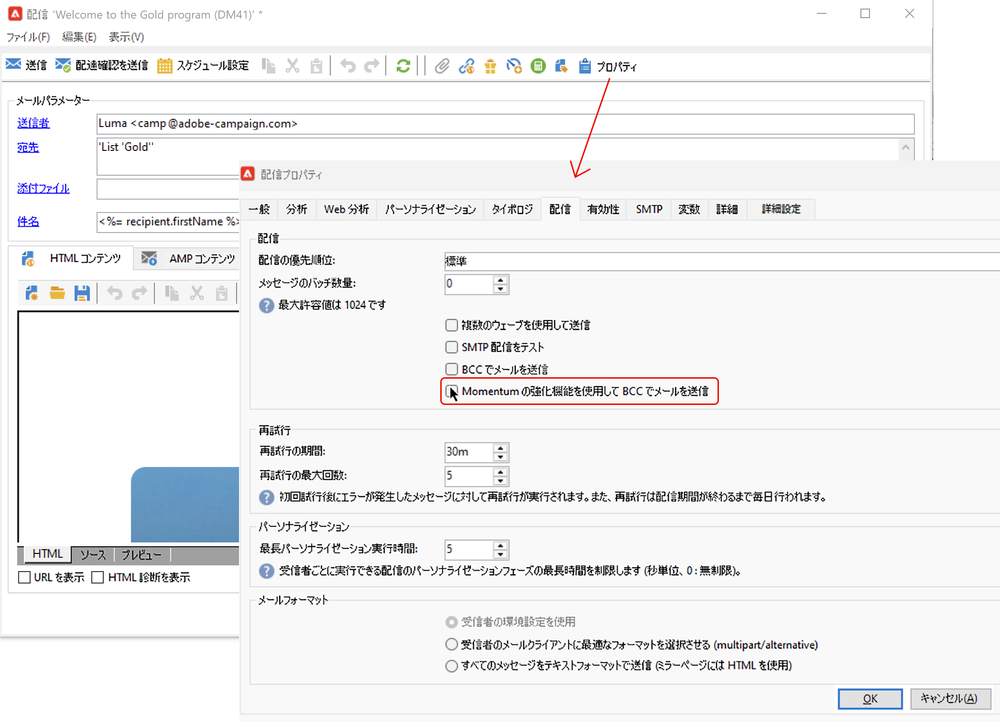

# BCC アドレスにメッセージのコピーを送信する {#bcc}

<!--
>[!NOTE]
>
>This capability is available starting Campaign v8.3. To check your version, refer to [this section](../start/compatibility-matrix.md#how-to-check-your-campaign-version-and-buildversion)-->

## E メールの BCC について {#gs-bcc}

プラットフォームから送信された電子メールのコピーを保持するようにAdobe Campaignを設定できます。 このオプションを使用すると、メッセージを専用の BCC(Blind Carbon Copy)E メールアドレスに送信し、そこから外部システムを使用して処理およびアーカイブできます。
Adobe Campaign 自体はアーカイブされたファイルを管理しません。送信された電子メールに対応する .eml ファイルは、SMTP 電子メールサーバーなどのリモートサーバーに転送できます。

アーカイブ先は、選択した BCC 電子メールアドレスで、配信の受信者には表示されません。 BCC 電子メールアドレスを定義したら、 [配信テンプレート](create-templates.md) レベル。

 Managed Cloud Services のユーザーは、[アドビに連絡](../start/campaign-faq.md#support){target="_blank"}して、アーカイブに使用する BCC メールアドレスを伝えてください。

>[!CAUTION]
>
>プライバシー上の理由から、BCC 電子メールは、個人の身元を特定できる情報（PII）を安全に保存できるアーカイブシステムで処理する必要があります。

## E メール BCC を有効にする {#enable-bcc}

特定のの BCC を有効にするには [配信テンプレート](create-templates.md)、次の手順に従います。

1. Campaign エクスプローラーで、配信テンプレートフォルダーを参照します。 デフォルトでは、配信テンプレートは、 **[!UICONTROL リソース]** > **[!UICONTROL テンプレート]** > **[!UICONTROL 配信テンプレート]** フォルダー。
1. BCC で更新する配信テンプレートを編集します。
1. 「**[!UICONTROL プロパティ]**」ボタンをクリックします。
1. 次から： **[!UICONTROL 配信]** タブで、 **[!UICONTROL BCC で E メールを送信]** オプション。

   

1. クリック **[!UICONTROL OK]** をクリックして確定します。

このテンプレートに基づく各配信に対するすべての送信済みメッセージのコピーが、お使いのプラットフォーム用に設定された E メールの BCC アドレスに送信されます。

## ガードレールとレコメンデーション {#recommendations-bcc}

Adobe Campaignで電子メール BCC を使用する場合、次のガードレールおよび推奨事項が適用されます。

* BCC に設定できるメールアドレスは 1 つだけです。

* BCC アドレスに、送信されるすべてのメールをアーカイブするだけの受信容量があることを確認します。

* BCC でメールを送信<!--with Enhanced MTA-->は、受信者に配信する前に BCC メールアドレスに配信することで、元の配信がバウンスした場合でも BCC メッセージが送信される可能性があります。バウンスについて詳しくは、[配信エラーについて](delivery-failures.md)を参照してください。

* BCC アドレスに送信された電子メールは、 **[!UICONTROL 合計開封数]** および **[!UICONTROL クリック数]** 送信分析から、は計算ミスを引き起こす可能性があります。

<!--Only successfully sent emails are taken in account, bounces are not.-->
