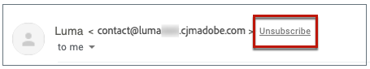
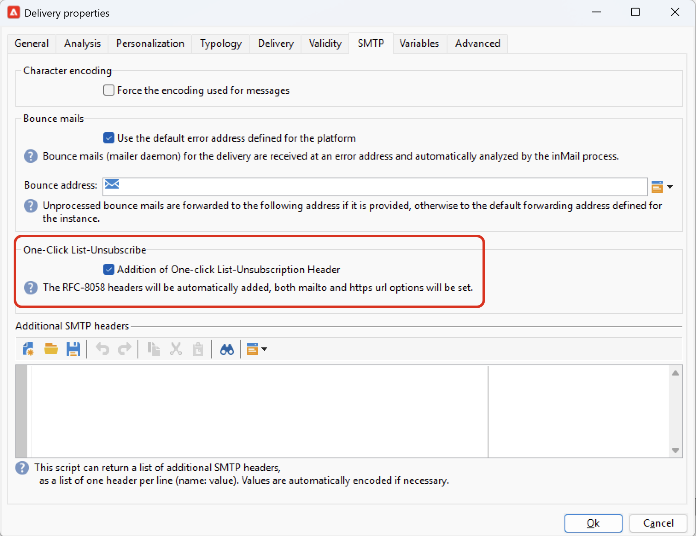

# メールパラメーター {#email-parameters}

この節では、メール配信に固有の配信プロパティで使用できるオプションとパラメーターについて説明します。

## BCC でのメールの使用 {#email-bcc}

プラットフォームから送信されたメールのコピーを保持するように Adobe Campaign を設定できます。このオプションについて詳しくは、[このページ](email-bcc.md)を参照してください。

## メッセージ形式の選択 {#selecting-message-formats}

送信されるメールメッセージの形式は変更できます。変更するには、配信プロパティを編集し、「**[!UICONTROL 配信]**」タブをクリックします。

ウィンドウ下部のセクションで、メールの形式を選択します。

* **[!UICONTROL 受信者の環境設定を使用]**（デフォルトのモード）

  メッセージの形式は、受信者のプロファイルに格納されたデータに従って定義され、デフォルトでは「**[!UICONTROL メールフォーマット]**」フィールド（@emailFormat）に保存されます。受信者が特定の形式でメッセージを受信することを希望していれば、メッセージはその形式で送信されます。このフィールドに何も入力されていない場合は、マルチパート／オルタナティブメッセージが送信されます（以下を参照）。

* **[!UICONTROL 受信者のメールクライアントに最適なフォーマットを選択させる]**

  テキスト形式と HTML 形式の両方を含んだメッセージが送信されます。受信時に表示されるメッセージ形式は、受信者のメールソフトウェアの設定に応じて切り替わります（マルチパート／オルタナティブ）。

  >[!IMPORTANT]
  >
  >このオプションを指定すると、両方のバージョンのドキュメントがメッセージに含められます。したがって、メッセージサイズが大きくなるので、配信のスループットが低下します。

* **[!UICONTROL すべてのメッセージをテキストフォーマットで送信]**

  メッセージはテキスト形式で送信されます。HTML 形式は送信されませんが、受信者がメッセージをクリックした場合にのみ表示されるミラーページに使用されます。

<!--
>[!NOTE]
>
>For more on defining the email content, see [this section]().-->

## 文字エンコーディングの設定 {#character-encoding}

配信パラメーターの「**[!UICONTROL SMTP]**」タブで、「**[!UICONTROL 文字エンコーディング]**」セクションを使用して特定のエンコードを設定できます。

デフォルトのエンコードは UTF-8 です。一部の受信者のメールプロバイダーが UTF-8 規格のエンコーディングをサポートしていない場合、メールの受信者に対して特殊文字を適切に表示するために特定のエンコーディングを設定する必要があります。

例えば、日本語の文字を含むメールを送信するとします。すべての文字が日本の受信者に正しく表示されるようにするには、標準の UTF-8 ではなく、日本語文字をサポートするエンコーディングを使用します。

そのためには、「**[!UICONTROL 文字エンコーディング]**」セクションの「**[!UICONTROL メッセージに使用されているエンコーディングを強制]**」オプションを選択し、表示されるドロップダウンリストからエンコーディングを選択します。

## バウンスメールの管理 {#managing-bounce-emails}

配信プロパティの「**[!UICONTROL SMTP]**」タブでは、バウンスメール管理を設定することもできます。

* **[!UICONTROL エラーアドレス]**：デフォルトでは、バウンスメールはプラットフォームのデフォルトエラーボックスに受信されますが、配信用の専用エラーアドレスを定義することもできます。

* **[!UICONTROL バウンスアドレス]**：未処理のバウンスメールの転送先となる別のアドレスを定義することもできます。バウンスメールの発生理由をアプリケーションで自動判定できない場合は、このアドレスを使用することで調査できます。

各フィールドは、専用のアイコンを使用してパーソナライズできます。パーソナライゼーションフィールドについて詳しくは、[この節](personalization-fields.md)を参照してください。

バウンスメールの管理について詳しくは、[この節](delivery-failures.md#bounce-mail-management)を参照してください。

## ワンクリックリスト – 登録解除を有効にする {#one-click-list-unsubscribe}

ワンクリックリスト – 登録解除 URL は、メール送信者情報の横に表示されるリンクまたはボタンで、受信者はワンクリックでメーリングリストから即座にオプトアウトできます。<!--[Learn more](https://experienceleague.adobe.com/docs/deliverability-learn/deliverability-best-practice-guide/additional-resources/campaign/acc-technical-recommendations.html#list-unsubscribe){target="_blank"}-->

これは、ISP のメールインターフェイスに **登録解除** リンクとして表示されます。 例：

最適な配信品質の管理を確保するには、List-Unsubscribe と呼ばれる SMTP ヘッダーの追加が必須であり、「スパムとしてレポート」アイコンの代わりに使用できます。 実際、この機能を使用すると、苦情の発生率が低下し、評判を保護するのに役立ちます。

>[!IMPORTANT]
>
>メールヘッダーにワンクリック購読解除 URL を表示するには、受信者のメールクライアントがこの機能をサポートしている必要があります。

この機能を有効にするには、配信プロパティの **[!UICONTROL SMTP]** タブにある **[!UICONTROL ワンクリックリスト – 購読解除ヘッダーの追加]** オプションを選択します。

>[!NOTE]
>
>このオプションは、デフォルトでは有効になっています。

<!--
>[!WARNING]
>
>If you uncheck this option in the delivery template, it will still be enabled by default in the deliveries created from this template. You need to enable the option again at the delivery level.-->

メールクライアントとオプトアウトの実行に使用する方法に応じて、メールヘッダーの **登録解除** リンクをクリックすると、次のような影響が出る場合があります。

* メールクライアントで **ワンクリック** List-Unsubscribe メソッドを使用している場合、受信者は直接オプトアウトされます。

  >[!NOTE]
  >
  >Googleや Yahoo！などの主要な ISP **ワンクリックリスト – 購読解除** に準拠することを送信者に求めている。

* メールクライアントがワンクリックリスト – 購読解除をサポートしていない場合でも、**&quot;mailto&quot;** List-Unsubscribe メソッドを使用できます。このメソッドは、メールヘッダーで指定された購読解除アドレスに事前入力されたメールを送信します。

  アドレスは、ヘッダーで明示的に設定するか、動的アドレス（&lt;%=errorAddress%> またはオプション「NmsEmail_DefaultErrorAddr」を使用するなど）を使用できます。このアドレスは、デプロイメントウィザードで設定できます。

>[!NOTE]
>
>[&#x200B; ワンクリックリスト – 購読解除 &#x200B;](https://experienceleague.adobe.com/en/docs/deliverability-learn/deliverability-best-practice-guide/additional-resources/campaign/acc-technical-recommendations?lang=en#one-click-list-unsubscribe){target="_blank"} および [&quot;mailto&quot; リスト – 購読解除 &#x200B;](https://experienceleague.adobe.com/en/docs/deliverability-learn/deliverability-best-practice-guide/additional-resources/campaign/acc-technical-recommendations?lang=en#mailto-list-unsubscribe){target="_blank"} メソッドを手動で設定することもできます。 詳細な手順については、Experience Cloud[&#x200B; 配信品質のベストプラクティスガイド &#x200B;](https://experienceleague.adobe.com/docs/deliverability-learn/deliverability-best-practice-guide/additional-resources/campaign/acc-technical-recommendations.html?lang=ja#list-unsubscribe){target="_blank"} を参照してください。

## SMTP ヘッダーの追加 {#adding-smtp-headers}

配信には SMTP ヘッダーを追加できます。そのためには、配信の「**[!UICONTROL SMTP]**」タブの関連するセクションを使用します。

このウィンドウで入力するスクリプトは、**name:value** の形式で 1 行ごとに 1 つのヘッダーを参照する必要があります。

値は必要に応じて自動的にエンコードされます。

>[!IMPORTANT]
>
>スクリプトを追加すると、挿入する SMTP ヘッダーを追加できます。これは高度な知識を持つユーザー向けに用意されています。
>
>スクリプトの構文は、このコンテンツタイプの要件を満たしている必要があります（不要なスペースや空行を含まないなど）。

## ミラーページの生成 {#generating-mirror-page}

ミラーページは、web ブラウザーでオンラインアクセス可能な HTML ページです。そのコンテンツはメールと同一です。これは、受信者がインボックスでメールを表示しようとする際に、レンダリングの問題や破損した画像が発生した場合に役立ちます。

ミラーページへのリンクを挿入する方法については、[この節](mirror-page.md)を参照してください
