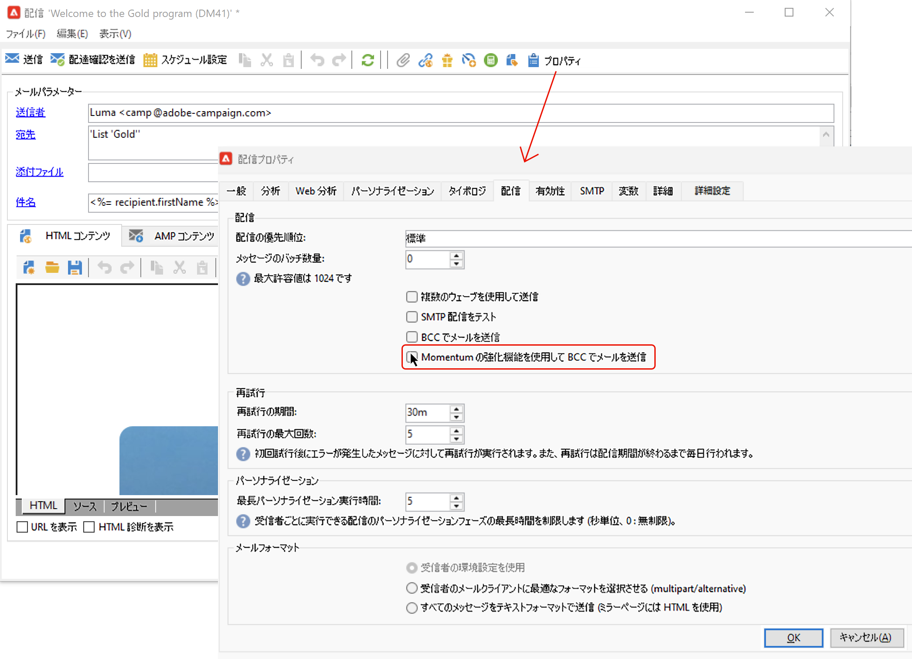
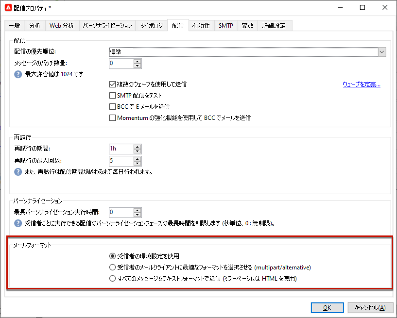
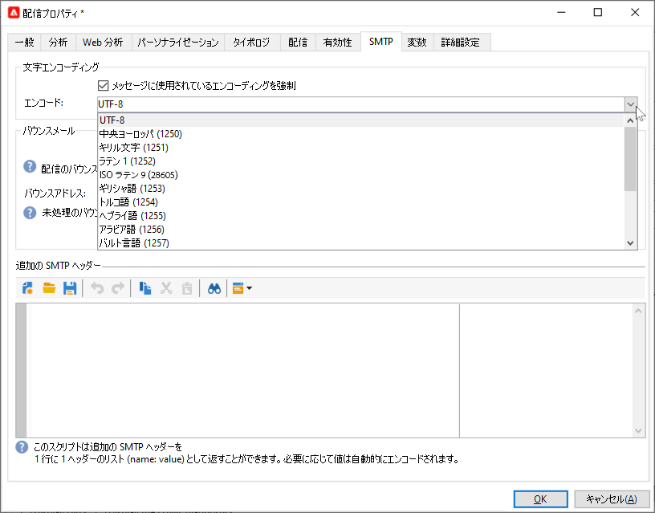
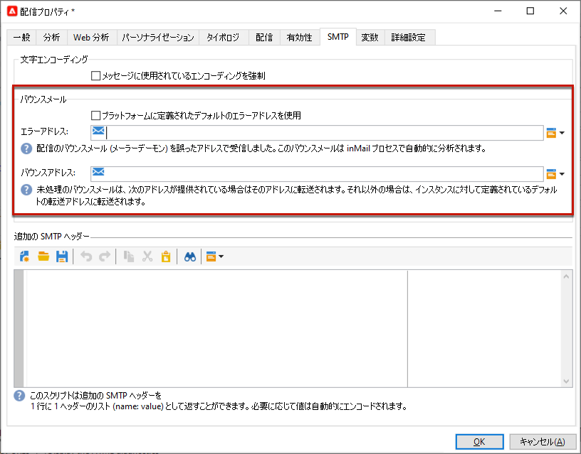
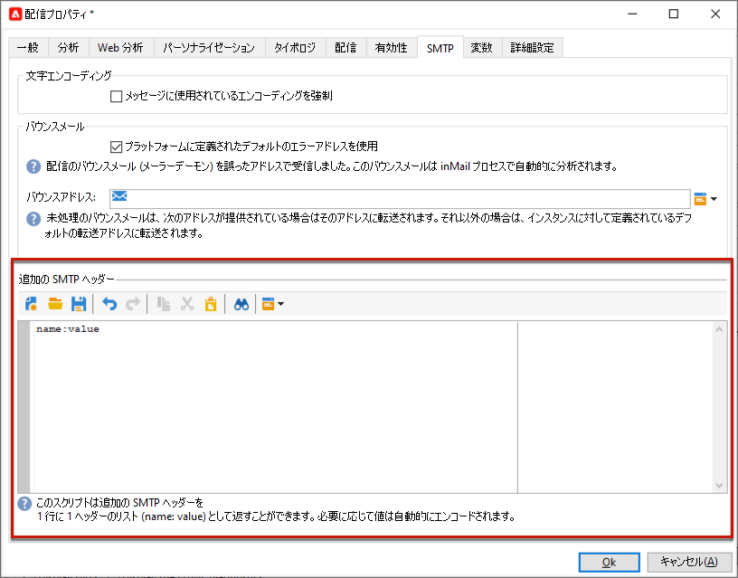

# メールパラメーター {#email-parameters}

この節では、メール配信に固有の配信プロパティで使用できるオプションとパラメーターについて説明します。

## BCC でのメールの使用 {#email-bcc}

<!--
>[!NOTE]
>
>This capability is available starting Campaign v8.3. To check your version, refer to [this section](../start/compatibility-matrix.md#how-to-check-your-campaign-version-and-buildversion)-->

プラットフォームから送信された電子メールのコピーを保持するように Adobe Campaign を設定できます。

Adobe Campaign 自体はアーカイブされたファイルを管理しません。これにより、選択したメッセージを専用の BCC（ブラインドカーボンコピー）メールアドレスに送信し、外部システムを使用して処理およびアーカイブできます。送信された電子メールに対応する .eml ファイルは、SMTP 電子メールサーバーなどのリモートサーバーに転送できます。

>[!CAUTION]
>
>プライバシー上の理由から、BCC 電子メールは、個人の身元を特定できる情報（PII）を安全に保存できるアーカイブシステムで処理する必要があります。

アーカイブ先は選択した BCC メールアドレスです。配信の受信者には表示されません。

 Managed Cloud Services のユーザーは、[アドビに連絡](../start/campaign-faq.md#support){target="_blank"}して、アーカイブに使用する BCC メールアドレスを伝えてください。

BCC メールアドレスを定義したら、配信レベルで専用オプションを有効にする必要があります。

>[!CAUTION]
>
>**[!UICONTROL BCC でメールを送信]**&#x200B;は、デフォルトでは有効になっていません。メール配信または配信テンプレートで手動で有効にする必要があります。

これをおこなうには、以下の手順に従います。

1. **[!UICONTROL キャンペーン管理]**／**[!UICONTROL 配信]**&#x200B;または&#x200B;**[!UICONTROL リソース]**／**[!UICONTROL テンプレート]**／**[!UICONTROL 配信テンプレート]**&#x200B;に移動します。
1. 目的の配信を選択します。または、標準の&#x200B;**[!UICONTROL メール配信]**&#x200B;テンプレートを複製して、複製されたテンプレートを選択します。
1. 「**[!UICONTROL プロパティ]**」ボタンをクリックします。
1. 「**[!UICONTROL 配信]**」タブを選択します。
1. 「**[!UICONTROL BCC でメールを送信]**」オプションを選択します。

   

1. 「**[!UICONTROL OK]**」を選択します。

このテンプレートに基づく各配信に対するすべての送信済みメッセージのコピーが、設定された「BCC でメールを送信」アドレスに送信されます。

次の特性とレコメンデーションに注意してください。

* BCC に設定できるメールアドレスは 1 つだけです。

* BCC アドレスに、送信されるすべてのメールをアーカイブするだけの受信容量があることを確認します。

* BCC でメールを送信<!--with Enhanced MTA-->は、受信者に配信する前に BCC メールアドレスに配信することで、元の配信がバウンスした場合でも BCC メッセージが送信される可能性があります。バウンスについて詳しくは、[配信エラーについて](delivery-failures.md)を参照してください。

* BCC アドレスに送信されたメールが開封され、クリックされた場合は、送信分析の&#x200B;**[!UICONTROL 合計開封数]**&#x200B;と&#x200B;**[!UICONTROL クリック数]**&#x200B;に含められるため、計算の誤りの原因となる可能性があります。

<!--Only successfully sent emails are taken in account, bounces are not.-->

## メッセージ形式の選択 {#selecting-message-formats}

送信されるメールメッセージの形式は変更できます。変更するには、配信プロパティを編集し、「**[!UICONTROL 配信]**」タブをクリックします。

ウィンドウ下部のセクションで、メールの形式を選択します。

* **[!UICONTROL 受信者の環境設定を使用]**（デフォルトのモード）

  メッセージの形式は、受信者のプロファイルに格納されたデータに従って定義され、デフォルトでは「**[!UICONTROL メールフォーマット]**」フィールド（@emailFormat）に保存されます。受信者が特定の形式でメッセージを受信することを希望していれば、メッセージはその形式で送信されます。このフィールドに何も入力されていない場合は、マルチパート／オルタナティブメッセージが送信されます（以下を参照）。

* **[!UICONTROL 受信者のメールクライアントに最適なフォーマットを選択させる]**

  テキスト形式と HTML 形式の両方を含んだメッセージが送信されます。受信時に表示されるメッセージ形式は、受信者のメールソフトウェアの設定に応じて切り替わります（マルチパート／オルタナティブ）。

  >[!IMPORTANT]
  >
  >このオプションを指定すると、両方のバージョンのドキュメントがメッセージに含められます。したがって、メッセージサイズが大きくなるので、配信のスループットが低下します。

* **[!UICONTROL すべてのメッセージをテキストフォーマットで送信]**

  メッセージはテキスト形式で送信されます。HTML 形式は送信されませんが、受信者がメッセージをクリックした場合にのみ表示されるミラーページに使用されます。

<!--
>[!NOTE]
>
>For more on defining the email content, see [this section]().-->

## 文字エンコーディングの設定 {#character-encoding}

配信パラメーターの「**[!UICONTROL SMTP]**」タブで、「**[!UICONTROL 文字エンコーディング]**」セクションを使用して特定のエンコードを設定できます。

デフォルトのエンコードは UTF-8 です。一部の受信者のメールプロバイダーが UTF-8 規格のエンコーディングをサポートしていない場合、メールの受信者に対して特殊文字を適切に表示するために特定のエンコーディングを設定する必要があります。

例えば、日本語の文字を含むメールを送信するとします。すべての文字が日本の受信者に正しく表示されるようにするには、標準の UTF-8 ではなく、日本語文字をサポートするエンコーディングを使用します。

そのためには、「**[!UICONTROL 文字エンコーディング]**」セクションの「**[!UICONTROL メッセージに使用されているエンコーディングを強制]**」オプションを選択し、表示されるドロップダウンリストからエンコーディングを選択します。

## バウンスメールの管理 {#managing-bounce-emails}

配信プロパティの「**[!UICONTROL SMTP]**」タブでは、バウンスメール管理を設定することもできます。

* **[!UICONTROL エラーアドレス]**：デフォルトでは、バウンスメールはプラットフォームのデフォルトエラーボックスに受信されますが、配信用の専用エラーアドレスを定義することもできます。

* **[!UICONTROL バウンスアドレス]**：未処理のバウンスメールの転送先となる別のアドレスを定義することもできます。バウンスメールの発生理由をアプリケーションで自動判定できない場合は、このアドレスを使用することで調査できます。

各フィールドは、専用のアイコンを使用してパーソナライズできます。パーソナライゼーションフィールドについて詳しくは、[この節](personalization-fields.md)を参照してください。

バウンスメールの管理について詳しくは、[この節](delivery-failures.md#bounce-mail-management)を参照してください。

## SMTP ヘッダーの追加 {#adding-smtp-headers}

配信には SMTP ヘッダーを追加できます。そのためには、配信の「**[!UICONTROL SMTP]**」タブの関連するセクションを使用します。

このウィンドウで入力するスクリプトは、**name:value** の形式で 1 行ごとに 1 つのヘッダーを参照する必要があります。

値は必要に応じて自動的にエンコードされます。

>[!IMPORTANT]
>
>スクリプトを追加すると、挿入する SMTP ヘッダーを追加できます。これは高度な知識を持つユーザー向けに用意されています。
>
>スクリプトの構文は、このコンテンツタイプの要件を満たしている必要があります（不要なスペースや空行を含まないなど）。

<!--
## Generate mirror page {#generating-mirror-page}

The mirror page is an HTML page accessible online via a web browser. Its content is identical to the email. It can be useful if your recipients are experiencing rendering issues or broken images when trying to view your email in their inbox.

Learn how to insert a link to the mirror page in [this section](mirror-page.md).-->
