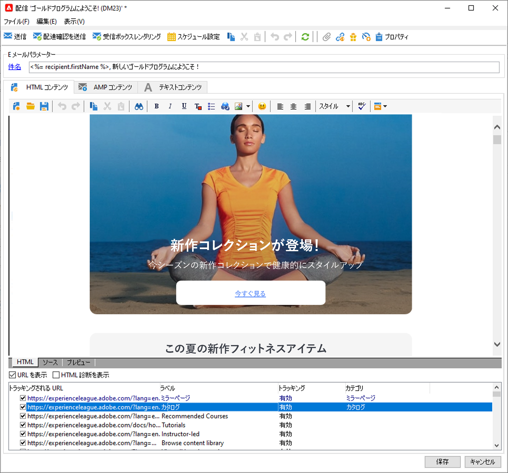
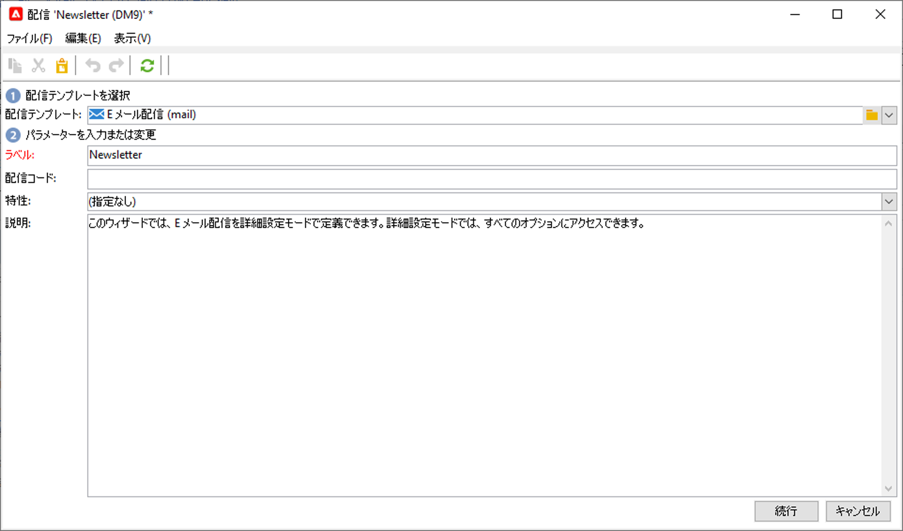
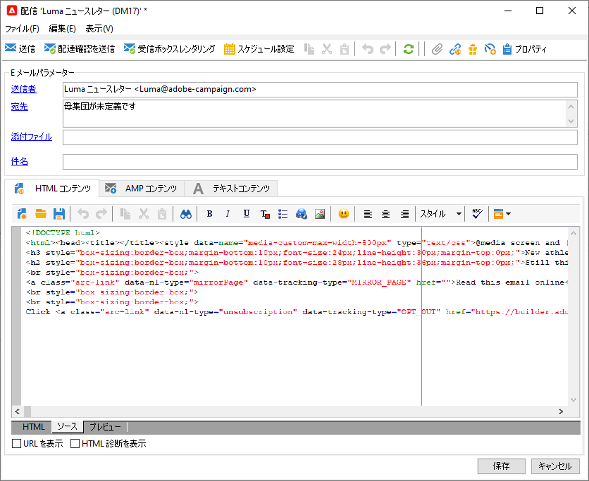
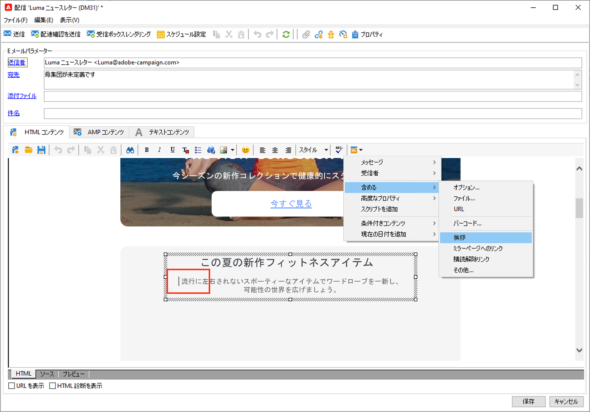
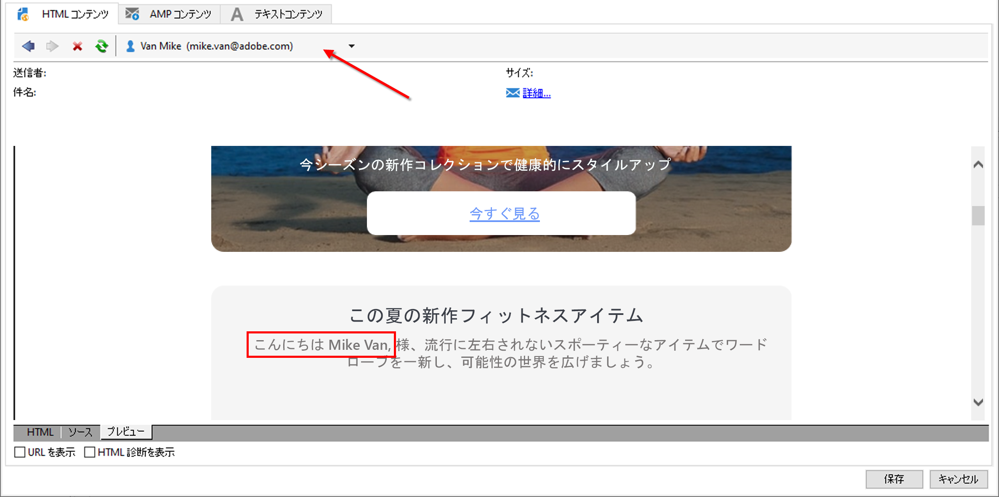
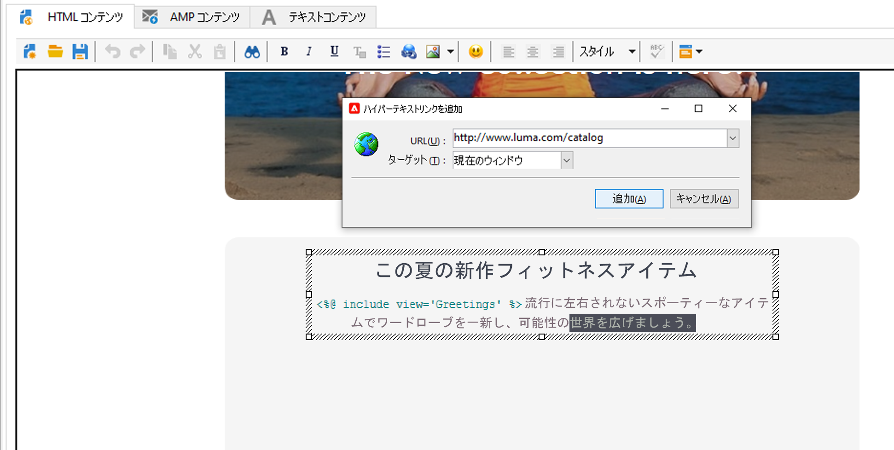

# メールのデザインと送信

メール配信によって、パーソナライズされたメールをターゲット母集団に送信できます。

[!DNL :arrow_upper_right:] 詳しくは、 [Campaign Classicv7のドキュメント](https://experienceleague.adobe.com/docs/campaign-classic/using/sending-messages/sending-emails/about-email-channel.html?lang=ja)を参照してください。

## 最初のメール配信の作成

その後の顧客体験と一貫する、パーソナライズされた関連性の高いメールを作成します。

次のサンプルでは、パーソナライズされたデータ、外部URLへのリンク、ミラーページへのリンクを含むEメール配信をAdobe Campaignでデザインする手順を説明します。

1. **配信の作成**

   新しい配信を作成するには、「**キャンペーン**」タブを参照し、「**配信**」をクリックして、既存の配信のリストの上にある「**作成**」ボタンをクリックします。

   

1. **テンプレートを選択します。**

   配信テンプレートを選択して、配信に名前を付けます。この名前は、Adobe Campaign コンソールのユーザーにのみ表示され、受信者には表示されません。ただし、この見出しは、配信のリストに表示されます。「**[!UICONTROL 続行]**」をクリックします。

   

1. **コンテンツの読み込み**

   「**ソース**」タブをクリックして、HTMLコンテンツを貼り付けます。

   

1. **メッセージのパーソナライズ**

   * 受信者の姓と名を追加する

      メッセージコンテンツ内のターゲットプロファイルの名と姓を挿入するには、挿入する場所にカーソルを置き、ツールバーの最後のアイコンをクリックしてから、「****&#x200B;を含める」をクリックし、「**[!UICONTROL 挨拶]**」を選択します。

      

      「プレビュー」タブで受信者を選択し、パーソナライゼーションを確認します。

      

   * 追跡するリンクの挿入

      画像やテキストを使用して配信の受信者を外部アドレスに導くには、受信者を選択し、ツールバーの「**[!UICONTROL リンクを追加]**」アイコンをクリックします。

      **https://www.myURL.com** という形式で「**URL**」フィールドにリンクの URL を入力して、確認します。

      

   * ミラーページの追加

      受信者にWebブラウザーで配信コンテンツを表示できるようにするには、メッセージのミラーページへのリンクを追加します。

      リンクを挿入する位置にカーソルを置き、ツールバーの最後のアイコンをクリックして、**[!UICONTROL 含める]**&#x200B;をクリックし、**[!UICONTROL ミラーページへのリンク]**&#x200B;を選択します。
   コンテンツの準備が整ったら、「**保存**」をクリックします。これで、配信のリストの&#x200B;**[!UICONTROL キャンペーン/「配信]**」タブに表示されます。 最初のEメール配信の準備が整いました。 次に、オーディエンスを定義し、配信を検証して送信する必要があります。

詳しくは、Campaign Classicv7ドキュメントの以下の節を参照してください。

* CampaignでのEメールのデザイン
   [!DNL :arrow_upper_right:] [Eメールのデザイン方法を説明します](https://experienceleague.adobe.com/docs/campaign-classic/using/sending-messages/sending-emails/defining-the-email-content.html?lang=ja)
* Eメールコンテンツのインポート
   [!DNL :arrow_upper_right:] [使用例：配信コンテンツを読み込むワークフローの作成](https://experienceleague.adobe.com/docs/campaign-classic/using/automating-with-workflows/use-cases/deliveries/loading-delivery-content.html?lang=ja)
* 電子メールテンプレートの作成と使用
   [!DNL :arrow_upper_right:] [電子メールテンプレートの詳細を説明します](https://experienceleague.adobe.com/docs/campaign-classic/using/sending-messages/using-delivery-templates/about-templates.html?lang=ja)
* Eメールのオーディエンスを選択します
   [!DNL :arrow_upper_right:] [ターゲット母集団の定義方法を説明します](https://experienceleague.adobe.com/docs/campaign-classic/using/sending-messages/key-steps-when-creating-a-delivery/steps-defining-the-target-population.html?lang=ja)
* 配信の検証と配達確認の送信
   [!DNL :arrow_upper_right:] [配信を検証するための主な手順を説明します](https://experienceleague.adobe.com/docs/campaign-classic/using/sending-messages/key-steps-when-creating-a-delivery/steps-validating-the-delivery.html?lang=ja)
* [シードアドレス](https://experienceleague.adobe.com/docs/campaign-classic/using/sending-messages/using-seed-addresses/about-seed-addresses.html?lang=ja)の追加

## メールのテストと検証

Campaign では、メールをオーディエンスに送信する前にテストと検証を実施できる方法がいくつかあります。

[!DNL :arrow_upper_right:] [Campaign Classicv7ドキュメントに記載されているベストプラクティスの適用](https://experienceleague.adobe.com/docs/campaign-classic/using/sending-messages/key-steps-when-creating-a-delivery/delivery-bestpractices/check-before-sending.html?lang=ja)

次の操作をおこなうことができます。

* 配信分析ログの確認
* 配達確認の送信
* シードアドレスの追加
* コントロールグループの使用
* メールのレンダリングの確認

[!DNL :arrow_upper_right:] [詳しくは、Campaign Classicv7のドキュメントを参照してください。](https://experienceleague.adobe.com/docs/campaign-classic/using/sending-messages/key-steps-when-creating-a-delivery/steps-validating-the-delivery.html)

## メールの監視

送信されたメッセージは、配信ダッシュボードで配信のステータスを確認し、配信ログとレポートで正しく送信されたことを確認します。

[!DNL :arrow_upper_right:] [詳しくは、Campaign Classicv7のドキュメントを参照してください。](https://experienceleague.adobe.com/docs/campaign-classic/using/sending-messages/key-steps-when-creating-a-delivery/delivery-bestpractices/track-and-monitor.html?lang=ja)

