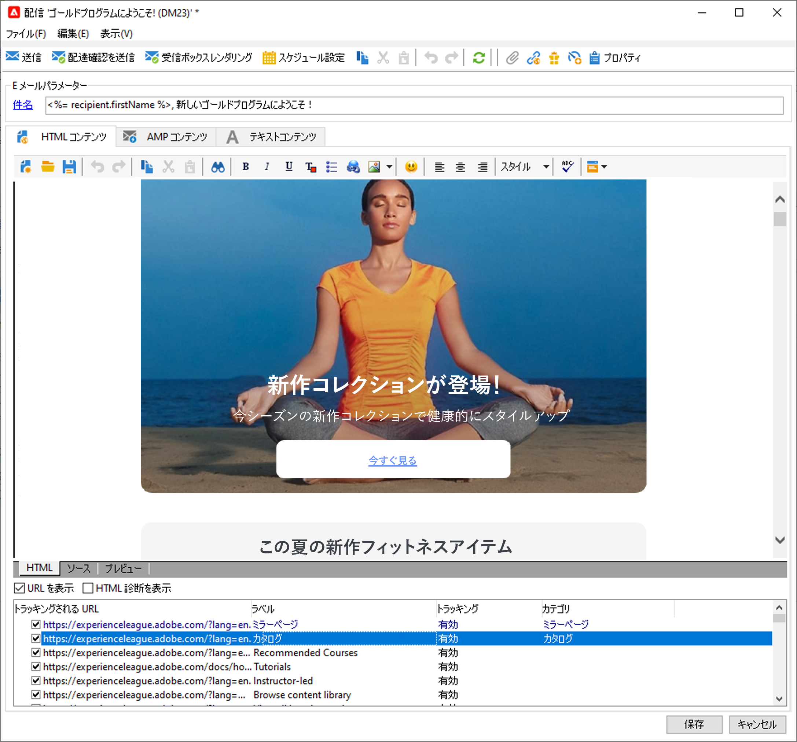
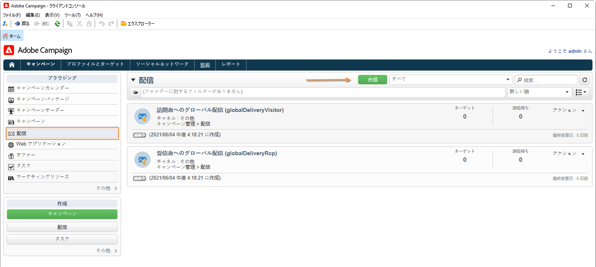
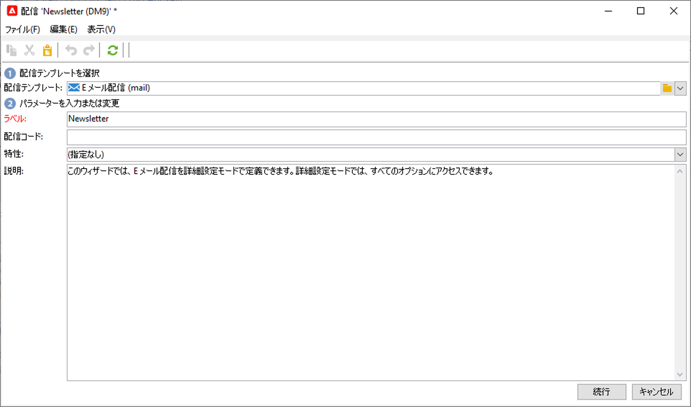
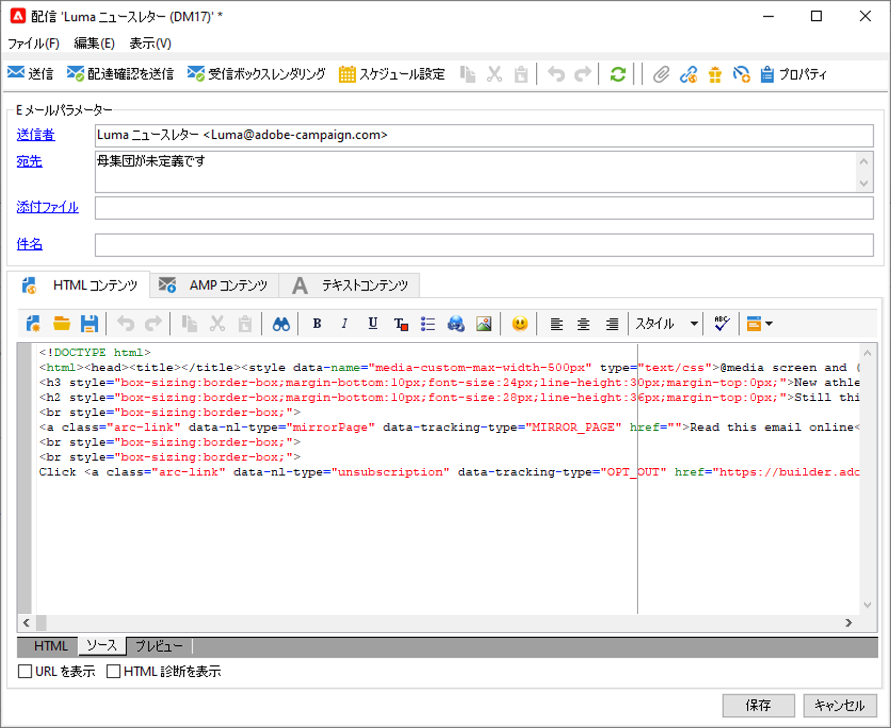
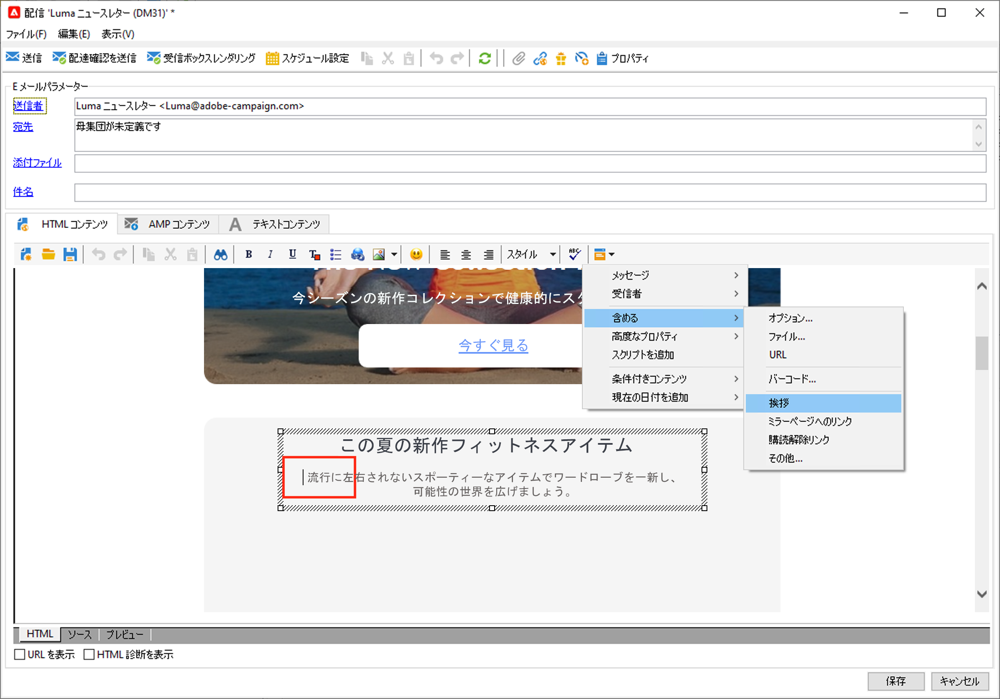
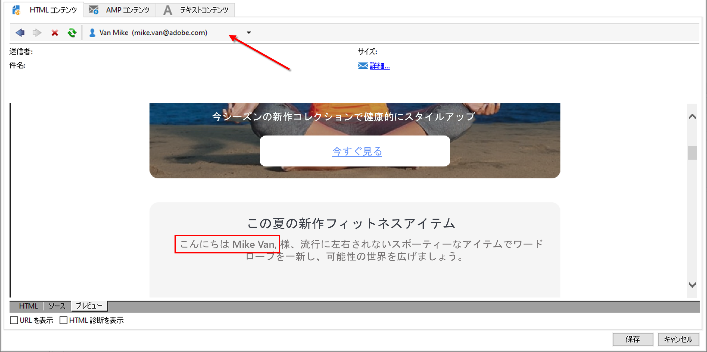
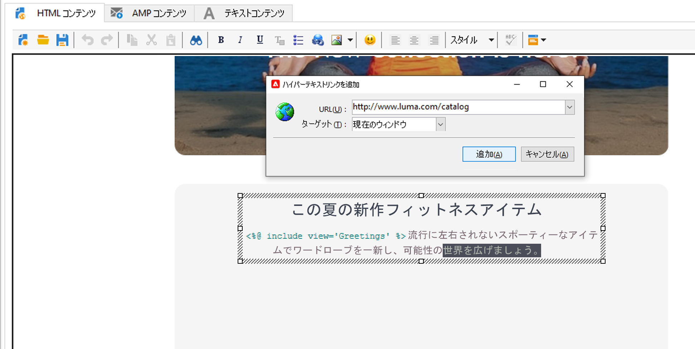

# メールのデザインと送信

Adobe Campaign を使用すると、メール配信を作成して、パーソナライズされたメールをターゲット母集団に送信できます。 [詳細情報](../send/send.md)

>[!NOTE]
>
>個別にカスタマイズされた魅力的なメールを作成するには、[Web ユーザーインターフェイス](../start/campaign-ui.md#campaign-web-user-interface-ac-web-ui)を参照してください。 Adobe Campaign には、直感的なドラッグ＆ドロップインターフェイスである E メールデザイナーが搭載されており、すべてのメールのあらゆるメールコンテンツのデザインと微調整に対応できます。

配信を作成して設定する主な手順について詳しくは、[このページ](../start/create-message.md)を参照してください。

## メール配信の作成

その他の顧客体験と一貫する、パーソナライズされた関連性の高いメールを作成します。

次の例では、パーソナライズされたデータ、外部 URL へのリンク、ミラーページへのリンクを含むメール配信を Adobe Campaign でデザインする手順を説明します。

1. **配信の作成**

   新しい配信を作成するには、「**Campaign**」タブで「**配信**」、既存の配信リストの上にある「**作成**」ボタンの順にクリックします。

   

1. **テンプレートの選択**

   配信テンプレートを選択して、配信に名前を付けます。 この名前は、Adobe Campaign コンソールのユーザーにのみ表示され、受信者には表示されません。ただし、この見出しは、配信のリストに表示されます。 「**[!UICONTROL 続行]**」をクリックします。

   

1. **コンテンツの読み込み**

   「**ソース**」タブをクリックして、HTML コンテンツを貼り付けます。

   

   >[!NOTE]
   >
   >パフォーマンスの問題を回避するために、メールに含める画像のサイズは 100 KB 以下にする必要があります。

1. **メッセージのパーソナライズ**

   * 受信者の氏名の追加

     メッセージの内容に対象のプロファイルの姓名を挿入するには、挿入したい場所にカーソルを置き、ツールバーの最後のアイコンをクリックしてから、「**[!UICONTROL 含める]**」をクリックし「**[!UICONTROL 挨拶]**」を選択します。

     

     「プレビュー」タブで受信者を選択し、パーソナライゼーションを確認します。

     

     パーソナライゼーションのオプションについて詳しくは、[この節](personalize.md)を参照してください。

   * トラッキングリンクの挿入

     画像やテキストを使用して配信の受信者を外部アドレスに誘導するには、画像やテキストを選択し、ツールバーの「**[!UICONTROL リンクを追加]**」アイコンをクリックします。

     **https://www.myURL.com** の形式で「**URL**」フィールドにリンクの URL を入力し、確認します。

     

   * ミラーページの追加

     受信者が web ブラウザーで配信コンテンツを表示できるようにするには、メッセージの[ミラーページ](mirror-page.md)へのリンクを追加します。

     リンクを挿入したい位置にカーソルを置き、ツールバーの最後のアイコンをクリックして、「**[!UICONTROL 含める]**」をクリックし「**[!UICONTROL ミラーページへのリンク]**」を選択します。

     ミラーページの管理について詳しくは、[この節](mirror-page.md#link-to-mirror-page)を参照してください。

1. BBC アドレスへのメッセージのコピーの送信、メッセージ形式の変更、特定のエンコーディングの設定など、メールの追加パラメーターを定義できます。詳しくは、[このセクション &#x200B;](email-parameters.md)を参照してください。

1. コンテンツの準備が整ったら「**保存**」をクリックします。すると、配信のリストの&#x200B;**[!UICONTROL キャンペーン／「配信」]**&#x200B;タブにコンテンツが表示されます。

最初のメール配信の準備が整いました。 次に、オーディエンスを定義し、配信を検証して送信する必要があります。

メールコンテンツをインポートするワークフローの作成方法について詳しくは、この[ユースケース](https://experienceleague.adobe.com/docs/campaign/automation/workflows/use-cases/deliveries/load-delivery-content.html?lang=ja){target="_blank"}を参照してください。

>[!MORELIKETHIS]
>
>* [配信の作成](../start/create-message.md)
>* [メールテンプレートの作成と使用](create-templates.md)
>* [メールのオーディエンスの選択](../audiences/gs-audiences.md)
>* [配信の検証と配達確認の送信](preview-and-proof.md)
>* [配信の設定と送信](configure-and-send.md)
>* [配信のベストプラクティス](https://experienceleague.adobe.com/docs/campaign/campaign-v8/send/delivery-best-practices.html?lang=ja){target="_blank"}

## メールのテストと検証

Campaign では、メールをオーディエンスに送信する前にテストと検証を実施できる方法がいくつかあります。 メールコンテンツをプレビューしてテストする方法については、[この節](../send/preview-and-proof.md)を参照してください。

以下を行うことができます。

* [配達確認の送信](preview-and-proof.md)
* [シードアドレスの追加](../audiences/test-profiles.md)
* [配信分析ログの確認](delivery-analysis.md)

