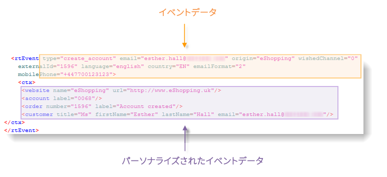
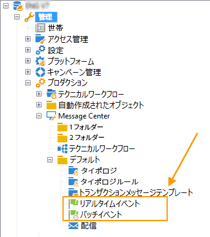
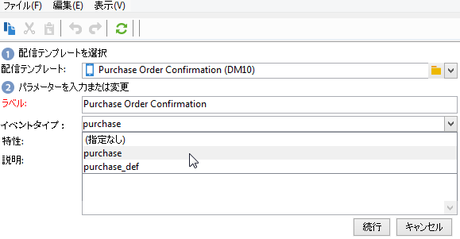

# イベントの処理 {#event-processing}

トランザクションメッセージのコンテキストでは、イベントは外部の情報システムによって生成され、**[!UICONTROL PushEvent]** および **[!UICONTROL PushEvents]** メソッドを介して Adobe Campaign に送信されます。これらのメソッドについては、[この節](event-description.md)を参照してください。

このイベントには、次のようなイベントにリンクされたデータが含まれます。

* その[タイプ](transactional.md#create-event-types)：注文の確認、web サイトでのアカウント作成など、
* メールアドレスまたは電話番号、
* 配信前にトランザクションメッセージをエンリッチメントし、パーソナライズするためのその他の情報：顧客の連絡先情報、メッセージの言語、メールフォーマットなど。

イベントデータの例：

トランザクションメッセージのイベントを処理するには、次の手順を実行インスタンスに適用します。

1. [イベントの収集](#event-collection)
1. [メッセージテンプレートへのイベントの転送](#routing-towards-a-template)
1. パーソナライゼーションデータを使用したイベントのエンリッチメント
1. [配信の実行](delivery-execution.md)
1. リンクされた配信に失敗した[イベントの再利用](#event-recycling)（Adobe Campaign ワークフロー経由）

すべての手順が完了すると、ターゲットの各受信者は、パーソナライズされたメッセージを受信します。

## イベントの収集 {#event-collection}

情報システムが生成したイベントは、次の 2 つのモードを使用して収集できます。

* SOAP メソッドの呼び出しでは、Adobe Campaign 内でイベントをプッシュできます。PushEvent メソッドを使用するとイベントを 1 つずつ送信し、PushEvents メソッドを使用すると複数のイベントを一度に送信します。[詳細情報](event-description.md)。

* ワークフローの作成では、ファイルのインポートまたは SQL ゲートウェイ経由で [Federated Data Access](../connect/fda.md) モジュールを使用してイベントを回復することができます。

収集したイベントは、テクニカルワークフローによって実行インスタンスのリアルタイムキューとバッチキューに分別され、[メッセージテンプレート](transactional-template.md)にリンクされるのを待つことになります。

>[!NOTE]
>
>実行インスタンス上では、**[!UICONTROL リアルタイムイベント]**&#x200B;フォルダーまたは&#x200B;**[!UICONTROL バッチイベント]**&#x200B;フォルダーをビューとして設定しないでください。アクセス権の問題が発生するおそれがあるからです。 フォルダーをビューとして設定する方法について詳しくは、[この節](../audiences/folders-and-views.md#turn-a-folder-to-a-view)を参照してください。

## テンプレートへのイベントの転送 {#event-to-template}

メッセージテンプレートが実行インスタンスにパブリッシュされると、2 つのテンプレートが自動的に生成されます。1 つはリアルタイムイベントにリンクし、もう 1 つはバッチイベントにリンクします。

ルーティングの手順では、以下に基づいてイベントを適切なメッセージテンプレートにリンクします。

* イベント自体のプロパティで指定されたイベントタイプ。

  

* メッセージテンプレートのプロパティで指定されたイベントタイプ。

  

デフォルトでは、ルーティングは次の情報に基づいておこなわれます。

* イベントタイプ
* 使用するチャネル（デフォルトはメール）
* 公開日に基づく最新の配信テンプレート

## イベントステータスの確認 {#event-statuses}

処理されたすべてのイベントは、**イベント履歴**&#x200B;フォルダーまたはエクスプローラーで単一のビューにグループ化されます。イベントは、イベントタイプまたは&#x200B;**ステータス**&#x200B;ごとに分類することができます。

可能なステータスは次のとおりです。

* **保留中**

   * 保留中のイベントには、収集されたばかりで処理されていないイベントがあります。**[!UICONTROL エラー数]**&#x200B;列に値 0 が表示されます。メールテンプレートはまだリンクされていません。
   * 処理された後、確認でエラーになった保留イベントの場合もあります。**[!UICONTROL エラー数]**&#x200B;列に 0 以外の値が表示されます。このイベントが再処理される日付については、**[!UICONTROL 処理リクエスト日]**&#x200B;の列を参照してください。

* **配信保留**
イベントは処理され、配信テンプレートがリンクされています。メールは配信保留となり、標準的な配信処理が適用されます。詳細を確認するには、該当する配信を開きます。
* **送信済み**、**無視**、**配信エラー**
これらの配信ステータスは、**updateEventsStatus** ワークフローで回復します。詳細を確認するには、該当する配信を開きます。
* **対象外のイベント**
トランザクションメッセージのルーティングフェーズで失敗しました。たとえば、Adobe Campaign がこのイベントのテンプレートとなるメールを見つけられなかった場合などです。
* **期限切れのイベント**
送信試行の最大数に達しました。このイベントは空とみなされます。

## イベントのリサイクル {#event-recycling}

特定のチャネルでのメッセージ配信に失敗した場合、Adobe Campaign は別のチャネルでメッセージを再送信することができます。例えば、SMS チャネルでの配信に失敗した場合、メールチャネルを利用してメッセージを再送信します。

これには、ステータスが **Delivery error** であるすべてのイベントを再度作成し、異なるチャネルを割り当てるワークフローを設定する必要があります。

>[!CAUTION]
>
>この手順の実行は、ワークフローを使用する必要があるので、エキスパートユーザー向けの操作となります。詳しくは、アドビのアカウント担当者にお問い合わせください。
