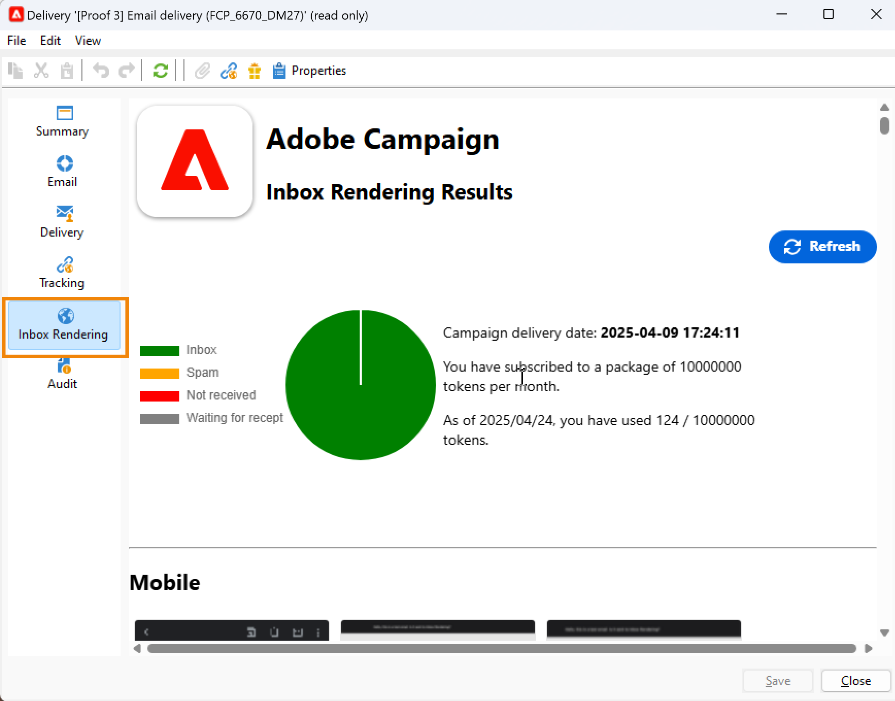

# 受信ボックスレンダリング{#inbox-rendering}

## 受信ボックスレンダリングについて {#about-inbox-rendering}

「**送信**」ボタンを押す前に、様々な Web クライアント、Web メールおよびデバイスで受信者へのメッセージの表示が最適化されていることを確認してください。

これを可能にするために、Adobe Campaign では、[Litmus](https://litmus.com/email-testing){target="_blank"} の Web ベースのメールテストソリューションを活用して、レンダリングをキャプチャし、専用のレポートで使用できるようにします。これにより、異なるコンテキストで受信される可能性のある送信済みのメッセージをプレビューして、メジャーなデスクトップおよびアプリケーションの互換性を確認できます。

>[!CAUTION]
>インボックスレンダリングは、[繰り返し配信](../../automation/workflow/recurring-delivery.md)に対応していません。

Litmus は、多機能メール検証およびプレビューアプリケーションです。メールコンテンツ作成者は、Gmail 受信トレイや Apple Mail クライアントなど、70 を超えるメールレンダラーでメッセージコンテンツをプレビューできます。

Adobe Campaign の「**受信ボックスレンダリング**」で使用できるモバイル、メッセージングおよび Web メールクライアントは、[Litmus の Web サイト](https://litmus.com/email-testing){target="_blank"}に記載されています（「**View all email clients**」をクリックしてください）。

>[!NOTE]
>
>受信ボックスレンダリングは、配信のパーソナライゼーションをテストするには必要ありません。パーソナライゼーションは、**[!UICONTROL プレビュー]**&#x200B;および[配達確認](preview-and-proof.md#send-proofs)などの Adobe Campaign ツールで確認できます。

## Litmus トークンについて {#about-litmus-tokens}

Litmus はサードパーティのサービスなので、使用量ごとのクレジットモデルで機能します。ユーザーが Litmus 機能を呼び出すたびに、クレジットが差し引かれます。

Adobe Campaign では、クレジットは、使用可能なレンダリングの数（トークンと呼ばれる）に対応しています。

>[!NOTE]
>
>使用可能な Litmus トークンの数は、購入した Campaign ライセンスによって異なります。ライセンス契約を確認してください。

配信で&#x200B;**[!UICONTROL 受信ボックスレンダリング]**&#x200B;機能を使用して各レンダリングを生成するたびに、使用可能なトークンが 1 つずつ減ります。

>[!IMPORTANT]
>
>トークンは、受信ボックスレンダリングレポート全体ではなく、個々のレンダリングから成ります。つまり、
>
>* 受信ボックスレンダリングレポートが生成されるたびに、メッセージングクライアントあたり 1 つのトークンが差し引かれます（Outlook 2000 レンダリングに 1 トークン、Outlook 2010 レンダリングに 1 トークン、Apple Mail 9 レンダリングに 1 トークン、というようになります）。
>* 同じ配信について、受信ボックスレンダリングを再生成する場合、使用可能なトークンの数は、生成したレンダリングの数だけ再度減ります。
>

使用可能なトークンの残り数は、[受信ボックスレンダリングレポート](#inbox-rendering-report)に表示されます。

通常、受信ボックスレンダリング機能は、新しくデザインされたメールの HTML フレームワークをテストするために使用されます。各レンダリングには、最大で約 70 トークンが必要です（通常テストされる環境の数による）。ただし、場合によっては、配信を完全にテストするために、複数の受信ボックスレンダリングレポートが必要なことがあります。そのため、複数の確認を完了するために、さらにトークンが必要になる可能性があります。

## 受信ボックスレンダリングレポートへのアクセス {#accessing-the-inbox-rendering-report}

メール配信を作成し、そのコンテンツとターゲット母集団を定義したら、以下の手順に従います。

配信の作成、デザイン、ターゲティングについて詳しくは、この [ ページ ](defining-the-email-content.md) を参照してください。

1. 配信の上部バーで、「**[!UICONTROL 受信ボックスレンダリング]**」ボタンをクリックします。

1. 「**[!UICONTROL 分析]**」を選択してキャプチャプロセスを開始します。

   

   配達確認が送信されます。メール送信後数分で、その配達確認からレンダリングサムネールにアクセスできます。配達確認の送信について詳しくは、[この節](preview-and-proof.md#send-proofs)を参照してください。

1. 送信後、配達確認は配信リストに表示されます。ダブルクリックします。

   

1. 配達確認の「**受信ボックスレンダリング**」タブに移動します。

   

   受信ボックスレンダリングレポートが表示されます。

## 受信ボックスレンダリングレポート {#inbox-rendering-report}

このレポートには、受信者に表示される受信ボックスレンダリングが表示されます。レンダリングは、ブラウザー、モバイルデバイス、メールアプリケーションなど、受信者がどの方法でメール配信を開くかによって異なります。

一番上のセクションには、受信済みメッセージ、不要なメッセージ（スパム）、未受信のメッセージ、または受信が保留されているメッセージの数の内訳が、色分けされたグラフで表示されます。

{width="40%" align="left"}

グラフの上にマウスポインターを置くと、各色の詳細が表示されます。リストの項目をクリックすると、グラフの対応するカテゴリの表示/非表示を切り替えることができます。

レポートの本文は、**[!UICONTROL モバイル]**、**[!UICONTROL デスクトップ]**、**[!UICONTROL Web]** メールの 3 つの部分に分かれています。レポートを下へスクロールすると、これらの 3 つのカテゴリにグループ化されたすべてのレンダリングが表示されます。

各レポートの詳細を表示するには、対応するカードをクリックします。選択した受信方法のレンダリングが表示されます。

