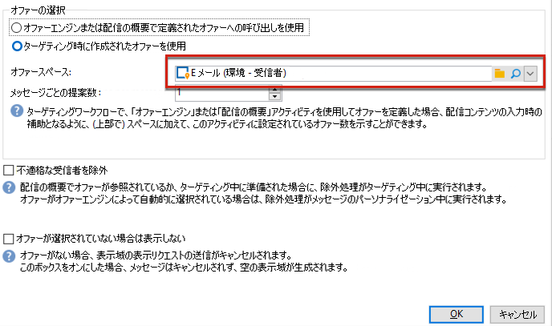
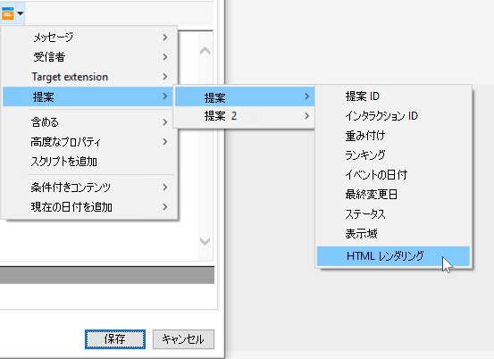
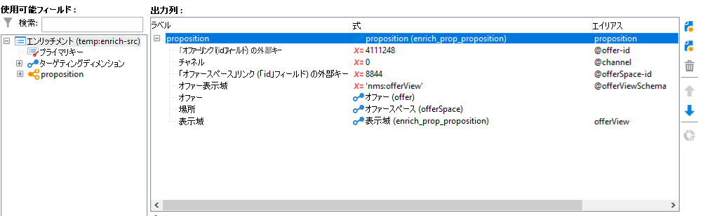
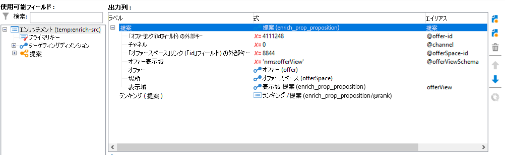
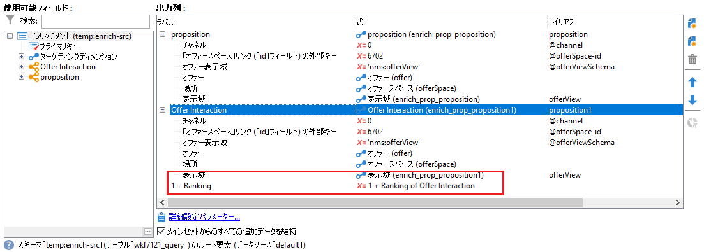

# インタラクションのベストプラクティス{#interaction-best-practices}

## 一般的な推奨事項 {#general-recommendations}

Adobe Campaign でオファーを管理するには、効率的に運用するための慎重な管理が必要です。問題を回避するには、コンタクト先の数と、オファーカテゴリおよびオファーの数のバランスを取る必要があります。

この節では、実施要件ルール、事前定義済みフィルター、ワークフローアクティビティ、データベースオプションなど、Adobe Campaign で&#x200B;**インタラクション**&#x200B;モジュールを管理するためのベストプラクティスを紹介します。

* **インタラクションを実装および設定**&#x200B;する際には、次の推奨事項に注意する必要があります。

   * バッチエンジン（一般的に E メールなどのアウトバウンド通信で使用）の場合、複数の連絡先を同時に処理できるので、主な懸念事項はスループットです。一般的なボトルネックはデータベースのパフォーマンスです。
   * 単一エンジン（一般的に Web サイトのバナーなどのインバウンド通信で使用）の場合、回答を待っているユーザーがいるので、主な制限事項は遅延です。一般的なボトルネックは CPU のパフォーマンスです。
   * オファーカタログのデザインは、Adobe Campaign のパフォーマンスに大きな影響を与えます。
   * 多数のオファーを扱う場合、ベストプラクティスは、オファーを複数のオファーカタログに分割することです。

* 以下に、**実施要件ルール**&#x200B;を扱う際のベストプラクティスをいくつか示します。

   * ルールはシンプルにします。ルールが複雑になれば、参照に時間がかかってしまい、パフォーマンスに影響します。複雑なルールとは、条件が 5 つ以上のルールです。
   * パフォーマンスを向上させるために、複数のオファーで共有される個別の定義済みフィルターにルールを分割できます。
   * 最も厳しいオファーカテゴリルールを、できるだけツリーの最上位に配置します。これにより、最初にほとんどの連絡先にフィルターをかけてターゲットとする数を減らし、それらに追加ルールを処理しなくて済むようにします。
   * 処理や時間が最も多く必要なルールをツリーの一番下に配置します。こうすることで、これらのルールは残りのターゲットオーディエンスでのみ実行します。
   * ツリー全体をスキャンしなくて済むよう、特定のカテゴリから開始します。
   * 処理時間を短縮するため、結合を使用した複雑なルールを作成する代わりに、事前に集計します。これを実行するには、実施要件ルール内で参照可能な参照テーブルに顧客データを保存するようにしてください。
   * 重み付けの数を最小限にして、クエリの数を制限します。
   * オファースペースあたりのオファー数を制限することをお勧めします。これにより、指定されたスペースでオファーを素早く取得できるようにします。
   * 特に頻繁に使用する参照列では、インデックスを使用します。

* 以下に、**提案テーブル**&#x200B;に関するいくつかのベストプラクティスを示します。

   * 可能な限り早く処理できるよう、使用するルールの数を最小限にします。
   * 提案テーブルのレコードの数を減らす：ステータスを最新に保つ必要があるレコードと、ルールで必要なレコードのみを残してから、別のシステムへアーカイブします。
   * 提案テーブルで集中的にデータベースのメンテナンスを実施します（インデックスの再構築やテーブルの再作成など）。
   * ターゲットごとに要求される提案数を制限します。実際に使用する数以上の提案を設定しないでください。
   * ルール条件では、できるだけ結合の使用を避けます。

## オファーを管理する際のヒント {#tips-managing-offers}

この節では、Adobe Campaign におけるオファーの管理とインタラクションモジュールの使用に関する詳しいアドバイスを提供しています。

### 1 つのメールに複数のオファースペース {#multiple-offer-spaces}

配信にオファーを含める場合、一般に、そのオファーは、「**エンリッチメント**」ワークフローアクティビティ（または他の類似アクティビティ）を通じてキャンペーンワークフローのアップストリームで選択されます。

「**エンリッチメント**」アクティビティでオファーを選択する際は、使用するオファースペースを選択できます。ただし、選択したオファースペースに関係なく、配信のカスタマイズメニューは、配信で設定したオファースペースに依存します。

以下の例では、配信で選択されたオファースペースは **[!UICONTROL E メール（環境 - 受信者）]**&#x200B;です。



配信で選択したオファースペースに HTML レンダリング関数が設定されていない場合、配信メニューに表示されず、選択できません。これは、「**エンリッチメント**」アクティビティで選択されたオファースペースとは無関係です。

以下の例では、配信で選択されたオファースペースにレンダリング関数があるので、HTML レンダリング関数をドロップダウンリストで使用できます。



この関数は、`<%@ include proposition="targetData.proposition" view="rendering/html" %>` のようなコードを挿入します。

提案を選択すると、**[!UICONTROL ビュー]**&#x200B;属性の値は、以下のようになります。
* &quot;rendering/html&quot;：HTML レンダリング。HTML レンダリング関数を使用します。
* &quot;offer/view/html&quot;：HTML コンテンツ。HTML レンダリング関数を使用しません。HTML フィールドのみが含まれます。

単一の E メール配信に複数のオファースペースを含める際に、一部にレンダリング関数があり、一部にレンダリング関数がない場合は、どのオファーがどのオファースペースを使用し、どのオファースペースにレンダリング関数があるかを覚えておく必要があります。

そのため、問題を回避するために、オファースペースが HTML コンテンツのみを必要とする場合でも、すべてのオファースペースに HTML レンダリング関数を定義することをお勧めします。

### 提案ログテーブルでのランクの設定 {#rank-proposition-log-table}

オファースペースには、提案が生成または許可された場合に、提案テーブルにデータを保存する機能があります。


ただし、これはインバウンドインタラクションにのみ適用されます。

アウトバウンドインタラクションを使用する場合、およびインタラクションモジュールを使用せずにアウトバウンドオファーを使用する場合は、提案テーブルに追加データを保存することもできます。

ワークフローの一時テーブルのフィールドのうち、提案テーブル内のフィールド名と名前が一致するフィールドは、提案テーブル内の同じフィールドにコピーされます。

例えば、「**エンリッチメント**」ワークフローアクティビティでオファーを手動（インタラクションなし）で選択する場合、標準フィールドは次のように定義されます。



`@rank` フィールドなど、フィールドをさらに追加できます。



`@rank` という名前の提案テーブルにフィールドがあるので、ワークフローの一時テーブルの値がコピーされます。

提案テーブルへの追加フィールドの格納について詳しくは、[この節](interaction-send-offers.md#storing-offer-rankings-and-weights)を参照してください。

インタラクションを含むアウトバウンドオファーの場合、これは、複数のオファーが選択され、E メールに表示される順序を記録する場合に役立ちます。

また、現在の支出レベルなど、追加のメタデータを提案テーブルに直接保存して、オファーが生成された時点の支出に関する履歴記録を保持することもできます。

アウトバウンドインタラクションを使用する場合、上記の例のように `@rank` フィールドを追加できますが、その値はインタラクションから返される順序に基づいて自動的に設定されます。例えば、インタラクションを使用して 3 つのオファーを選択する場合、`@rank` フィールドには 1、2 および 3 の値が返されます。

インタラクションを使用して手動でオファーを選択する場合、両方のアプローチを組み合わせることができます。例えば、手動で選択したオファーの `@rank` フィールドを手動で 1 に設定し、インタラクションから返されるオファーに `"1 + @rank"` などの式を使用できます。インタラクションが 3 つのオファーを選択すると仮定すると、両方のアプローチで返されるオファーは 1～4 にランク付けされます。



### nms:offer スキーマの拡張 {#extending-nms-offer-schema}

nms:offer スキーマを拡張する場合、既に設定済みの標準の構造に従っていることを確認します。
* `<element name="view">` の下にコンテンツストレージ用の新しいフィールドを定義します。
* それぞれの新しいフィールドは、2 回ずつ定義する必要があります。1 回は通常の XML フィールドとして、もう 1 回は名前に「_jst」が付いた CDATA XML フィールドとして定義します。次に例を示します。

   ```
   <element label="Price" name="price" type="long" xml="true"/>
   <element advanced="true" label="Script price" name="price_jst" type="CDATA" xml="true"/>
   ```

* トラッキングする URL を含むフィールドは、`<element name="view" >` の下にある `<element name="trackedUrls">` の下に配置する必要があります。
